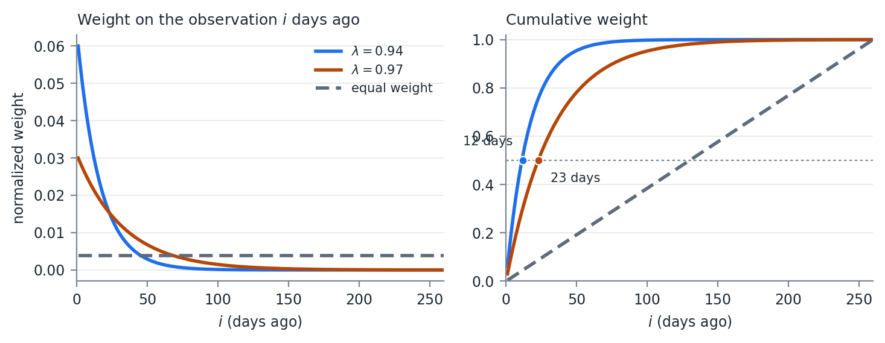
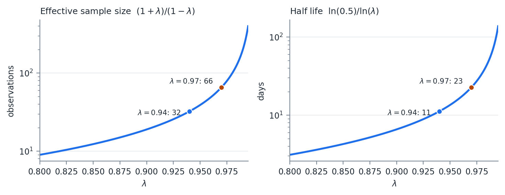

# Monte Carlo Simulation

## Why Simulate

Week 01 and Week 02 gave us distributions we can write down. Almost nothing we
actually hold is one of them.

A portfolio of options on correlated assets has a P&L distribution with no closed
form, and no amount of algebra will produce one.

Simulation replaces the algebra. Draw the inputs from a distribution we do
understand, push each draw through the function, and read the answer off the
resulting sample.

::: {.notes}
The whole method is a trade. Give up the exact answer to a problem we cannot
solve, take an approximate answer to one we can.
:::

## The Cost

The answer is itself a random variable.

Every number produced this way carries simulation error, and that error falls as
$1/\sqrt{K}$ in the number of draws.

Four times the draws to halve the error. Report a simulated number without
knowing its simulation error and you are reporting noise to two decimal places.

## The Inverse CDF Method

Drawing univariate random numbers is easy. Most packages have a random function,
and many allow a distribution to be specified.

Sometimes only the uniform on $(0,1)$ is available. The quantile function turns
that into a draw from anything.

$$
F(x) = P(X \leq x) = \int_{lb}^{x} f(t)\, dt
$$

The quantile function is its inverse, $F^{-1}(p)$: the value of $x$ such that
$F(x) = p$.

## One Line

The CDF is monotonic and defined between $(0,1)$, so the quantile function gives
a 1:1 mapping from $(0,1)$ into the range of the distribution.

$$
x = F^{-1}(u), \quad u \sim U(0,1)
$$

This converts any distribution with a computable quantile function into a draw,
using only a uniform generator.

It is also the mechanism behind the copula in Week 05, where we run the transform
in both directions: CDF to get to uniforms, inverse CDF to get back out.

## Simulating a Correlated System

One variable at a time is not the problem we have. Recall from last week, if $X$
is multivariate normal

$$
X \sim N(\mu, \Sigma)
$$

there exists

$$
\mu \in \mathbb{R}^{n},\ L \in \mathbb{R}^{n \times m} \quad \text{such that} \quad X = LZ + \mu
$$

where

$$
Z_i \sim N(0,1), \quad i \in [1,m], \qquad \Sigma = LL'
$$

## The Multivariate Draw Algorithm

To simulate $K$ draws from an $N$ variable multivariate normal:

1. Factor $\Sigma$ into $L$, which is $(N \times M)$
2. Generate $K \times M$ random standard normals, $Z$, shaped $(M \times K)$
3. $X = (LZ + \mu)^T$, with shape $(K \times N)$

Each series is on the row without the transpose. We think of tables as columns of
values, so the transpose puts the matrix into a data table format.

## Step 1 Is the Whole Week

Steps 2 and 3 are a random number call and a matrix multiply.

Producing an $L$ from a covariance matrix estimated on real data is where the
work is, and where the failures are.

A lot of packages have a multivariate normal generator. With the data problems we
are about to hit, knowing how to generate your own is necessary.

# Cholesky Factorization

## The Root

The most used factorization of $\Sigma$. It applies to positive definite
matrices, and the factor $L$ is lower triangular.

Sometimes called the Cholesky root, because the factor is analogous to a square
root.

Roughly 2x more efficient to calculate than the $LU$ factorization, which is why
it is the one that gets used.

If the matrix is only PSD, the root can still be calculated allowing for a column
of zeros. The number of non-zero columns is the rank of the matrix.

## The Algorithm

$A$ is symmetric and PD, $L$ is lower triangular, $A = LL'$. Multiply the two
triangular matrices, match entries, and every element of $L$ falls out:

$$
L_{jj} = \sqrt{A_{jj} - \sum_{k=1}^{j-1} L_{jk}^2}
$$

$$
L_{ij} = \frac{1}{L_{jj}}\left( A_{ij} - \sum_{k=1}^{j-1} L_{ik} L_{jk} \right), \quad i > j
$$

Nothing on the right hand side involves an unknown, which is why a single pass
works.

## Down the Columns

1. Column *j*, start on the diagonal element
2. Subtract the sum of squares of the root matrix values in row *j* from the
   input matrix diagonal
3. Update the root at (*j,j*) with the square root of step 2
4. Moving down the column, row *i*:
    a. Dot product of sub matrix vectors [*i, 1:(j-1)*] and [*j, 1:(j-1)*]
    b. Subtract a. from element (*i,j*) of the input matrix
    c. Divide b. by the *j* diagonal element of the root
    d. Store the result in element (*i,j*) of the root
5. Repeat for the next column

## A Worked Example

$$
A = \begin{pmatrix}
4 & 2 & -2 & 4\\
2 & 10 & 5 & -1\\
-2 & 5 & 21 & 0\\
4 & -1 & 0 & 15
\end{pmatrix}
$$

Read as a covariance matrix, the variances are 4, 10, 21, and 15, and the implied
correlations run from $-0.22$ to $0.52$.

## Columns One and Two

Column 1. The diagonal has no prior terms to subtract, so $L_{11} = \sqrt{4} = 2$.
Divide the rest of the column by it:

$$
L_{21} = \tfrac{2}{2} = 1, \qquad
L_{31} = \tfrac{-2}{2} = -1, \qquad
L_{41} = \tfrac{4}{2} = 2
$$

Column 2. Subtract the squares already placed in row 2, then divide:

$$
L_{22} = \sqrt{10 - 1^2} = 3
$$

$$
L_{32} = \frac{5 - (-1)(1)}{3} = 2, \qquad
L_{42} = \frac{-1 - (2)(1)}{3} = -1
$$

## Columns Three and Four

$$
L_{33} = \sqrt{21 - (-1)^2 - 2^2} = \sqrt{16} = 4
$$

$$
L_{43} = \frac{0 - (2)(-1) - (-1)(2)}{4} = 1
$$

$$
L_{44} = \sqrt{15 - 2^2 - (-1)^2 - 1^2} = \sqrt{9} = 3
$$

## The Result

$$
L = \begin{pmatrix}
2 & 0 & 0 & 0\\
1 & 3 & 0 & 0\\
-1 & 2 & 4 & 0\\
2 & -1 & 1 & 3
\end{pmatrix}
$$

Multiply $LL'$ and confirm you recover $A$. Work this by hand once.

Every failure mode in the rest of this week is a failure of one of those four
square roots or one of those six divisions.

## How Packages Do It

Most linear algebra libraries run this algorithm on blocks of the matrix.

The dot products become matrix multiplications, the division becomes a matrix
inverse, and the square root is a single threaded Cholesky call.

Block size is chosen from CPU cache size, and vector operations handle the
multiplications.

<http://www.netlib.org/utk/papers/factor/node9.html>

## The PSD Case

If the matrix is PSD rather than PD, the algorithm breaks down.

At least one root diagonal element is 0. The column calculation then fails when
we divide by it.

The patch: set every value in that column to 0.

## The Patch Works

$LL'$ still reproduces $\Sigma$ exactly, and the simulation still runs.

The Cholesky failing is a property of the PD algorithm, not of the matrix.

## The Patch Is Not Free

A zero column means one fewer independent random number driving the system.

Simulating $N$ variables from a rank $M$ matrix gives draws that all lie inside
an $M$ dimensional subspace. No simulated scenario can ever produce a pattern
outside it.

Week 09 is built on that observation.

# Missing Data

## Different Calendars

Missing values are very common in finance.

Not all markets are open at the same time on the same days, and a holiday in one
market is not a holiday in another, even in the same country.

Take three assets on three trading calendars over ten days, and ask what the
covariance matrix is estimated from.

## Three Assets, Three Calendars

| Date | Asset A | Asset B | Asset C |
|--:|:-:|:-:|:-:|
| 1 | X | X | |
| 2 | X | X | X |
| 3 | | X | X |
| 4 | | | |
| 5 | X | | |
| 6 | X | X | X |
| 7 | X | X | X |
| 8 | X | X | |
| 9 | X | X | X |
| 10 | | X | X |

## Two Common Methods

**Overlapping rows only.**

- Limits the information
- Days 2, 6, 7, and 9 only, which is 40%
- Behavior on the other days is ignored

**Pairwise.** Find the matching rows for each pair and build the matrix piece by
piece.

- Uses more information, but not all
- Assets A and B use days 1, 2, 6, 7, 8, and 9
- The matrix is symmetric, but it is not guaranteed PSD

## The Trade

Method 1 keeps 4 rows out of 10 and returns a matrix guaranteed to be PSD.

Method 2 uses 6 rows for the A-B pair and returns a matrix that may not be.

Each entry of a pairwise matrix is estimated from a different sample, so the
entries are not required to be mutually consistent.

A set of mutually inconsistent correlations is exactly what a negative eigenvalue
is. Nothing here is a rounding problem.

# Covariance Matrix Generation

## Techniques, One Through Four

1. **Default covariance.** With perfect data and an assumption of normality, the
   estimator from last week is the best one
2. **Overlapping rows.** Works when there is enough fully overlapping history.
   Not the full information, but with a lot of data the matrix should be fine
3. **Pairwise.** For when there is not enough overlap. Often non-PSD
4. **Exponential weights.** Financial data are time variant, so weight recent
   observations more heavily. The RiskMetrics covariance

## Techniques, Five Through Seven

5. **EM algorithm.** Iterative, uses the likelihood, handles missing data. Gets
   unstable as the missing proportion rises, and wants a large number of
   observations to converge. Worth reading about on your own
6. **High frequency methods.** At millisecond intervals it is impossible to see
   updated prices on all assets. See "highfrequency" in R and
   "HighFrequencyCovariance" in Julia
7. **Split correlation from variance.** Estimate correlations by any method
   above, but use the full history of each variable for the variances

## Item Seven

The rank problem comes from the correlation estimation, not from the variances.

Splitting the problem lets each piece use the data it can, and it isolates the
rank problem in the correlation matrix where the repair algorithms operate.

$$
\Sigma = D\, C\, D, \quad D = \operatorname{diag}(\sigma_1, \dots, \sigma_n)
$$

A full-history variance for each variable survives whatever was done to $C$.

## A Note on Pearson

When we break the assumption of normality and we have what look like outliers to
the normal distribution, the Pearson coefficient may not be the best estimator of
correlation.

We return to this in a few weeks.

# Exponentially Weighted Covariance

## RiskMetrics

JP Morgan was one of the first banks to use exponentially weighted covariance
matrices in their risk analytics, starting in the late 1980s.

Their risk management was considered some of the best in the industry, and they
spun out a software and consulting company called RiskMetrics.

## The Estimator

$$
\sigma_t^2 = \lambda \sigma_{t-1}^2 + (1-\lambda)\left( x_{t-1} - \bar{x} \right)^2
$$

A simple exponential smoothing model. The variance for tomorrow is updated from
today's forecast variance and today's deviation from the mean.

Back substitute:

$$
\sigma_t^2 = (1-\lambda) \sum_{i=1}^{\infty} \lambda^{i-1} \left( x_{t-i} - \bar{x} \right)^2
$$

## The Weights

$$
\lim_{n \to \infty} (1-\lambda) \sum_{i=1}^{n} \lambda^{i-1} = 1
$$

so setting $w_{t-i} = (1-\lambda)\, \lambda^{i-1}$ gives a weighted estimator over
an infinite horizon.

We do not have an infinite horizon, so the weights are normalized to sum to 1:

$$
\hat{w}_{t-i} = \frac{w_{t-i}}{\sum_{j=1}^{n} w_{t-j}}
$$

## The Estimators

$$
\widehat{\sigma_t^2} = \sum_{i=1}^{n} \hat{w}_{t-i} \left( x_{t-i} - \bar{x} \right)^2
$$

$$
\widehat{\operatorname{cov}(x,y)} = \sum_{i=1}^{n} \hat{w}_{t-i} \left( x_{t-i} - \bar{x} \right)\left( y_{t-i} - \bar{y} \right)
$$

Equal weighting the time series reduces to the MLE values from last week.

## Choosing Lambda

RiskMetrics research found $\lambda = 0.97$ was the best value across a number of
asset classes.

Be careful with that number. 0.97 is the decay factor for **monthly** data. For
daily data, which is what we use in this class, RiskMetrics used
$\lambda = 0.94$.

Treat both as starting guides. They came from one firm's data in the mid 1990s,
across a particular set of asset classes, at a particular sampling frequency.

A more liquid market, a longer horizon, or a different use for the estimate can
all justify moving off them. What the choice should not be is unexamined.

## What the Choice Buys

{width=66%}

At $\lambda = 0.94$, half the total weight sits in the most recent 12
observations. At $\lambda = 0.97$ it takes 23. Equal weighting over the same 260
days puts half the weight in the most recent 130.

## Effective Sample Size

An equally weighted estimator built on $n$ observations uses $n$ observations. An
exponentially weighted one does not, and the number it does use is worth
computing.

$$
n_{\text{eff}} = \frac{1}{\sum_i \hat{w}_i^2}
$$

For equal weights, $\hat{w}_i = 1/n$, the sum is $1/n$, and $n_{\text{eff}} = n$.

## The Closed Form

For exponential weights on an infinite horizon:

$$
\sum_{i=1}^{\infty} \hat{w}_i^2 = (1-\lambda)^2 \sum_{i=1}^{\infty} \lambda^{2(i-1)} = \frac{(1-\lambda)^2}{1-\lambda^2} = \frac{1-\lambda}{1+\lambda}
$$

$$
n_{\text{eff}} = \frac{1+\lambda}{1-\lambda}, \qquad h = \frac{\ln(0.5)}{\ln(\lambda)}
$$

## Effective Sample Size Against Lambda

{width=70%}

## It Does Not Depend on n

At $\lambda = 0.94$, $n_{\text{eff}}$ is 32 observations whether you feed the
estimator one year of history or ten.

Adding data past roughly four half lives changes the estimate by less than the
rounding on the way to the report.

Storing five years of returns to run a $\lambda = 0.94$ estimator is storage, not
information.

## The Curve Is Convex

And it gets steep exactly where people set $\lambda$.

- 0.94 to 0.97 doubles $n_{\text{eff}}$ from 32 to 66
- 0.97 to 0.99 triples it again to 199

Small changes in $\lambda$ are not small changes in the estimator. Reporting
$\lambda$ to two decimals conceals that.

## Error Scales with n_eff

Estimation error scales with $n_{\text{eff}}$, not with $n$. The standard error of
a volatility estimate is roughly $\sigma / \sqrt{2 n_{\text{eff}}}$.

That is about 12.5% of the estimate at $\lambda = 0.94$ and 8.7% at
$\lambda = 0.97$.

A 20% volatility estimated at $\lambda = 0.94$ carries a standard error of about
2.5 volatility points. That is the price of responsiveness, and it is not small.

## The Conditioning Consequence

Every weight is strictly positive, so the matrix is not singular in exact
arithmetic.

But the smallest eigenvalues are supported almost entirely by observations
carrying vanishing weight.

A covariance matrix estimated at $\lambda = 0.94$ across more than roughly
$n_{\text{eff}}$ assets is numerically close to singular.

My opinion: on daily data, use at least a year of history. Then be honest with
yourself that the estimate is built on a few weeks of it.

## Speed of Update

The recursion gives the answer directly. Today's observation enters $\sigma_t^2$
with weight exactly $(1-\lambda)$: 6% at $\lambda = 0.94$, 3% at 0.97, 1% at 0.99.

Everything already in the estimate is scaled by $\lambda$, so a shock that entered
$k$ days ago retains $\lambda^k$ of the weight it arrived with.

Put a 5 standard deviation day through it. The squared observation is
$25\sigma^2$:

$$
\sigma^2_{\text{new}} = \lambda \sigma^2 + (1-\lambda)\, 25\sigma^2 = \sigma^2\left( \lambda + 25(1-\lambda) \right)
$$

## The Whole Trade in One Table

| $\lambda$ | Weight today | Volatility after a $5\sigma$ day | Half life |
|--:|--:|--:|--:|
| 0.90 | 10% | $\times 1.87$ | 7 days |
| 0.94 | 6% | $\times 1.56$ | 11 days |
| 0.97 | 3% | $\times 1.31$ | 23 days |
| 0.99 | 1% | $\times 1.11$ | 69 days |

The same event moves a $\lambda = 0.90$ estimate by 87% and a $\lambda = 0.99$
estimate by 11%, and the faster estimate then forgets it ten times sooner.

## Neither End Is Right

A fast $\lambda$ tracks a regime change within a week and produces limit breaches
on days when nothing happened.

A slow $\lambda$ is stable and will still be reporting last month's calm in the
middle of a crisis.

Pick based on what the number is for. A risk limit that triggers trading wants
responsiveness. A capital calculation wants stability.

Whatever you pick, say what it is. An unstated $\lambda$ makes two volatility
numbers incomparable even when they were computed from the same returns.

## The Link to GARCH

$$
\sigma_t^2 = \omega + \sum_{i=1}^{p} \alpha_i \epsilon_{t-i}^2 + \sum_{i=1}^{q} \beta_i \sigma_{t-i}^2
$$

Set $(p,q) = (1,1)$, $\omega = 0$, $\alpha = (1-\lambda)$, and $\beta = \lambda$.

The RiskMetrics estimator is a GARCH(1,1) sitting exactly on the
$\alpha + \beta = 1$ boundary.

## What the Boundary Costs

With $\alpha + \beta = 1$ the long term variance is undefined.

There is no level to revert to, so the $k$ step ahead forecast is today's variance
repeated forever, and any simulation that keeps updating will wander without
bound.

Do not use long horizon simulation that updates the covariance matrix each period
with this methodology.

## What the Boundary Buys

GARCH with $\alpha + \beta < 1$ mean reverts to a fixed level, so when volatility
shifts to a genuinely new regime the model fights the shift. The forecast keeps
decaying back toward the old level.

The exponentially weighted estimator has no old level to decay toward, so it
absorbs the shift permanently.

Clustered spikes are what GARCH was built to describe. Persistent level shifts are
what the exponentially weighted estimator handles better.

## Lamoureux and Lastrapes

Lamoureux and Lastrapes (1990) make the point from the other direction.

Ignoring structural breaks in the unconditional variance biases the estimated
$\alpha + \beta$ upward toward 1.

So the persistence of 0.95 to 0.99 typically fitted on daily equity data is partly
an artifact of regime shifts the model does not represent.

## How Much This Buys

Neither estimator observes the regime.

Both learn only through squared returns, at speed $\alpha$ for GARCH and
$(1-\lambda)$ for the exponentially weighted estimator. Typical values are 0.05 to
0.10 against 0.06.

The advantage is in the forecast, not in the detection. The same refusal to revert
also means a one off spike stays in the estimate long after it should have gone.

# Dealing with Non-PSD Matrices

## Two Reasons

1. Floating point error
2. Missing data

A true PSD matrix can still produce a slightly negative eigenvalue in finite
precision, which makes one of the root diagonals complex.

It is generally fine to check for and set to 0 slightly negative values before
attempting the square root. Negative values too large to be floating point error
need different treatment.

## A Question of Magnitude

There is no clean threshold.

An eigenvalue at $-10^{-16}$ times the largest eigenvalue is arithmetic.

An eigenvalue at $-0.05$ times the largest is a statement that the data are
mutually inconsistent, and zeroing it silently changes the matrix.

## Rebonato and Jackel

Rebonato and Jackel (1999) present two methods for finding an acceptable PSD
matrix. The spectral decomposition method is the straightforward one.

First, decompose the correlation matrix:

$$
C S = S \Lambda, \quad \Lambda = \operatorname{diag}(\lambda_i)
$$

Second, clip the eigenvalues:

$$
\Lambda' : \lambda_i' = \max(\lambda_i, 0)
$$

## Rescaling

Third, construct the diagonal scaling matrix

$$
T : t_i = \left[ \sum_{j=1}^{n} s_{i,j}^2 \lambda_j' \right]^{-1}, \quad T = \operatorname{diag}(t_i)
$$

$T$ is what restores the unit diagonal. Zeroing eigenvalues shrinks the rows, and
without the rescaling the result would no longer be a correlation matrix.

$$
B = \sqrt{T}\, S\, \sqrt{\Lambda'}, \qquad BB^T = \hat{C} \approx C
$$

where $\sqrt{\ }$ denotes the element wise square root.

## Good Enough, Not Closest

This matrix is not necessarily the closest matrix to the original, by whatever
definition of closest you choose.

It is a good starting point, and often it is good enough.

Rebonato and Jackel also present an optimization algorithm in their paper, which
we do not cover.

## Higham

Higham (2002) presents an iterative algorithm for finding the nearest PSD
correlation matrix. This method is used widely.

Find $A$ minimizing

$$
\gamma(A) = \|A - C\|
$$

subject to $A$ being PSD. The norm used is generally Frobenius:

$$
\|A\|_F = \sqrt{\sum_{i=1}^{n} \sum_{j=1}^{n} a_{i,j}^2}
$$

## Weights

Weights can be applied by two methods. We assume a diagonal weight matrix $W$,
and unweighted means $W = I$.

$$
\|A\|_W = \left\| W^{\frac{1}{2}} A\, W^{\frac{1}{2}} \right\|_F
$$

Higham proposes Algorithm 3.3, which alternates two projections until the norm
converges.

## The First Projection

$$
P_U(A) = A - W^{-1} \operatorname{diag}(\theta_i) W^{-1}
$$

where $\theta$ solves
$\left( W^{-1} \# W^{-1} \right)\theta = \operatorname{diag}(A - I)$, and \# is
element wise multiplication.

With $W$ diagonal this collapses to

$$
p_{i,j} = a_{i,j}\ \ \forall\ i \neq j, \qquad p_{i,j} = 1\ \ \forall\ i = j
$$

$P_U$ is the easy projection. It sets the diagonal back to 1 and leaves everything
else alone.

## The Second Projection

$$
P_S(A) = W^{\frac{-1}{2}}\left( \left( W^{\frac{1}{2}} A\, W^{\frac{1}{2}} \right)_{+} \right) W^{\frac{-1}{2}}
$$

$$
(A)_{+} = S \operatorname{diag}(\max(\lambda_i, 0)) S^T
$$

The eigenvalue system with negative eigenvalues set to 0. The same clip as
Rebonato and Jackel, without the rescaling.

## Why Alternate

Neither projection alone gives a correlation matrix.

$P_S$ makes the matrix PSD and breaks the unit diagonal.

$P_U$ fixes the diagonal and can break the PSD property.

Alternating between them converges to a matrix in both sets.

## The Algorithm

> $\Delta S_0 = 0,\ \ Y_0 = A,\ \ \gamma_0 = \max\ \text{Float}$
>
> $\text{Loop } k \in 1 \dots \max\ \text{Iterations}$
>
> $\quad R_k = Y_{k-1} - \Delta S_{k-1}$
>
> $\quad X_k = P_S(R_k)$
>
> $\quad \Delta S_k = X_k - R_k$
>
> $\quad Y_k = P_U(X_k)$
>
> $\quad \gamma_k = \gamma(Y_k)$
>
> $\quad \text{if } |\gamma_k - \gamma_{k-1}| < tol \text{ then break}$

## The Dykstra Correction

The $\Delta S$ term is what makes this work.

Plain alternating projections converge to some point in the intersection of the
two sets.

The correction is what makes the limit the nearest one.

## In Practice

Check the smallest eigenvalue of the result. If it is significantly negative, run
the algorithm on the result.

You need a result your Cholesky function can process.

Convergence of the norm is not the same as the answer being usable, and the
tolerance you set on $\gamma$ says nothing directly about the smallest eigenvalue.

Check the eigenvalue, not the norm.

# Principal Component Analysis

## Another Route to L

PCA gives us another way to simulate a system.

The Rebonato and Jackel methodology used to adjust a non-PSD matrix is simply PCA,
removing the negative eigenvalues.

PCA projects the system into an orthogonal space. It gives a linear transform of
independent random variables into a correlated multivariate distribution.

It is also the standard tool for reducing the dimensionality of the problem.

## The Decomposition

$$
C = S \Lambda S^T
$$

$S$ are the eigenvectors, $\Lambda$ is the diagonal matrix of eigenvalues.

Take the square root of the eigenvalues into $\Lambda^{\frac{1}{2}}$:

$$
C = \left[ S \Lambda^{\frac{1}{2}} \right]\left[ \Lambda^{\frac{1}{2}} S^T \right]
$$

$$
B = \left[ S \Lambda^{\frac{1}{2}} \right] \Rightarrow C = BB^T
$$

## Nothing Downstream Changes

The requirement has not changed:

$$
X = LZ + \mu, \qquad Z_i \sim N(0,1), \qquad \Sigma = LL'
$$

$B$ satisfies that last line, so set $L = B$ and the multivariate draw algorithm
runs unchanged.

Cholesky and PCA are two ways of answering the same question. Nothing about the
simulation cares which one produced the root.

The Cholesky is preferred for a full rank system. Being triangular, it takes fewer
floating point operations.

## Dimensionality Reduction

If the matrix is PSD there are $m$ non-zero eigenvalues, with $m \leq n$.

Drop the zero eigenvalues from $\Lambda$ and the corresponding columns from $S$.

To simulate $N$ values we now generate only $M$ random numbers.

This is the same rank deficiency as the zero columns in the Cholesky, handled
explicitly rather than patched. Both produce a valid $\Sigma = BB'$. Neither
recovers information that was never in the matrix.

## Variance Explained

Sort the $m$ non-zero eigenvalues largest to smallest:

$$
L = \left[ \lambda_1,\ \lambda_2,\ \dots,\ \lambda_m \right] \ \forall\ \lambda_i \geq \lambda_j,\ i < j
$$

The percentage of variance explained by the first $K$:

$$
\text{Pct Explained}(K) = \frac{\sum_{i=1}^{K} L_i}{\sum_{j=1}^{m} L_j}
$$

The larger the eigenvalue, the more impact it has on the total system.

## Dropping Is a Modeling Choice

Not a repair.

Every dropped component is a direction the simulation can no longer move in.

The forecast variance of any portfolio sitting in that direction is exactly zero.

Week 09 shows what that looks like when it goes wrong.

# Simulating from Models

## Running Week 02 Backwards

At the heart of most modeling is getting to an error variable that is independent
and identically distributed.

Every model in Week 02 existed to strip structure out of a series until what was
left satisfied the OLS error assumptions.

Here we run the same machinery backwards: simulate the iid errors, then push them
through the model to rebuild the series.

## The Setup

$n$ variables $X$, an information matrix $\Omega$ used for modeling, and normally
distributed errors $\epsilon$.

$$
x_{i,t} = f_i\left( \Omega_t,\ \epsilon_{i,t} \right)
$$

Because $\epsilon_i \sim N(0, \sigma_i^2)\ iid$, the system of errors is jointly
normal:

$$
\epsilon \sim N(0, \Sigma)
$$

The models are separate but the errors are not. Two stocks each carrying their own
ARMA still move together, and $\Sigma$ is where that co-movement lives.

## If We Know Omega

1. Simulate $m$ draws for $n$ error terms
2. For each draw, evaluate the set of functions to create the simulated $X$

If we do not know all elements of $\Omega_t$, then either simulate them through
their own model, or assume a value for them.

## Ordering the Models

Often some $x_i$ depends on other elements of $X$. Order the models so the
independent ones are evaluated first.

1. Models without dependencies on $X$ first
2. Remaining models ordered so dependencies are evaluated earlier
3. Simulate $m$ draws for $n$ error terms
4. Evaluate the models in order

A circular pattern, where A depends on B, which depends on C, which depends on A,
needs an iterative solver. We do not deal with it in this class.
