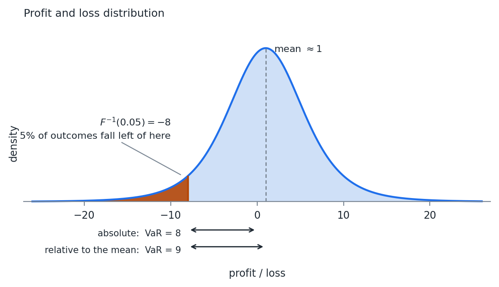

# Financial Data and Returns

## Prices Are Not Modelable

Financial data is often quoted as prices. Prices are non-stationary, so our
assumptions for modeling do not hold.

Everything in Weeks 01 through 03 assumed a series with a stable mean and
variance. A price series has neither.

A stock at \$40 last year and \$90 today has no mean to estimate, and the
variance of its level grows with the length of the sample.

::: {.notes}
Returns are not a convention. They are the transform that makes the previous
three weeks apply at all.
:::

## Today from Yesterday

Today's price is some function of yesterday's price, plus whatever new
information arrived today. Prices are generally assumed to be positive.

Three classical ways to write that function:

$$
P_t = P_{t-1} + r_t
$$

$$
P_t = P_{t-1}\left( 1 + r_t \right)
$$

$$
P_t = P_{t-1} e^{r_t}
$$

## The Three Systems

| System | Price process | Additive across | Prices stay positive |
|:--|:--|:--|:--|
| Classical Brownian | $P_t = P_{t-1} + r_t$ | assets and time | no |
| Arithmetic | $P_t = P_{t-1}(1+r_t)$ | assets | only if $r_t > -1$ |
| Geometric | $P_t = P_{t-1}e^{r_t}$ | time | yes |

The third column is why we keep all three. No system is additive both across
assets and across time, so the choice depends on which direction the sum runs.

## Classical Brownian

The least used of the three. There is no good way to assure prices stay above
zero.

It survives in commodity applications, where we are often concerned with the
price difference between two physical locations, called the basis.

Basis can and often does change sign, so the one property that disqualifies the
system elsewhere is the property we need here.

## Arithmetic Returns

Used in portfolio management. Let $h_i$ be the holding of asset $i$, $w_{i,t}$
its weight, and $PV_t$ the portfolio value.

$$
PV_t = \sum_{i=1}^{n} h_i P_{i,t}, \qquad w_{i,t} = \frac{h_i P_{i,t}}{PV_t} \Rightarrow \sum_{i=1}^{n} w_{i,t} = 1
$$

$$
PV_{t+1} = \sum_{i=1}^{n} h_i P_{i,t}\left( 1 + r_{i,t} \right) = PV_t \left( 1 + R_t \right)
$$

## The Line That Matters

$$
PV_t + \sum_{i=1}^{n} h_i P_{i,t} r_{i,t} = PV_t + PV_t R_t \Rightarrow \sum_{i=1}^{n} w_{i,t} r_{i,t} = R_t
$$

A portfolio return is a weighted sum of asset returns, exactly, with no
approximation.

Fact 7 from Week 02 then gives the portfolio variance directly, and the whole of
Delta Normal VaR follows from it.

## The Cost of Arithmetic

Prices built from arithmetic returns can go negative if the return drops below
$-1$.

We usually assume normal returns, with a volatility low enough that the boundary
rarely comes into play.

You will see arithmetic returns in the literature on the cross section of
returns, where additivity inside a single time period makes the math easy.

## Geometric Returns

Used when looking through time. Returns are additive with time.

$$
P_{t+1} = P_t e^{r_t} \Rightarrow P_T = P_0 e^{\sum_{t=0}^{T-1} r_t}
$$

$$
\ln\left( P_{t+1} \right) = \ln\left( P_t \right) + r_t
$$

If $r_t \sim N(\mu, \sigma^2)$, then

$$
\ln\left( P_{t+1} \right) \sim N\left( \mu + \ln P_t,\ \sigma^2 \right) \Rightarrow P_{t+1} \sim LN\left( \mu + \ln P_t,\ \sigma^2 \right)
$$

## The Lognormal, Arrived at Twice

Week 01 gave the lognormal as a density. This is the same distribution arrived
at from the process.

Taking the log converts a multiplicative price process into an additive one, and
the normal is closed under addition.

That closure is the only reason the $T$ period distribution is available in
closed form. The multi-day section at the end of the week uses it directly.

## Total Return Series

Assets distribute cash or undergo changes that make the raw price series not
indicative of total return:

1. Cash distributions
    a. Dividends
    b. Coupon payments
2. Stock splits
3. Spin outs

The fix is a total return price series, which assumes any proceeds are
reinvested back into the security.

## Building One

1. Calculate a price return, usually arithmetic, at each time period
2. On days where events happen, adjust the return so it reflects what an
   investor actually experienced
3. Starting with today's price, use the returns to calculate the price series
   back in time

Maintaining a database of these means recomputing history whenever an event
lands, or storing the total return values instead.

## What Step 3 Implies

The historical levels of a total return series are not prices anyone ever traded
at, and they change every time a new dividend is paid.

Only the returns are stable.

Most data sources provide a price series, a total return price series, or both.
On Yahoo! Finance the "ADJ CLOSE" column is the total return series.

## Getting This Wrong Is Expensive

A dividend paying stock analyzed on price alone shows a loss on every
ex-dividend date.

That looks like a series of small negative shocks that never reverse.

Every moment estimated off that series is wrong, and the error is largest for
exactly the high yielding names a risk report cares about.

# Value at Risk

## What It Answers

Risk is the possibility of financial loss, and it is quantified in numerous
ways.

Portfolio management often uses the standard deviation of returns. We return to
that when we cover portfolio construction.

Value at Risk attempts to answer a different question. Under normal market
conditions, what is the minimum we can expect to lose on an $\alpha$% bad day.

## What It Is Not

VaR is not the maximum loss.

Most models calibrate to recent history. Regimes shift, and what was normal
yesterday is abnormal today.

Losses in a market that is not normal can be an order of magnitude larger than
VaR.

Markets are hard to model, and extreme events happen with higher probability
than most modeling would assume.

## The Definition

Mathematically, VaR is the $\alpha$ percentile of the profit and loss
distribution.

$$
VaR_{\alpha}(x) = -F_x^{-1}(\alpha)
$$

We negate so that a positive number is a loss and a negative number is a gain.

That is the Week 01 quantile function with a minus sign in front of it. Every
method this week is a different way of getting at $F$.

## Reading It Off the Distribution

{width=70%}

## Two Reporting Conventions

VaR is reported two ways in practice. It is always helpful to ask which is
intended.

1. **Absolute** value on the profit and loss distribution. In the figure,
   VaR = 8
2. **Relative** to the mean expected value. The mean is about 1, so VaR = 9

In risk management we mostly care about the loss, so the first is usually
sufficient.

## When the Convention Matters

Comparing two portfolios on both expected return and risk generally calls for
the second definition.

At a one day horizon the two agree to within rounding, because the mean daily
return is small next to the daily standard deviation.

At a one year horizon they do not, and the gap is the entire expected return of
the portfolio.

# Criticisms of VaR

## The Two Complaints

The largest criticism has to do with the fact that models have a hard time
describing price movements in finance.

VaR is the minimum loss under normal markets. Managing risk solely to VaR leads
investors into a false sense of security.

The second complaint is structural. VaR is not subadditive when the distribution
is non-elliptical.

## Subadditivity

A subadditive measure satisfies

$$
q(P_1) + q(P_2) \geq q(P_1 + P_2)
$$

Risk should be subadditive. It is hard to construct a case where investing in
one asset makes a second asset more risky.

Diversification, at worst, has no effect when things are perfectly correlated.

## Standard Deviation Passes

Two independent assets, each with standard deviation 1, held in equal weights,
multivariate normal.

$$
q(0.5 P_1 + 0.5 P_2) = \sqrt{0.5^2 \cdot 1 + 0.5^2 \cdot 1} = 0.5\sqrt{2} = 0.707
$$

$$
q(0.5 P_1) = q(0.5 P_2) = 0.5
$$

$$
q(0.5 P_1) + q(0.5 P_2) = 1 > 0.707
$$

## Under Normality, So Does VaR

If returns are multivariate normal, VaR is a multiple of the standard deviation:

$$
\alpha = 0.05 \Rightarrow VaR \approx 1.65\, \sigma_P
$$

VaR inherits subadditivity from the quantity it is a multiple of.

The problem is not VaR itself. It is VaR applied to a distribution that is not
elliptical.

## A Counterexample

Break the normality assumption.

Two independent bonds. Each costs \$90 and pays \$100 next period if it does not
default. Each has a 4% chance of default. You have \$180.

Buy two of either bond, or one of both. Set $\alpha = 0.05$.

## Concentrated

Default happens in the 4% worst case, so in the 5% worst case the bond does not
default.

Two of the same bond pay \$200 on a \$180 cost.

$$
VaR = -\$20
$$

Negative, because the 5% loss is still a profit.

## Diversified

With one of each, the probability that at least one defaults is

$$
P(n_{\text{default}} \geq 1) = 1 - (1 - 0.04)^2 = 0.078
$$

That is above 5%, so the 5% worst case now contains a default. One bond returns
nothing on its \$90, the other pays \$100 on its \$90.

$$
-90 + 10 = -80 \Rightarrow VaR = 80
$$

## Subadditivity Fails

$$
q(P_1) = q(P_2) = -10, \qquad q(P_1 + P_2) = 80
$$

$$
q(P_1) + q(P_2) \geq q(P_1 + P_2)
$$

does not hold. $-20$ is not greater than 80.

## The Mechanism

Splitting the position moved probability mass across the 5% threshold.

Concentrated, the bad event sits at 4% and VaR never sees it. Diversified, it
sits at 7.8% and VaR reports it in full.

A measure that reads a single quantile is blind to everything on the far side of
it, and diversification moves things across.

## Not Coherent, Still Used

This makes VaR non-coherent as a risk measure.

But we still use it.

Week 05 covers Expected Shortfall, which averages over the tail instead of
reading one point on it, and is subadditive as a result.

# Delta Normal VaR

## Parametric VaR

Two assumptions: payoffs are linear, and returns are multivariate normal.

Together they give a closed form solution.

$$
\alpha = 0.05 \Rightarrow VaR_{ret} \approx 1.65\, \sigma_P
$$

That is VaR expressed as a return. Transform it into a price to get a dollar
value.

## Returns to Dollars

Arithmetic returns:

$$
VaR_{\$} = P_0 - P_0\left( 1 + \mu - VaR_{ret} \right) = P_0 VaR_{ret} - P_0 \mu
$$

Geometric returns:

$$
VaR_{\$} = P_0 - P_0 e^{\mu - VaR_{ret}}
$$

Close but not exact. Know how your returns were calculated and use the matching
version.

From here out we assume $\mu = 0$.

## The Gradient

Break the change in portfolio value into per price pieces:

$$
\Delta PV = \sum_{i=1}^{n} d_i \Delta P_i
$$

With arithmetic returns and the $\Delta$ function read as the return,

$$
R = \sum_{i=1}^{n} d_i r_i
$$

We use arithmetic returns because they are summable across the portfolio. What
is left is to find $d_i$.

## Two Derivatives

Read the expression as a Taylor polynomial and $d_i$ is the first derivative of
portfolio value with respect to price $i$.

We do not hold prices, we hold positions, so the chain rule gives two
derivatives:

$$
\frac{dR}{dr_i} = \frac{dR}{dRA_i} \frac{dRA_i}{dr_i}
$$

The first is the weight $w_i$. Hold 50% of the portfolio in an asset that
returns 5%, and the portfolio moves 2.5%.

## The Second Derivative Needs a Model

The derivative of the asset return with respect to the price return requires a
pricing function.

$$
\Delta A_i \approx \delta\, \Delta P_i, \qquad \delta = \frac{dA_i}{dP_i}
$$

$$
r_i = \frac{\Delta P_i}{P_i}, \quad RA_i = \frac{\Delta A_i}{A_i} \Rightarrow RA_i \approx \frac{\delta P_i r_i}{A_i}
$$

$$
\frac{dRA_i}{dr_i} = \frac{\delta P_i}{A_i}
$$

## Linear Instruments Are Easy

For a stock the pricing function is the price of the stock, so $\delta = 1$.

The price of the asset and the price of the underlying are the same, and a 1%
change in the price causes a 1% change in the value of the position.

Everything harder than a stock is a different $\delta$ in the same formula.

## Adding Across Assets

Derivatives are additive. If $m$ assets are affected by price $i$:

$$
\frac{dR}{dr_i} = \sum_{j=1}^{m} w_j \frac{dRA_j}{dr_i} = P_i \sum_{j=1}^{m} \frac{w_j \delta_j}{A_j}
$$

Recognizing that $w_j = \frac{h_j A_j}{PV}$, the same thing in holdings:

$$
\frac{dR}{dr_i} = \frac{P_i}{PV} \sum_{j=1}^{m} h_j \delta_j
$$

Use whichever matches how the problem was set up.

## Where the Method Lives

With the gradient $\nabla R$ and multivariate normality:

$$
R \sim N\left( \nabla R^T \mu,\ \nabla R^T \Sigma\, \nabla R \right)
$$

$\nabla R$ collapses any number of positions into one exposure per underlying
price.

The normal is closed under linear transforms, so the portfolio return is normal
with a variance we can write down.

## The Formula

With $\mu_i = 0$ for all $i$:

$$
VaR(\alpha) = -PV \cdot F_X^{-1}(\alpha) \cdot \sqrt{\nabla R^T \Sigma\, \nabla R}
$$

$F_X^{-1}(\alpha)$ is the quantile function for the standard normal. At
$\alpha = 0.05$ that value is $-1.645$, and the leading minus sign is what turns
it back into a positive loss.

## Worked Example

- 3 assets $A = [A_1, A_2, A_3]$ with current values $[1, 8, 20]$
- 2 prices $P = [P_1, P_2]$ with current prices $[7, 10]$
- Quantities $Q = [10, 20, 5]$, so $PV = A'Q = 270$
- $\frac{dA_1}{dP_1} = 0.5$, $\frac{dA_2}{dP_1} = 1$, $\frac{dA_3}{dP_2} = 1$,
  all other partial derivatives 0

$$
\Sigma = \begin{pmatrix} 0.01 & 0.0075 \\ 0.0075 & 0.0225 \end{pmatrix}
$$

## The Exposures

Assets 1 and 2 both depend on $P_1$, so their sensitivities add:

$$
\frac{dR}{dr_1} = \frac{7}{270}\left( 10 \cdot 0.5 + 20 \cdot 1 \right) = 0.6481
$$

$$
\frac{dR}{dr_2} = \frac{10}{270}\left( 5 \cdot 1 \right) = 0.1852
$$

$$
\sqrt{\nabla R^T \Sigma\, \nabla R} = 0.0823
$$

## The Answer

$$
VaR = -270 \cdot (-1.645) \cdot 0.0823 = \$36.55
$$

Remove the $PV$ from the equation and the same calculation gives VaR as a
percentage:

$$
VaR = -(-1.645) \cdot 0.0823 = 13.54\%
$$

## The Exposures Do Not Sum to One

$0.6481 + 0.1852 = 0.833$.

The portfolio is not fully exposed to its own prices, because asset 1 carries a
delta of 0.5 rather than 1.

A gradient that sums to something other than 1 is normal. A gradient you cannot
explain is a bug.

## Where It Fails

Two big issues with Delta Normal VaR.

1. **Normality of returns.** See the GFC example in the code with this lecture.
   The largest one day return during the financial crisis was so large that it
   should not have happened in the lifetime of the universe
2. **Linearity of portfolio value in returns.** Options and bonds are common
   holdings, and their return profiles are not linear with respect to underlying
   prices

## The Sign of the Second Error

Issue 2 has a sign we can predict.

The second derivative of an option value with respect to the underlying price is
called gamma, and Week 06 covers it in full.

Long gamma: the linear approximation understates the value on both sides, so
Delta Normal overstates the loss.

Short gamma: Delta Normal understates the loss. That is the direction that
matters.

## What Comes Next

The two remaining methods each attack one of the assumptions.

**Monte Carlo VaR** keeps the normality assumption and drops the linearity
assumption.

**Historical VaR** drops both.

# Normal Monte Carlo VaR

## Dropping Linearity

Asset pricing functions can be, and often are, non-linear. That makes the return
distribution of the asset not well defined, so we estimate it by simulation.

We are still assuming returns are multivariate normal.

What we are no longer assuming is that the portfolio is a linear function of
them, so we reprice rather than differentiate.

## The Algorithm

1. Calculate current portfolio value
2. Simulate $N$ draws from the assumed distribution
3. Calculate new prices from the returns, using the chosen methodology
4. Price each asset for all $N$ draws
5. Calculate portfolio value for each of the $N$ draws
6. Find the $\alpha$% of the simulated distribution
7. Calculate VaR

## Where the Cost Is

Step 2 is the Week 03 multivariate draw algorithm, unchanged.

Step 4 is where the cost is. A full revaluation of every position on every draw,
which for a book of American options is the difference between a calculation
that runs in a second and one that runs overnight.

## Reading the Quantile

Sort the portfolio values and pick the $N\alpha$ value from the vector. For a
large number of draws that is sufficient.

If the number of draws is small, a Kernel Density Estimate or another smoothing
technique may provide better results.

<https://stats.stackexchange.com/questions/341023/quantile-of-kernel-density-estimator>

# Historical VaR

## Dropping Both Assumptions

Both issues with Delta Normal VaR, that returns are not normal and asset prices
are not always linear, are sometimes addressed with Historical VaR.

It looks much like Monte Carlo VaR, but instead of using a model for returns we
assume observed past returns mimic the distribution.

Historical VaR is a non-parametric statistic. We make no distributional
assumptions on returns.

## The Algorithm

1. Calculate current portfolio value
2. Simulate $N$ draws from history, with replacement
3. Calculate new prices from the returns, using the chosen methodology
4. Price each asset for all $N$ draws
5. Calculate portfolio value for each of the $N$ draws
6. Find the $\alpha$% of the simulated distribution
7. Calculate VaR

Only step 2 changed.

## Rows, Not Returns

Sampling whole rows rather than individual returns is what preserves the
correlation structure.

There is no covariance matrix anywhere in this method, and no assumption that
dependence is linear, because the joint behavior comes along with the row.

## The Three Methods

| | Delta Normal | Monte Carlo Normal | Historical |
|:--|:--|:--|:--|
| Returns | multivariate normal | multivariate normal | sampled from history |
| Payoffs | linear | any | any |
| Dependence | $\Sigma$ | $\Sigma$ | whatever occurred |
| Cost | closed form | $N$ revaluations | $N$ revaluations |
| Main weakness | both assumptions | fat tails | limited history |

## Reading the Table

This is the choice in practice.

Nothing in the first two columns can produce a loss larger than the normal
allows.

Nothing in the third column can produce a loss that has not already happened.

Historical VaR still suffers from recency bias. Often there is not enough
history to show all regimes, so a limited sample is selected.

Using a KDE to smooth the estimate is highly recommended.

## Weighted Historical Simulation

We can weight historical values, much as we added weights for the exponentially
weighted covariance estimate.

Without weights each day has an equal chance of being selected. Weights alter
that probability.

With $m$ days of history and weight $w_i$ on day $i$:

$$
\sum_{i=1}^{m} w_i = 1, \qquad cw_i = \sum_{j=1}^{i} w_j\ \ \forall\ i \in 1:m
$$

## Drawing a Day

$$
r \sim U(0,1), \qquad \min(i)\ \text{where}\ r \leq cw_i
$$

This is the inverse CDF method from Week 03, applied to a discrete distribution
over historical days.

## The Effective Sample Size Bites

The Week 03 effective sample size discussion applies unchanged, and it bites
harder here.

A weighted historical VaR at $\lambda = 0.94$ is estimating a 5% quantile from
roughly 32 effective observations.

That puts one or two days in the tail.

# Time Periods Larger than One

## The Square Root of T Rule

Multi-day dynamics need more data to estimate than one day ahead dynamics do.

The usual shortcut assumes returns are summable across time, which means
geometric returns.

$$
R_T = \sum_{t=1}^{T} R_t, \quad R_t \sim N(\mu, \sigma^2)\ iid \Rightarrow R_T \sim N\left( T\mu,\ T\sigma^2 \right)
$$

## Scaling the Number

Assuming $\mu = 0$:

$$
VaR_t(\alpha) = -PV \cdot F_X^{-1}(\alpha) \cdot \sigma
$$

$$
VaR_T(\alpha) = -PV \cdot F_X^{-1}(\alpha) \cdot \sqrt{T}\, \sigma = \sqrt{T}\, VaR_t(\alpha)
$$

The rule needs all three assumptions in that line. Normality, independence
across time, and constant variance.

## Why Two of Them Fail

Volatility is not constant. Large moves cluster, and the level itself shifts
between regimes.

Week 02 modeled the clustering with GARCH and Week 03 handled the level shifts
with an exponentially weighted estimator. Neither is compatible with a fixed
$\sigma$ scaled by $\sqrt{T}$.

Serial correlation in the returns breaks the independence assumption in the same
line.

Both effects push the true multi-day risk above what the rule reports, and both
grow with $T$.

## The Alternatives

This estimation is often good enough. Where it is not:

1. **Delta Normal.** None. Use the $\sqrt{t}$ rule. There is no other closed
   form solution, and you are often on this method because you needed something
   quick to estimate
2. **Monte Carlo Normal.** Two options
3. **Historical simulation.** Two options

## Monte Carlo, Two Ways

**Arithmetic returns.** Simulate $T \times N$ random normals instead of $N$.
Compound the returns across time, then price the portfolio.

**Geometric returns.** Geometric returns are summable across time and we have
assumed normality, so the $T$ period ahead distribution is known. Multiply every
element of the covariance matrix by $T$, and the mean vector if you use one.
Simulate $N$ values, convert to prices, price the portfolio.

## They Are Not the Same Calculation

Path matters under arithmetic returns. Compounding is multiplicative while the
returns are added, so the $T$ period distribution is not normal and has to be
simulated.

Under geometric returns the path drops out and only the sum matters, which is
why scaling $\Sigma$ works.

## Historical, Two Ways

**A lot of data.** Segregate history into $M$ non-overlapping periods of length
$T$ and sample from those.

**Not much data.** Segregate into $M$ overlapping periods.

The overlapping version can bias the estimate. The samples are no longer
independent, and the same extreme day appears in $T$ different periods.
