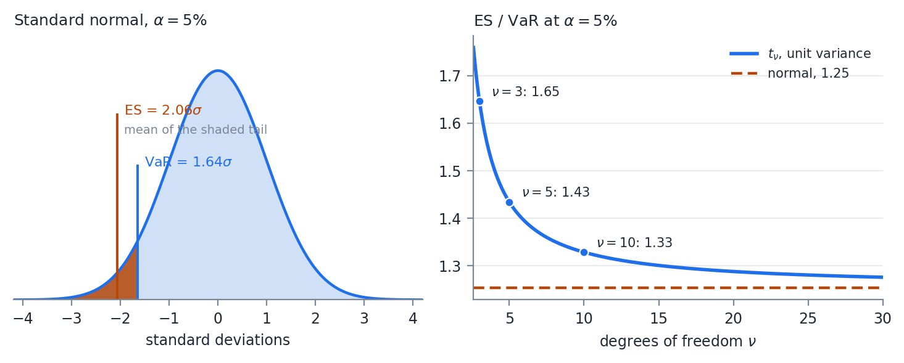
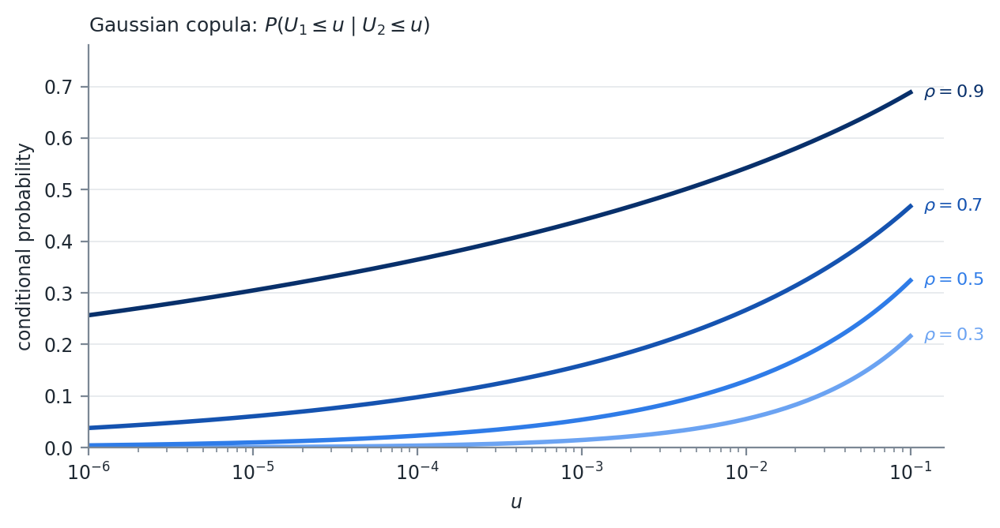
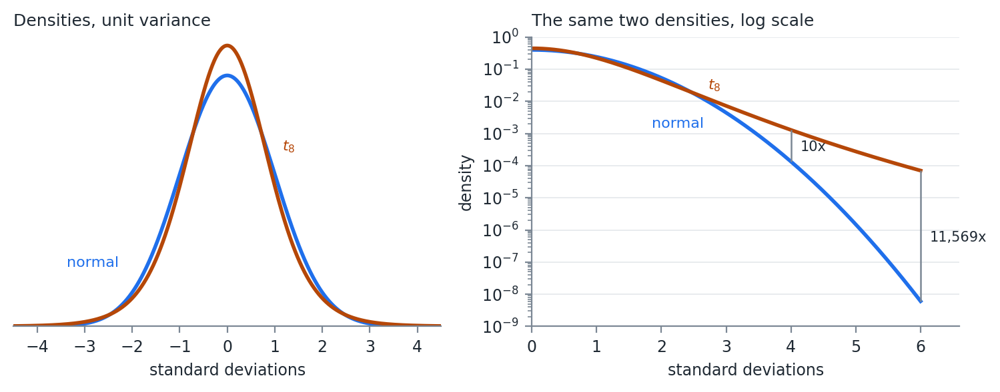

# Expected Shortfall

## Where Week 04 Left Off

VaR reads a single point on the loss distribution, so it is blind to everything
past that point.

Diversification can move a bad outcome across the threshold and make the
reported risk jump.

This week fixes both problems, and then fixes the distributional assumption
underneath them.

::: {.notes}
The first half of the week replaces the measure. The second half replaces the
distribution it is measured on. The second half is the larger idea.
:::

## The Definition

Expected shortfall is the expected value of profit and loss given the loss is
beyond VaR.

$$
ES(X) = E\left( X\ |\ x \leq -VaR(X) \right)
$$

The average of the left tail, where the tail is the values whose CDF is less
than or equal to $\alpha$.

## A Note on Signs

The two conventions get mixed constantly.

The conditional expectation above is a point on the P&L distribution, so it is
negative for a loss.

The formula that follows carries a leading minus sign, which reports ES as a
positive loss number, the same convention we used for VaR.

Both appear in practice. Pick one, state it, and stay with it.

## Other Names

1. Conditional VaR, or CVaR
2. Average VaR, or AVaR
3. Expected Tail Loss, or ETL

CVaR is the most widely used alternative, but it can mean different things to
different people. Ask for a definition when someone uses it.

## Computing It

From the PDF and VaR:

$$
ES(X) = -\frac{1}{\alpha} \int_{-\infty}^{-VaR(X)} x\, f(x)\, dx
$$

Numerically, given a sample, this is the mean of all values less than or equal
to VaR.

Two lines of code, and no more difficult than VaR was.

## The Normal Case

ES has closed form solutions for many distributions. Most of what we do is
simulation based, so we calculate it numerically, but the normal is worth
having.

$$
ES_{\alpha}(X) = -\mu + \sigma \frac{f\left( \Phi^{-1}(\alpha) \right)}{\alpha}
$$

$f(x)$ is the standard normal PDF and $\Phi^{-1}(\alpha)$ the standard normal
quantile function.

ES for the normal is a linear function of the standard deviation. Just like VaR.

## The Same Number, Scaled

At $\alpha = 0.05$ the multiplier is $f(-1.645)/0.05 = 2.063$, against $1.645$
for VaR.

Under normality the two measures are the same number scaled by 1.25, and any
statement about one is a statement about the other.

That is a statement about the normal, not about the measures.

## VaR and ES on a Normal

{width=88%}

## What the Panels Show

The left panel is the definition. VaR is where the shading starts. ES is the
average of what is inside it.

The right panel is why we bother. For a $t$ scaled to the same variance the
ratio rises as the tail gets heavier: 1.33 at $\nu = 10$, 1.43 at $\nu = 5$,
1.65 at $\nu = 3$.

VaR barely moves across that range, because the 5% quantile of a unit variance
$t$ is close to the normal's. ES moves, because it is averaging over the part of
the distribution that actually changed.

## Coherence

Coherence is a defined term. Artzner, Delbaen, Eber, and Heath (1999) set out
four properties a risk measure $q$ should have, writing losses as positive.

1. **Monotonicity.** If $X$ loses at least as much as $Y$ in every state, then
   $q(X) \geq q(Y)$
2. **Subadditivity.** $q(X + Y) \leq q(X) + q(Y)$. Combining positions cannot
   create risk
3. **Positive homogeneity.** $q(\lambda X) = \lambda\, q(X)$ for
   $\lambda \geq 0$
4. **Translation invariance.** $q(X + c) = q(X) - c$. Adding cash reduces risk
   by the amount of cash

## One Row Apart

| Property | VaR | ES |
|:--|:-:|:-:|
| Monotonicity | yes | yes |
| Subadditivity | no | yes |
| Positive homogeneity | yes | yes |
| Translation invariance | yes | yes |

And it is the row from Week 04.

## The Bond Example Again

Week 04 gave $q(P_1) + q(P_2) = -20$ against $q(P_1 + P_2) = 80$.

Run the same example through ES and the inequality holds, because averaging over
the tail sees the 0.16% state where both bonds default.

VaR never looks past the 5% point.

## Convexity

Subadditivity is also what makes the surface convex.

A subadditive and positively homogeneous measure is convex in the portfolio
weights, so minimizing ES subject to linear constraints is a convex program with
one optimum.

Minimizing VaR is not, and can have many local minima.

Week 07 and Week 08 both build optimizations on this.

## Why ES Gained Ground

It gives a loss expectation instead of a minimum.

It is more sensitive to the tails than VaR. Fatter tails generally mean larger
ES, which is not always true for VaR.

The Basel framework moved market risk capital from 99% VaR to 97.5% ES for
exactly that reason. The two are close under normality, $2.34\sigma$ against
$2.33\sigma$, and they separate when the tail is heavy, which is when the number
matters.

## What ES Costs

There is a real cost, and it is worth knowing before recommending ES to anyone.

ES is harder to validate against realized outcomes.

VaR has a clean test: count the days the loss exceeded it and compare the count
to $\alpha n$.

ES has no equivalent.

## Elicitability

Gneiting (2011) showed there is no scoring function whose expected value is
minimized by the true ES, which is the property a direct backtest needs.

Fissler and Ziegel (2016) showed that VaR and ES are jointly elicitable, so ES
can be backtested alongside VaR but not on its own.

My opinion: use ES for optimization and for reporting the size of a tail loss,
and keep VaR in the report as the thing you can actually backtest. The two cost
the same to compute once the distribution is simulated.

# Model Based Simulation

## Simulating from Fitted Models

Often we want to simulate from fitted models instead of just a distribution.

$$
y = f(X, \epsilon)
$$

That requires distributional assumptions on $X$ and $\epsilon$. The easiest
assumption is multivariate normal:

$$
[X\ \epsilon] \sim N(\mu, \Sigma)
$$

## The OLS Case

If $f(X,\epsilon)$ is OLS, then $X$ and $\epsilon$ are independent and
$E(\epsilon) = 0$.

$$
y = X\beta + \epsilon, \qquad X \sim N\left( \mu_X, \Sigma_X \right), \quad \epsilon \sim N\left( 0, \sigma^2 \right)
$$

$$
[X\ \epsilon] \sim N(\mu, \Sigma), \quad
\mu = \begin{bmatrix} \mu_X \\ 0 \end{bmatrix}, \quad
\Sigma = \begin{bmatrix} \Sigma_X & 0 \\ 0 & \sigma^2 \end{bmatrix}
$$

## Read the Zeros

$\Sigma_X$ is the $m \times m$ covariance of the regressors and $\sigma^2$ is
the scalar residual variance.

The off diagonal blocks are 0 because assumption 3 of OLS says the regressors
are uncorrelated with the error. For two regressors:

$$
\Sigma = \begin{bmatrix}
\sigma_{x_1}^2 & \sigma_{x_1 x_2} & 0 \\
\sigma_{x_1 x_2} & \sigma_{x_2}^2 & 0 \\
0 & 0 & \sigma^2
\end{bmatrix}
$$

This is the Week 03 multivariate draw algorithm with the error term appended to
the vector of variables.

## OLS Does Not Need This

- OLS is a linear function of random normals
- A linear function of random normals is also a random normal
- OLS is the same thing as just using a joint multivariate distribution on $Y$
  and $X$

## The Regression Was Already Inside

From the conditional distributions section of Week 02, given a joint normal on
$[Y\ X]$:

$$
\bar{\mu} = \mu_Y + \Sigma_{YX}\Sigma_{XX}^{-1}\left( a - \mu_X \right), \qquad
\bar{\Sigma} = \Sigma_{YY} - \Sigma_{YX}\Sigma_{XX}^{-1}\Sigma_{XY}
$$

$\Sigma_{YX}\Sigma_{XX}^{-1}$ is $\hat{\beta}$ and $\bar{\Sigma}$ is the
residual variance.

## A Check, Not a Result

Fit the regression, simulate the pieces, and you get back the joint normal you
could have written down at the start.

It stops being true the moment any piece is not normal.

That is the whole point of the copula.

## Several Dependent Variables

$$
y_i = f(X, \epsilon_i)\ \ \forall\ i \in [1,n], \qquad
\mathcal{E} = \left[ \epsilon_1,\ \epsilon_2,\ \dots,\ \epsilon_n \right]
$$

$$
\mathcal{E} \sim N\left( 0, \Sigma_{\epsilon} \right)
$$

If all $X$ variables are used in each model:

$$
\Sigma = \begin{bmatrix} \Sigma_X & 0 \\ 0 & \Sigma_{\epsilon} \end{bmatrix}
$$

The scalar $\sigma^2$ has become the $n \times n$ matrix $\Sigma_{\epsilon}$.
The corner blocks are still 0.

## When Not All X Are Used

$$
\Sigma = \operatorname{cov}\left( [X\ \mathcal{E}] \right) =
\begin{bmatrix} \Sigma_X & \Sigma_{X\epsilon} \\ \Sigma_{X\epsilon}' & \Sigma_{\epsilon} \end{bmatrix}
$$

The diagonal elements are the same. The off diagonal elements are no longer
necessarily 0.

In practice it is often easier to calculate the covariance than to construct the
block diagonal matrix.

## The Part That Is Easy to Forget

Each model was fit separately, and each residual series is uncorrelated with its
own regressors by construction.

The residuals of two different models are not uncorrelated with each other.

Two stocks sharing an industry exposure the market factor did not capture will
have residuals that move together, and setting $\Sigma_{\epsilon}$ diagonal
throws that away.

Week 09 returns to this as the load bearing assumption of a factor model.

## A Distribution Is a Model

A distributional assumption about a variable is a model. Assuming
$y \sim N\left( \mu, \sigma_{\epsilon}^2 \right)$:

$$
y = f(X, \epsilon) = \mu + \sigma_{\epsilon} z, \qquad z \sim N(0,1)
$$

There is no $X$ in that model, which is the point.

A variable we assume a distribution for and a variable we regress on three
factors both end up as a function of an iid error. The simulation machinery does
not distinguish them, and that is what lets the next section mix them freely.

# Copulas

## The Problem

Not all financial data are normally distributed. Some are close enough and
others are not.

The problem is specific. Fitting a $t$ to one stock and a normal to another is
easy.

Fitting a joint distribution whose first margin is $t$ and whose second is
normal is not, because no standard multivariate family has margins from
different families.

Everything in Weeks 02 and 03 assumed one $\Sigma$ over one multivariate normal.

## What a Copula Is

Copulas are multivariate cumulative distribution functions whose marginal
distributions are uniform on $[0,1]$.

They combine variables with different assumed distributions.

## The Mechanism

The inverse CDF method from Week 03, run in both directions.

The CDF maps any distribution onto $[0,1]$. The quantile function maps $[0,1]$
back onto any other.

Between those two steps the marginal distribution has been stripped out, and
what remains is the dependence structure alone.

## Sklar's Theorem

Every multivariate CDF of a random vector $X$

$$
H\left( x_1,\ \dots,\ x_n \right) = P\left( X_1 \leq x_1,\ \dots,\ X_n \leq x_n \right)
$$

can be expressed in terms of its marginals $F_i(x_i) = P(X_i \leq x_i)$ and some
copula $C$:

$$
H\left( x_1,\ \dots,\ x_n \right) = C\left( F_1\left( x_1 \right),\ \dots,\ F_n\left( x_n \right) \right)
$$

Recognize that $F_i(x_i) \in [0,1]$, and that $F_i$ need not be the same
distribution as $F_j$.

## What Sklar Says

Something stronger than it first appears.

Any joint distribution can be split into margins and a copula, and for
continuous margins the split is unique.

So the choice of copula and the choice of margins are two independent modeling
decisions.

Getting one right does nothing to protect you from getting the other wrong.

# The Gaussian Copula

## The Construction

Given a correlation matrix $R$:

$$
C_R(X) = \Phi_R\left( \Phi^{-1}\left( F_1\left( x_1 \right) \right),\ \dots,\ \Phi^{-1}\left( F_n\left( x_n \right) \right) \right)
$$

$\Phi^{-1}(x)$ is the standard normal quantile function and $\Phi_R(X)$ is the
multivariate normal CDF given correlation $R$.

These are all functions we have worked with, which makes $R$ very simple to fit.

## What It Does and Does Not Assume

The dependence structure is the one a multivariate normal would have.

The marginal distributions are whatever we fit, and they are not normal.

## Fitting the Copula

1. For each variable $i \in 1 \dots n$:
    a. Transform $X_i$ into a uniform vector $U_i$ using the CDF $F_i(x_i)$
    b. Transform $U_i$ into a standard normal vector $Z_i$ using the normal
       quantile function
2. Calculate the correlation matrix of $Z$

Use Spearman correlations. We are often dealing with distributions with large
outliers, and Spearman is the more robust measure.

## Spearman

$$
r_s = \rho_{R(x),R(y)} = \frac{\operatorname{cov}\left( R(x),R(y) \right)}{\sigma_{R(x)} \sigma_{R(y)}}
$$

- $R(x)$ is the rank function
- $\overline{R(x)}$ is the average of the rank function

Pearson computed on rank vectors.

## Skip Step 1b

Because Spearman uses ranks and the quantile function is monotonic, we can
calculate Spearman correlations straight from the $U$ matrix.

Ranks survive any monotone transform. $F_i$ is monotone and $\Phi^{-1}$ is
monotone, so the ranks of $X$, of $U$, and of $Z$ are identical.

A statistic computed from ranks cannot tell them apart. Week 02 made the same
point with $y = x^3$.

## R Must Be PSD

On complete data it will be.

Spearman is Pearson computed on rank vectors, and a Pearson matrix built from
complete data is PSD by the same argument as any covariance matrix.

Missing data is where that breaks, for Spearman exactly as it did for Pearson in
Week 03, and the repairs there apply here unchanged.

## Simulating from the Copula

1. Simulate $NSim$ draws from the multivariate normal
2. For each variable $Z_i \in 1 \dots n$:
    a. Transform $Z_i$ into a uniform using the standard normal CDF,
       $\Phi(z_i) = U_i$
    b. Transform $U_i$ into the fitted distribution using its quantile function,
       $F_i^{-1}(U_i) = X_i$

Step 2.b is where the fitted marginals come back. The correlated normals in step
1 are a scaffold, and nothing about the final values is normal unless $F_i$ was
normal to begin with.

## Tail Dependence

One failure mode worth naming, because it is not obvious and it is not small.

Tail dependence is the probability that one variable is extreme given that
another is:

$$
\lambda_L = \lim_{u \to 0^+} P\left( U_1 \leq u\ |\ U_2 \leq u \right)
$$

## Zero at Every Rho

For the Gaussian copula, $\lambda_L = 0$ for every $\rho < 1$.

Far enough into the tail, the variables become independent.

Fit $\rho = 0.9$ and the model still says that a sufficiently extreme loss in
one asset tells you nothing about the other.

## Conditional Exceedance

{width=88%}

## The Limit in Progress

The left panel. At $\rho = 0.7$, a 5% day in one asset means a 39% chance of a
5% day in the other, which sounds reasonable.

Go to a 0.1% day and it is 16%. Go to a 0.001% day and it is 6%, still falling,
on its way to 0.

The right panel is the same picture under the $t$ copula. The curves flatten
instead of falling, and the level each one flattens at is a number we will fit.

## Whether It Matters

Depends entirely on what the simulation is for.

It does not change a portfolio's variance and it barely moves a 5% VaR.

It changes the probability that many positions lose together on the same day,
which is the event a risk manager is paid to worry about.

## Li and 2008

The Gaussian copula took a great deal of blame after 2008, mostly through Li
(2000), which used it to price correlated defaults in CDO tranches.

My opinion: the criticism is fair as far as the tail dependence goes and unfair
as an explanation of the crisis.

A model that assumes defaults become independent in the extreme is the wrong
model for a senior tranche, and that is a real defect. It is not the reason
anyone bought the tranche.

## Other Families

**Archimedean**, including Clayton, Gumbel, and Frank. Built from a generator
function rather than from a multivariate distribution, and can be asymmetric
between the upper and lower tails.

**Vine**, which builds a high dimensional dependence structure out of a tree of
bivariate ones.

We cover neither. Investigate them on your own if you are going to simulate
financial data seriously.

The $t$ copula we do cover, and building it requires the multivariate $t$ first.

# The Multivariate $t$ Distribution

## Inherited, Not a Quirk

The Gaussian copula's zero tail dependence comes from the multivariate normal
that generates it.

Change the generator to a distribution with fat joint tails and the copula
inherits fat joint tails instead.

The multivariate $t$ is the smallest such change from what we already have.

## The Density

$X$ of length $n$ is multivariate $t$ with $\nu$ degrees of freedom, location
$\mu$, and scale matrix $\Sigma$ when

$$
f(X) = c_{\nu,n}\left\lbrack 1 + \frac{1}{\nu}\left( X - \mu \right)'\Sigma^{-1}\left( X - \mu \right) \right\rbrack^{-\frac{\nu + n}{2}}
$$

$$
c_{\nu,n} = \frac{\Gamma\left( \frac{\nu + n}{2} \right)}{\Gamma\left( \frac{\nu}{2} \right)\left( \nu\pi \right)^{n/2}\left| \Sigma \right|^{1/2}}
$$

The bracket is the part that does the work. $c_{\nu,n}$ only makes it integrate
to 1.

## Scale, Not Covariance

$\Sigma$ is a scale matrix. For $\nu > 2$,

$$
\operatorname{cov}(X) = \frac{\nu}{\nu - 2}\Sigma
$$

For $\nu \leq 2$ the covariance does not exist at all.

Correlations are unaffected either way, since the scaling factor divides out of
the numerator and the denominator.

## One Nu for Every Margin

Every margin shares one $\nu$.

Fit a multivariate $t$ to a set of assets and the fit assigns all of them the
same tail thickness, which is rarely what the data says.

That restriction is exactly the one the copula construction removes.

## Against the Normal

The quadratic form $\left( X - \mu \right)'\Sigma^{-1}\left( X - \mu \right)$
appears in both.

The normal puts it inside an exponential. The $t$ puts it inside a power.

Take one variable with mean 0 and unit variance, so the $t$ carries a scale of
$s^2 = (\nu - 2)/\nu$, and let $x$ grow:

$$
\frac{f_t\left( x \right)}{f_N\left( x \right)} \propto \frac{\left( 1 + \frac{x^2}{\nu s^2} \right)^{-\frac{\nu + 1}{2}}}{e^{-x^2/2}} \sim x^{-\left( \nu + 1 \right)}e^{x^2/2} \rightarrow \infty
$$

## No Power Beats an Exponential

The numerator falls like a power of $x$. The denominator falls like
$e^{-x^{2}/2}$.

Far enough out, the $t$ is arbitrarily more likely than the normal, and that
holds for every finite $\nu$ no matter how large.

Far enough out is closer than it sounds.

## A Normal and a $t_8$

{width=88%}

## Linear and Log

The left panel is the pair on a linear scale, and they are hard to tell apart.
The $t$ is a little taller at the center and a little thinner around one
standard deviation. That is the entire visible difference.

The right panel is the same two densities on a log scale, where the normal falls
away as a parabola and the $t$ falls close to a straight line.

## The Tail Table

| Deviation | Normal density | $t_8$ density | Ratio |
|--:|--:|--:|--:|
| $2\sigma$ | $5.40 \times 10^{-2}$ | $4.48 \times 10^{-2}$ | 0.8 |
| $3\sigma$ | $4.43 \times 10^{-3}$ | $7.23 \times 10^{-3}$ | 1.6 |
| $4\sigma$ | $1.34 \times 10^{-4}$ | $1.29 \times 10^{-3}$ | 9.6 |
| $5\sigma$ | $1.49 \times 10^{-6}$ | $2.76 \times 10^{-4}$ | 185 |
| $6\sigma$ | $6.08 \times 10^{-9}$ | $7.03 \times 10^{-5}$ | 11,569 |

Same variance, four orders of magnitude apart at six standard deviations.

## Once Every Four Million Years

Under the normal, a six standard deviation loss or worse arrives about once
every four million years of trading days.

Under the $t_8$ it arrives about once every 65 years.

That is one variable. The multivariate version does the same thing to the joint
tail, which is the part we came for.

## The Mixture Representation

Week 01 built the Normal Inverse Gaussian as a normal variance mixture. The
multivariate $t$ is another one:

$$
X = \mu + \sqrt{W}\ LZ,\ \ \ \ \ W = \frac{\nu}{Q},\ \ \ Q\sim\chi_{\nu}^{2},\ \ \ Z\sim N\left( 0,I \right)
$$

$L$ is the Cholesky root of $\Sigma$ from Week 03.

Draw a standard normal vector, draw one chi-square, scale the entire vector by
the same $\sqrt{W}$, and the result is multivariate $t$.

## The Word Same

One draw of $W$ scales every element of $Z$ at once, so on the draws where $W$
is large every asset is extreme together.

No correlation matrix is doing that work. The common shock is the tail
dependence.

Simulating it costs one line more than the multivariate normal simulation in
Week 03.

## Check It

Most packages will draw from a multivariate $t$ directly.

Build the mixture version anyway, simulate from both, and compare the sample
covariance, the sample kurtosis, and a few quantiles.

If they agree, use whichever you are more comfortable with. If they disagree,
you have found either a bug or a parameterization difference, and the scale
matrix is the first place to look.

## Three Ways to Fit

**Full maximum likelihood.** Optimize over $\mu$, $\Sigma$, and $\nu$ together.
The surface is badly behaved because $\Sigma$ and $\nu$ trade off. Shrink $\nu$,
inflate $\Sigma$, and the likelihood barely moves.

**Expectation maximization.** The standard method, and it works because of the
mixture. Conditional on $W$ the model is a weighted multivariate normal with a
closed form. Use a package.

**Rank based with a profiled $\nu$.** What we will do. For a copula we need
neither $\mu$ nor the scale of $\Sigma$, only $R$ and $\nu$.

## Kendall's Tau

$\tau$ counts how often two variables agree about which of two observations is
the larger one.

**Concordant.** The observation with the larger $x$ also has the larger $y$:

$$
\operatorname{sign}\left( x_k - x_l \right) = \operatorname{sign}\left( y_k - y_l \right)
$$

**Discordant.** The observation with the larger $x$ has the smaller $y$.

## In Returns

Take any two days out of the sample.

If the day that was better for the first stock was also the better day for the
second, that pair of days is concordant.

If the day that was better for the first stock was the worse day for the second,
that pair is discordant.

## The Formula

$$
\tau = \frac{\#\text{concordant} - \#\text{discordant}}{\binom{m}{2}}
$$

$\binom{m}{2}$ is the number of pairs available to compare, which puts $\tau$ on
the $[-1,1]$ scale we expect.

Every pair concordant gives 1. Every pair discordant gives $-1$. An even split
gives 0.

Only the ordering enters, never the values, so $\tau$ is a rank statistic like
Spearman.

## Why Tau Here

Exactness. For any elliptical copula, which includes both the Gaussian and the
$t$,

$$
\rho = \sin\left( \frac{\pi\tau}{2} \right)
$$

$\nu$ appears nowhere in that relation.

Spearman has a matching identity under the Gaussian copula,
$\rho_S = \frac{6}{\pi}\arcsin(\rho/2)$, but no closed form under the $t$.

Estimating $R$ from $\tau$ means estimating it once and handing the same matrix
to both models.

## A Worked Count {.smaller}

Eight observations, listed in increasing order of $x$:

| Obs | $x$ | $y$ | Rank of $y$ | Concordant | Discordant |
|--:|--:|--:|--:|--:|--:|
| 1 | $-2.1$ | 0.2 | 4 | 4 | 3 |
| 2 | $-1.4$ | $-0.5$ | 3 | 4 | 2 |
| 3 | $-0.9$ | $-1.8$ | 1 | 5 | 0 |
| 4 | $-0.3$ | $-1.1$ | 2 | 4 | 0 |
| 5 | 0.4 | 1.0 | 6 | 2 | 1 |
| 6 | 0.8 | 0.6 | 5 | 2 | 0 |
| 7 | 1.5 | 2.2 | 8 | 0 | 1 |
| 8 | 2.6 | 1.7 | 7 | 0 | 0 |
|  |  |  | **Total** | **21** | **7** |

## Why the Ordering Helps

Listing in increasing order of $x$ turns the counting into one comparison
instead of two.

For any pair of rows the lower row holds the larger $x$ by construction, so the
pair is concordant when the lower row also holds the larger $y$. The $y$ column
is the only one that needs to be read.

The last two columns count each row against the rows below it, which visits
every pair exactly once.

## Reading Three Rows

Row 1 has rank 4. The seven rows below hold 3, 1, 2, 6, 5, 8, 7. Four are above
4 and three are below, so 4 concordant and 3 discordant.

Row 3 has rank 1, the smallest, so all five rows below hold a larger $y$. Five
concordant, none discordant.

Row 7 has rank 8, the largest, so the single row below it is discordant.

## The Answer

The columns sum to 21 and 7, which is 28 pairs, matching $\binom{8}{2}$.

$$
\tau = \frac{21 - 7}{28} = 0.5 \qquad \rho = \sin\left( \frac{\pi(0.5)}{2} \right) = \frac{\sqrt{2}}{2} = 0.7071
$$

The two variables agree about the ordering three times as often as they
disagree, and under an elliptical copula that implies a correlation of 0.71.

## Three Measures, No Winner

Pearson on the same eight pairs is 0.7116 and Spearman is 0.7381.

The three measures do not have to agree and none of them is wrong.

Only $\tau$ carries an inversion that is exact for the $t$ as well as for the
Gaussian.

## Is the Tau Matrix PSD

On complete data, yes, for the same reason the Spearman matrix is.

Write the sample $\tau$ as an average over observation pairs $(k,l)$ of the
outer product $s^{(kl)}s^{(kl)'}$, where
$s_i^{(kl)} = \operatorname{sign}\left( x_{ik} - x_{il} \right)$.

Every outer product is PSD and an average of PSD matrices is PSD.

## The Transform Breaks It

$\sin(\pi\tau/2)$ is applied entry by entry, and an entrywise function of a PSD
matrix carries no guarantee of coming back PSD.

On the five assets ahead it does come back PSD, smallest eigenvalue 0.18.

On all one hundred columns of `DailyPrices.csv` over the same year the $\tau$
matrix has a smallest eigenvalue of 0.050 and the transformed matrix has one of
$-0.0056$.

Check the eigenvalues and repair with the Week 03 methods. Nothing like that
could happen with Spearman, which was used directly as $R$.

## Profiling Nu

$\nu$ is what is left. Hold $\mu$ at the sample mean and $R$ at the rank
estimate, and the scales come along for free.

Run the scale relation backwards. At a given $\nu$, variable $i$ with sample
standard deviation $\widehat{\sigma}_i$ must have scale

$$
d_i\left( \nu \right) = \widehat{\sigma}_i\sqrt{\frac{\nu - 2}{\nu}}\ \ \ \ \ \ \ \ \Sigma\left( \nu \right) = D\left( \nu \right)RD\left( \nu \right)
$$

Every parameter of the distribution is now a function of $\nu$ alone.

## The Likelihood

$$
\ell\left( \nu \right) = \sum_{k = 1}^{m}\ln f\left( x_k;\ \widehat{\mu},\ \Sigma\left( \nu \right),\ \nu \right)
$$

$$
\widehat{\nu} = \underset{\nu}{\arg\max}\ \ell\left( \nu \right)\ \ \ \ \text{subject to}\ \ \ \ 2 < \nu \leq \nu_{\max}
$$

The lower bound keeps the covariance finite.

The upper bound is there because the objective flattens. Past $\nu \approx 100$
a $t$ and a normal are indistinguishable at any sample size we will have, so the
likelihood stops discriminating and an unbounded search wanders.

## Search in One Over Nu

Search over $\theta = 1/\nu$ on $\theta \in [0.01,\ 0.49]$.

The difference between $\nu = 4$ and $\nu = 5$ matters a great deal. The
difference between $\nu = 40$ and $\nu = 50$ matters almost not at all.
Searching in $\theta$ puts the resolution where the first of those lives.

Stop at 0.49 rather than 0.5 to keep $\nu$ off its lower boundary, where
$d_i(\nu)$ collapses to zero and $\Sigma$ stops being invertible.

A 200 point grid is cheap, and unlike a scalar optimizer it shows you the shape
of the objective.

## What This Is Not

$R$ is held at the rank estimate and the scales are tied to the sample standard
deviations.

The likelihood is being maximized along a one dimensional slice rather than over
the whole parameter space.

It is cheap, it is stable, and it is close enough for what we do with it. EM
does the joint version when you need the joint version.

## A Worked Fit

Daily returns for SPY, AAPL, MSFT, JPM, and XOM from `DailyPrices.csv`, 249
observations. Code in `fit_multivariate_t.jl`.

| Asset | Mean (%) | $\widehat{\sigma}$ (%) | Separate $\widehat{\nu}$ |
|:--|--:|--:|--:|
| SPY | 0.100 | 0.780 | 7.74 |
| AAPL | 0.088 | 1.416 | 4.43 |
| MSFT | 0.101 | 1.254 | 11.87 |
| JPM | 0.192 | 1.149 | 4.50 |
| XOM | 0.037 | 1.277 | 22.65 |

## R from Kendall's Tau

|  | SPY | AAPL | MSFT | JPM |
|:--|--:|--:|--:|--:|
| AAPL | 0.595 |  |  |  |
| MSFT | 0.721 | 0.492 |  |  |
| JPM | 0.452 | 0.155 | 0.140 |  |
| XOM | 0.105 | $-0.043$ | $-0.159$ | 0.307 |

Smallest eigenvalue 0.181, so nothing needs repair.

SPY carries the two largest correlations, which is what you would expect of an
index against its own constituents. XOM sits nearly independent of the three
technology and financial names.

## The Profile

| $\nu$ | $\ell\left( \nu \right)$ |
|--:|--:|
| 4 | 4004.6 |
| 6 | 4020.8 |
| **7.8** | **4022.6** |
| 10 | 4021.6 |
| 15 | 4017.1 |
| 20 | 4012.9 |
| 40 | 4002.6 |

The maximum sits at $\widehat{\nu} = 7.8$, and the curve is flat enough around
it that the grid resolution matters more than the optimizer does.

## What the Shared Nu Costs

Hold 7.8 against the last column of the moments table.

Fitted one at a time these five series want degrees of freedom from 4.43 to
22.65, a range of five to one. The multivariate $t$ has to answer with a single
number, and 7.8 sits closer to the fat tailed names than to XOM.

Every margin is now misdescribed. AAPL and JPM are given thinner tails than they
have and XOM is given fatter ones.

That is the reason to want a construction that lets each margin keep its own.

# The $t$ Copula

## The Construction

Given $R$ and degrees of freedom $\nu$:

$$
C_{R,\nu}(X) = t_{R,\nu}\left( t_{\nu}^{- 1}\left( F_1\left( x_1 \right) \right),\ \dots,\ t_{\nu}^{- 1}\left( F_n\left( x_n \right) \right) \right)
$$

$t_{\nu}^{-1}(x)$ is the univariate $t$ quantile function and $t_{R,\nu}(X)$ the
multivariate $t$ CDF.

Held against the Gaussian copula, the only change is which quantile function
goes in and which joint CDF comes out.

## Two Different Nus

The $\nu$ inside the copula has nothing to do with any $\nu$ fitted to a margin.

A margin can be a normal, a $t$ with four degrees of freedom, or an empirical
distribution, and the copula's $\nu$ still governs the joint tail alone.

Sklar's theorem is what permits the separation.

As $\nu \rightarrow \infty$ the $t$ copula converges to the Gaussian copula. The
Gaussian is the nested special case.

## Fitting

1. For each variable, transform $X_i$ into $U_i$ using its own fitted CDF
   $F_i(x_i)$
2. Calculate Kendall's $\tau$ for every pair and set $R = \sin(\pi\tau/2)$.
   Repair $R$ to PSD if the eigenvalues call for it
3. Maximize the copula log likelihood over $\nu$ with $R$ held fixed

Step 3 needs the copula density.

## The Copula Density

Differentiating Sklar's theorem gives the joint density divided by the product
of the marginal densities of the transformed variables:

$$
c_{R,\nu}\left( u_1,\ \dots,\ u_n \right) = \frac{f_{R,\nu}\left( t_{\nu}^{- 1}\left( u_1 \right),\ \dots,\ t_{\nu}^{- 1}\left( u_n \right) \right)}{\prod_{i = 1}^{n}f_{\nu}\left( t_{\nu}^{- 1}\left( u_i \right) \right)}
$$

$f_{R,\nu}$ is the multivariate $t$ density with $\mu = 0$ and $\Sigma = R$.
$f_{\nu}$ is the univariate $t$ density carrying the same $\nu$.

## Reading the Ratio

A comparison against independence.

Independent densities multiply, so the denominator is the joint density the
variables would have if nothing linked them. The numerator is the joint density
they actually have.

A copula density of 1 everywhere is independence. Above 1 marks the region where
the variables turn up together more often than chance. Below 1 marks the region
where they avoid each other.

## The Conditional Reading

In two dimensions, write $f(x,y) = f(y \mid x)f(x)$ and one marginal cancels:

$$
c\left( u,v \right) = \frac{f\left( x,y \right)}{f(x)f(y)} = \frac{f\left( y \mid x \right)}{f(y)}
$$

The copula density at a point is how much more likely $y$ becomes once you are
told $x$.

## The Log Likelihood

$$
\ell\left( \nu \right) = \sum_{k = 1}^{m}\ln c_{R,\nu}\left( u_{k1},\ u_{k2},\ \dots,\ u_{kn} \right)
$$

Do not implement that as written.

The copula density is a ratio holding a product of $n$ densities. Week 02 made
the case against forming a product of densities: values sit below 1, and
multiplying enough of them underflows to zero before the optimizer sees
anything.

The ratio adds a second way to fail, since a denominator that underflows to zero
divides as well.

## The Log Splits It

A log of a ratio is a difference and a log of a product is a sum:

$$
\ln c_{R,\nu}\left( u_{k1},\ \dots \right) = \ln f_{R,\nu}\left( y_{k1},\ \dots \right) - \sum_{i = 1}^{n}\ln f_{\nu}\left( y_{ki} \right)
$$

with $y_{ki} = t_{\nu}^{-1}\left( u_{ki} \right)$. Summing over observations:

$$
\ell\left( \nu \right) = \sum_{k = 1}^{m}\ln f_{R,\nu}\left( y_{k1},\ \dots,\ y_{kn} \right) - \sum_{k = 1}^{m}\sum_{i = 1}^{n}\ln f_{\nu}\left( y_{ki} \right)
$$

Two sums of logs, no product or ratio anywhere. Both terms are available as log
density functions in any package, so neither density is evaluated on its own
scale.

## The Search

$$
\widehat{\nu} = \underset{\nu}{\arg\max}\ \ell\left( \nu \right)\ \ \ \ \text{subject to}\ \ \ \ 2 < \nu \leq \nu_{\max}
$$

Same bounds, same $\theta = 1/\nu$ substitution, same grid and refinement as the
multivariate $t$.

The objective is the only thing that moved. One evaluation costs a $t$ quantile
transform of the whole $U$ matrix and one quadratic form per observation.

## Simulating

1. Draw $Y$ from the multivariate $t$ with correlation $R$ and $\widehat{\nu}$,
   using the mixture representation
2. For each variable $i \in 1\dots n$:
    a. Transform $Y_i$ into a uniform using the univariate $t$ CDF,
       $t_{\widehat{\nu}}(y_i) = U_i$
    b. Transform $U_i$ into the fitted distribution using its quantile function,
       $F_i^{-1}(U_i) = X_i$

## The Most Common Error

Step 2.a uses the copula's $\widehat{\nu}$, not the margin's.

Confusing those two is the most common error in the entire construction, and the
simulation still runs when you make it.

## Tail Dependence, Closed Form

$$
\lambda = 2\ t_{\nu + 1}\left( - \sqrt{\frac{\left( \nu + 1 \right)\left( 1 - \rho \right)}{1 + \rho}} \right)
$$

$t_{\nu + 1}$ is the univariate $t$ CDF with one more degree of freedom than the
copula.

Positive for every finite $\nu$ and every $\rho > -1$.

By symmetry the upper tail dependence is the same number, which is itself a
modeling assumption and not a fact about markets.

## Lambda Under the $t$ Copula

| $\rho$ | $\nu = 4$ | $\nu = 8$ | $\nu = 16$ | $\nu = 30$ |
|--:|--:|--:|--:|--:|
| 0.3 | 0.162 | 0.055 | 0.008 | 0.000 |
| 0.5 | 0.253 | 0.117 | 0.029 | 0.003 |
| 0.7 | 0.391 | 0.239 | 0.101 | 0.026 |
| 0.9 | 0.630 | 0.509 | 0.357 | 0.211 |

Every entry is 0 under the Gaussian copula.

## Reading the Table

Down a column, $\lambda$ tracks correlation, which is unsurprising.

Across a row, $\lambda$ collapses as $\nu$ grows, which is the part that
matters.

Fitting $\nu$ is fitting the tail. There is no separate tail dependence
parameter to set, and no way to fit the joint tail without committing to a
value.

## Choosing Between the Copulas

Week 02 answered a question of the same shape with goodness of fit statistics.
Two candidate models, one data set, and a criterion that rewards fit and charges
for parameters.

AIC, AICc, and BIC are unchanged here. What changes is what we hand them.

Fit the margins first and freeze them. Score only the copula log likelihood, on
the same $U$ matrix, for both models.

## Delta BIC

The Gaussian then has no free parameters left and the $t$ has one, so
$k_{\text{Gauss}} = 0$ and $k_t = 1$, and BIC collapses to a single line:

$$
\Delta BIC = 2\left( \ell_t - \ell_{\text{Gauss}} \right) - \ln m
$$

Take the $t$ when $\Delta BIC$ is positive.

## AICc and BIC

The two criteria charge different prices for that one extra parameter.

AIC charges 2. BIC charges $\ln m$, which is 5.52 at $m = 249$ and keeps growing
with the sample. BIC is the harder test, and it gets harder the more data you
have.

AICc adds the small sample correction $\frac{2k^2 + 2k}{m - k - 1}$, which is
0.016 here and vanishes in a large sample. Make AICc the default over plain AIC.
It costs nothing when it is unnecessary.

Report both. When they disagree, BIC is saying the extra parameter has not paid
for itself at this sample size.

## Same R for Both

The Gaussian copula was fit earlier with a Spearman matrix. Here both models are
given the same $R$ built from Kendall's $\tau$.

Handing the two models different correlation matrices would leave the likelihood
gap part copula family and part correlation estimate, with no way to separate
them.

Compare on $\tau$, and if the Gaussian wins, then decide between $\tau$ and
Spearman for the production fit. The exact inversion there is
$\rho = 2\sin(\pi\rho_S/6)$, which returns 0.717 at $\rho_S = 0.7$.

## Not a Likelihood Ratio Test

The Gaussian copula is the $t$ copula at $\nu = \infty$.

The null sits on the boundary of the parameter space, so the test statistic does
not have its usual $\chi^2$ distribution there.

AICc and BIC need no null distribution.

One caveat. When the margins are empirical rather than fitted parametric
distributions, what gets maximized is a pseudo likelihood and the information
criteria lose their formal justification. Practitioners use them anyway. Know
that you are doing it.

## A Worked Comparison

Same five assets, same 249 observations, same $R$. Each margin is the Student's
$t$ already fitted. Code in `choosing_between_copulas.jl`.

| Statistic | Gaussian | $t$ |
|:--|--:|--:|
| Log likelihood $\ell$ | 196.41 | 205.58 |
| Free parameters $k$ | 0 | 1 |
| Fitted $\widehat{\nu}$ | -- | 16.0 |
| AICc | $-392.83$ | $-409.13$ |
| BIC | $-392.83$ | $-405.63$ |

## The Verdict

$$
\Delta BIC = 2\left( 205.58 - 196.41 \right) - \ln 249 = 18.33 - 5.52 = 12.81
$$

A $\Delta BIC$ above 10 is read as strong evidence.

The $t$ wins here, and it wins on data that is neither a crisis period nor a
hand picked pair.

## Sixteen Against 7.8

Neither number is wrong, because the two are not estimating the same thing.

The multivariate $t$ uses one $\nu$ for everything, so its estimate is pulled
down by margins that are individually fat tailed, AAPL at 4.43 and JPM at 4.50.

The copula has handed those margins off to their own fitted distributions, and
what is left for its $\nu$ to describe is the joint tail alone, which is thinner
than the individual tails are.

That gap is the argument for the copula in one number. Forcing a single $\nu$ to
carry both jobs makes it wrong for both.

## The Profile Is Flat

The log likelihood is 205.47 at $\nu = 14$ and 205.35 at $\nu = 20$, against
205.58 at the maximum.

$\widehat{\nu}$ is weakly identified and a different year of data would move it.

The tail dependence moves with it. At the fitted SPY and MSFT correlation of
0.72, $\widehat{\nu} = 16$ gives $\lambda = 0.12$, and $\nu = 8$ would have
given 0.26.

## On a Near Tie, Take the $t$

My opinion.

Almost all of the sample sits in the middle of the distribution, so that is what
the criterion is scoring. The place the two models actually disagree is the tail
where the data is thinnest.

The two errors are not the same size. Choosing the $t$ when the Gaussian was
right costs a slightly wider tail in the simulation.

Choosing the Gaussian when the $t$ was right means the simulation never produces
the day on which everything falls together.

# Putting It Together

## The Example Problem

- Calculate VaR on a portfolio holding 1 share of each stock in
  `DailyPrices.csv`
- Model prices as a linear function of SPY with $t$ distributed errors
- Model SPY as normally distributed
- Assume all stocks and SPY have 0 expected return
- Calculate VaR for each stock as well as the total portfolio

## Where Each Piece Came From

The regressions and their residual covariance are model based simulation.

The mixed distributional assumptions, normal for SPY and $t$ for the errors, are
what forces a copula.

Simulating the copula and repricing the portfolio is Week 04's Monte Carlo VaR
with a non-normal draw.

Report ES alongside VaR from the same simulated vector, since it costs one more
line.

## The Answer Changes

`model_based_simulation_with_copulas.jl` runs both copulas end to end, and the
answer is not the one from the worked comparison.

Five raw return series: the $t$ wins by a $\Delta BIC$ of 12.8.

The regression residuals, with SPY already taken out of every stock: the
Gaussian wins by a $\Delta BIC$ of 3.8 at a fitted $\widehat{\nu}$ near 41.

## What That Means

Most of the joint tail behavior in raw equity returns is the market factor.

Take the market out and what is left looks close to Gaussian.

The copula question is never about the data. It is about what is left after the
model.
