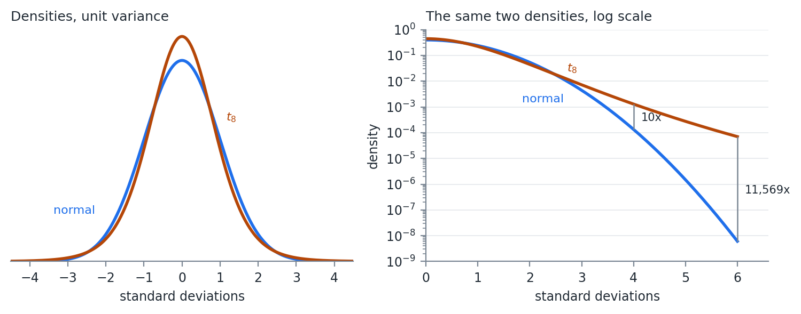

# Expected Shortfall

Week 04 ended on a measure that is not coherent. VaR reads a single point on the loss distribution, so it is blind to everything past that point, and diversification can move a bad outcome across the threshold and make the reported risk jump. This week fixes both problems, and then fixes the distributional assumption underneath them.

Expected shortfall is the expected value of profit and loss given the loss is beyond VaR.

$$
ES(X) = E\left( X\ |\ x \leq -VaR(X) \right)
$$

Expected shortfall is the average of the left tail of the distribution, where the tail is defined as values whose CDF is less than or equal to $\alpha$.

A note on signs, because the two conventions get mixed constantly. The conditional expectation above is a point on the P&L distribution, so it is negative for a loss. The formula that follows carries a leading minus sign, which reports ES as a positive loss number -- the same convention we used for VaR. Both appear in practice. Pick one, state it, and stay with it.

Expected shortfall is sometimes called:

1. Conditional VaR, or CVaR
2. Average VaR, or AVaR
3. Expected Tail Loss, or ETL

CVaR is the most widely used alternative, but can sometimes mean different things to different people. It is always good to ask for a definition when someone uses it.

Formally, we can construct this from the PDF and VaR:

$$
ES(X) = -\frac{1}{\alpha} \int_{-\infty}^{-VaR(X)} x\, f(x)\, dx
$$

Numerically, given a sample of observations this is just the mean of all values less than or equal to VaR. Two lines of code, and no more difficult than VaR was.

## The Normal Case

ES has closed form solutions for many distributions. Because most of what we do is simulation based, we will calculate ES numerically. In the case of the Delta Normal VaR, it is useful to have the equation for the normal.

$$
ES_{\alpha}(X) = -\mu + \sigma \frac{f\left( \Phi^{-1}(\alpha) \right)}{\alpha}
$$

Where $f(x)$ is the standard normal PDF, and $\Phi^{-1}(\alpha)$ is the standard normal quantile function.

Recognize that the expected shortfall for the normal is a linear function of the standard deviation. Just like VaR.

At $\alpha = 0.05$ the multiplier is $f(-1.645)/0.05 = 2.063$, against $1.645$ for VaR. Under normality the two measures are the same number scaled by 1.25, and any statement about one is a statement about the other.

{#fig-esvar width=100%}

The left panel of @fig-esvar is the definition. VaR is where the shading starts. ES is the average of what is inside it.

The right panel is why we bother. That fixed 1.25 ratio holds only for the normal. For a $t$ distribution scaled to the same variance the ratio rises as the tail gets heavier -- 1.33 at $\nu = 10$, 1.43 at $\nu = 5$, 1.65 at $\nu = 3$. VaR barely moves across that range because the 5% quantile of a unit-variance $t$ is close to the normal's. ES moves, because it is averaging over the part of the distribution that actually changed.

## Coherence and Convexity

This does not hold for other distributions, but expected shortfall has nice properties.

1. It is a coherent risk measure. That means ES is subadditive, like standard deviation, but unlike VaR.
2. Expected shortfall forms a convex surface when VaR does not. This means that optimizing based on ES is easier.

Coherence is a defined term. Artzner, Delbaen, Eber, and Heath (1999) set out four properties a risk measure $q$ should have, writing losses as positive:

1. Monotonicity. If portfolio $X$ loses at least as much as $Y$ in every state, then $q(X) \geq q(Y)$.
2. Subadditivity. $q(X + Y) \leq q(X) + q(Y)$. Combining positions cannot create risk.
3. Positive homogeneity. $q(\lambda X) = \lambda\, q(X)$ for $\lambda \geq 0$. Doubling the position doubles the risk.
4. Translation invariance. $q(X + c) = q(X) - c$. Adding cash reduces the risk by the amount of cash.

| Property | VaR | ES |
|:--|:-:|:-:|
| Monotonicity | yes | yes |
| Subadditivity | no | yes |
| Positive homogeneity | yes | yes |
| Translation invariance | yes | yes |

: The four coherence properties {#tbl-coherent}

@tbl-coherent is a one row difference, and it is the row from Week 04. The bond example there gave $q(P_1) + q(P_2) = -20$ against $q(P_1 + P_2) = 80$. Run the same example through ES and the inequality holds, because averaging over the tail sees the 0.16% state where both bonds default. VaR never looks past the 5% point.

Property 2 is also what makes property "convex surface" true. A subadditive and positively homogeneous measure is convex in the portfolio weights, so minimizing ES subject to linear constraints is a convex program with one optimum. Minimizing VaR is not, and can have many local minima. Week 07 and Week 08 both build optimizations on this.

## What ES Costs

Expected shortfall has gained in popularity. It gives a loss expectation instead of a minimum like VaR. It is more sensitive to the tails of the distribution than VaR. Fatter tails, meaning more kurtosis, generally mean larger ES, when this is not always the case for VaR.

The Basel framework moved market risk capital from 99% VaR to 97.5% ES for exactly that reason. The two are close under normality -- 97.5% ES is $2.34\sigma$ and 99% VaR is $2.33\sigma$ -- and they separate when the tail is heavy, which is when the number matters.

There is a real cost, and it is worth knowing before recommending ES to anyone.

ES is harder to validate against realized outcomes. VaR has a clean test: count the days the loss exceeded it and compare the count to $\alpha n$. ES has no equivalent, because ES is not elicitable. Gneiting (2011) showed there is no scoring function whose expected value is minimized by the true ES, which is the property a direct backtest needs. Fissler and Ziegel (2016) showed that VaR and ES are jointly elicitable, so ES can be backtested alongside VaR but not on its own.

My opinion: use ES for optimization and for reporting the size of a tail loss, and keep VaR in the report as the thing you can actually backtest. The two cost the same to compute once the distribution is simulated.

# Model Based Simulation {#sec-mbs}

Often we want to simulate from fitted models instead of just a distribution.

$$
y = f(X, \epsilon)
$$

To do this, we have to make distributional assumptions on $X$ and $\epsilon$. The easiest assumption is multivariate normal:

$$
[X\ \epsilon] \sim N(\mu, \Sigma)
$$

## The OLS Case

If $f(X,\epsilon)$ is OLS, then $X$ and $\epsilon$ are independent and $E(\epsilon) = 0$.

$$
y = X\beta + \epsilon
$$

$$
X \sim N\left( \mu_X, \Sigma_X \right), \quad \epsilon \sim N\left( 0, \sigma^2 \right)
$$

$$
[X\ \epsilon] \sim N(\mu, \Sigma), \quad
\mu = \begin{bmatrix} \mu_X \\ 0 \end{bmatrix}, \quad
\Sigma = \begin{bmatrix} \Sigma_X & 0 \\ 0 & \sigma^2 \end{bmatrix}
$$

Read the zeros. $\Sigma_X$ is the $m \times m$ covariance of the regressors, $\sigma^2$ is the scalar residual variance, and the off diagonal blocks are 0 because assumption 3 of OLS says the regressors are uncorrelated with the error. For two regressors the whole matrix is:

$$
\Sigma = \begin{bmatrix}
\sigma_{x_1}^2 & \sigma_{x_1 x_2} & 0 \\
\sigma_{x_1 x_2} & \sigma_{x_2}^2 & 0 \\
0 & 0 & \sigma^2
\end{bmatrix}
$$

We can simulate $[X, \epsilon]$, applying what we have learned previously. This is the Week 03 multivariate draw algorithm with the error term appended to the vector of variables.

In the case of OLS, this model fitting is not needed.

- OLS is a linear function of random normals
- A linear function of random normals is also a random normal
- OLS is the same thing as just using a joint, multivariate distribution on $Y$ and $X$

The conditional distributions section of Week 02 is where that last point comes from. Given a joint normal on $[Y\ X]$, the distribution of $Y$ given $X = a$ is normal with

$$
\bar{\mu} = \mu_Y + \Sigma_{YX}\Sigma_{XX}^{-1}\left( a - \mu_X \right), \qquad
\bar{\Sigma} = \Sigma_{YY} - \Sigma_{YX}\Sigma_{XX}^{-1}\Sigma_{XY}
$$

$\Sigma_{YX}\Sigma_{XX}^{-1}$ is $\hat{\beta}$ and $\bar{\Sigma}$ is the residual variance. The regression was already inside the joint normal.

That equivalence is a check on the machinery rather than a result to use. Fit the regression, simulate the pieces, and you get back the joint normal you could have written down at the start. It stops being true the moment any piece is not normal, which is the whole point of the copula in @sec-copula.

## Several Dependent Variables

What if we have $n$ independent variables?

$$
y_i = f(X, \epsilon_i)\ \ \forall\ i \in [1,n]
$$

Let $\mathcal{E}$ be the matrix collection of $\epsilon_i$ vectors:

$$
\mathcal{E} = \left[ \epsilon_1,\ \epsilon_2,\ \dots,\ \epsilon_n \right]
$$

Then $\mathcal{E}$ is

$$
\mathcal{E} \sim N\left( 0, \Sigma_{\epsilon} \right)
$$

If all $X$ variables are used in each model then:

$$
[X\ \mathcal{E}] \sim N(\mu, \Sigma), \quad
\mu = \begin{bmatrix} \mu_X \\ 0 \end{bmatrix}, \quad
\Sigma = \begin{bmatrix} \Sigma_X & 0 \\ 0 & \Sigma_{\epsilon} \end{bmatrix}
$$

The scalar $\sigma^2$ has become the $n \times n$ matrix $\Sigma_{\epsilon}$. The corner blocks are still 0.

If not all $X$ variables are used in each model, then you have to calculate the full covariance matrix:

$$
[X\ \mathcal{E}] \sim N(\mu, \Sigma), \quad
\mu = \begin{bmatrix} \mu_X \\ 0 \end{bmatrix}, \quad
\Sigma = \operatorname{cov}\left( [X\ \mathcal{E}] \right) =
\begin{bmatrix} \Sigma_X & \Sigma_{X\epsilon} \\ \Sigma_{X\epsilon}' & \Sigma_{\epsilon} \end{bmatrix}
$$

The diagonal elements will be the same, however the off diagonal elements will not necessarily be 0. In practice, it is often easier to just calculate the covariance than to construct the block diagonal matrix.

$\Sigma_{\epsilon}$ is the part that is easy to forget. Each model was fit separately and each residual series is uncorrelated with its own regressors by construction, but the residuals of two different models are not uncorrelated with each other. Two stocks that share an industry exposure the market factor did not capture will have residuals that move together, and setting $\Sigma_{\epsilon}$ diagonal throws that away. Week 09 returns to this as the load bearing assumption of a factor model.

The fact that everything is still normal holds even if there are multiple dependent variables ($Y$) and multiple independent variables ($X$).

## A Distribution Is a Model

Recognize that a distributional assumption about a variable is a model.

For example, assuming $y \sim N\left( \mu, \sigma_{\epsilon}^2 \right)$:

$$
y = f(X, \epsilon) = \mu + \sigma_{\epsilon} z
$$

$$
z \sim N(0,1)
$$

There is no $X$ in that model, which is the point. A variable we simply assume a distribution for and a variable we regress on three factors both end up as a function of an iid error, and the simulation machinery does not distinguish them. That is what lets the next section mix them freely.

# Copulas {#sec-copula}

Often in finance, not all of the data are normally distributed. Some might be close enough, but others are not. There are very few multivariate distributions with well defined properties. We need a way to combine disparate distributions into a single, coherent simulation.

The problem is specific. Fitting a $t$ to one stock and a normal to another is easy. Fitting a joint distribution whose first margin is $t$ and whose second is normal is not, because no standard multivariate family has margins from different families. Everything in Weeks 02 and 03 assumed one $\Sigma$ over one multivariate normal.

Copulas are multivariate cumulative distribution functions whose marginal probability distribution functions are uniform on $[0,1]$. They can be used to combine variables with different assumed distributions.

The mechanism is the inverse CDF method from Week 03, run in both directions. The CDF maps any distribution onto $[0,1]$. The quantile function maps $[0,1]$ back onto any other. Between those two steps the marginal distribution has been stripped out, and what remains is the dependence structure alone.

## Sklar's Theorem

Sklar's theorem forms the basis of copulas.

It states that every multivariate cumulative distribution function of random vector $X$

$$
H\left( x_1, x_2,\ \dots,\ x_n \right) = P\left( X_1 \leq x_1, X_2 \leq x_2,\ \dots,\ X_n \leq x_n \right)
$$

can be expressed in terms of its marginal distributions

$$
F_i\left( x_i \right) = P\left( X_i \leq x_i \right)
$$

and some copula $C$:

$$
H\left( x_1, x_2,\ \dots,\ x_n \right) = C\left( F_1\left( x_1 \right), F_2\left( x_2 \right),\ \dots,\ F_n\left( x_n \right) \right)
$$

Recognize that a CDF $F_i\left( x_i \right) \in [0,1]$.

A copula describes a joint distribution of variables $X$ whose individual distributions are assumed. $F_i()$ does not have to be the same distribution as $F_j()$.

We use the CDF to transform the variables into the range $[0,1]$ and fit the copula.

Sklar's theorem says something stronger than it first appears. Any joint distribution can be split into margins and a copula, and for continuous margins the split is unique. So the choice of copula and the choice of margins are two independent modeling decisions, and getting one right does nothing to protect you from getting the other wrong.

# The Gaussian Copula {#sec-gauss}

There are a number of different copulas. The most common is the Gaussian copula. If you start to work with simulating financial data, looking into other copulas will be beneficial.

Given a correlation matrix $R$, the Gaussian copula is

$$
C_R(X) = \Phi_R\left( \Phi^{-1}\left( F_1\left( x_1 \right) \right), \Phi^{-1}\left( F_2\left( x_2 \right) \right),\ \dots,\ \Phi^{-1}\left( F_n\left( x_n \right) \right) \right)
$$

$\Phi^{-1}(x)$ is the standard normal quantile function.

$\Phi_R(X)$ is the multivariate normal CDF given the correlation $R$.

These are all functions we have worked with, and it makes it very simple to fit $R$.

Note what the Gaussian copula does and does not assume. The dependence structure is the one a multivariate normal would have. The marginal distributions are whatever we fit, and they are not normal.

## Fitting the Copula

1. For each variable $i \in 1 \dots n$:
    a. Transform the observation vector $X_i$ into a uniform vector $U_i$ with $u_i \in [0,1]$ using the CDF for $x_i$, $F_i\left( x_i \right)$.
    b. Transform the uniform vector $U_i$ into a standard normal vector $Z_i$ using the normal quantile function.
2. Calculate the correlation matrix of $Z$.

When calculating $Z$, it is generally better to use Spearman correlations. We are often dealing with distributions with large outliers, and Spearman is a more robust correlation measure with outliers.

Spearman correlation for reference:

$$
r_s = \rho_{R(x),R(y)} = \frac{\operatorname{cov}(R(x),R(y))}{\sigma_{R(x)} \sigma_{R(y)}} = \frac{\sum_{i=1}^{n}\left( R\left( x_i \right) - \overline{R(x)} \right)\left( R\left( y_i \right) - \overline{R(y)} \right)}{\sqrt{\sum_{i=1}^{n}\left( R\left( x_i \right) - \overline{R(x)} \right)^2} \sqrt{\sum_{i=1}^{n}\left( R\left( y_i \right) - \overline{R(y)} \right)^2}}
$$

Where:

- $\rho_{x,y}$ is the Pearson coefficient of $x$ and $y$
- $R(x)$ is the rank function
- $\overline{R(x)}$ is the average of the rank function

Because Spearman uses rank correlations and the quantile function is monotonic, we can skip step 1.b, calculating the $Z$ values, and calculate Spearman correlations from the $U$ matrix.

That shortcut works because ranks survive any monotone transform. $F_i$ is monotone and $\Phi^{-1}$ is monotone, so the ranks of $X$, of $U$, and of $Z$ are identical, and a statistic computed from ranks cannot tell them apart. Week 02 made the same point with $y = x^3$.

$R$ must be PSD before it can be used to simulate. On complete data it will be. Spearman is Pearson computed on rank vectors, and a Pearson matrix built from complete data is PSD by the same argument as any covariance matrix. Missing data is where that breaks, for Spearman exactly as it did for Pearson in Week 03, and the repairs there apply here unchanged.

## Simulating from the Copula

Once the copula is fit, we use the multivariate normal simulation techniques we learned previously. This generates correlated standard normals. We go backwards through the transform in the previous section to arrive at the simulated values of $X$.

1. Simulate $NSim$ draws from the multivariate normal.
2. For each variable $Z_i \in 1 \dots n$:
    a. Transform $Z_i$ into a uniform variable using the standard normal CDF, $\Phi\left( z_i \right) = U_i$.
    b. Transform $U_i$ into the fitted distribution using the quantile of the fitted distribution, $F_i^{-1}\left( U_i \right) = X_i$.

Step 2.b is where the fitted marginals come back. The correlated normals produced in step 1 are a scaffold, and nothing about the final simulated values is normal unless $F_i$ was normal to begin with.

## Tail Dependence

The Gaussian copula has one failure mode worth naming, because it is not obvious and it is not small.

Tail dependence is the probability that one variable is extreme given that another is:

$$
\lambda_L = \lim_{u \to 0^+} P\left( U_1 \leq u\ |\ U_2 \leq u \right)
$$

For the Gaussian copula, $\lambda_L = 0$ for every $\rho < 1$. Far enough into the tail, the variables become independent. Fit $\rho = 0.9$ and the model still says that a sufficiently extreme loss in one asset tells you nothing about the other.

{#fig-jointex width=100%}

The left panel of @fig-jointex is that limit in progress. At $\rho = 0.7$, a 5% day in one asset means a 39% chance of a 5% day in the other, which sounds reasonable. Go to a 0.1% day and it is 16%. Go to a 0.001% day and it is 6%, still falling, on its way to 0.

The right panel is the same picture drawn under the $t$ copula, which @sec-tcop builds. The curves flatten instead of falling, and the level each one flattens at is a number we will fit.

Whether that matters depends entirely on what the simulation is for. It does not change a portfolio's variance and it barely moves a 5% VaR. It changes the probability that many positions lose together on the same day, which is the event a risk manager is paid to worry about.

The Gaussian copula took a great deal of blame after 2008, mostly through Li (2000), which used it to price correlated defaults in CDO tranches. My opinion: the criticism is fair as far as the tail dependence goes and unfair as an explanation of the crisis. A model that assumes defaults become independent in the extreme is the wrong model for a senior tranche, and that is a real defect. It is not the reason anyone bought the tranche.

Other copula families do not have this defect. Archimedean copulas, including Clayton, Gumbel, and Frank, are built from a generator function rather than from a multivariate distribution, and can be asymmetric between the upper and lower tails. Vine copulas build a high dimensional dependence structure out of a tree of bivariate ones. We are not covering either family. Investigate them on your own if you are going to simulate financial data seriously.

The $t$ copula we are covering. It is the same construction with a multivariate $t$ in place of the multivariate normal, and its tail dependence is positive at every finite degrees of freedom. Building it requires the multivariate $t$ first.

# The Multivariate $t$ Distribution {#sec-mvt}

The Gaussian copula's zero tail dependence is not a quirk of the copula. It is inherited from the multivariate normal that generates it. Change the generator to a distribution with fat joint tails and the copula inherits fat joint tails instead.

The multivariate $t$ is the smallest such change from what we already have.

## The Density {#sec-density}

A random vector $X$ of length $n$ is multivariate $t$ with $\nu$ degrees of freedom, location $\mu$, and scale matrix $\Sigma$ when

$$
f(X) = \frac{\Gamma\left( \frac{\nu + n}{2} \right)}{\Gamma\left( \frac{\nu}{2} \right)\left( \nu\pi \right)^{n/2}\left| \Sigma \right|^{1/2}}\left\lbrack 1 + \frac{1}{\nu}\left( X - \mu \right)'\Sigma^{-1}\left( X - \mu \right) \right\rbrack^{-\frac{\nu + n}{2}}
$$

$\Sigma$ is a scale matrix, not the covariance. For $\nu > 2$,

$$
\operatorname{cov}(X) = \frac{\nu}{\nu - 2}\Sigma
$$

For $\nu \leq 2$ the covariance does not exist at all. Correlations are unaffected either way, since the scaling factor divides out of the numerator and the denominator.

Every margin shares one $\nu$. Fit a multivariate $t$ to a set of assets and the fit assigns all of them the same tail thickness, which is rarely what the data says. That restriction is exactly the one the copula construction removes.

Set the density next to the multivariate normal from Week 02. The quadratic form $\left( X - \mu \right)'\Sigma^{-1}\left( X - \mu \right)$ appears in both. The normal puts it inside an exponential and the $t$ puts it inside a power.

Take one variable with mean 0 and unit variance, so the $t$ carries a scale of $s^2 = \left( \nu - 2 \right)/\nu$, and let $x$ grow:

$$
\frac{f_t\left( x \right)}{f_N\left( x \right)} \propto \frac{\left( 1 + \frac{x^2}{\nu s^2} \right)^{-\frac{\nu + 1}{2}}}{e^{-x^2/2}} \sim x^{-\left( \nu + 1 \right)}e^{x^2/2} \rightarrow \infty
$$

The numerator falls like a power of $x$ and the denominator falls like $e^{-x^{2}/2}$. No power beats an exponential. Far enough out, the $t$ is arbitrarily more likely than the normal, and that holds for every finite $\nu$ no matter how large.

Far enough out is closer than it sounds.

{#fig-normt width=100%}

The left panel of @fig-normt is the pair on a linear scale, and they are hard to tell apart. The $t$ is a little taller at the center and a little thinner around one standard deviation. That is the entire visible difference. The right panel is the same two densities on a log scale, where the normal falls away as a parabola and the $t$ falls close to a straight line.

: A standard normal and a $t_8$, both at unit variance {#tbl-tails tbl-colwidths="[25,25,25,25]"}

| Deviation | Normal density | $t_8$ density | Ratio |
|--:|--:|--:|--:|
| $2\sigma$ | $5.40 \times 10^{-2}$ | $4.48 \times 10^{-2}$ | 0.8 |
| $3\sigma$ | $4.43 \times 10^{-3}$ | $7.23 \times 10^{-3}$ | 1.6 |
| $4\sigma$ | $1.34 \times 10^{-4}$ | $1.29 \times 10^{-3}$ | 9.6 |
| $5\sigma$ | $1.49 \times 10^{-6}$ | $2.76 \times 10^{-4}$ | 185 |
| $6\sigma$ | $6.08 \times 10^{-9}$ | $7.03 \times 10^{-5}$ | 11,569 |

The two distributions in @tbl-tails have the same variance and they disagree about a six standard deviation day by four orders of magnitude. Under the normal, a loss that size or worse arrives about once every four million years of trading days. Under the $t_8$ it arrives about once every 65 years.

That is one variable. The multivariate version does the same thing to the joint tail, which is the part we came for.

## The Mixture Representation {#sec-mixrep}

Week 01 built the Normal Inverse Gaussian as a normal variance mixture. The multivariate $t$ is another one:

$$
X = \mu + \sqrt{W}\ LZ,\ \ \ \ \ W = \frac{\nu}{Q},\ \ \ Q\sim\chi_{\nu}^{2},\ \ \ Z\sim N\left( 0,I \right)
$$

$L$ is the Cholesky root of $\Sigma$ from Week 03. Draw a standard normal vector, draw one chi-square, scale the entire vector by the same $\sqrt{W}$, and the result is multivariate $t$.

The word same carries the idea. One draw of $W$ scales every element of $Z$ at once, so on the draws where $W$ is large every asset is extreme together. No correlation matrix is doing that work. The common shock is the tail dependence.

Simulating it costs one line more than the multivariate normal simulation in Week 03.

Most statistical packages will also draw from a multivariate $t$ directly. Build the mixture version anyway, simulate from both, and compare the sample covariance, the sample kurtosis, and a few quantiles. If they agree, use whichever you are more comfortable with. If they disagree, you have found either a bug or a parameterization difference, and the scale matrix in @sec-density is the first place to look.

## Fitting the Multivariate $t$

Three approaches, in increasing order of how much I recommend them.

**Full maximum likelihood** -- optimize over $\mu$, $\Sigma$, and $\nu$ together. The surface is badly behaved because $\Sigma$ and $\nu$ trade off against each other. Shrink $\nu$, inflate $\Sigma$, and the likelihood barely moves. With $n$ assets the optimizer is also pushing $n(n+1)/2$ scale parameters around at the same time.

**Expectation maximization** -- the standard method, and it works because of @sec-mixrep. Conditional on $W$, the model is a weighted multivariate normal with a closed form solution. The algorithm alternates between imputing $E\left\lbrack W_t \right\rbrack$ for each observation and re-estimating $\mu$ and $\Sigma$ by weighted least squares. Observations far from the center receive small weights, which is why the fit resists outliers. Use a package.

**Rank based estimation with a profiled $\nu$** -- what I would do for copula work, and what we will do here. For a copula we do not need $\mu$, and we do not need the scale of $\Sigma$. We need the correlation matrix and $\nu$, which is a much smaller problem.

$R$ comes from Kendall's $\tau$ and $\nu$ from a one dimensional search, both below.

### Kendall's Tau {#sec-tau}

Kendall's $\tau$ counts how often two variables agree about which of two observations is the larger one.

Take any two observations, $k$ and $l$, of the pair of variables $x$ and $y$. Each observation gives an $x$ value and a $y$ value, so the two observations can be compared on each variable separately. There are two cases.

**Concordant** -- the observation with the larger $x$ also has the larger $y$. The two differences carry the same sign:

$$
\operatorname{sign}\left( x_k - x_l \right) = \operatorname{sign}\left( y_k - y_l \right)
$$

**Discordant** -- the observation with the larger $x$ has the smaller $y$. The two differences carry opposite signs.

Put in terms of returns for two stocks, take any two days out of the sample. If the day that was better for the first stock was also the better day for the second, that pair of days is concordant. If the day that was better for the first stock was the worse day for the second, that pair is discordant.

Every pair of observations is one or the other, so counting them and taking the difference measures agreement:

$$
\tau = \frac{\#\text{concordant} - \#\text{discordant}}{\binom{m}{2}}
$$

$m$ is the number of observations and $\binom{m}{2}$ is the number of pairs available to compare, which is what puts $\tau$ on the $[-1,1]$ scale we expect of a correlation measure. Every pair concordant gives $\tau = 1$. Every pair discordant gives $\tau = -1$. An even split gives 0.

Only the ordering of the observations enters, never the values themselves, so $\tau$ is a rank statistic like Spearman. It survives the marginal transforms untouched, and a single large outlier changes one observation's rank rather than dragging a mean around.

The reason to prefer it here is exactness. For any elliptical copula, which includes both the Gaussian and the $t$,

$$
\rho = \sin\left( \frac{\pi\tau}{2} \right)
$$

$\nu$ appears nowhere in that relation. Spearman has a matching identity under the Gaussian copula, $\rho_S = \frac{6}{\pi}\arcsin\left( \rho/2 \right)$, but no closed form under the $t$. Estimating $R$ from $\tau$ means estimating it once and handing the same matrix to both models, which is what makes the comparison in @sec-choose clean.

Work one all the way through. Eight observations of two variables, listed in increasing order of $x$:

: Eight observations, listed in increasing order of $x$ {#tbl-tau tbl-colwidths="[16,16,16,18,17,17]"}

| Obs | $x$ | $y$ | Rank of $y$ | Concordant | Discordant |
|--:|--:|--:|--:|--:|--:|
| 1 | $-2.1$ | 0.2 | 4 | 4 | 3 |
| 2 | $-1.4$ | $-0.5$ | 3 | 4 | 2 |
| 3 | $-0.9$ | $-1.8$ | 1 | 5 | 0 |
| 4 | $-0.3$ | $-1.1$ | 2 | 4 | 0 |
| 5 | 0.4 | 1.0 | 6 | 2 | 1 |
| 6 | 0.8 | 0.6 | 5 | 2 | 0 |
| 7 | 1.5 | 2.2 | 8 | 0 | 1 |
| 8 | 2.6 | 1.7 | 7 | 0 | 0 |
|  |  |  | **Total** | **21** | **7** |

Listing the observations in increasing order of $x$ turns the counting into one comparison instead of two. For any pair of rows, the lower row holds the larger $x$ by construction. So the pair is concordant when the lower row also holds the larger $y$, and discordant when it does not, and the $y$ column is the only one that needs to be read.

The last two columns count each row against the rows below it, which visits every pair exactly once. Row 1 has $y$ rank 4. The seven rows below it hold ranks 3, 1, 2, 6, 5, 8, and 7. Four of those are above 4 and three are below, so row 1 contributes 4 concordant pairs and 3 discordant ones. Row 3 has rank 1, the smallest in the table, so all five rows below it hold a larger $y$ and it contributes 5 concordant pairs and none discordant. Row 7 has rank 8, the largest, so the single row below it is discordant. Row 8 has nothing below it and contributes nothing.

The columns sum to 21 and 7, which is 28 pairs, matching $\binom{8}{2}$. Every pair is accounted for:

$$
\tau = \frac{21 - 7}{28} = 0.5\ \ \ \ \ \ \ \ \rho = \sin\left( \frac{\pi\left( 0.5 \right)}{2} \right) = \frac{\sqrt{2}}{2} = 0.7071
$$

The two variables agree about the ordering three times as often as they disagree, and under an elliptical copula that rate of agreement implies a correlation of 0.71.

Pearson on the same eight pairs is 0.7116 and Spearman is 0.7381. The three measures do not have to agree and none of them is wrong. Only $\tau$ carries an inversion that is exact for the $t$ as well as for the Gaussian.

The positive semidefinite question has a two part answer, and the parts land on opposite sides.

The $\tau$ matrix itself is PSD on complete data, for the same reason the Spearman matrix is. Write the sample $\tau$ as an average over observation pairs $\left( k,l \right)$ of the outer product $s^{\left( kl \right)}s^{\left( kl \right)'}$, where $s_i^{\left( kl \right)} = \operatorname{sign}\left( x_{ik} - x_{il} \right)$. Every outer product is PSD and an average of PSD matrices is PSD.

The transform is where it breaks. $\sin\left( \pi\tau/2 \right)$ is applied entry by entry, and an entrywise function of a PSD matrix carries no guarantee of coming back PSD. On the five assets in @sec-choose it does come back PSD, with a smallest eigenvalue of 0.18. On all one hundred columns of `DailyPrices.csv` over the same year the $\tau$ matrix has a smallest eigenvalue of 0.050 and the transformed matrix has one of $-0.0056$. Check the eigenvalues and repair with the Week 03 methods.

Nothing like that could happen in @sec-gauss, where the Spearman matrix was used directly as $R$ with no transform applied to it.

### Profiling $\nu$ {#sec-profnu}

$\nu$ is what is left. Hold $\mu$ at the sample mean and $R$ at the rank estimate, and the scales come along for free.

A multivariate $t$ carries a scale matrix, not a covariance, and @sec-density gave the relation between them. Run it backwards. If variable $i$ has sample standard deviation $\widehat{\sigma}_i$, then at a given $\nu$ its scale has to be

$$
d_i\left( \nu \right) = \widehat{\sigma}_i\sqrt{\frac{\nu - 2}{\nu}}\ \ \ \ \ \ \ \ \Sigma\left( \nu \right) = D\left( \nu \right)RD\left( \nu \right)
$$

where $D\left( \nu \right)$ is the diagonal matrix of those scales. Every parameter of the distribution is now a function of $\nu$ alone. With $m$ observations $x_k$ and $f$ the density from @sec-density,

$$
\ell\left( \nu \right) = \sum_{k = 1}^{m}\ln f\left( x_k;\ \widehat{\mu},\ \Sigma\left( \nu \right),\ \nu \right)
$$

$$
\widehat{\nu} = \underset{\nu}{\arg\max}\ \ell\left( \nu \right)\ \ \ \ \text{subject to}\ \ \ \ 2 < \nu \leq \nu_{\max}
$$

The lower bound keeps the covariance finite. The upper bound is there because the objective flattens. Past $\nu \approx 100$ a $t$ and a normal are indistinguishable at any sample size we are going to have, so the likelihood stops discriminating and an unbounded search wanders. Set $\nu_{\max} = 100$.

Search over $\theta = 1/\nu$ rather than $\nu$ itself, on $\theta \in \lbrack 0.01,\ 0.49 \rbrack$. The difference between $\nu = 4$ and $\nu = 5$ matters a great deal and the difference between $\nu = 40$ and $\nu = 50$ matters almost not at all, and searching in $\theta$ puts the resolution where the first of those lives. Stop the interval at 0.49 rather than 0.5 to keep $\nu$ off its lower boundary, where $d_i\left( \nu \right)$ collapses to zero and $\Sigma$ stops being invertible.

A 200 point grid is cheap, and unlike a scalar optimizer it shows you the shape of the objective. Take the grid maximum and refine between its neighbors.

Be clear about what this is not. $R$ is held at the rank estimate and the scales are tied to the sample standard deviations, so the likelihood is being maximized along a one dimensional slice rather than over the whole parameter space. It is cheap, it is stable, and it is close enough for what we do with it. EM does the joint version when you need the joint version.

### A Worked Fit {#sec-mvtfit}

Fit the whole thing to real data. Daily returns for SPY, AAPL, MSFT, JPM, and XOM from `DailyPrices.csv`, 249 observations. The code is in `fit_multivariate_t.jl`.

The sample moments come first, and a $t$ fitted to each series on its own comes with them for comparison later.

: Sample moments, and a $t$ fitted to each series separately {#tbl-mvtmoments tbl-colwidths="[25,25,25,25]"}

| Asset | Mean (%) | $\widehat{\sigma}$ (%) | Separate $\widehat{\nu}$ |
|:--|--:|--:|--:|
| SPY | 0.100 | 0.780 | 7.74 |
| AAPL | 0.088 | 1.416 | 4.43 |
| MSFT | 0.101 | 1.254 | 11.87 |
| JPM | 0.192 | 1.149 | 4.50 |
| XOM | 0.037 | 1.277 | 22.65 |

Kendall's $\tau$ for each pair, run through $\rho = \sin\left( \pi\tau/2 \right)$, gives $R$.

: $R$ from Kendall's $\tau$ {#tbl-mvtR tbl-colwidths="[20,20,20,20,20]"}

|  | SPY | AAPL | MSFT | JPM |
|:--|--:|--:|--:|--:|
| AAPL | 0.595 |  |  |  |
| MSFT | 0.721 | 0.492 |  |  |
| JPM | 0.452 | 0.155 | 0.140 |  |
| XOM | 0.105 | $-0.043$ | $-0.159$ | 0.307 |

The smallest eigenvalue of $R$ is 0.181, so nothing needs repair. SPY carries the two largest correlations, which is what you would expect of an index against its own constituents, and XOM sits nearly independent of the three technology and financial names.

Everything else is now a function of $\nu$. Profiling it over the grid gives @tbl-mvtprofile.

: The multivariate $t$ log likelihood as a function of $\nu$ {#tbl-mvtprofile tbl-colwidths="[50,50]"}

| $\nu$ | $\ell\left( \nu \right)$ |
|--:|--:|
| 4 | 4004.6 |
| 6 | 4020.8 |
| **7.8** | **4022.6** |
| 10 | 4021.6 |
| 15 | 4017.1 |
| 20 | 4012.9 |
| 40 | 4002.6 |

The maximum sits at $\widehat{\nu} = 7.8$, and the curve is flat enough around it that the grid resolution matters more than the optimizer does.

`fit_multivariate_t.jl` closes by simulating 100,000 draws from the fit twice, once through the mixture in @sec-mixrep and once through the package's own multivariate $t$, and printing the standard deviation and kurtosis of each. They agree, which is the check @sec-mixrep asked for.

Hold that number against the last column of @tbl-mvtmoments. Fitted one at a time these five series want degrees of freedom from 4.43 to 22.65, a range of five to one. The multivariate $t$ has to answer with a single number covering all of them, and 7.8 sits closer to the fat tailed names than to XOM. Every margin is now misdescribed. AAPL and JPM are given thinner tails than they have and XOM is given fatter ones. That is the price of the shared $\nu$ restriction in @sec-density, and it is the reason to want a construction that lets each margin keep its own.

# The $t$ Copula {#sec-tcop}

Given a correlation matrix $R$ and degrees of freedom $\nu$, the $t$ copula is

$$
C_{R,\nu}(X) = t_{R,\nu}\left( t_{\nu}^{- 1}\left( F_1\left( x_1 \right) \right),\ t_{\nu}^{- 1}\left( F_2\left( x_2 \right) \right),\ \dots,\ t_{\nu}^{- 1}\left( F_n\left( x_n \right) \right) \right)
$$

$t_{\nu}^{- 1}(x)$ is the univariate $t$ quantile function and $t_{R,\nu}(X)$ is the multivariate $t$ CDF. Held against the Gaussian copula in @sec-gauss, the only change is which quantile function goes in and which joint CDF comes out.

The $\nu$ inside the copula has nothing to do with any $\nu$ fitted to a margin. A margin can be a normal, a $t$ with four degrees of freedom, or an empirical distribution, and the copula's $\nu$ still governs the joint tail alone. Sklar's theorem in @sec-copula is what permits the separation.

As $\nu \rightarrow \infty$ the $t$ copula converges to the Gaussian copula. The Gaussian is the nested special case.

## Fitting

1. For each variable $i \in 1\dots n$, transform the observation vector $X_i$ into $U_i$ using its own fitted CDF $F_i\left( x_i \right)$, exactly as in @sec-gauss.
2. Calculate Kendall's $\tau$ for every pair and set $R = \sin\left( \pi\tau/2 \right)$. Repair $R$ to PSD if the eigenvalues call for it.
3. Maximize the copula log likelihood over $\nu$ with $R$ held fixed.

Steps 1 and 2 are @sec-tau. Step 3 needs the copula density, which is next.

## The Copula Density and Profiling $\nu$ {#sec-profile}

With $R$ fixed, $\nu$ is the only parameter left.

Differentiating Sklar's theorem gives the copula density as the joint density divided by the product of the marginal densities of the transformed variables:

$$
c_{R,\nu}\left( u_1,\ \dots,\ u_n \right) = \frac{f_{R,\nu}\left( t_{\nu}^{- 1}\left( u_1 \right),\ \dots,\ t_{\nu}^{- 1}\left( u_n \right) \right)}{\prod_{i = 1}^{n}f_{\nu}\left( t_{\nu}^{- 1}\left( u_i \right) \right)}
$$

$f_{R,\nu}$ is the multivariate $t$ density from @sec-density with $\mu = 0$ and $\Sigma = R$. $f_{\nu}$ is the univariate $t$ density carrying the same $\nu$.

Read that ratio as a comparison against independence. Independent densities multiply, so the denominator is the joint density the variables would have if nothing linked them. The numerator is the joint density they actually have. A copula density of 1 everywhere is independence. Above 1 marks the region where the variables turn up together more often than chance, and below 1 marks the region where they avoid each other.

In two dimensions the same ratio has a conditional reading. Write $f\left( x,y \right) = f\left( y \mid x \right)f(x)$ and one marginal cancels:

$$
c\left( u,v \right) = \frac{f\left( x,y \right)}{f(x)f(y)} = \frac{f\left( y \mid x \right)}{f(y)}
$$

The copula density at a point is how much more likely $y$ becomes once you are told $x$.

With $m$ observations of $n$ variables, and $u_{ki}$ the $k$th observation of variable $i$, the log likelihood is

$$
\ell\left( \nu \right) = \sum_{k = 1}^{m}\ln c_{R,\nu}\left( u_{k1},\ u_{k2},\ \dots,\ u_{kn} \right)
$$

Do not implement that as written. The copula density is a ratio holding a product of $n$ densities, and Week 02 made the case against forming a product of densities in the Likelihood Function section: density values sit below 1, and multiplying enough of them together underflows to zero before the optimizer sees anything. The ratio adds a second way to fail, since a denominator that underflows to zero divides as well.

The log splits both problems apart. A log of a ratio is a difference and a log of a product is a sum:

$$
\ln c_{R,\nu}\left( u_{k1},\ \dots,\ u_{kn} \right) = \ln f_{R,\nu}\left( y_{k1},\ \dots,\ y_{kn} \right) - \sum_{i = 1}^{n}\ln f_{\nu}\left( y_{ki} \right)\ \ \ \ \ \ \ \ y_{ki} = t_{\nu}^{- 1}\left( u_{ki} \right)
$$

Substituting that into $\ell\left( \nu \right)$ leaves two sums of logs and no product or ratio anywhere:

$$
\ell\left( \nu \right) = \sum_{k = 1}^{m}\ln f_{R,\nu}\left( y_{k1},\ \dots,\ y_{kn} \right) - \sum_{k = 1}^{m}\sum_{i = 1}^{n}\ln f_{\nu}\left( y_{ki} \right)
$$

Both terms are available as log density functions in any statistical package, so neither density is ever evaluated on its own scale. Write it this way and the whole calculation is two calls and a subtraction.

The problem is then

$$
\widehat{\nu} = \underset{\nu}{\arg\max}\ \ell\left( \nu \right)\ \ \ \ \text{subject to}\ \ \ \ 2 < \nu \leq \nu_{\max}
$$

The search is the one in @sec-profnu and nothing about it changes. Same bounds, same $\theta = 1/\nu$ substitution, same grid and refinement. The objective is the only thing that moved. One evaluation costs a $t$ quantile transform of the whole $U$ matrix and one quadratic form per observation.

## Simulating

1. Draw $Y$ from the multivariate $t$ with correlation $R$ and $\widehat{\nu}$, using the mixture representation in @sec-mixrep.
2. For each variable $i \in 1\dots n$:
    a. Transform $Y_i$ into a uniform variable using the univariate $t$ CDF, $t_{\widehat{\nu}}\left( y_i \right) = U_i$.
    b. Transform $U_i$ into the fitted distribution using its quantile function, $F_i^{- 1}\left( U_i \right) = X_i$.

Step 2.a uses the copula's $\widehat{\nu}$, not the margin's. Confusing those two is the most common error in the entire construction, and the simulation still runs when you make it.

## Tail Dependence Under the $t$ Copula

The lower tail dependence coefficient has a closed form:

$$
\lambda = 2\ t_{\nu + 1}\left( - \sqrt{\frac{\left( \nu + 1 \right)\left( 1 - \rho \right)}{1 + \rho}} \right)
$$

$t_{\nu + 1}$ is the univariate $t$ CDF with one more degree of freedom than the copula. The value is positive for every finite $\nu$ and every $\rho > - 1$. By symmetry the upper tail dependence is the same number, which is itself a modeling assumption and not a fact about markets.

: Lower tail dependence $\lambda$ under the $t$ copula {#tbl-lambda tbl-colwidths="[20,20,20,20,20]"}

| $\rho$ | $\nu = 4$ | $\nu = 8$ | $\nu = 16$ | $\nu = 30$ |
|--:|--:|--:|--:|--:|
| 0.3 | 0.162 | 0.055 | 0.008 | 0.000 |
| 0.5 | 0.253 | 0.117 | 0.029 | 0.003 |
| 0.7 | 0.391 | 0.239 | 0.101 | 0.026 |
| 0.9 | 0.630 | 0.509 | 0.357 | 0.211 |

Every entry of @tbl-lambda is 0 under the Gaussian copula. The right panel of @fig-jointex shows three of the $\rho = 0.7$ cases approaching their limits.

Read the table down a column and $\lambda$ tracks correlation, which is unsurprising. Read it across a row and $\lambda$ collapses as $\nu$ grows, which is the part that matters. Fitting $\nu$ is fitting the tail. There is no separate tail dependence parameter to set, and no way to fit the joint tail without committing to a value.

## Choosing Between the Copulas {#sec-choose}

Which copula should we use?

Week 02 answered a question of the same shape with Goodness of Fit statistics. Two candidate models, one data set, and a criterion that rewards fit and charges for parameters. AIC, AICc, and BIC are defined in the Information Criteria section of Week 02 and nothing about them changes here. What changes is what we hand them.

Fit the margins first and freeze them. Score only the copula log likelihood, on the same $U$ matrix, for both models. The Gaussian then has no free parameters left and the $t$ has one, so $k_{\text{Gauss}} = 0$ and $k_t = 1$, and the BIC comparison collapses to a single line:

$$
\Delta BIC = 2\left( \ell_t - \ell_{\text{Gauss}} \right) - \ln m
$$

$m$ is the number of observations. Take the $t$ when $\Delta BIC$ is positive.

The two criteria charge different prices for that one extra parameter. AIC charges 2 and BIC charges $\ln m$, which is 5.52 at $m = 249$ and keeps growing with the sample. BIC is the harder test, and it gets harder the more data you have. AICc adds the small sample correction on top of AIC, $\frac{2k^2 + 2k}{m - k - 1}$, which is 0.016 here and vanishes entirely in a large sample. Make AICc the default over plain AIC. It costs nothing when it is unnecessary.

Report both AICc and BIC. When they agree the decision is made. When they disagree, BIC is saying the extra parameter has not paid for itself at this sample size, and you are in the near tie below.

Be explicit about one substitution. @sec-gauss fit the Gaussian copula with a Spearman matrix, and here both models are given the same $R$ built from Kendall's $\tau$. Handing the two models different correlation matrices would leave the likelihood gap part copula family and part correlation estimate, with no way to separate them.

Run it in that order in practice. Compare on $\tau$, and if the Gaussian wins, then decide between $\tau$ and Spearman for the production fit. The two barely disagree under a Gaussian copula. The exact inversion there is $\rho = 2\sin\left( \pi\rho_S/6 \right)$, which returns 0.717 at $\rho_S = 0.7$, so the second decision is close to free either way.

Use an information criterion here rather than a likelihood ratio test. The Gaussian copula is the $t$ copula at $\nu = \infty$, so the null sits on the boundary of the parameter space and the test statistic does not have its usual $\chi^2$ distribution there. AICc and BIC need no null distribution.

One caveat, worth knowing rather than worrying about. When the margins are empirical rather than fitted parametric distributions, what gets maximized is a pseudo likelihood, and the information criteria lose their formal justification. Practitioners use them anyway. Know that you are doing it.

### A Worked Comparison

The same five assets and the same 249 observations as @sec-mvtfit, with the same $R$. Each margin is the Student's $t$ already fitted in @tbl-mvtmoments. The code is in `choosing_between_copulas.jl`.

: Gaussian and $t$ copulas on five assets, $m = 249$ {#tbl-copfit tbl-colwidths="[40,30,30]"}

| Statistic | Gaussian | $t$ |
|:--|--:|--:|
| Log likelihood $\ell$ | 196.41 | 205.58 |
| Free parameters $k$ | 0 | 1 |
| Fitted $\widehat{\nu}$ | -- | 16.0 |
| AICc | $-392.83$ | $-409.13$ |
| BIC | $-392.83$ | $-405.63$ |

$$
\Delta BIC = 2\left( 205.58 - 196.41 \right) - \ln 249 = 18.33 - 5.52 = 12.81
$$

A $\Delta BIC$ above 10 is read as strong evidence. The $t$ wins here, and it wins on data that is neither a crisis period nor a hand picked pair.

Now put $\widehat{\nu} = 16.0$ next to the $\widehat{\nu} = 7.8$ that @sec-mvtfit got from the same five series. Neither number is wrong, because the two are not estimating the same thing. The multivariate $t$ in @sec-mvtfit uses one $\nu$ for everything, so its estimate is pulled down by margins that are individually fat tailed, AAPL at 4.43 and JPM at 4.50. The copula has handed those margins off to their own fitted distributions, and what is left for its $\nu$ to describe is the joint tail alone, which is thinner than the individual tails are.

That gap is the argument for the copula in one number. Forcing a single $\nu$ to carry both jobs makes it wrong for both.

The profile is flat near its top. The log likelihood is 205.47 at $\nu = 14$ and 205.35 at $\nu = 20$, against 205.58 at the maximum. $\widehat{\nu}$ is weakly identified and a different year of data would move it. The tail dependence moves with it. At the fitted SPY and MSFT correlation of 0.72, $\widehat{\nu} = 16$ gives $\lambda = 0.12$, and $\nu = 8$ would have given 0.26.

My opinion: on a near tie, take the $t$. Almost all of the sample sits in the middle of the distribution, so that is what the criterion is scoring, and the place the two models actually disagree is the tail where the data is thinnest. The two errors are not the same size either. Choosing the $t$ when the Gaussian was right costs a slightly wider tail in the simulation. Choosing the Gaussian when the $t$ was right means the simulation never produces the day on which everything falls together.

# Putting It Together

Example problem.

- Calculate VaR on a portfolio holding 1 share of each stock in `DailyPrices.csv`.
- Model prices as a linear function of SPY with $t$ distributed errors.
- Model SPY as normally distributed.
- Assume all stocks and SPY have 0 expected return.
- Calculate VaR for each stock as well as the total portfolio.

Every piece of that is in this week. The regressions and their residual covariance are @sec-mbs. The mixed distributional assumptions, normal for SPY and $t$ for the errors, are what forces a copula in @sec-gauss. Simulating the copula and repricing the portfolio is Week 04's Monte Carlo VaR with a non-normal draw. Report ES alongside VaR from the same simulated vector, since it costs one more line.

Fit the $t$ copula as well and choose between the two by the rule in @sec-choose. `model_based_simulation_with_copulas.jl` runs both copulas end to end.

The answer there is not the answer in @sec-choose, and the difference is the useful part. @sec-choose fits a copula to five raw return series and the $t$ wins by a $\Delta BIC$ of 12.8. This problem fits a copula to the regression residuals, with SPY already taken out of every stock, and there the Gaussian wins by a $\Delta BIC$ of 3.8 at a fitted $\widehat{\nu}$ near 41. Most of the joint tail behavior in raw equity returns is the market factor. Take the market out and what is left looks close to Gaussian.

The copula question is never about the data. It is about what is left after the model.
