<!--
GENERATED FILE -- do not edit.
Built by make_book.py from the nine Week0N/week0N.qmd files.
Edit those, then rebuild with `make book` from the repo root.
-->

# Preface {.unnumbered}

These are the lecture notes for FinTech 545, Quantitative Risk Management. The
nine chapters correspond to the nine lectures of the course and are meant to be
read in order. Each one assumes the machinery built in the ones before it.

# Week 01 — Univariate Statistics

## Risk Management and the Distribution of Outcomes

Risk management is the process of understanding and managing, to an acceptable level, the risk of loss to a company's earnings and balance sheet.

As Wikipedia puts it:

> Risk management is the identification, evaluation, and prioritization of risks followed by coordinated and economical application of resources to minimize, monitor, and control the probability or impact of unfortunate events or to maximize the realization of opportunities.

We are concerned with the distribution of outcomes. We are NOT only interested in the expected, or forecasted, outcome.

That distinction is the whole course. Two strategies with the same 8% expected return are the same investment to a portfolio manager who looks only at the mean, and they are not the same investment at all if one of them loses 60% once a decade and the other never loses more than 10%. The forecast is a single number. Everything the single number does not say is what we spend the semester estimating.

### Types of Risk

- Market Risk
- Credit Risk
- Liquidity Risk
- Operational Risk
- Business Risk

This course is about market risk, with an extended detour through the simulation and estimation machinery that market risk requires. The tools transfer to the other four. A default model, an operational loss model, and a return model all come down to the same two questions -- what is the distribution, and what is in the tail.

### Working with Distributions

To manage risks, we need to understand the distribution of outcomes.

We almost never observe the distribution. What we observe is a finite sample drawn from it, and what we do with that sample is choose a parametric family to stand in for the distribution and then estimate the parameters of the family. Two things can go wrong, and in practice both of them do:

1. The family is wrong. Returns are not normal, and we assume normal anyway because the algebra closes.
2. The family is right and the parameters are estimated badly. A variance estimated from 30 observations is not the variance.

Weeks 01 through 03 build the machinery for describing and estimating a distribution. Week 04 turns that machinery into a risk number.

## Describing a Distribution

Three functions describe a univariate distribution. Each is a transform of the others, and in practice we move between them constantly.

### Probability Density Function

**Probability Density Function**, PDF(x), measures the relative likelihood of the value of a random variable, $x$.

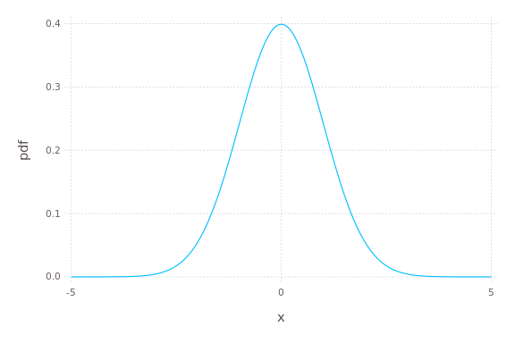{#fig-w01-pdf width=85%}

The density is not a probability. For a continuous random variable the probability of landing on any single point is zero, and the density itself is free to exceed 1 -- a normal with $\sigma = 0.1$ has a peak density near 4, which would be an impossible probability. Only the area under @fig-w01-pdf is a probability.

### Cumulative Distribution Function

**Cumulative Density Function**, CDF(x), measures the probability a value of the random variable $X$ will be less than or equal to some value $x$:

$$
F_X(x) = P(X \leq x)
$$

$F_X(x)$ is the CDF. $f_X(x)$ is the PDF. The CDF is the integral of the PDF over the range. Where the support is unbounded below, as it is for the density in @fig-w01-pdf, the integral runs from negative infinity:

$$
F_X(x) = \int_{-\infty}^{x} f_X(t)\, dt
$$

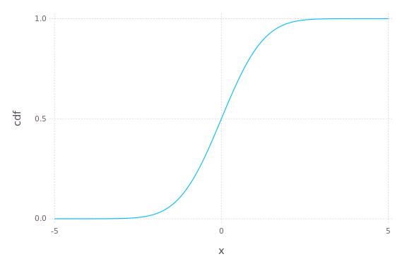{#fig-w01-cdf width=85%}

@fig-w01-cdf shows the two properties that matter. The CDF never decreases, and it runs from 0 to 1. Both follow from the density being non-negative and integrating to one.

If we are interested in the probability of a value falling in an interval:

$$
P(a < X \leq b) = \int_a^b f_X(t)\, dt = \int_{-\infty}^{b} f_X(t)\, dt - \int_{-\infty}^{a} f_X(t)\, dt = F_X(b) - F_X(a)
$$

Differencing the CDF is how an interval probability is computed in practice, because the CDF is the function every statistical package implements and the integral in the middle of that expression is not something anyone evaluates directly.

### Quantile Function

**Quantile Function** is the inverse of the CDF. It is the value of $x$ such that $F(x) = p$:

$$
F^{-1}(p)
$$

This is useful in numerous ways, starting with hypothesis testing.

For example, given a distribution of $X$, what is the range of $X$ such that 95% of random values fall inside the range?

$$
\left( F^{-1}(0.025),\ F^{-1}(0.975) \right)
$$

The quantile function is also the definition of Value at Risk. A 5% VaR is $-F^{-1}(0.05)$ applied to the P&L distribution, and nothing more than that. We spend most of Week 04 on that one line, because every difficult part of a VaR calculation lies in getting $F$ right and none of it lies in inverting a function we already know how to invert.

## Moments

**Distribution moments** describe the shape of the PDF. Generally:

$$
\mu_n = \int_{-\infty}^{\infty} (x - c)^n f(x)\, dx = E\left[ (x - c)^n \right]
$$

Where $E$ is the expectation operator. Adjust the integral range for the support of the distribution.

In statistics when talking about the first moment, we set $c = 0$. The first moment is the mean, usually denoted $\mu$. For the higher moments we set $c = \mu$, which makes them central moments -- measured around the mean rather than around the origin.

### The First Four Moments

The first 4 moments of a distribution are the most used, but do not, by themselves, define a distribution.

| # | Name | What it measures |
|--:|:--|:--|
| 1 | Mean | Expected value |
| 2 | Variance ($\sigma^2$) | Dispersion around the mean |
| 3 | Skewness | Asymmetry |
| 4 | Kurtosis | Fatness of the tails |

: The first four moments {#tbl-w01-moments tbl-colwidths="[8,27,65]"}

Two points on @tbl-w01-moments. Positive skew distributions skew to the right, with mean > median. Negative skew distributions skew to the left, with mean < median.

The qualifier above @tbl-w01-moments is not a technicality. Two distributions can agree on all four of these moments and still disagree substantially about the probability of a 5% loss, which is the only number a risk committee is going to ask about. Matching moments is a weak form of matching distributions.

### Standardized Skewness and Kurtosis

Skewness and kurtosis as generally reported are standardized values:

$$
\hat{\mu}_3 = E\left[ \left( \frac{X - \mu}{\sigma} \right)^3 \right] = \frac{\mu_3}{\sigma^3}
$$

$$
\hat{\mu}_4 = E\left[ \left( \frac{X - \mu}{\sigma} \right)^4 \right] - 3 = \frac{\mu_4}{\sigma^4} - 3
$$

Standardizing makes the values scale-free, so a daily return series and an annual return series with the same shape report the same skewness and the same kurtosis regardless of how large the underlying moves are.

We subtract 3 from the kurtosis to report "excess" kurtosis. The kurtosis of the normal distribution is 3 -- excess kurtosis is kurtosis in excess of the normal distribution. Excess kurtosis of zero means normal-like tails. Positive excess kurtosis means fatter tails than the normal, and equity returns have plenty of it.

Check the convention on any kurtosis number you are handed, because some packages report raw kurtosis and some report excess kurtosis, and a difference of 3 is more than large enough to turn a fat-tailed series into a normal-looking one.

### Existence {#sec-w01-existence}

Moments can be infinite or undefined.

This is not a pathological case invented for a textbook. Whether a moment exists depends on how fast the density decays in the tail, and a tail that decays slowly enough will make the defining integral diverge. A distribution can have a finite mean and an infinite variance, or a finite variance and an infinite kurtosis, and which of those happens is a property of the family and its parameters.

A distribution with infinite variance has no standard deviation to report. The sample estimate will still come back as a finite number, and that number will grow as you add observations, which is exactly the behavior that makes the problem hard to notice.

@sec-w01-t covers the distribution where this matters most for us. Fitted to daily equity returns, it routinely lands in the range where the kurtosis does not exist.

## Estimating Moments from a Sample

Estimation of moments from samples is messy.

The population moments above are integrals against a density we do not have, so every estimator below replaces that integral with a sample average and inherits a bias that depends on the sample size.

### Mean

$$
\hat{\mu}_1 = E[X] = \frac{1}{n} \sum_{i=1}^{n} x_i
$$

The sample mean is unbiased for any distribution with a finite first moment. It is also the estimator with the worst signal to noise ratio in finance, because the quantity we are trying to measure is small and the noise around it is not.

Take a stock with a true expected return of 8% per year and a volatility of 20% per year. The standard error of the sample mean after $n$ years of data is $\sigma / \sqrt{n}$, so ten years of history gives $20\% / \sqrt{10} = 6.3\%$. A two standard error interval around the estimate runs from $-4.6\%$ to $20.6\%$. Ten years of data cannot establish that the stock has a positive expected return at all.

The same ten years of daily data pins the volatility down to within a few tenths of a percentage point. The asymmetry is not a small-sample accident. More frequent sampling improves a variance estimate and does nothing for a mean estimate, because the mean depends only on the first and last price in the window. We come back to that in Week 07 when expected returns enter portfolio construction.

### Variance

Variance -- in small samples, dividing by $n$ leads to a biased estimator.

$$
\hat{\mu}_2 = E\left[ (X - \hat{\mu}_1)^2 \right] = \frac{1}{n-1} \sum_{i=1}^{n} (x_i - \hat{\mu}_1)^2
$$

The correction is a degrees of freedom argument. We have already used the data once to estimate $\hat{\mu}_1$, and the sample mean sits closer to the data than the true $\mu$ does, so the deviations $x_i - \hat{\mu}_1$ are on average too small. Dividing by $n-1$ instead of $n$ compensates for that exactly.

As the sample size grows, the unbiased estimator above converges to the biased estimator. At $n = 30$ the two differ by 3%. At $n = 250$ they differ by 0.4%.

### Skewness and Kurtosis

Unbiased estimators for skew and kurtosis are more complicated. See <https://modelingwithdata.org/pdfs/moments.pdf> for mathematical derivations of estimators.

For reference, the unnormalized skew is:

$$
\hat{\mu}_3 = E\left[ (X - \hat{\mu}_1)^3 \right] = \frac{n}{(n-1)(n-2)} \sum_{i=1}^{n} (x_i - \hat{\mu}_1)^3
$$

Normalize to the standardized form by dividing by $\sigma^3$.

The unnormalized kurtosis is:

$$
\hat{\mu}_4 = E\left[ (X - \hat{\mu}_1)^4 \right] = \frac{n^2}{(n-1)^3 (n^2 - 3n + 3)} \left[ \left( n(n-1)^2 + (6n-9) \right) K_{\bar{x}}(x) - n(6n-9)\, \sigma_{\bar{x}}^4(x) \right]
$$

Where:

- $K_{\bar{x}}(x)$ is the biased estimator for kurtosis (see link for formula)
- $\sigma_{\bar{x}}^4(x)$ is the square of the biased estimator for variance

Both corrections are a factor of $n$ over a product of $(n-1)$ terms, so both go to one as the sample grows and both are far enough from one to matter at the sample sizes we actually work with.

### What Statistical Packages Return

Statistical packages may or may not provide the bias corrected estimates.

In Julia, the 3rd and 4th moment estimators are presented as the 3rd and 4th central moment population estimators. The skew metric can be easily adjusted. The kurtosis estimator is more involved, as it depends on the population kurtosis, the population variance, and the kurtosis of the mean estimator.

In general, the differences are minor. Do not assume that, though -- check the documentation of whatever package you are using, and where the documentation does not say which convention it follows, test the function against a distribution whose moments you already know. @sec-w01-biastest does exactly that for the Julia kurtosis function.

## Common Distributions

Four distributions cover most of what we do -- the normal because it is tractable, the lognormal because prices cannot go negative, the Student's t because returns have fatter tails than the normal admits, and the normal inverse Gaussian because returns are also skewed.

### Normal Distribution

**Normal or Gaussian Distribution** is commonly used in statistics. Properties of the normal distribution make it tractable to many calculations. Further, through the Central Limit Theorem, it is the limiting distribution of sample means.

Notation:

$$
X \sim N(\mu, \sigma^2)
$$

| Statistic | Value |
|:--|:--|
| Support | $x \in (-\infty, \infty)$ |
| Mean | $\mu$ |
| Median | $\mu$ |
| Mode | $\mu$ |
| Variance | $\sigma^2$ |
| Skewness | 0 |
| Excess Kurtosis | 0 |

: Properties of the normal distribution {#tbl-w01-normal}

PDF:

$$
f(x) = \frac{1}{\sigma \sqrt{2\pi}} e^{-\frac{1}{2} \left( \frac{x - \mu}{\sigma} \right)^2}
$$

If we set $\mu = 0$ and $\sigma = 1$, we call this the Standard Normal. Standard normals are often notated $Z$. The CDF for the standard normal is:

$$
\Phi(x) = \frac{1}{\sqrt{2\pi}} \int_{-\infty}^{x} e^{-\frac{t^2}{2}}\, dt
$$

No analytic form exists for the value of the integral, therefore numerical approximations are used. The same applies for the quantile function. Every statistical package ships an implementation of both, and the implementations agree to far more digits than any risk number ever needs.

### Linear Functions of Normals

A property of the normal distribution is that any linear function of a normal variable is also normally distributed:

$$
Y = A + BX
$$

$$
Y \sim N(A + B\mu,\ B^2 \sigma^2)
$$

Given that, we can transform any normal variable into a standard normal:

$$
Z = \frac{X - \mu}{\sigma}
$$

The CDF of any normal is then:

$$
\Phi\left( \frac{X - \mu}{\sigma} \right)
$$

One standard normal CDF implementation therefore serves every normal distribution, which is the practical reason the standardization shows up in nearly every formula we write.

A linear function of multiple random normal variables is also normally distributed. For a 2 variable case, where $x$ and $y$ are random normals:

$$
Z = Ax + By + c
$$

$$
Z \sim N(\mu_z, \sigma_z^2)
$$

$$
\mu_z = A\mu_x + B\mu_y + c
$$

$$
\sigma_z^2 = A^2 \sigma_x^2 + B^2 \sigma_y^2 + 2AB\, \mathrm{cov}_{x,y}
$$

The cross term is where portfolio risk lives. A portfolio is a linear function of its holdings, so the variance of a portfolio of normals is the expression above with more terms. We cover the covariance and the general $N$ variable case next week.

### Lognormal Distribution

**Lognormal Distribution** -- is the transform of a random normal, $X$. The exponential of $X$ is distributed lognormal:

$$
x \sim N(\mu, \sigma^2)
$$

$$
Y = e^{x}, \quad Y \sim \ln(\mu, \sigma^2)
$$

| Statistic | Value |
|:--|:--|
| Support | $x \in (0, \infty)$ |
| Mean | $e^{\mu + \frac{\sigma^2}{2}}$ |
| Median | $e^{\mu}$ |
| Mode | $e^{\mu - \sigma^2}$ |
| Variance | $\left( e^{\sigma^2} - 1 \right) e^{2\mu + \sigma^2}$ |
| Skewness | $\left( e^{\sigma^2} + 2 \right) \sqrt{e^{\sigma^2} - 1}$ |
| Excess Kurtosis | $e^{4\sigma^2} + 2e^{3\sigma^2} + 3e^{2\sigma^2} - 6$ |

: Properties of the lognormal distribution {#tbl-w01-lognormal}

**NOTE: The mean and variance of the distribution are not** $\mu$ **and** $\sigma^2$.

Read @tbl-w01-lognormal against @tbl-w01-normal. The lognormal has positive support and, for every $\sigma > 0$, positive skew and positive excess kurtosis. A price cannot go negative and a long series of small multiplicative shocks compounds into a right-skewed distribution, so the lognormal is the natural model for a price where the normal is the natural model for a return.

PDF:

$$
f(x) = \frac{1}{x \sigma \sqrt{2\pi}} e^{-\frac{\left( \ln(x) - \mu \right)^2}{2\sigma^2}}
$$

Because we can transform the lognormal distribution into a normal distribution with the natural logarithm function, we can use the standard normal CDF function, $\Phi(x)$:

$$
F(x) = \Phi\left( \frac{\ln(x) - \mu}{\sigma} \right)
$$

The same transform is why we work in log returns. If the price is lognormal then the log return is normal, and the normal is the distribution we have closed-form tools for. Week 04 covers what that convenience costs when the returns have to be aggregated across assets.

### Student's t Distribution {#sec-w01-t}

**Student's-t Distribution** or t distribution is used for hypothesis testing. Specifically it is the distribution of the sample mean when the variance is unknown. As the number of observations increases, the Student's-t distribution converges to the normal distribution.

The t distribution has 3 parameters:

1. $\nu$ -- degrees of freedom
2. $\mu$ -- location
3. $\sigma$ -- scale

Usually only the 1st parameter is used, as the standardized T ($\mu = 0$ and $\sigma = 1$) is used for hypothesis testing. I will reference the standardized distribution as T and the generalized as t. Like the normal, the standardized T can be transformed with the location and scale:

$$
X = \mu + \sigma T
$$

Notation:

$$
X \sim t\left( \nu,\ (\mu, \sigma) \right)
$$

| Statistic | Value |
|:--|:--|
| Support | $x \in (-\infty, \infty)$ |
| Mean | $\mu$ if $\nu > 1$, otherwise undefined |
| Median | $\mu$ |
| Mode | $\mu$ |
| Variance | $\sigma^2 \frac{\nu}{\nu - 2}$ if $\nu > 2$, $\infty$ if $1 < \nu \leq 2$, otherwise undefined |
| Skewness | 0 if $\nu > 3$, otherwise undefined |
| Excess Kurtosis | $\frac{6}{\nu - 4}$ if $\nu > 4$, $\infty$ if $2 < \nu \leq 4$, otherwise undefined |

: Properties of the Student's t distribution {#tbl-w01-t}

Note that $\sigma$ ($\sigma^2$) is not the standard deviation (variance). The variance row in @tbl-w01-t carries a factor of $\nu / (\nu - 2)$, which is where the confusion usually starts.

PDF:

$$
f(x) = \frac{\Gamma\left( \frac{\nu + 1}{2} \right)}{\Gamma\left( \frac{\nu}{2} \right) \sigma \sqrt{\pi \nu}} \left( 1 + \frac{1}{\nu} \left( \frac{x - \mu}{\sigma} \right)^2 \right)^{-\frac{\nu+1}{2}}
$$

The t distribution has $\nu - 1$ finite moments, and:

$$
\lim_{\nu \to \infty} t(\nu, \mu, \sigma) = N(\mu, \sigma^2)
$$

The T distribution is defined as:

$$
T = Z \sqrt{\frac{\nu}{V}}
$$

Where:

1. $Z \sim N(0,1)$ -- the standard normal
2. $V \sim \chi^2(\nu)$ -- chi-square distribution with $\nu$ degrees of freedom (independently study the chi-square)
3. $Z$ and $V$ are independent

The division by a random $V$ is the source of the fat tails. A normal draw is being scaled by a random quantity that is occasionally close to zero, and those occasional small divisors produce the occasional very large outcome that a fixed $\sigma$ would never generate.

That is also why we use the t for returns and not only for hypothesis testing. Daily equity returns fit a t with $\nu$ somewhere between 3 and 6 considerably better than they fit any normal, and Week 05 fits t distributions to real return series and then uses them as the marginals inside a copula.

### Normal Inverse Gaussian Distribution

**Normal Inverse Gaussian Distribution**, NIG, is a four parameter family that carries both skew and excess kurtosis. Ole Barndorff-Nielsen introduced it in 1977 as a member of the generalized hyperbolic family, and published its application to financial return series in 1997.

The t gives us fat tails and nothing else. Return series are also asymmetric, and a symmetric family cannot represent an asymmetric sample no matter how it is parameterized.

The four parameters are:

1. $\alpha$ -- tail heaviness. Large $\alpha$ gives light tails
2. $\beta$ -- asymmetry, with $0 \leq |\beta| < \alpha$. $\beta = 0$ is symmetric
3. $\delta$ -- scale, $\delta > 0$
4. $\mu$ -- location

Throughout, write:

$$
\gamma = \sqrt{\alpha^2 - \beta^2}
$$

Notation:

$$
X \sim \mathrm{NIG}(\alpha, \beta, \delta, \mu)
$$

| Statistic | Value |
|:--|:--|
| Support | $x \in (-\infty, \infty)$ |
| Mean | $\mu + \dfrac{\delta \beta}{\gamma}$ |
| Median | No closed form |
| Mode | No closed form |
| Variance | $\dfrac{\delta \alpha^2}{\gamma^3}$ |
| Skewness | $\dfrac{3\beta}{\alpha \sqrt{\delta \gamma}}$ |
| Excess Kurtosis | $\dfrac{3}{\delta \gamma} \left( 1 + \dfrac{4\beta^2}{\alpha^2} \right)$ |

: Properties of the normal inverse Gaussian distribution {#tbl-w01-nig}

Note the sign of the skewness in @tbl-w01-nig. It follows the sign of $\beta$, and $\delta\gamma$ appears in the denominator of both the skewness and the excess kurtosis. Small $\delta\gamma$ means a sharply peaked distribution with heavy tails.

PDF:

$$
f(x) = \frac{\alpha \delta}{\pi} \frac{K_1\left( \alpha \sqrt{\delta^2 + (x - \mu)^2} \right)}{\sqrt{\delta^2 + (x - \mu)^2}} e^{\delta \gamma + \beta (x - \mu)}
$$

Where $K_1$ is the modified Bessel function of the second kind of order 1. There is no closed form for the CDF or the quantile function, and both are evaluated numerically.

The density looks worse than it is to work with. Three properties make it practical.

**Mixture representation.** The NIG is a normal whose variance is itself random:

$$
X = \mu + \beta Z + \sqrt{Z}\, W, \quad W \sim N(0,1), \quad Z \sim \mathrm{IG}(\delta, \gamma)
$$

$\mathrm{IG}$ is the inverse Gaussian distribution, which is where the name comes from. Compare this to the construction of the T in @sec-w01-t. Both are normal draws rescaled by an independent random quantity, and in both cases the random rescaling is what produces the fat tails. The difference is the $\beta Z$ term, which shifts the mean by an amount that depends on the draw and produces the skew. Simulating from the NIG is therefore two draws and some arithmetic, which is what we need in Week 03.

**Closure under convolution.** If $X_1$ and $X_2$ are independent NIG with the same $\alpha$ and $\beta$, then:

$$
X_1 + X_2 \sim \mathrm{NIG}(\alpha, \beta, \delta_1 + \delta_2, \mu_1 + \mu_2)
$$

A sum of daily NIG returns is a weekly NIG return in the same family. The normal is the only other distribution we have covered with that property, and the t does not have it. Week 04 covers scaling risk measures to horizons longer than one day, and closure under convolution is the property that makes that scaling honest rather than approximate.

**All moments are finite.** The tails decay as $|x|^{-3/2} e^{-\alpha |x| + \beta x}$, which is exponential damping rather than a power law. The NIG is fat tailed relative to the normal and thin tailed relative to the t. Every moment exists, so the concerns in @sec-w01-existence do not apply.

That last property cuts both ways. A series whose tail is genuinely power law will be fit badly by the NIG, and the fit will look fine in the body of the distribution where most of the data is. My opinion: on daily equity returns the NIG is the better default because the skew is real and a symmetric family cannot represent it, but compare the two fits in the tail before committing.

As $\alpha$ grows with $\delta / \alpha$ held fixed, the excess kurtosis $3 / (\delta\gamma)$ goes to zero and the NIG converges to a normal. Every family in this section has the normal as a limiting case.

## Choosing a Distribution from the Sample Shape

The third and fourth moments are the cheapest diagnostic we have. Compute them on the sample before choosing any of the four families above to fit, because together they rule out most of the candidates in a single pass.

| Sample skew | Sample excess kurtosis | Candidate families |
|:--|:--|:--|
| $\approx 0$ | $\approx 0$ | Normal |
| $\approx 0$ | $> 0$ | Student's t, symmetric NIG |
| $\neq 0$ | $> 0$ | Normal inverse Gaussian, skewed t, generalized hyperbolic |
| $> 0$ | $> 0$, positive support | Lognormal |

: Sample shape and the families it points to {#tbl-w01-shape}

@tbl-w01-shape is a filter, not a decision. It tells us which families can reproduce the shape we observe, and a family that cannot reproduce a skew of $-0.6$ is not going to become able to after we fit it.

Daily equity index returns have negative skew and large positive excess kurtosis. Big down days are larger and more frequent than big up days. The normal has zero for both, so the normal cannot represent either feature at any choice of $\mu$ and $\sigma$, and no amount of fitting will change that. The symmetric Student's t handles the kurtosis and leaves the skew on the table. The normal inverse Gaussian handles both, which is the reason it is in these notes at all.

Two constraints on the pair are worth knowing. Skewness and kurtosis are not free of each other -- for any distribution, kurtosis $\geq$ skewness$^2 + 1$, so an excess kurtosis below $\hat{\mu}_3^2 - 2$ is not merely unusual, it is impossible and indicates an error in the calculation. And the four moments do not pin down a family. Several of the candidates in @tbl-w01-shape can be tuned to match any admissible pair, and choosing between them requires a likelihood comparison or a look at the tail itself.

My opinion: treat the sample kurtosis as a signal about direction and not as a number. It is an average of fourth powers, so on a few hundred observations a single large move can move it by several units, and the estimate is biased downward in small samples. A sample excess kurtosis of 4 tells us the tails are fat. It does not tell us they are twice as fat as a series that came in at 2.

## Hypothesis Testing

### The t Statistic

As a test statistic:

$$
T = \left( \bar{X} - \mu_0 \right) \frac{\sqrt{n}}{S_n}
$$

Where:

1. $\bar{X}$ is the sample mean
2. $S_n$ is the sample standard deviation
3. $n$ is the number of samples
4. $\mu_0$ is the hypothesis value
5. $T \sim T(n-1)$ -- standardized T with $\nu = n - 1$

Recognize this is standardizing the value of $\bar{X}$ with a hypothesized mean and a calculated variance. The degrees of freedom are $n-1$ for the same reason the variance estimator divides by $n-1$, which is that one degree of freedom was already spent estimating the mean.

### Testing an Estimator for Bias {#sec-w01-biastest}

Example: test if the kurtosis calculated by your distribution package is biased.

Steps:

1. Sample 100,000 standardized random normal values.
2. Calculate the kurtosis.
3. Sample the kurtosis by repeating steps 1 and 2 100 times.
4. Calculate the mean kurtosis $\bar{k}$ and standard deviation $S_k$.
5. Calculate the T statistic ($\mu_0 = 0$).
6. Use the CDF function to find the p-value of the absolute value of the statistic and subtract from 1. Multiply the value by 2 because this is a 2 sided test.
7. If the value is lower than your threshold (typically 5%), then you reject the hypothesis that the kurtosis function is unbiased.

Alternatively, use a T test function in your statistics package. `week1.jl` does it both ways and checks that the answers agree.

Run that a few times. How confident are you in the result? Try increasing the number of samples.

We know in Julia the kurtosis function should be biased. If it is failing to reject the null hypothesis, why and what can we change?

# Week 02 — Multivariate Statistics and Regression

## Co-movement

Multivariate statistics deals with 2 or more random variables and their co-movement.

Week 01 handled one variable at a time. A portfolio is never one variable. The reason a portfolio of 50 stocks is less risky than any one of them, and the reason that protection disappears in a crisis, are both statements about co-movement rather than about any individual distribution.

The last equation of Week 01 already showed the mechanism. For $Z = Ax + By + c$:

$$
\sigma_z^2 = A^2 \sigma_x^2 + B^2 \sigma_y^2 + 2AB\, \operatorname{cov}(x,y)
$$

The first two terms are what we already know how to estimate. The third term is this week.

### Covariance {#sec-w02-cov}

**Covariance** between 2 variables is defined as the expected value of the product of the deviation from their means. Covariance is defined on the real number line.

$$
\operatorname{cov}(x,y) = E\left[ \left( x - \mu_x \right)\left( y - \mu_y \right) \right]
$$

Where $\mu_x, \mu_y$ are the mean of $x$ and $y$.

Numerically, this is calculated like the variance:

$$
\operatorname{cov}(x,y) = \frac{1}{n-1} \sum_{i=1}^{n} \left[ \left( x_i - \bar{x} \right)\left( y_i - \bar{y} \right) \right]
$$

The $n-1$ is there for the same degrees of freedom reason as the variance estimator. Two means were estimated from the same data, but they cost one degree of freedom between them, not two.

Wikipedia lists a few facts on the covariance of linear combinations of random variables, all of which are key to understand. Most should be obvious from the definition.

1. $\operatorname{cov}(x,a) = 0$ -- the covariance of a variable and a constant is 0
2. $\operatorname{cov}(x,x) = \operatorname{var}(x)$ -- as stated above
3. $\operatorname{cov}(x,y) = \operatorname{cov}(y,x)$ -- order does not matter
4. $\operatorname{cov}(ax,by) = ab\, \operatorname{cov}(x,y)$ -- covariance scales similar to variance
5. $\operatorname{cov}(a+x, b+y) = \operatorname{cov}(x,y)$ -- covariance is invariant to the mean
6. $\operatorname{cov}(ax + by,\ cw + dv) = ac\, \operatorname{cov}(x,w) + ad\, \operatorname{cov}(x,v) + bc\, \operatorname{cov}(y,w) + bd\, \operatorname{cov}(y,v)$
7. $\operatorname{var}\left( \sum_i^n a_i X_i \right) = \sum_i^n \sum_j^n a_i a_j \operatorname{cov}\left( X_i, X_j \right)$ where $X$ is a vector of random variables and $a$ is a vector of constants

Fact 7 is the one to memorize. A portfolio is $\sum a_i X_i$, so fact 7 says the variance of any portfolio is a double sum over the covariance matrix. Every risk number in this course is a version of that expression.

Covariance has no natural scale. Doubling the units of $x$ doubles the covariance, which makes two covariances impossible to compare directly. Correlation fixes that.

### Correlation

**Correlation** is a statistic, ranging between -1 and 1, that describes how strongly 1 variable moves with another.

There are 2 common correlation calculation methodologies used in risk management.

1. Pearson coefficient is the most widely used. It is a linear measure.
2. Spearman's rank coefficient is a measure of monotonicity. It is less sensitive to outliers and does not depend on a linear relationship.

There are other measures of correlation and you are encouraged to research on your own.

| | Pearson | Spearman |
|:--|:--|:--|
| Measures | Linear association | Monotonic association |
| Computed on | Values | Ranks |
| Outlier sensitivity | High | Low |
| Equals $\pm 1$ when | Points lie on a line | Points are monotone |

: Pearson against Spearman {#tbl-w02-corr}

@tbl-w02-corr is the whole comparison. Which one is right depends on what the number is going to be used for, and in this course it is usually going to be used to build a covariance matrix, which means Pearson.

### Pearson Coefficient

**Pearson Coefficient** is a linear measure of correlation. It is the most common form of correlation taught. 99% of the time when someone uses the phrase "correlation," they mean the Pearson Coefficient.

Pearson coefficient is the covariance scaled into the $[-1,1]$ range.

$$
\rho_{i,j} = \frac{\operatorname{cov}\left( X_i, X_j \right)}{\sigma_i \sigma_j}
$$

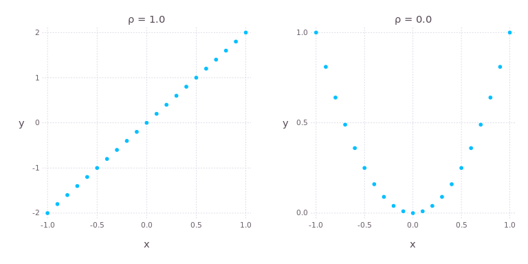{#fig-w02-rank width=85%}

The right panel of @fig-w02-rank is the warning. $y$ is a deterministic function of $x$, there is no randomness at all, and the Pearson coefficient is zero. A correlation of zero means no linear relationship. It does not mean no relationship, and it does not mean independence.

The converse does hold for the multivariate normal in @sec-w02-mvn, which is one of the reasons that distribution is so heavily used.

### Spearman Rank Coefficient

**Spearman Coefficient** is a nonparametric measure of correlation. Spearman uses ranks to calculate the correlation. Because of this, the correlation is a measure of monotonicity.

$$
r_s = \rho_{R(x),R(y)} = \frac{\operatorname{cov}(R(x),R(y))}{\sigma_{R(x)} \sigma_{R(y)}} = \frac{\sum_{i=1}^{n}\left( R\left( x_i \right) - \overline{R(x)} \right)\left( R\left( y_i \right) - \overline{R(y)} \right)}{\sqrt{\sum_{i=1}^{n}\left( R\left( x_i \right) - \overline{R(x)} \right)^2} \sqrt{\sum_{i=1}^{n}\left( R\left( y_i \right) - \overline{R(y)} \right)^2}}
$$

Where:

- $\rho_{x,y}$ is the Pearson coefficient of $x$ and $y$
- $R(x)$ is the rank function
- $\overline{R(x)}$ is the average of the rank function

Spearman is the Pearson coefficient computed on ranks. Nothing more than that.

The rank function assigns integer values from lowest to highest values in the input vector. Ties are broken by averaging the rank of all the tied values.

| Value | Order | Rank |
|--:|--:|--:|
| 1.2 | 5 | 5 |
| 0.8 | 2 | 3 |
| 1.3 | 6 | 6 |
| 0.8 | 3 | 3 |
| 0.8 | 4 | 3 |
| 0.5 | 1 | 1 |

: The rank function, with the three tied values averaged {#tbl-w02-rank}

The three tied values in @tbl-w02-rank hold orders 2, 3, and 4, so each of them receives the average of those three orders, which is a rank of 3.

Here $y = x^3$:

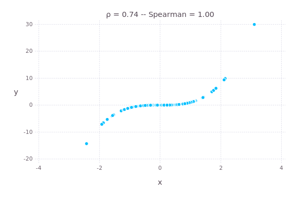{#fig-w02-cubic width=85%}

Because the function is perfectly monotonically increasing, the Spearman coefficient is 1. Pearson comes in at 0.74 because the relationship, while perfect, is not a straight line.

Note what happened between @fig-w02-rank and @fig-w02-cubic. Both figures show a deterministic relationship, and the two measures disagree in both cases. Neither measure is wrong. They answer different questions.

Spearman returns in Week 05. A copula separates the dependence structure from the marginal distributions, and rank correlation is the natural way to describe dependence once the marginals have been stripped out.

## The Multivariate Normal Distribution {#sec-w02-mvn}

The most commonly used multivariate distribution is the multivariate normal. It is important to understand the dynamics of this distribution.

Notation:

$$
X \sim N(\mu, \Sigma)
$$

- $X$ is a $(N \times 1)$ random vector
- $\mu$ is the $(N \times 1)$ vector of expected values
- $\Sigma$ is the $(N \times N)$ covariance matrix

$$
\Sigma_{i,j} = \operatorname{cov}\left( X_i, X_j \right)
$$

### Positive Definiteness {#sec-w02-psd}

Note: $\operatorname{var}(w'X) = w' \Sigma w$. This is fact 7 from @sec-w02-cov written in matrix form, and it constrains what $\Sigma$ is allowed to be.

**Positive semi-definite**, PSD:

$$
w' \Sigma w \geq 0\ \ \forall\ w \in \mathbb{R}^n
$$

Every covariance matrix is PSD. This is not an assumption we impose, it is forced -- $w'\Sigma w$ is the variance of the portfolio $w'X$, and a variance cannot be negative. Equivalently, every eigenvalue of $\Sigma$ is greater than or equal to 0.

**Positive definite**, PD, is the same statement with a strict inequality:

$$
w' \Sigma w > 0\ \ \forall\ w \neq 0
$$

Every eigenvalue is strictly greater than 0.

The gap between the two is a portfolio with exactly zero variance. If $w'\Sigma w = 0$ for some $w \neq 0$, then $w'X$ is a constant, which means one of the variables is an exact linear combination of the others. In that case $\Sigma$ is singular. It has at least one zero eigenvalue, $|\Sigma| = 0$, and $\Sigma^{-1}$ does not exist.

$\Sigma$ is positive definite in the non-degenerative case. We will deal with this later.

A matrix that fails the PSD condition entirely, with $w'\Sigma w < 0$ for some $w$, assigns a negative variance to a real portfolio. That is not a rounding problem. It is a covariance matrix that cannot have come from any data. Week 03 covers what to do when the matrix we are handed fails this test.

### The Density

$$
f(X) = \frac{e^{-\frac{1}{2}(X - \mu)' \Sigma^{-1} (X - \mu)}}{\sqrt{(2\pi)^k |\Sigma|}}
$$

The exponent is the multivariate version of $\left( \frac{x-\mu}{\sigma} \right)^2$ from Week 01. $\Sigma^{-1}$ is doing the work that division by $\sigma^2$ did in one dimension.

The density requires PD, not just PSD. Both $\Sigma^{-1}$ and $|\Sigma|$ appear, and in the PSD but not PD case $|\Sigma| = 0$, so the denominator is zero and the inverse in the exponent does not exist either.

There is nothing to work around here. The distribution genuinely has no density in $n$ dimensions, because all of its mass sits on a lower dimensional subspace. The degenerate direction still has a perfectly good distribution, it is just a point mass rather than a density.

This case is common rather than exotic. A sample covariance matrix estimated from fewer observations than variables is always singular, which is the starting point for Week 09.

### The Linear Transform

If $X \sim N(\mu, \Sigma)$, then there exists

$$
\mu \in \mathbb{R}^n,\ L \in \mathbb{R}^{n \times m} \quad \text{such that} \quad X = LZ + \mu
$$

Where

$$
Z_i \sim N(0,1), \quad i \in [1,m]
$$

$$
\Sigma = LL'
$$

This gives us a way to simulate multivariate normal vectors. We will do this later.

The construction is the multivariate version of $X = \mu + \sigma Z$ from Week 01, with $L$ standing in for $\sigma$. Week 03 is largely about finding $L$, because the factorization exists in theory and the algorithm that produces it fails in practice more often than you would expect.

### Conditional Distributions {#sec-w02-cond}

Conditional distributions -- given a known value or values of random variables in the normal vector, what is the distribution of the remaining variables?

$X \sim N(\mu, \Sigma)$. Partition $X$, $\mu$, and $\Sigma$ as:

$$
\mathbf{x} = \begin{bmatrix}\mathbf{x}_{1}\\ \mathbf{x}_{2}\end{bmatrix}
\quad\text{with sizes}\quad
\begin{bmatrix} q \times 1\\ (N-q) \times 1\end{bmatrix}
$$

$$
\boldsymbol{\mu} = \begin{bmatrix}\boldsymbol{\mu}_{1}\\ \boldsymbol{\mu}_{2}\end{bmatrix}
\quad\text{with sizes}\quad
\begin{bmatrix} q \times 1\\ (N-q) \times 1\end{bmatrix}
$$

$$
\boldsymbol{\Sigma} = \begin{bmatrix}\boldsymbol{\Sigma}_{11} & \boldsymbol{\Sigma}_{12}\\
\boldsymbol{\Sigma}_{21} & \boldsymbol{\Sigma}_{22}\end{bmatrix}
\quad\text{with sizes}\quad
\begin{bmatrix} q \times q & q \times (N-q)\\ (N-q) \times q & (N-q) \times (N-q)\end{bmatrix}
$$

Given

$$
X_2 = a
$$

Then

$$
X_1 \sim N(\bar{\mu}, \bar{\Sigma})
$$

Where

$$
\bar{\mu} = \mu_1 + \Sigma_{12} \Sigma_{22}^{-1} \left( a - \mu_2 \right)
$$

$$
\bar{\Sigma} = \Sigma_{11} - \Sigma_{12} \Sigma_{22}^{-1} \Sigma_{21}
$$

Two things about the conditional variance are worth noticing. It does not depend on $a$ at all, so learning the value of $X_2$ reduces the uncertainty in $X_1$ by the same amount regardless of what value showed up. And $\Sigma_{12}\Sigma_{22}^{-1}\Sigma_{21}$ is positive semi-definite, so conditioning never increases variance.

The expression for $\bar{\mu}$ is a regression. $\Sigma_{12}\Sigma_{22}^{-1}$ is the matrix of coefficients from regressing $X_1$ on $X_2$, and the next section derives the same quantity from an entirely different starting point. Week 03 uses this result directly to fill in missing observations in a return matrix.

## Ordinary Least Squares

Ordinary Least Squares, or OLS, regression is the most widely used form of regression analysis.

### The Seven Assumptions

There are 7 assumptions made for this model:

1. The model is linear in the parameters and error term. That is, the model must be specified as:

$$
y = \beta_0 + \beta_1 x_1 + \dots + \beta_n x_n + \epsilon
$$

2. The error term, $\epsilon$, has 0 mean.
3. The regressors ($X$) or "independent variables" are uncorrelated with the error term.
4. The values of the error term are uncorrelated with each other:

$$
E\left( \epsilon_i \epsilon_j \right) = 0\ \ \forall\ i \neq j
$$

5. The error term has a constant variance -- the variance does not vary over the sample.

> Assumptions 4 and 5 mean the error term is identically and independently distributed (*iid*)

6. There is not a perfect linear dependence between the regressors.
7. The error term is normally distributed.

Assumption 7 can be broken, however, if assumed, then hypothesis testing along with confidence and prediction intervals can be calculated.

Assuming 7 and 4, and allowing an intercept term in your model of 1 ($\beta_0$), then 2 flows naturally. All expected value after accounting for the regressors is carried in the intercept and the error term will have 0 expected value.

Explore the relaxation of 3 on your own time.

We will deal with the relaxation of 4 and 5 later. @sec-w02-ts handles the relaxation of 4, and @sec-w02-garch handles the relaxation of 5. Both are the same idea -- model the structure that OLS assumed away, then apply OLS to what is left.

A violation of 6 usually means you need to reduce the number of variables in your analysis. We will discuss other methods later in this class. In the next section, we will see mathematically why this is an issue.

### Solving for Beta

Construct the regressor matrix:

$$
X = [\,\mathbf{1}\ \ X\,]
$$

Where $\mathbf{1}$ is a vector of 1s and $X$ is a matrix of $n$ observations of $m$ dependent variables. The final matrix is then $(n, m+1)$. Assume $m + 1 < n$.

$$
Y = X\beta
$$

This system is overdetermined and likely has no solution. We seek to approximate $\beta$ such that

$$
Y = X\hat{\beta} + \epsilon
$$

To find the smallest possible error, solve for $\hat{\beta}$ so that

$$
\epsilon = Y - X\hat{\beta}
$$

$$
\text{minimize } S(\hat{\beta}) = \epsilon' \epsilon
$$

Recognize this as the sum of the squares of the errors.

If $\epsilon_i \sim N(0, \sigma^2)$ for all $i$, then this is the same as minimizing the variance of the errors.

From a linear algebra perspective:

$$
Y = X\beta
$$

Multiply each side by $(X'X)^{-1}X'$:

$$
(X'X)^{-1}X'Y = (X'X)^{-1}X'X\beta
$$

$$
(X'X)^{-1}X'Y = I_{m+1}\, \beta
$$

$$
\hat{\beta} = (X'X)^{-1}X'Y
$$

In the single regressor case this collapses to a statement about the covariance:

$$
\hat{\beta_i} = \frac{\operatorname{cov}\left( x_i, y \right)}{\sigma_{x(i)}^2} = \frac{\sigma_y \rho_{x(i),y}}{\sigma_{x(i)}}
$$

That expression is the same object that appeared as $\Sigma_{12}\Sigma_{22}^{-1}$ in @sec-w02-cond. A regression coefficient is a scaled covariance, whether it arrives from a minimization problem or from conditioning a normal vector.

If all the assumptions 1 through 6 hold, then $\hat{\beta}$ is the solution to the minimization problem. If assumption 7 holds, then this solution is also the maximum likelihood estimator.

### Standard Errors

Let $p = m + 1$.

$$
s^2 = \frac{\epsilon' \epsilon}{n - p}, \qquad \hat{\sigma}^2 = \frac{n-p}{n} s^2
$$

$$
E\left( s^2\ |\ X \right) = \sigma^2, \qquad E\left( \hat{\beta}\ |\ X \right) = \beta
$$

$$
\operatorname{var}\left( \hat{\beta}\ |\ X \right) = \sigma^2 (X'X)^{-1}
$$

The standard error of $\hat{\beta}$ is then

$$
\text{s.e. } \hat{\beta} = s \sqrt{\operatorname{diag}\left( (X'X)^{-1} \right)}
$$

Where $\operatorname{diag}()$ is the vector of the diagonal elements.

The $n - p$ in $s^2$ is the same degrees of freedom argument as the $n-1$ in the sample variance, generalized. We estimated $p$ parameters from the data, so $p$ degrees of freedom are gone.

### Multicollinearity

Implications of assumption 6. $X'X$ is a Gram matrix, so it is PSD by the same argument as @sec-w02-psd -- for any vector $v$, $v'X'Xv = (Xv)'(Xv) = \|Xv\|^2 \geq 0$.

Assumption 6 is what makes it PD rather than merely PSD. If the columns of $X$ are linearly dependent, then some $v \neq 0$ gives $Xv = 0$, so $v'X'Xv = 0$. $X'X$ is then singular, $|X'X| = 0$, and $(X'X)^{-1}$ does not exist. It is the same failure as a covariance matrix losing rank, arriving through a different door.

We can measure the amount of linear dependence by looking at the smallest eigenvalue of $X'X$. As this value tends to 0, the linear dependence among the regressors is increasing. This is called "multicollinearity." The inverse becomes unstable, and as such so are the $\hat{\beta}$ values. The standard errors of the coefficients rise.

Perfect dependence is the easy case, because the matrix is singular, the software fails, and you go look for the problem. Near dependence is the dangerous one. The regression runs and reports a respectable $R^2$, while the individual coefficients come back large, unstable, and occasionally carrying the wrong sign, and dropping a single observation moves them.

The same smallest-eigenvalue diagnostic reappears in Week 03 for covariance matrices and again in Week 09 for factor exposures. It is the same problem in all three places.

### Serial Correlation in the Residuals

Assumption 4 is a different failure from assumption 6, and it has its own diagnostic.

The Durbin Watson statistic can be calculated with many statistical packages. It is a measure of serial correlation of the errors of a regression, which is assumption 4. Values near 2 indicate there is no serial correlation.

The statistic runs from 0 to 4. Values below 2 indicate positive serial correlation, values above 2 indicate negative serial correlation, and 2 is the no-correlation case. Durbin Watson tests the first lag only, so a series correlated at longer lags can pass it. @sec-w02-ts handles what to do once the test fails.

## Maximum Likelihood Estimation {#sec-w02-mle}

Maximum Likelihood Estimation (MLE) attempts to find parameter values to maximize the joint probability of the observed data.

OLS minimizes a sum of squares and asks nothing about the distribution of the errors. MLE starts from an assumed distribution and asks which parameters make the observed data most probable. The two agree under normality and part company as soon as we leave it, which is most of this course.

### The Likelihood Function

In simple terms, the likelihood can be thought of as the product of the PDF values:

$$
l = \prod_{i=1}^{n} f(Y\ |\ X;\ \beta)
$$

Numerically, PDF values are typically less than 1 -- the CDF is the integral of the PDF and evaluated across the support equals 1. This causes problems as floating point math on computers loses precision as we start looking at smaller and smaller numbers.

A thousand observations at a density of 0.3 gives a likelihood around $0.3^{1000} \approx 10^{-523}$, which is below the smallest number a 64 bit float can represent. The product underflows to exactly zero and the optimizer has nothing to work with.

We take the log of both sides to get

$$
ll = \sum_{i=1}^{n} \ln \left( f(Y|X;\beta) \right)
$$

MLE is then the maximization of this function. The log is monotone, so the maximizing parameters are unchanged. Those same thousand observations at a density of 0.3 now contribute $\ln(0.3) = -1.2$ each, and a sum of a thousand numbers near $-1.2$ is a number a computer can handle.

### The Normal Distribution {#sec-w02-mlenormal}

For the normal distribution:

$$
l = \prod_{i=1}^{n} f(x_i\ ;\ \mu, \sigma) = \prod_{i=1}^{n} \frac{1}{\sigma\sqrt{2\pi}} e^{-\frac{1}{2}\left( \frac{x_i - \mu}{\sigma} \right)^2}
$$

$$
ll = \sum_{i=1}^{n} \ln\left( f\left( x_i \right) \right) = \sum_{i=1}^{n} \left[ -\frac{1}{2}\ln\left( \sigma^2 2\pi \right) - \frac{1}{2}\left( \frac{x_i - \mu}{\sigma} \right)^2 \right]
$$

$$
ll = -\frac{n}{2}\ln\left( \sigma^2 2\pi \right) - \frac{1}{2\sigma^2}\sum_{i=1}^{n}\left( x_i - \mu \right)^2
$$

You can solve this maximization problem to show the MLE estimates for the normal distribution are

$$
\hat{\mu} = \frac{1}{n}\sum_{i=1}^{n} x_i \qquad\qquad \widehat{\sigma^2} = \frac{1}{n}\sum_{i=1}^{n}(x_i - \mu)^2
$$

Notice the maximum likelihood estimator for the variance is NOT unbiased. Maximum likelihood does not promise unbiasedness. It promises consistency and, asymptotically, the smallest variance of any consistent estimator, which is a different guarantee.

### Regression by MLE

When fitting a regression model, you are fitting the likelihood to the error term.

$$
\epsilon = Y - X\hat{\beta}
$$

We want to set the mean to 0.

$$
ll = -\frac{n}{2}\ln\left( \sigma^2 2\pi \right) - \frac{1}{2\sigma^2}\sum_{i=1}^{n}\left( \epsilon_i - 0 \right)^2
$$

You can solve this problem to show that the solution for $\hat{\beta}$ is the same as the OLS solution.

The only term involving $\beta$ is $\sum \epsilon_i^2$, and it carries a negative sign. Maximizing the log likelihood over $\beta$ is therefore minimizing the sum of squared errors, which is the OLS problem written backwards.

The value of setting the regression up this way is that the normal density can be replaced. Fit the same regression with a $t$ distributed error term and OLS has nothing to say, while the likelihood construction needs only a different $f$. Week 05 does exactly that.

## Model Selection

Often we have multiple models to choose between. Goodness of Fit statistics help with this process.

### R Squared

R-Square, $R^2$, is the variance explained by the model as a fraction of the total independent variable's variance.

$$
SS_{total} = \sum_{i=1}^{n} \left( y_i - \bar{y} \right)^2
$$

$$
SS_{error} = \sum_{i=1}^{n} \left( \epsilon_i - \bar{\epsilon} \right)^2 = \sum_{i=1}^{n} \epsilon_i^2
$$

$$
SS_{model} = SS_{total} - SS_{error}
$$

$$
R^2 = \frac{SS_{model}}{SS_{total}} = 1 - \frac{SS_{error}}{SS_{total}}
$$

The biggest problem with $R^2$ is that as variables are added, it continuously increases, regardless if they are explanatory.

In linear algebra terms, as you add additional values to $X$ then

$$
Y = X\beta
$$

becomes more deterministic. Once $X$ is a square matrix, then the system can have a singular solution and $\operatorname{var}(\epsilon) = 0$.

An $R^2$ of 1.0 obtained that way describes the sample perfectly and forecasts nothing at all, because the extra columns are fitting the noise in this particular sample rather than any structure that will repeat. Adding a column of random numbers to any regression raises the $R^2$.

### Adjusted R Squared

Adjusted R Square penalizes the metric for additional explanatory variables.

$$
\text{Adj } R^2 = 1 - (1 - R^2)\frac{n-1}{n-p-1} = 1 - \frac{SS_{error}}{SS_{total}} \frac{n-1}{n-p-1}
$$

The penalty grows with $p$ and shrinks with $n$, so a variable has to earn its place by more than the fit it buys mechanically. Adjusted $R^2$ can decrease when a variable is added, and can be negative.

### Information Criteria

There are 2 different statistics widely used for model selection. Akaike Information Criterion (AIC) and Bayes Information Criterion (BIC). Both use the sum of the log likelihood functions, penalized for the number of parameters.

$$
AIC = 2k - 2\ln(\hat{L})
$$

In small sample sizes, AIC can tend to select models with higher numbers of parameters and overfitting of the model, in the same way $R^2$ does. The following correction is made:

$$
AICc = AIC + \frac{2k^2 + 2k}{n - k - 1}
$$

$$
BIC = k \ln(n) - 2\ln(\hat{L})
$$

In each of these formulas,

$$
k = p + d
$$

Where $d$ is the number of additional parameters fit for the distribution in the MLE process. If a model has $q$ slope parameters, $p = q + 1$ (+1 for the intercept). Using the normal distribution, we have to account for the fitted variance, $d = 1$, $k = p + 1$.

Lower is better for both. The difference between them is the size of the penalty -- AIC charges 2 per parameter while BIC charges $\ln(n)$, which is larger for any sample beyond 8 observations. BIC therefore selects smaller models, and the gap widens as the sample grows.

The absolute value of AIC or BIC means nothing. Only differences between models fit to the same data are interpretable, and a model fit to a different sample cannot be compared at all.

## Time Series {#sec-w02-ts}

One of the key assumptions in linear regression is the independence of the error:

$$
E(\epsilon_i \epsilon_j) = 0\ \ \forall\ i \neq j
$$

When this is broken, the results from your regression are suspect. The beta values are consistent, however the standard errors are not. Consistent means that as the number of observations goes to infinity, the estimate will converge to the true value. However, the estimate in small sample sizes is not "best," it will have a much wider (larger variance) distribution.

The practical damage is in the standard errors rather than in the coefficients themselves. Serially correlated errors mean the sample carries less independent information than its length suggests, so the reported standard errors come in too small, the $t$-statistics come in too large, and variables look significant when they are not.

Time series models are built in a way to get back to the assumptions of linear regression for the errors.

1. Uncorrelated: $E(\epsilon_i \epsilon_j) = 0\ \forall\ i \neq j$
2. 0 expected value: $E(\epsilon) = 0$
3. Constant variance: $\operatorname{var}(\epsilon) = \sigma^2$

Highly recommended reading: <https://mfe.baruch.cuny.edu/wp-content/uploads/2014/12/TS_Lecture1_2019.pdf>

### Autocovariance, Autocorrelation, and Partial Autocorrelation

Autocovariance is the covariance across time periods:

$$
\gamma(n) = \operatorname{cov}(y_t, y_{t-n})
$$

The Autocorrelation Function (ACF) is the Pearson correlation across time periods:

$$
\rho(n) = \frac{\gamma(n)}{\sigma_t \sigma_{t-n}}
$$

The Partial Autocorrelation Function (PACF) is the residual autocorrelation left in the series when $n-1$ lags have been taken into account. That is, the autocorrelation of the residual of the series regressed on the $n-1$ lags.

ACF and PACF are helpful for identifying the type of model and appropriate lags to use.

| Process | ACF | PACF |
|:--|:--|:--|
| MA(q) | Cuts off after lag $q$ | Decays |
| AR(p) | Decays | Cuts off after lag $p$ |
| ARMA(p,q) | Decays | Decays |

: Identifying a model from its ACF and PACF {#tbl-w02-acfpacf}

@tbl-w02-acfpacf is the reason both functions are reported together. Either one alone is ambiguous. The two derivations that follow produce the top two rows of the table.

The structural autocovariance matrix determined by a specific model is used during MLE fitting.

### Moving Average Processes

**Moving Average** processes -- the independent variable is a function of past error terms.

MA(1):

$$
y_t = \mu + \epsilon_t + \theta \epsilon_{t-1}
$$

Innovations (random errors) have a 2 period impact.

$$
E(y_t) = E(\mu + \epsilon_t + \theta \epsilon_{t-1}) = E(\mu) + E(\epsilon_t) + \theta E(\epsilon_{t-1}) = \mu
$$

The expected value is the mean.

$$
\operatorname{var}(y_t) = \operatorname{var}(\mu + \epsilon_t + \theta \epsilon_{t-1})
$$

$\mu$ is constant so we can take that out of the equation:

$$
\operatorname{var}(y_t) = \operatorname{var}(\epsilon_t) + \theta^2 \operatorname{var}(\epsilon_{t-1}) + 2\theta \operatorname{cov}(\epsilon_t, \epsilon_{t-1})
$$

$$
\operatorname{var}(y_t) = \sigma^2 + \theta^2 \sigma^2 = (1 + \theta^2)\sigma^2
$$

The variance of the series is different from the variance of the errors. The covariance term dropped out because the errors are iid by assumption, which is the assumption we are trying to preserve.

$$
E(y_t | \Omega_{t-1}) = E(\mu + \epsilon_t + \theta \epsilon_{t-1} | \Omega_{t-1}) = \mu + 0 + \theta \epsilon_{t-1}
$$

The autocovariance of MA(1):

$$
\gamma(1) = E(y_t, y_{t-1}) = \theta \sigma^2
$$

Because $y_t$ does not depend on values beyond $y_{t-1}$:

$$
\gamma(k) = E(y_t, y_{t-k}) = 0\ \ \forall\ k > 1
$$

The ACF:

$$
\rho(1) = \frac{\gamma(1)}{(1 + \theta^2)\sigma^2} = \frac{\theta}{1 + \theta^2}
$$

$$
\rho(k) = 0\ \ \forall\ k > 1
$$

That last line is the first row of @tbl-w02-acfpacf. An MA(1) has exactly one non-zero autocorrelation, and it is bounded by 0.5 in absolute value for any $\theta$.

Reconfiguring the MA(1):

$$
y_t = \mu + \epsilon_t + \theta \epsilon_{t-1}
$$

let

$$
\hat{y_t} = y_t - \mu = \epsilon_t + \theta \epsilon_{t-1}
$$

$$
\epsilon_t = \hat{y_t} - \theta \epsilon_{t-1}
$$

$$
\epsilon_{t-1} = \hat{y_{t-1}} - \theta \epsilon_{t-2}
$$

$$
\epsilon_t = \hat{y_t} - \theta\left( \hat{y_{t-1}} - \theta \epsilon_{t-2} \right) = \hat{y_t} - \theta \hat{y_{t-1}} + \theta^2 \epsilon_{t-2}
$$

Indefinitely:

$$
\epsilon_t = \hat{y_t} + \sum_{i=1}^{\infty} (-\theta)^i\, \hat{y_{t-i}}
$$

$$
\hat{y_t} = -\sum_{i=1}^{\infty} \left( (-\theta)^i\, \hat{y_{t-i}} \right) + \epsilon_t
$$

For $y$ to be defined, $|\theta| < 1$. That condition is what makes the weights $(-\theta)^i$ decline rather than explode, and it is called invertibility.

MA(q) processes extend the MA(1) into more lags.

$$
y_t = \mu + \epsilon_t + \sum_{i=1}^{q} \theta_i \epsilon_{t-i}
$$

Example MA(1) process:

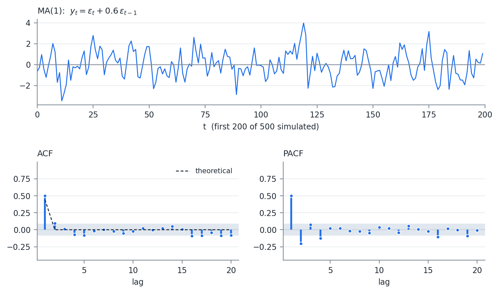{#fig-w02-ma1 width=100%}

@fig-w02-ma1 shows the signature. One significant spike in the ACF, at the theoretical value $\theta/(1+\theta^2) = 0.44$, and a PACF that decays with alternating sign. The shaded band is the $\pm 1.96/\sqrt{n}$ region where a sample autocorrelation is indistinguishable from zero.

### Autoregressive Processes

**Autoregressive Process** -- the independent variable is a function of its own lags.

AR(1). Easiest to work with if we center it on 0.

$$
\hat{y_t} = y_t - \mu
$$

$$
\hat{y_t} = \beta \hat{y_{t-1}} + \epsilon_t
$$

Back substitute:

$$
\hat{y_t} = \sum_{i=0}^{\infty} \left( \beta^i \epsilon_{t-i} \right)
$$

This is a special case of an infinite moving average. Note the weights are NOT constant -- they decline geometrically, $\theta_i = \beta^i$.

Also notice from above, the MA(1) is a special case of an infinite AR process.

Like the MA, $y$ is only defined if $|\beta| < 1$.

$$
E(\hat{y_t}) = E\left( \sum_{i=0}^{\infty} \left( \beta^i \epsilon_{t-i} \right) \right) = 0 \Rightarrow E(y_t) = \mu
$$

Since $\mu$ is constant:

$$
\operatorname{var}(y_t) = \operatorname{var}(\hat{y_t}) = \operatorname{var}\left( \sum_{i=0}^{\infty} \left( \beta^i \epsilon_{t-i} \right) \right) = \sigma^2 \sum_{i=0}^{\infty} \beta^{2i} = \frac{\sigma^2}{1 - \beta^2}
$$

If $|\beta| = 1$ then the variance of $y$ is infinite. Greater than 1 and it is undefined as the variance cannot be negative.

In our original equation, we had an intercept term, $c$:

$$
E(y_t) = E(c + \beta y_{t-1} + \epsilon_t)
$$

$$
\mu = E(c) + \beta\mu \Rightarrow c = (1 - \beta)\mu \Rightarrow \mu = \frac{c}{1-\beta}
$$

Autocovariance:

$$
\gamma(k) = \beta \gamma(k-1) = \frac{\sigma^2 \beta^k}{1 - \beta^2}
$$

Autocorrelation:

$$
\rho(k) = \beta^k
$$

Here, too, we can see that if $|\beta| = 1$ the variance is infinite, and if it is greater than 1, the variance is undefined.

$\beta$ determines the persistence of the correlation through time. A beta near 0 will quickly decay to 0, while a beta near 1 (or -1) will persist long into the future.

Beta = 1 is a random walk.

$\rho(k) = \beta^k$ decays but never reaches zero, which is the second row of @tbl-w02-acfpacf. The PACF is the mirror image. Once the first lag is accounted for, nothing is left, so the PACF cuts off after lag 1.

Example AR(1):

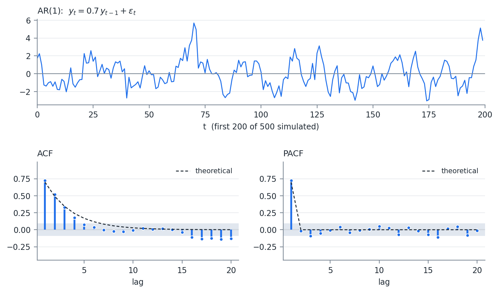{#fig-w02-ar1 width=100%}

Compare @fig-w02-ar1 to @fig-w02-ma1. The ACF and PACF panels have traded places, which is @tbl-w02-acfpacf drawn twice.

### ARMA and Its Extensions

AR and MA processes can be combined into ARMA(p,q) models -- a combination of AR(p) + MA(q).

When we include additional regressor (exogenous) variables, we call this an ARMAX.

If those other regressors are themselves serially correlated, this breaks other assumptions and we then have to estimate their ARMA process (with cross error effects) in a simultaneous equations model called VARMAX. V is for Vector. Usually you see these as VAR, vector autoregression, models without the MA component.

Persistence in returns is what momentum is. $\rho(k) = \beta^k$ with $\beta > 0$ says a positive move makes the next move more likely to be positive, decaying geometrically, and that is the effect a momentum factor is built to capture. Week 07 and Week 09 both use momentum as a factor. Knowing the process that generates it is worth the derivation.

My opinion: in risk work, the marginal value of moving past ARMA(1,1) on return data is small, and the higher order fits tend to look like overfitting rather than signal. The autocorrelation in returns is real but small. The variance is where most of the structure is, which is @sec-w02-garch.

### Fitting by Maximum Likelihood

There are multiple ways to fit ARMA models. All are involved. Most statistics software has model fitting for these.

For the MLE technique, we have to add the autocovariance matrix to the likelihood function.

$$
ll = -\frac{1}{2}\left( n \ln(2\pi) + \ln\left( \left| \Gamma(\theta,\beta) \right| \right) + X' \Gamma(\theta,\beta)^{-1} X \right)
$$

Where

$$
X = Y - \mu
$$

and $\Gamma(\theta,\beta)$ is the autocovariance matrix of size $(n \times n)$ implied by the values of the MA ($\theta$) and AR ($\beta$) parameters.

We are finding the max of the function above for $\mu$, $\theta$, and $\beta$.

The likelihood is given here so you know what is being maximized and what $\Gamma$ contributes. Do not implement it. Building $\Gamma$, inverting an $(n \times n)$ matrix at every step, and keeping the parameters inside the stationary region are all handled by any competent time series package, and a hand-rolled version will be slower and less stable. Use the fitting routine in your statistics package and spend your effort on whether the fitted model is the right one.

Compare this to the log likelihood in @sec-w02-mlenormal. The $\ln(\sigma^2)$ term has become $\ln|\Gamma|$ and the sum of squares has become a quadratic form in $\Gamma^{-1}$. It is the multivariate normal density from @sec-w02-mvn, with the model supplying the covariance matrix instead of an estimate.

## GARCH Models {#sec-w02-garch}

Another assumption that can break OLS regression is the constant variance of the errors. If the variance of the error term changes over time, this is called heteroskedasticity (homoscedasticity is constant variance).

Return data breaks assumption 5 far more visibly than it breaks assumption 4. Large moves cluster. A 3% day is followed by another large day considerably more often than a quiet day is, and the effect persists for weeks rather than for a session or two. The pattern lives in the squared returns rather than in the returns themselves, which is why an ACF of returns looks like noise while an ACF of squared returns does not.

One class of model to account for this is the GARCH model, where we apply the ARMA framework to the variance of the error term.

$$
\epsilon_t = y_t - \mu
$$

$$
\epsilon_t = \sigma_t z_t \quad \text{where } z \sim N(0,1)\ iid
$$

Here, $z$ becomes our constant and uncorrelated error process.

The GARCH(p,q) model is then

$$
\sigma_t^2 = \omega + \sum_{i=1}^{p} \left( \alpha_i \epsilon_{t-i}^2 \right) + \sum_{i=1}^{q} \left( \beta_i \sigma_{t-i}^2 \right)
$$

The $\alpha$ terms are the ARCH part, carrying the effect of a recent large move. The $\beta$ terms are the GARCH part, carrying the persistence of the variance level itself.

### The Long Run Variance

We can get the long run average variance by taking the expectation of both sides. For the GARCH(1,1) model:

$$
\sigma^2 = E\left( \sigma_t^2 \right) = E\left( \omega + \alpha \epsilon_{t-1}^2 + \beta \sigma_{t-1}^2 \right)
$$

$$
\sigma^2 = \omega + \alpha \sigma^2 + \beta \sigma^2 = \frac{\omega}{1 - \alpha - \beta}
$$

This puts bounds on alpha and beta. Like the ARMA(1,1) coefficients, they must be less than 1. Also their sum must be less than 1, $\alpha + \beta < 1$.

The condition is not a technicality. If $\alpha + \beta \geq 1$ the expression above is negative or undefined, and the model has no long run variance to revert to. Fitted values of $\alpha + \beta$ on daily equity data typically land between 0.95 and 0.99, which is close enough to the boundary that the estimated long run variance is unstable.

### Forecasting

The $k$ step ahead variance forecast follows from the same recursion:

$$
E\left( \sigma_{t+k}^2 \right) = \sigma^2 + (\alpha + \beta)^{k-1}\left( \sigma_{t+1}^2 - \sigma^2 \right)
$$

The forecast decays from the current variance toward the long run level at rate $\alpha + \beta$, so the persistence parameter that made the long run variance unstable is the same parameter that sets how long a shock stays in the forecast. At $\alpha + \beta = 0.97$ the half life is roughly 23 days, which is why a volatility spike takes about a month to work its way out.

Setting $\omega = 0$ and $\alpha + \beta = 1$ removes the long run variance entirely and leaves an exponentially weighted average of squared returns. That is the RiskMetrics estimator, and Week 03 covers it directly.

GARCH models are fit by maximum likelihood, using the machinery of @sec-w02-mle. The likelihood is the normal density evaluated at $\epsilon_t / \sigma_t$, with $\sigma_t$ generated recursively from the parameters being fit.

The same advice applies as for ARMA. Use your statistics package. The recursion needs a starting value for $\sigma_0^2$, the optimizer has to respect $\omega > 0$, $\alpha \geq 0$, $\beta \geq 0$, and $\alpha + \beta < 1$, and the likelihood surface is flat enough near the boundary that a naive optimizer will wander out of it.

# Week 03 — Monte Carlo and Covariance Estimation

## Monte Carlo Simulation

The Monte Carlo method is something that is used widely throughout risk management. Often we are dealing with functions of random variables, from which the final distribution of outcomes is unknown. The Monte Carlo method gives us a way to approximate that final distribution.

Week 01 and Week 02 gave us distributions we can write down. Almost nothing we actually hold is one of them. A portfolio of options on correlated assets has a P&L distribution with no closed form, and no amount of algebra will produce one. Simulation replaces the algebra. Draw the inputs from a distribution we do understand, push each draw through the function, and read the answer off the resulting sample.

The cost is that the answer is itself a random variable. Every number produced this way carries simulation error, and that error falls as $1/\sqrt{K}$ in the number of draws.

### The Inverse CDF Method

Drawing univariate random numbers is easy. Most software packages have a random function and many will allow you to specify a distribution.

Sometimes, only the uniform distribution is available from the random number generator, defined on the interval $(0,1)$. Using the quantile function, the inverse CDF, we can use that to give us random draws from a distribution.

Quantile function is the inverse of the CDF. It is the value of $x$ such that $F(x) = p$:

$$
F^{-1}(p)
$$

Remember the CDF function is

$$
F(x) = P(X \leq x) = \int_{lb}^{x} f(t)\, dt
$$

where $lb$ is the lower bound of the distribution.

The CDF is monotonic and defined between $(0,1)$, so the quantile function gives a 1:1 mapping from $(0,1)$ into the range of the distribution.

$$
x = F^{-1}(u), \quad u \sim U(0,1)
$$

This one line does more work than it appears to. It converts any distribution with a computable quantile function into a draw, using only a uniform generator. It is also the mechanism behind the copula in Week 05, where we run the transform in both directions -- CDF to get to uniforms, inverse CDF to get back out.

### Simulating a Correlated System {#sec-w03-mvdraw}

Often we need to simulate a system of correlated values. Most commonly, we use a multivariate normal distribution.

Recall last week we stated if $X$ was multivariate normal

$$
X \sim N(\mu, \Sigma)
$$

There exists

$$
\mu \in \mathbb{R}^{n},\ L \in \mathbb{R}^{n \times m} \quad \text{such that} \quad X = LZ + \mu
$$

Where

$$
Z_i \sim N(0,1), \quad i \in [1,m]
$$

$$
\Sigma = LL'
$$

This provides a path for the generation of multivariate random normals.

**Multivariate Draw Algorithm.** To simulate $K$ random draws from an $N$ variable multivariate normal, we need:

1. Factor $\Sigma$ into $L$, which is $(N \times M)$
2. Generate $K \times M$ random standard normals, $Z$, shaped $(M \times K)$
3. $X = (LZ + \mu)^T$, with shape $(K \times N)$

Each series is on the row without the transpose. We tend to think of tables with columns of values, so we use the transpose to put the matrix into a data table format.

A lot of packages have a multivariate normal random number generator. However, with some of the data problems we will encounter, knowing how to generate your own will be necessary.

The rest of this week is about step 1. Steps 2 and 3 are a random number call and a matrix multiply. Producing an $L$ from a covariance matrix estimated on real data is where the work is, and where the failures are.

## Cholesky Factorization

The most used factorization of $\Sigma$ is the Cholesky root. The Cholesky factorization can be applied to positive definite (PD) matrices. The factor $L$ is a lower triangular matrix. This is sometimes referred to as the Cholesky root, as the factor is analogous to the square root.

The Cholesky root is roughly 2x more efficient to calculate than the $LU$ factorization. For this reason it is more often used.

If the matrix is only positive semi-definite (PSD), the Cholesky root can still be calculated allowing for a column of 0 values. The number of non-zero columns aligns with the number of positive eigenvalues (the rank) of the matrix.

### The Algorithm

$A$ is symmetric and PD. $L$ is lower triangular, and $A = LL'$. Multiply the two triangular matrices and match entries, and every element of $L$ falls out in terms of elements already computed:

$$
L_{jj} = \sqrt{A_{jj} - \sum_{k=1}^{j-1} L_{jk}^2}
$$

$$
L_{ij} = \frac{1}{L_{jj}}\left( A_{ij} - \sum_{k=1}^{j-1} L_{ik} L_{jk} \right), \quad i > j
$$

Nothing on the right hand side of either expression involves an unknown, which is why a single pass works.

This is solved either across the rows or down the columns.

Down the columns:

1. Column *j*, start on the diagonal element
2. Subtract the sum of the squares of the values on the root matrix for row *j* from the value on the input matrix on the diagonal
3. Update the root matrix at position (*j,j*) with the square root of step 2
4. Moving down the column, row *i*:
    a. Calculate the dot product of sub matrix vector [*i, 1:(j-1)*] and [*j, 1:(j-1)*]
    b. Subtract a. from the (*i,j*) element of the input matrix
    c. Divide b. by the *j* diagonal element of the root matrix
    d. Store that value in element (*i,j*) of the root matrix
5. Repeat for the next column

#### A Worked Example

Take the symmetric PD matrix

$$
A = \begin{pmatrix}
4 & 2 & -2 & 4\\
2 & 10 & 5 & -1\\
-2 & 5 & 21 & 0\\
4 & -1 & 0 & 15
\end{pmatrix}
$$

Read as a covariance matrix, the variances are 4, 10, 21, and 15, and the implied correlations run from $-0.22$ to $0.52$.

Column 1. The diagonal has no prior terms to subtract, so $L_{11} = \sqrt{4} = 2$. Divide the rest of the column by it:

$$
L_{21} = \tfrac{2}{2} = 1, \qquad
L_{31} = \tfrac{-2}{2} = -1, \qquad
L_{41} = \tfrac{4}{2} = 2
$$

Column 2. Subtract the squares already placed in row 2, then divide:

$$
L_{22} = \sqrt{10 - 1^2} = \sqrt{9} = 3
$$

$$
L_{32} = \frac{5 - (-1)(1)}{3} = \frac{6}{3} = 2, \qquad
L_{42} = \frac{-1 - (2)(1)}{3} = \frac{-3}{3} = -1
$$

Column 3.

$$
L_{33} = \sqrt{21 - (-1)^2 - 2^2} = \sqrt{16} = 4
$$

$$
L_{43} = \frac{0 - (2)(-1) - (-1)(2)}{4} = \frac{4}{4} = 1
$$

Column 4. Only the diagonal is left:

$$
L_{44} = \sqrt{15 - 2^2 - (-1)^2 - 1^2} = \sqrt{9} = 3
$$

Collecting the results:

$$
L = \begin{pmatrix}
2 & 0 & 0 & 0\\
1 & 3 & 0 & 0\\
-1 & 2 & 4 & 0\\
2 & -1 & 1 & 3
\end{pmatrix}
$$

Multiply $LL'$ and confirm you recover $A$. Work this by hand once. Every failure mode discussed below is a failure of one of the four square roots or one of the six divisions above.

Most linear algebra packages use this algorithm on blocks of the matrix. The dot products become matrix multiplications, matrix inverse for the division, and the square root is a single threaded Cholesky call. The block size is chosen based on CPU cache size and vector operations are used for the matrix multiplications. See <http://www.netlib.org/utk/papers/factor/node9.html>.

### The PSD Case {#sec-w03-cholpsd}

If the matrix is PSD instead of PD, the algorithm above breaks down. At least one of the root diagonal elements will be 0. The calculation of the column then fails when we attempt to divide by 0. In this case, we set all the values of the column to 0.

Two things follow from that patch, and both matter later.

The first is that it works. $LL'$ still reproduces $\Sigma$ exactly, and the simulation still runs. The Cholesky failing is a property of the PD algorithm, not of the matrix.

The second is that it is not free. A zero column means one fewer independent random number driving the system. Simulating $N$ variables from a rank $M$ matrix gives draws that all lie inside an $M$ dimensional subspace, and no simulated scenario can ever produce a pattern outside it. Week 09 is built on that observation.

## Missing Data

Missing values are very common in finance. Not all markets are open at the same time on the same days. A holiday in one market is not necessarily a holiday in another, even in the same country.

Imagine 3 assets with different trading schedules. @tbl-w03-missing shows the days on which a market is open and the asset trades.

| Date | Asset A | Asset B | Asset C |
|--:|:-:|:-:|:-:|
| 1 | X | X | |
| 2 | X | X | X |
| 3 | | X | X |
| 4 | | | |
| 5 | X | | |
| 6 | X | X | X |
| 7 | X | X | X |
| 8 | X | X | |
| 9 | X | X | X |
| 10 | | X | X |

: Three assets on different trading calendars {#tbl-w03-missing tbl-colwidths="[16,28,28,28]"}

2 common ways to calculate (we will talk about some others later):

1. Only use the days on which all markets are open.
    a. This limits the information
    b. Only days 2, 6, 7, and 9 (40%) are open at the same time
    c. Information about asset behavior on the other days is ignored
2. Use pairwise calculations. Find the matching rows for each pair, and build the covariance matrix piece by piece.
    a. We use more information, but not all
    b. Assets A and B would use days 1, 2, 6, 7, 8, and 9
    c. While we are building a symmetric matrix, we do not guarantee the matrix is PSD

The trade in @tbl-w03-missing is a real one. Method 1 keeps 4 rows out of 10 and returns a matrix that is guaranteed PSD. Method 2 uses 6 rows for the A-B pair and returns a matrix that may not be. Each entry of a pairwise matrix is estimated from a different sample, so the entries are not required to be mutually consistent, and a set of mutually inconsistent correlations is exactly what a negative eigenvalue is.

Nothing here is a rounding problem. @sec-w03-nonpsd is about what to do once it happens.

## Covariance Matrix Generation Techniques

There are many different techniques people use in practice for creating covariance matrices.

1. Default covariance function. With perfect data, and an assumption of normality, then the covariance as we described last class is the best estimator.
2. If there are missing values that do not fully overlap, but enough history that does, then the method of using only records with overlapping data works well. It might not have the full information, but because you have a lot of data, the matrix should be OK.
3. If you are missing values and do not have a lot of fully overlapping observations, then pairwise estimation can be used. This will often result in a non-PSD matrix, which we will discuss shortly.
4. Financial data are time variant. Often we use a weight function to give more weight to recent observations -- usually with weights decreasing exponentially. This is sometimes called the RiskMetrics covariance, after the firm that popularized it in the mid 1990s. @sec-w03-ew details the calculation.
5. Another popular method is using an EM algorithm to estimate the covariance. Expectation Maximization is an iterative process using the likelihood function. This can deal with the missing data problem. However, as the proportion of missing values as a percent of the total observations increases, the results can be unstable. It is best suited to a large number of observations so that convergence can occur.
    a. We will not go into detail, but I would highly recommend looking into this.
6. When dealing with high frequency data, the issue of overlapping observations becomes even harder. With time intervals measured in milliseconds, it is impossible to see updated prices on all assets. Lots of work has gone into this area recently. There are a few packages, "highfrequency" in R and "HighFrequencyCovariance" in Julia.
    a. If you are going into the field of automated trading and will be dealing with very short time interval data, start by reading the paper for "HighFrequencyCovariance" in Julia and follow the references. <https://papers.ssrn.com/sol3/papers.cfm?abstract_id=3786912>
    b. If someone knows of an analogous package in Python, please let me know and I will add it to the course notes.
7. Because the issue of rank of the matrix comes from the correlation estimation, we will use any of the methods in this list to calculate correlations, but use the full history of each variable for the variance calculation.

Item 7 is worth reading twice. Splitting the problem into a correlation matrix and a vector of variances lets each piece use the data it can, and it isolates the rank problem in the correlation matrix where the repair algorithms in @sec-w03-nonpsd operate. Rebuild with

$$
\Sigma = D\, C\, D, \quad D = \operatorname{diag}(\sigma_1, \dots, \sigma_n)
$$

so a full-history variance for each variable survives whatever was done to $C$.

When we break the assumption of normality and we have what look like outliers to the normal distribution, the Pearson coefficient may not be the best estimator of correlation. We will discuss this in a few weeks.

## Exponentially Weighted Covariance {#sec-w03-ew}

JP Morgan was one of the first banks to use exponentially weighted covariance matrices in their risk analytics starting in the late 1980s. Their risk management was considered some of the best in the industry, and they spun out a software and consulting company called "RiskMetrics."

### The Estimator

$$
\sigma_t^2 = \lambda \sigma_{t-1}^2 + (1-\lambda)\left( x_{t-1} - \bar{x} \right)^2
$$

This is a simple exponential smoothing model. The variance for tomorrow is updated based on today's forecast variance and today's deviation from the mean.

Back substitute and we get

$$
\sigma_t^2 = (1-\lambda) \sum_{i=1}^{\infty} \lambda^{i-1} \left( x_{t-i} - \bar{x} \right)^2
$$

Recognize that

$$
\lim_{n \to \infty} (1-\lambda) \sum_{i=1}^{n} \lambda^{i-1} = 1
$$

Setting the weight of a prior observation

$$
w_{t-i} = (1-\lambda)\, \lambda^{i-1}
$$

will give us a weighted estimator over an infinite horizon. Obviously we do not have an infinite horizon, so weights are normalized so that they sum to 1:

$$
\hat{w}_{t-i} = \frac{w_{t-i}}{\sum_{j=1}^{n} w_{t-j}}
$$

Variance and covariance estimators are then

$$
\widehat{\sigma_t^2} = \sum_{i=1}^{n} \hat{w}_{t-i} \left( x_{t-i} - \bar{x} \right)^2
$$

$$
\widehat{\operatorname{cov}(x,y)} = \sum_{i=1}^{n} \hat{w}_{t-i} \left( x_{t-i} - \bar{x} \right)\left( y_{t-i} - \bar{y} \right)
$$

Equal weighting the time series reduces to the MLE values.

### Choosing Lambda

RiskMetrics research found that across a number of asset classes, $\lambda = 0.97$ was the best value.

Be careful with that number. 0.97 is the RiskMetrics decay factor for monthly data. For daily data, which is what we use in this class, RiskMetrics used $\lambda = 0.94$.

Treat both as starting guides rather than settings. They came from one firm's data in the mid 1990s, across a particular set of asset classes, at a particular sampling frequency. A more liquid market, a longer horizon, or a different use for the estimate can all justify moving off them. What the choice should not be is unexamined.

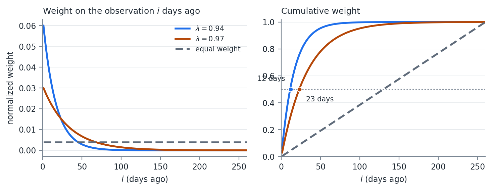{#fig-w03-ewweights width=100%}

@fig-w03-ewweights shows what the choice buys and what it costs. At $\lambda = 0.94$, half the total weight sits in the most recent 12 observations. At $\lambda = 0.97$ it takes 23. Equal weighting over the same 260 days puts half the weight in the most recent 130.

### Effective Sample Size

An equally weighted estimator built on $n$ observations uses $n$ observations. An exponentially weighted one does not, and the number it does use is worth computing.

The standard summary is the effective sample size:

$$
n_{\text{eff}} = \frac{1}{\sum_i \hat{w}_i^2}
$$

For equal weights, $\hat{w}_i = 1/n$, the sum is $1/n$, and $n_{\text{eff}} = n$. For exponential weights on an infinite horizon the sum has a closed form:

$$
\sum_{i=1}^{\infty} \hat{w}_i^2 = (1-\lambda)^2 \sum_{i=1}^{\infty} \lambda^{2(i-1)} = \frac{(1-\lambda)^2}{1-\lambda^2} = \frac{1-\lambda}{1+\lambda}
$$

$$
n_{\text{eff}} = \frac{1+\lambda}{1-\lambda}
$$

The half life follows from the same weights:

$$
h = \frac{\ln(0.5)}{\ln(\lambda)}
$$

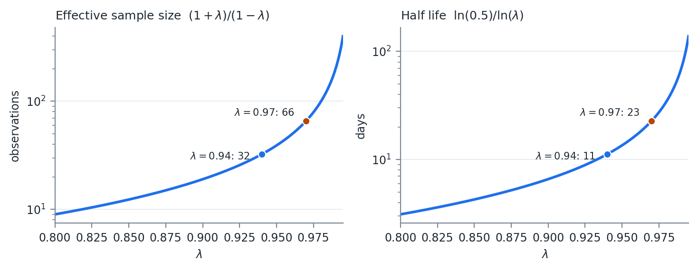{#fig-w03-esslambda width=100%}

Three things follow from @fig-w03-esslambda.

$n_{\text{eff}}$ does not depend on $n$. At $\lambda = 0.94$ it is 32 observations whether you feed the estimator one year of history or ten. Adding data past roughly four half lives changes the estimate by less than the rounding on the way to the report. Storing five years of returns to run a $\lambda = 0.94$ estimator is storage, not information.

The curve is convex, and it gets steep exactly where people set $\lambda$. Moving from 0.94 to 0.97 doubles $n_{\text{eff}}$ from 32 to 66. Moving from 0.97 to 0.99 triples it again to 199. Small changes in $\lambda$ are not small changes in the estimator, and reporting $\lambda$ to two decimals conceals that.

Estimation error scales with $n_{\text{eff}}$, not $n$. The standard error of a volatility estimate is roughly $\sigma / \sqrt{2 n_{\text{eff}}}$, which is about 12.5% of the estimate at $\lambda = 0.94$ and 8.7% at $\lambda = 0.97$. That is the price of responsiveness, and it is not small. A 20% volatility estimated at $\lambda = 0.94$ carries a standard error of about 2.5 volatility points.

There is also a conditioning consequence. Every weight is strictly positive, so the matrix is not singular in exact arithmetic. But the smallest eigenvalues are supported almost entirely by observations carrying vanishing weight, so a covariance matrix estimated at $\lambda = 0.94$ across more than roughly $n_{\text{eff}}$ assets is numerically close to singular. @sec-w03-nonpsd exists partly because of this.

My opinion: on daily data, use at least a year of history. Then be honest with yourself that the estimate is built on a few weeks of it.

### Speed of Update

The other half of the trade is how fast the estimate moves.

The recursion gives the answer directly. Today's observation enters $\sigma_t^2$ with weight exactly $(1-\lambda)$ -- 6% at $\lambda = 0.94$, 3% at $\lambda = 0.97$, 1% at $\lambda = 0.99$. Everything already in the estimate is scaled by $\lambda$. A shock that entered $k$ days ago retains $\lambda^k$ of the weight it arrived with, so it decays on the same half life as @fig-w03-esslambda.

Put a 5 standard deviation day through it. The squared observation is $25\sigma^2$, so:

$$
\sigma^2_{\text{new}} = \lambda \sigma^2 + (1-\lambda)\, 25\sigma^2 = \sigma^2\left( \lambda + 25(1-\lambda) \right)
$$

| $\lambda$ | Weight on today | Volatility after a $5\sigma$ day | Half life |
|--:|--:|--:|--:|
| 0.90 | 10% | $\times 1.87$ | 7 days |
| 0.94 | 6% | $\times 1.56$ | 11 days |
| 0.97 | 3% | $\times 1.31$ | 23 days |
| 0.99 | 1% | $\times 1.11$ | 69 days |

: How $\lambda$ controls the response to a single large move {#tbl-w03-lambda}

@tbl-w03-lambda is the whole trade in one place. The same event moves a $\lambda = 0.90$ estimate by 87% and a $\lambda = 0.99$ estimate by 11%, and the faster estimate then forgets it ten times sooner.

Neither end is right. A fast $\lambda$ tracks a regime change within a week and produces limit breaches on days when nothing happened. A slow $\lambda$ is stable and will still be reporting last month's calm in the middle of a crisis. Pick based on what the number is for. A risk limit that triggers trading wants responsiveness. A capital calculation wants stability.

Whatever you pick, say what it is. An unstated $\lambda$ makes two volatility numbers incomparable even when they were computed from the same returns.

### The Link to GARCH

Remember the GARCH(p,q) model from last week:

$$
\sigma_t^2 = \omega + \sum_{i=1}^{p} \left( \alpha_i \epsilon_{t-i}^2 \right) + \sum_{i=1}^{q} \left( \beta_i \sigma_{t-i}^2 \right)
$$

If we set $(p,q) = (1,1)$ then we can see RiskMetrics' exponentially weighted methodology is a GARCH(1,1) process with $\omega = 0$, $\alpha = (1-\lambda)$, and $\beta = \lambda$.

We also said that if $\alpha + \beta = 1$ the long term variance is undefined. Do not use long time horizon simulation where you update the covariance matrix for each future time period using this methodology.

The reason is in the forecast recursion from last week. With $\alpha + \beta = 1$ there is no level to revert to, so the $k$ step ahead forecast is just today's variance repeated forever, and any simulation that keeps updating will wander without bound.

The missing long run variance is not only a liability. GARCH with $\alpha + \beta < 1$ mean reverts to a fixed level, so when volatility shifts to a genuinely new regime the model fights the shift -- the forecast keeps decaying back toward the old level. The exponentially weighted estimator has no old level to decay toward, so it absorbs the shift permanently. Clustered spikes are what GARCH was built to describe. Persistent level shifts are what the exponentially weighted estimator handles better.

Lamoureux and Lastrapes (1990) make the point from the other direction. Ignoring structural breaks in the unconditional variance biases the estimated $\alpha + \beta$ upward toward 1, so the persistence of 0.95 to 0.99 typically fitted on daily equity data is partly an artifact of regime shifts the model does not represent.

Be careful about how much this buys. Neither estimator observes the regime. Both learn only through squared returns, at speed $\alpha$ for GARCH and $(1-\lambda)$ for the exponentially weighted estimator, and typical values of those are 0.05 to 0.10 against 0.06. The advantage is in the forecast, not in the detection. The same refusal to revert also means a one off spike stays in the estimate long after it should have gone.

## Dealing with Non-PSD Matrices {#sec-w03-nonpsd}

2 main reasons matrices are non-PSD:

1. Floating point error
2. Missing data

Floating point error and rounding can become a problem when calculating the Cholesky on a PSD matrix. Sometimes you have a true PSD matrix but you end up with a slightly negative eigenvalue. That will cause one of the diagonals on the root matrix to be complex. Generally it is OK to check for and set to 0 slightly negative values before you attempt the square root. Negative values too large to be floating point error need to be dealt with in a different manner.

The distinction is one of magnitude, and there is no clean threshold. An eigenvalue at $-10^{-16}$ times the largest eigenvalue is arithmetic. An eigenvalue at $-0.05$ times the largest is a statement that the data are mutually inconsistent, and zeroing it silently changes the matrix.

### Rebonato and Jackel

Rebonato and Jackel (1999, <https://papers.ssrn.com/sol3/papers.cfm?abstract_id=1969689>) present 2 methods for finding an acceptable PSD matrix. The method using a spectral decomposition on the correlation matrix is relatively straightforward.

First, decompose the correlation matrix:

$$
C S = S \Lambda, \quad \Lambda = \operatorname{diag}(\lambda_i)
$$

This is the eigenvalue decomposition of $C$ into its eigenvectors $S$ and a diagonal matrix with its eigenvalues, $\Lambda$.

Second, construct a new $\Lambda'$ such that all eigenvalues are greater than or equal to 0:

$$
\Lambda' : \lambda_i' = \max(\lambda_i, 0)
$$

Third, construct the diagonal scaling matrix

$$
T : t_i = \left[ \sum_{j=1}^{n} s_{i,j}^2 \lambda_j' \right]^{-1}, \quad T = \operatorname{diag}(t_i)
$$

$s_{i,j}$ is the $(i,j)$ element of the eigenvector matrix. $T$ is what restores the unit diagonal. Zeroing eigenvalues shrinks the rows, and without the rescaling the result would no longer be a correlation matrix.

Now let

$$
B = \sqrt{T}\, S\, \sqrt{\Lambda'}
$$

Where $\sqrt{\ }$ of a matrix denotes the element wise square root.

$$
BB^T = \hat{C} \approx C
$$

This matrix is not necessarily the closest matrix (by whatever method of "closest" you choose) to the original. It is, however, a good starting point and oftentimes, good enough.

Rebonato and Jackel also present an optimization algorithm in their paper, which we will not discuss here.

### Higham

**Higham** (2002, <https://www.maths.manchester.ac.uk/~higham/narep/narep369.pdf>) presents an iterative algorithm for finding the nearest PSD correlation matrix. This method is used widely.

The goal is to find $A$ such that

$$
\gamma(A) = \|A - C\|
$$

is minimized, such that $A$ is PSD.

Generally, the norm used is the Frobenius norm

$$
\|A\|_F = \sqrt{\sum_{i=1}^{n} \sum_{j=1}^{n} a_{i,j}^2}
$$

Weights can be applied by 2 methods, if desired. See the paper for more information.

We will assume our weights are a diagonal matrix, $W$. Unweighted, we can set $W = I$.

$$
\|A\|_W = \left\| W^{\frac{1}{2}} A\, W^{\frac{1}{2}} \right\|_F
$$

Higham proposes Algorithm 3.3 (page 9 of the pdf, 337 of the journal). This method alternates projections until the norm converges.

The first projection,

$$
P_U(A) = A - W^{-1} \operatorname{diag}(\theta_i) W^{-1}
$$

Where $\theta$ solves the equation

$$
\left( W^{-1} \# W^{-1} \right)\theta = \operatorname{diag}(A - I)
$$

\# is element wise multiplication.

When $W$ is diagonal (which we are assuming), then

$$
P_U(A) = (p_{i,j})
$$

$$
p_{i,j} = a_{i,j}\ \ \forall\ i \neq j
$$

$$
p_{i,j} = 1\ \ \forall\ i = j
$$

$P_U$ is the easy projection. It sets the diagonal back to 1 and leaves everything else alone.

The second projection is similar to the spectral decomposition we performed earlier.

$$
P_S(A) = W^{\frac{-1}{2}}\left( \left( W^{\frac{1}{2}} A\, W^{\frac{1}{2}} \right)_{+} \right) W^{\frac{-1}{2}}
$$

$$
(A)_{+} = S \operatorname{diag}(\max(\lambda_i, 0)) S^T
$$

That is, the eigenvalue system with negative eigenvalues set to 0.

Neither projection alone gives a correlation matrix. $P_S$ makes the matrix PSD and breaks the unit diagonal. $P_U$ fixes the diagonal and can break the PSD property. Alternating between them converges to a matrix in both sets.

The algorithm proceeds:

> $\Delta S_0 = 0,\ \ Y_0 = A,\ \ \gamma_0 = \max\ \text{Float}$
>
> $\text{Loop } k \in 1 \dots \max\ \text{Iterations}$
>
> $\quad R_k = Y_{k-1} - \Delta S_{k-1}$
>
> $\quad X_k = P_S(R_k)$
>
> $\quad \Delta S_k = X_k - R_k$
>
> $\quad Y_k = P_U(X_k)$
>
> $\quad \gamma_k = \gamma(Y_k)$
>
> $\quad \text{if } |\gamma_k - \gamma_{k-1}| < tol \text{ then break}$

We use the alternating projections to update the $Y$ matrix until we max out our iterations, or the weighted norm converges to a set tolerance.

The $\Delta S$ term is a Dykstra correction. Plain alternating projections converge to some point in the intersection. The correction is what makes the limit the nearest one.

### In Practice

In practice, you need to check the smallest eigenvalue from the result. If it is significantly negative, you need to run the algorithm on the result. You need a result that can be processed by your Cholesky function.

Convergence of the norm is not the same as the answer being usable, and the tolerance you set on $\gamma$ says nothing directly about the smallest eigenvalue. Check the eigenvalue, not the norm.

## Principal Component Analysis

PCA provides us another way to simulate a system. The Rebonato and Jackel methodology used to adjust a non-PSD matrix is simply PCA, removing the negative eigenvalues. PCA is often used to reduce the dimensionality of the problem.

PCA projects the system into an orthogonal space. It gives us a linear transform of independent random variables into a correlated multivariate distribution.

### The Decomposition

$$
C = S \Lambda S^T
$$

Where $S$ are the eigenvectors and $\Lambda$ is a diagonal matrix of eigenvalues.

If we take the square root of the eigenvalues and store those in a diagonal matrix, $\Lambda^{\frac{1}{2}}$, we can write

$$
C = \left[ S \Lambda^{\frac{1}{2}} \right]\left[ \Lambda^{\frac{1}{2}} S^T \right]
$$

$$
B = \left[ S \Lambda^{\frac{1}{2}} \right] \Rightarrow C = BB^T
$$

This provides an alternative to the Cholesky factorization. The requirement has not changed since @sec-w03-mvdraw:

$$
X \sim N(\mu, \Sigma)
$$

There exists

$$
\mu \in \mathbb{R}^{n},\ L \in \mathbb{R}^{n \times m} \quad \text{such that} \quad X = LZ + \mu
$$

Where

$$
Z_i \sim N(0,1), \quad i \in [1,m]
$$

$$
\Sigma = LL'
$$

$B$ satisfies that last line, so set $L = B$ and the multivariate draw algorithm runs unchanged. Cholesky and PCA are two ways of answering the same question. Nothing about the simulation cares which one produced the root.

The Cholesky is preferred for a full rank system. Because it is a triangular matrix, fewer floating point operations have to be performed.

### Dimensionality Reduction

If the matrix is PSD then there will be $m$ non-zero eigenvalues where $m \leq n$.

If the eigenvalue is 0, then we can remove it from the $\Lambda$ matrix, along with the corresponding column in the eigenvector matrix $S$.

Now to simulate $N$ values, we only have to generate $M$ random numbers, effectively reducing the size of the problem.

This is the same rank deficiency as the zero columns in @sec-w03-cholpsd, handled explicitly rather than patched. Both approaches produce a valid $\Sigma = BB'$. Neither one recovers the information that was never in the matrix.

We can further reduce the dimensionality by removing additional non-zero eigenvalues. The larger the eigenvalue, the more impact it has on the total system.

### Variance Explained

Take the vector of $m$ non-zero eigenvalues. Sort them from largest to smallest (most eigenvalue functions do this for you) to form the vector

$$
L = \left[ \lambda_1,\ \lambda_2,\ \dots,\ \lambda_m \right] \ \forall\ \lambda_i \geq \lambda_j,\ i < j,\ \text{with } i,j \in [1, 2, \dots, m]
$$

Then the percentage of variance explained by the first $K$ eigenvalues is

$$
\text{Pct Explained}(K) = \frac{\sum_{i=1}^{K} L_i}{\sum_{j=1}^{m} L_j}
$$

Dropping eigenvalues is a modeling choice, not a repair. Every dropped component is a direction the simulation can no longer move in, and the forecast variance of any portfolio sitting in that direction is exactly zero. Week 09 shows what that looks like when it goes wrong.

## Simulating from Models

Often we have a model for an asset. This could be OLS, MLE, ARMA, or something else. At the heart of most modeling is to get to an error variable that is independent and identically distributed (iid).

That is the connection back to Week 02. Every model in that week existed to strip structure out of a series until what was left satisfied the OLS error assumptions. Here we run the same machinery backwards -- simulate the iid errors, then push them through the model to rebuild the series.

Assume we have $n$ variables, $X$, that we are interested in. There is some information matrix, $\Omega$, that we use for modeling, and the error terms, $\epsilon$, are all assumed to be normally distributed.

Models for variable $i$ at time $t$, $x_{i,t} \in X$, are given as a function:

$$
x_{i,t} = f_i\left( \Omega_t,\ \epsilon_{i,t} \right)
$$

Because we assume $\epsilon_i \sim N(0, \sigma_i^2)\ iid$, then we can assume the system of errors is jointly normal

$$
\epsilon \sim N(0, \Sigma)
$$

The models are separate but the errors are not. Two stocks each carrying their own ARMA still move together, and $\Sigma$ is where that co-movement lives.

If we know $\Omega_t$ then we can use the set of functions, $f$, to simulate $X$:

1. Simulate $m$ draws for $n$ error terms
2. For each draw, evaluate the set of functions to create the $X$ simulated variables

If we do not know all elements of $\Omega_t$ then we need to

1. Simulate them through their own model
2. Assume a value for them

Often some $x_i$ will depend on other elements in $X$. In that case we need to order the models so that the independent models are evaluated first.

1. Order models without dependencies on $X$ first
2. Order remaining models such that dependent models are evaluated earlier
3. Simulate $m$ draws for $n$ error terms
4. Evaluate the models in order

If you have a circular pattern, that is, A depends on B, which depends on C, which depends on A, then you need an iterative solver. We will not deal with it in this class.

# Week 04 — Returns and Value at Risk

## Financial Data and Returns

Financial data is often quoted as prices. Prices are non-stationary, meaning our assumptions for modeling do not hold. We have to transform prices into a series that is stationary and suitable for modeling.

Everything in Weeks 01 through 03 assumed a series with a stable mean and variance. A price series has neither. A stock at \$40 last year and \$90 today has no mean to estimate, and the variance of its level grows with the length of the sample. Returns are the transform that makes the previous three weeks apply.

Fundamentally, today's price is some function of yesterday's price, plus whatever new information arrived today. Prices are generally assumed to be positive.

### Three Return Systems

3 classical ways to view this:

1. Classical Brownian Motion

$$
P_t = P_{t-1} + r_t
$$

2. Arithmetic Return System

$$
P_t = P_{t-1}\left( 1 + r_t \right)
$$

3. Log Return or Geometric Brownian Motion

$$
P_t = P_{t-1} e^{r_t}
$$

| System | Price process | Additive across | Prices stay positive |
|:--|:--|:--|:--|
| Classical Brownian | $P_t = P_{t-1} + r_t$ | assets and time | no |
| Arithmetic | $P_t = P_{t-1}(1+r_t)$ | assets | only if $r_t > -1$ |
| Geometric | $P_t = P_{t-1}e^{r_t}$ | time | yes |

: The three return systems {#tbl-w04-returns}

The third column of @tbl-w04-returns is why we keep all three. No system is additive both across assets and across time, so the choice depends on which direction the sum runs.

Classical Brownian Motion is the least used of the 3. There is not a good way to assure prices are greater than 0. However this is used in commodity applications where we are often concerned with the price between two physical locations (called the basis). Basis can and often does change sign.

### Arithmetic Returns

Arithmetic returns are often used in portfolio management. If I have a portfolio of assets $X$ with returns $r$, and I hold them with weight $w$, then the total return on my portfolio is simply the dot product of $r$ and $w$.

Let:

- $h_i$ be the absolute holding of asset $i$ in the portfolio
- $w_{i,t}$ be the weight of asset $i$ at time $t$
- $PV_t$ be the portfolio value at time $t$
- $P_{i,t}$ be the price of asset $i$ at time $t$
- $R_t$ be the portfolio return at time $t$
- $r_{i,t}$ be the asset $i$ return at time $t$

The value of the portfolio at time $t$ is:

$$
PV_t = \sum_{i=1}^{n} h_i P_{i,t} \quad \text{and} \quad w_{i,t} = \frac{h_i P_{i,t}}{PV_t} \Rightarrow \sum_{i=1}^{n} w_{i,t} = 1
$$

$$
PV_{t+1} = \sum_{i=1}^{n} h_i P_{i,t}\left( 1 + r_{i,t} \right) = PV_t \left( 1 + R_t \right)
$$

$$
PV_t + \sum_{i=1}^{n} h_i P_{i,t} r_{i,t} = PV_t + PV_t R_t \Rightarrow \sum_{i=1}^{n} w_{i,t} r_{i,t} = R_t
$$

That last line is the reason arithmetic returns exist. A portfolio return is a weighted sum of asset returns, exactly, with no approximation. Fact 7 from Week 02 then gives the portfolio variance directly.

Prices based on arithmetic returns can still be negative if the lower bound of the return is less than $-1$. Often we assume normal returns, but with a low enough volatility that this boundary rarely, if ever, comes into play.

You will see arithmetic returns used in the literature looking at the cross section of returns, where the additive property inside the same time period makes the math easy.

### Geometric Returns

Geometric Brownian Motion is often used when looking at returns through time. Here returns are additive with time.

$$
P_{t+1} = P_t e^{r_t} \Rightarrow P_T = P_0 e^{\sum_{t=0}^{T-1} r_t}
$$

If we assume $r_t \sim N\left( \mu, \sigma^2 \right)$ then $P_{t+1} \sim LN\left( \mu + \ln\left( P_t \right), \sigma^2 \right)$.

$$
\ln\left( P_{t+1} \right) = \ln\left( P_t \right) + r_t
$$

$$
\ln\left( P_{t+1} \right) \sim N\left( \mu + \ln\left( P_t \right), \sigma^2 \right) \Rightarrow P_{t+1} \sim LN\left( \mu + \ln\left( P_t \right), \sigma^2 \right)
$$

This is the Week 01 lognormal, arrived at from the process rather than from the density. Taking the log converts a multiplicative price process into an additive one, and the normal is closed under addition, which is the only reason the $T$ period distribution is available in closed form. @sec-w04-multiday uses that directly.

### Total Return Series

In practice, assets distribute cash or undergo changes that make the underlying price time series not indicative of total return. Some common occurrences:

1. Cash distributions
    a. Dividends
    b. Coupon payments
2. Stock splits
3. Spin outs

This is addressed by creating a total return price series. It is assumed that any proceeds are reinvested back into the security.

The method for doing this is straightforward:

1. Calculate a price return (usually arithmetic) at each time period.
2. In the time periods where events happen, adjust the return so that it reflects the actual return an investor would have experienced.
3. Starting with today's price, use the returns to calculate the price series back in time.

If you are maintaining a database of these total return prices, each day you calculate the total return for the security and, if there was an event, update the previous prices in the series. Alternatively you can just maintain the total return values.

Note what step 3 implies. The historical levels of a total return series are not the prices anyone ever traded at, and they change every time a new dividend is paid. Only the returns are stable.

Most sources of data will provide either a price series, a total return price series, or both. When pulling data from Yahoo! Finance, the "ADJ CLOSE" column is the total return price series.

Getting this wrong is a common and expensive mistake. A dividend paying stock analyzed on price alone shows a loss on every ex-dividend date, which looks like a series of small negative shocks that never reverse.

## Value at Risk {#sec-w04-var}

Risk is the possibility of financial loss. It is quantified in numerous ways.

In portfolio management, we often see the standard deviation of returns as the risk measure. We will be using this when we talk about portfolio management in a few weeks.

Value at Risk, or VaR, is a widely used metric. It attempts to answer, under normal market conditions, what is the minimum we can expect to lose on an $\alpha$% bad day.

VaR is not the maximum loss. It is the minimum loss on a "normal" $\alpha$% bad day. Most models look at recent history to calibrate market movement. Regimes can shift, and what was normal yesterday is abnormal today. Losses in a market that is not normal can be an order of magnitude larger than VaR.

Said another way, markets are hard to model and extreme events happen with a higher probability than would be assumed from most modeling.

Mathematically, VaR is the $\alpha$ percentile on the profit and loss distribution.

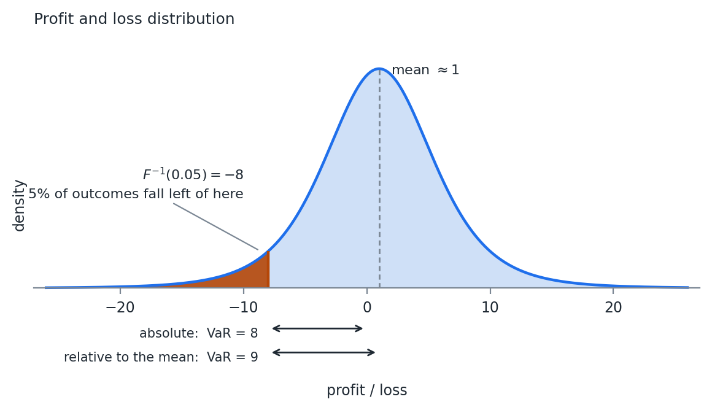{#fig-w04-var width=100%}

We negate the value of VaR so that a positive number is a loss and a negative number is a gain.

$$
VaR_{\alpha}(x) = -F_x^{-1}(\alpha)
$$

That is the Week 01 quantile function with a minus sign in front of it. Every method in the rest of this week is a different way of getting at $F$.

### Two Reporting Conventions

VaR is reported in 2 ways in practice. It is always helpful to ask which is intended.

1. Absolute value on the profit and loss distribution. In @fig-w04-var, VaR = 8.
2. The relative difference from the mean expected value. The mean in @fig-w04-var is about 1, so VaR = 9.

In risk management, we mostly care about the loss, so the first definition is sufficient.

If we are comparing 2 portfolios and we are interested in both their expected return (profit) as well as their level of risk (VaR), then the 2nd definition is generally used.

At a one day horizon the two agree to within rounding, because the mean daily return is small next to the daily standard deviation. At a one year horizon they do not, and the gap is the entire expected return of the portfolio.

## Criticisms of VaR

The largest criticism of VaR has to do with the fact that models have a hard time describing price movements in finance. VaR is the minimum loss under normal markets. Managing risk solely to VaR leads investors into a false sense of security.

VaR is not subadditive when the distribution is non-elliptical.

### Subadditivity

A subadditive measure is

$$
q(P_1) + q(P_2) \geq q(P_1 + P_2)
$$

Standard deviation (and variance) are subadditive. However, not all distribution percentiles are subadditive, meaning that VaR is not.

Why does that matter? Risk should be subadditive. It is hard to come up with a case where investing in 1 asset makes the 2nd asset more risky. Diversification, at worst, has no effect when things are perfectly correlated.

Example. Standard deviation is subadditive. Imagine you have 2 assets that are independent. They each have a standard deviation of 1 and we assume multivariate normality. We hold the assets in equal weights.

$$
q(0.5 P_1 + 0.5 P_2) = \sqrt{0.5^2 \cdot 1 + 0.5^2 \cdot 1} = 0.5\sqrt{2} = 0.707
$$

$$
q(0.5 P_1) = q(0.5 P_2) = 0.5
$$

$$
q(0.5 P_1) + q(0.5 P_2) = 1 > 0.707
$$

If we assume multivariate normality, then VaR is just a multiple of standard deviation:

$$
\alpha = 0.05 \Rightarrow VaR \approx 1.65\, \sigma_P
$$

Under normality VaR inherits subadditivity from the standard deviation it is a multiple of. The problem is not VaR itself. It is VaR applied to a distribution that is not elliptical.

### A Counterexample

Break the normality assumption. Imagine 2 bonds that are independent. Each costs \$90 and will pay \$100 in the next time period, if they do not default. Each has a 4% chance of default. You have \$180. You can buy 2 of either bond, or 1 of both.

If we let $\alpha = 0.05$, then in the 5% worst case scenario each bond will not default -- default happens in the 4% worst case scenario.

If I buy 2 of a single bond then VaR = $-\$20$. It is negative because the 5% loss is still a profit.

If I buy 1 of each bond, then the probability of one of the 2 defaulting is

$$
P(n_{\text{default}} \geq 1) = 1 - (1 - 0.04)^2 = 0.078
$$

In the 5% worst case, we will see 1 bond default. One bond returns nothing on its \$90 and the other pays \$100 on its \$90, so the profit and loss is $-90 + 10 = -80$ and VaR = 80.

$$
q(P_1) = q(P_2) = -10, \qquad q(P_1 + P_2) = 80
$$

$$
q(P_1) + q(P_2) \geq q(P_1 + P_2)
$$

Does not hold. $-20$ is not greater than 80.

The mechanism is worth seeing. Splitting the position moved probability mass across the 5% threshold. Concentrated, the bad event sits at 4% and VaR never sees it. Diversified, the bad event sits at 7.8% and VaR reports it in full. A measure that reads a single quantile is blind to everything on the far side of it, and diversification moves things across.

This makes VaR non-coherent as a risk measure.

But we still use it.

Week 05 covers Expected Shortfall, which averages over the tail instead of reading one point on it, and is subadditive as a result.

## Delta Normal VaR

Sometimes called parametric VaR, this assumes payoffs are linear and returns are distributed multivariate normal.

The assumptions make this a closed form solution.

$$
\alpha = 0.05 \Rightarrow VaR_{ret} \approx 1.65\, \sigma_P
$$

Where VaR is expressed as a return. You transform that into a price to get a dollar value.

Assuming arithmetic returns:

$$
VaR_{\$} = P_0 - P_0\left( 1 + \mu - VaR_{ret} \right) = P_0 VaR_{ret} - P_0 \mu
$$

Assuming geometric returns:

$$
VaR_{\$} = P_0 - P_0 e^{\mu - VaR_{ret}}
$$

These numbers will be close but not exact. It is important to understand how your returns were calculated and use the proper version.

Most times we assume $\mu = 0$. We will assume that from here out.

### The Gradient

Break down change in portfolio value as

$$
\Delta PV = \sum_{i=1}^{n} d_i \Delta P_i
$$

Assuming arithmetic returns and the $\Delta$ function as the return, then

$$
R = \sum_{i=1}^{n} d_i r_i
$$

We assume arithmetic returns because they are summable across the portfolio.

What is left is to find $d_i$. If we think of the equation above as a Taylor polynomial, then $d_i$ is just the first derivative of portfolio value with respect to price $i$.

We do not hold prices, we hold assets (also called positions). So by the chain rule we need 2 derivatives.

$$
\frac{dR}{dr_i} = \frac{dR}{dRA_i} \frac{dRA_i}{dr_i}
$$

The derivative of the portfolio return $R$ with respect to the return on the asset $RA_i$ is easy. That is the weight $w_i$ from before, assuming arithmetic returns. If I hold 50% of the portfolio in Asset 1 and asset 1 returns 5%, then the change in the portfolio value is 2.5%.

The derivative of the asset return with respect to the price return requires us to have a pricing function. Calculate the first derivative of the asset with respect to the current price.

$$
\Delta A_i \approx \delta\, \Delta P_i, \qquad \delta = \frac{dA_i}{dP_i}
$$

The change in the value of the asset is approximately the derivative of the asset with respect to price, times the change in price.

$$
r_i = \frac{\Delta P_i}{P_i}, \quad RA_i = \frac{\Delta A_i}{A_i} \Rightarrow RA_i \approx \frac{\delta P_i r_i}{A_i}
$$

$$
\frac{dRA_i}{dr_i} = \frac{\delta P_i}{A_i}
$$

Linear instruments like stocks are easy. The pricing function is just the price of the stock. The derivative is 1. The price of the asset and the price of the underlying are the same. A 1% change in the price causes a 1% change in the value of the position.

Derivatives are additive. If we have $m$ assets that are affected by price $i$:

$$
\frac{dR}{dr_i} = \sum_{j=1}^{m} w_j \frac{dRA_j}{dr_i} = P_i \sum_{j=1}^{m} \frac{w_j \delta_j}{A_j}
$$

If you recognize that $w_j = \frac{h_j A_j}{PV}$, where $h_j$ is the units of the asset held, we can also express this in terms of holdings instead of weights. Depending on how you set up the problem, use the one that makes the most sense.

$$
\frac{dR}{dr_i} = \frac{P_i}{PV} \sum_{j=1}^{m} h_j \delta_j
$$

We now have a gradient, $\nabla R$, of the portfolio return with respect to our underlying price returns. With the assumption of multivariate normality, it follows:

$$
R \sim N\left( \nabla R^T \mu,\ \nabla R^T \Sigma\, \nabla R \right)
$$

This is where the whole method lives. $\nabla R$ collapses any number of positions into one exposure per underlying price, and the normal is closed under linear transforms, so the portfolio return is normal with a variance we can write down.

We assumed that $\mu_i = 0\ \forall\ i$, so VaR is simply

$$
VaR(\alpha) = -PV \cdot F_X^{-1}(\alpha) \cdot \sqrt{\nabla R^T \Sigma\, \nabla R}
$$

Where $F_X^{-1}(\alpha)$ is the quantile function for the standard normal. At $\alpha = 0.05$ that value is $-1.645$, and the leading minus sign is what turns it back into a positive loss.

### Worked Example

Assume we have:

- 3 assets $A = \left[ A_1, A_2, A_3 \right]$ with current values $[1, 8, 20]$
- 2 prices $P = \left[ P_1, P_2 \right]$ with current prices $[7, 10]$
- We hold assets 1 to 3 in quantities $Q = [10, 20, 5]$
- Total portfolio value is then $A'Q = 1 \cdot 10 + 8 \cdot 20 + 20 \cdot 5 = 270$
- $\frac{dA_1}{dP_1} = 0.5$, $\frac{dA_2}{dP_1} = 1$, $\frac{dA_3}{dP_2} = 1$
- All other partial derivatives are 0

$$
\Sigma = \begin{pmatrix} 0.01 & 0.0075 \\ 0.0075 & 0.0225 \end{pmatrix}
$$

Assets 1 and 2 both depend on $P_1$, so their sensitivities add:

$$
\frac{dR}{dr_1} = \frac{7}{270}\left( 10 \cdot 0.5 + 20 \cdot 1 \right) = 0.6481
$$

$$
\frac{dR}{dr_2} = \frac{10}{270}\left( 5 \cdot 1 \right) = 0.1852
$$

$$
\sqrt{\nabla R^T \Sigma\, \nabla R} = 0.0823
$$

Assuming a normal distribution and $\alpha = 0.05$, $F^{-1}(\alpha) = -1.645$:

$$
VaR = -270 \cdot (-1.645) \cdot 0.0823 = \$36.55
$$

If we remove the $PV$ from the equation, we get VaR as a percentage:

$$
VaR = -(-1.645) \cdot 0.0823 = 13.54\%
$$

Note that the two exposures, 0.6481 and 0.1852, sum to 0.833 rather than to 1. The portfolio is not fully exposed to its own prices, because asset 1 carries a delta of 0.5 rather than 1.

### Where It Fails

There are 2 big issues with the Delta Normal VaR.

1. Assumption of normality of returns. See the GFC example in the code with this lecture. The largest 1 day return during the financial crisis was so large that it should not have happened in the lifetime of the universe.
2. The linear assumption of portfolio value with returns. Options and bonds are common portfolio holdings and their return profiles are not linear with respect to underlying prices. The sign of the second derivative will decide if we over or underestimate VaR using this method.

Issue 2 has a sign we can predict. The second derivative of an option value with respect to the underlying price is called gamma, and Week 06 covers it in full. A long option position has positive gamma, so the linear approximation understates the value on both sides and Delta Normal overstates the loss. A short option position has negative gamma, so Delta Normal understates the loss, which is the direction that matters.

The two remaining methods each attack one of these. Monte Carlo VaR keeps the normality assumption and drops the linearity assumption. Historical VaR drops both.

## Normal Monte Carlo VaR

The second issue with Delta Normal VaR is that asset pricing functions can be, and often are, non-linear. This makes the return distribution of the asset not well defined, meaning we need to estimate it with a Monte Carlo simulation.

We are still assuming returns are multivariate normal. What we are no longer assuming is that the portfolio is a linear function of them, so we reprice rather than differentiate.

1. Calculate current portfolio value.
2. Simulate $N$ draws from the assumed distribution.
3. Calculate new prices from the returns, using the chosen methodology.
4. Price each asset for all $N$ draws.
5. Calculate portfolio value for each of the $N$ draws.
6. Using the simulated portfolio values, find the $\alpha$% of the distribution.
7. Calculate VaR.

Step 2 is the Week 03 multivariate draw algorithm. Step 4 is where the cost is -- a full revaluation of every position on every draw, which for a book of American options is the difference between a calculation that runs in a second and one that runs overnight.

We find the $\alpha$% by sorting the portfolio values and picking the $N\alpha$ value from the vector. For a large number of draws, this is sufficient. If the number of draws is small, then using something like a Kernel Density Estimate or another smoothing technique might provide better results.

See <https://stats.stackexchange.com/questions/341023/quantile-of-kernel-density-estimator> for an example of calculating a quantile from a KDE.

## Historical VaR

Both issues with Delta Normal VaR, that returns are not normal and asset prices are not always linear, are sometimes addressed with Historical VaR.

This looks much like Monte Carlo VaR, but instead of using a model for returns, we simply assume observed past returns mimic the distribution. Historical VaR is a non-parametric statistic -- we make no distributional assumptions on returns.

### The Algorithm

Historical VaR works like MC VaR. We do not simulate returns, we sample them from history.

1. Calculate current portfolio value.
2. Simulate $N$ draws from history with replacement.
3. Calculate new prices from the returns, using the chosen methodology.
4. Price each asset for all $N$ draws.
5. Calculate portfolio value for each of the $N$ draws.
6. Using the simulated portfolio values, find the $\alpha$% of the distribution.
7. Calculate VaR.

Sampling whole rows rather than individual returns is what preserves the correlation structure. There is no covariance matrix anywhere in this method, and no assumption that dependence is linear, because the joint behavior comes along with the row.

| | Delta Normal | Monte Carlo Normal | Historical |
|:--|:--|:--|:--|
| Returns | multivariate normal | multivariate normal | sampled from history |
| Payoffs | linear | any | any |
| Dependence | $\Sigma$ | $\Sigma$ | whatever occurred |
| Cost | closed form | $N$ revaluations | $N$ revaluations |
| Main weakness | both assumptions | fat tails | limited history |

: The three VaR methods {#tbl-w04-varmethods}

@tbl-w04-varmethods is the choice in practice. Nothing in the first two columns can produce a loss larger than the normal allows, and nothing in the third column can produce a loss that has not already happened.

Historical VaR still suffers from recency bias. Often there is not enough history to show all regimes, so a limited sample is selected.

Using a KDE to smooth the VaR estimation is highly recommended.

### Weighted Historical Simulation

We can add weights to historical values, much like we added weights for the exponentially weighted covariance estimate. Without weights each day has an equal chance of being selected. Weights alter that probability.

Assume you have $m$ days of history and each day $i$ is given weight $w_i$:

$$
\sum_{i=1}^{m} w_i = 1
$$

Calculate the cumulative weight vector $cw$ as

$$
cw_i = \sum_{j=1}^{i} w_j\ \ \forall\ i \in 1:m
$$

The algorithm for selecting a day $i$ is

$$
r \sim U(0,1)
$$

$$
\min(i) \ \text{where}\ r \leq cw_i
$$

This is the inverse CDF method from Week 03, applied to a discrete distribution over historical days. The effective sample size discussion from Week 03 applies unchanged, and it bites harder here. A weighted historical VaR at $\lambda = 0.94$ is estimating a 5% quantile from roughly 32 effective observations, which puts one or two days in the tail.

## Time Periods Larger than 1 {#sec-w04-multiday}

Sometimes we are interested in holding periods greater than a single day. This can be an issue, as the data required to estimate multi-day ahead dynamics are more than single day ahead.

Often you see the $\sqrt{t}$ rule. This comes from an assumption that returns are summable across time, which means geometric returns.

$$
R_T = \sum_{t=1}^{T} R_t, \quad R_t \sim N\left( \mu, \sigma^2 \right)\ iid \Rightarrow R_T \sim N\left( T\mu,\ T\sigma^2 \right)
$$

Assuming $\mu = 0$:

$$
VaR_t(\alpha) = -PV \cdot F_X^{-1}(\alpha) \cdot \sigma
$$

$$
VaR_T(\alpha) = -PV \cdot F_X^{-1}(\alpha) \cdot \sqrt{T}\, \sigma = \sqrt{T}\, VaR_t(\alpha)
$$

The rule needs all three assumptions in that line. Normality, independence across time, and constant variance. The last two are the ones that fail in practice.

Volatility is not constant. Large moves cluster, and the level itself shifts between regimes. Week 02 modeled the clustering with GARCH and Week 03 handled the level shifts with an exponentially weighted estimator, and neither of those is compatible with a fixed $\sigma$ scaled by $\sqrt{T}$. Serial correlation in the returns breaks the independence assumption in the same line. Both effects push the true multi-day risk above what the rule reports, and both grow with $T$.

This estimation is often good enough. The options for each type of VaR other than the $\sqrt{t}$ rule:

1. Delta Normal -- none. Use the $\sqrt{t}$ rule. There is no other closed form solution and you are often using this approach when you need something that is quick to estimate.
2. Monte Carlo Normal -- two options.
    a. If you are using arithmetic returns, simulate $T \times N$ random normals instead of $N$. Compound your returns across time, and then price the portfolio.
    b. If you are using geometric returns, geometric returns are summable across time and we have assumed normality, so we know the $T$ period ahead distribution. Scale the covariance matrix by $T$, and the mean vector if you are using one. That is, multiply all elements of the covariance matrix by $T$. Simulate $N$ values, which now have properly scaled variance, convert to prices, and price the portfolio.
3. Historical simulation -- two options.
    a. If you have a lot of historical data, segregate the data into $M$ non-overlapping time periods. Sample from those $M$ periods.
    b. If you do not have a lot of historical data, segregate the data into $M$ overlapping time periods. This can cause a bias to your estimate. The samples are no longer independent.

Option 2a and option 2b are not the same calculation. Path matters under arithmetic returns, because compounding is multiplicative while the returns are added, so the $T$ period distribution is not normal and has to be simulated. Under geometric returns the path drops out and only the sum matters, which is why scaling $\Sigma$ works.

# Week 05 — Expected Shortfall and Copulas

## Expected Shortfall

Week 04 ended on a measure that is not coherent. VaR reads a single point on the loss distribution, so it is blind to everything past that point, and diversification can move a bad outcome across the threshold and make the reported risk jump. This week fixes both problems, and then fixes the distributional assumption underneath them.

Expected shortfall is the expected value of profit and loss given the loss is beyond VaR.

$$
ES(X) = E\left( X\ |\ x \leq -VaR(X) \right)
$$

Expected shortfall is the average of the left tail of the distribution, where the tail is defined as values whose CDF is less than or equal to $\alpha$.

A note on signs, because the two conventions get mixed constantly. The conditional expectation above is a point on the P&L distribution, so it is negative for a loss. The formula that follows carries a leading minus sign, which reports ES as a positive loss number -- the same convention we used for VaR. Both appear in practice. Pick one, state it, and stay with it.

Expected shortfall is sometimes called:

1. Conditional VaR, or CVaR
2. Average VaR, or AVaR
3. Expected Tail Loss, or ETL

CVaR is the most widely used alternative, but can sometimes mean different things to different people. It is always good to ask for a definition when someone uses it.

Formally, we can construct this from the PDF and VaR:

$$
ES(X) = -\frac{1}{\alpha} \int_{-\infty}^{-VaR(X)} x\, f(x)\, dx
$$

Numerically, given a sample of observations this is just the mean of all values less than or equal to VaR. Two lines of code, and no more difficult than VaR was.

### The Normal Case

ES has closed form solutions for many distributions. Because most of what we do is simulation based, we will calculate ES numerically. In the case of the Delta Normal VaR, it is useful to have the equation for the normal.

$$
ES_{\alpha}(X) = -\mu + \sigma \frac{f\left( \Phi^{-1}(\alpha) \right)}{\alpha}
$$

Where $f(x)$ is the standard normal PDF, and $\Phi^{-1}(\alpha)$ is the standard normal quantile function.

Recognize that the expected shortfall for the normal is a linear function of the standard deviation. Just like VaR.

At $\alpha = 0.05$ the multiplier is $f(-1.645)/0.05 = 2.063$, against $1.645$ for VaR. Under normality the two measures are the same number scaled by 1.25, and any statement about one is a statement about the other.

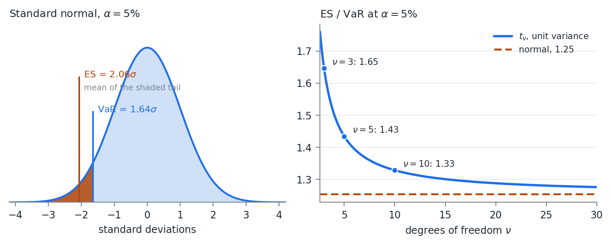{#fig-w05-esvar width=100%}

The left panel of @fig-w05-esvar is the definition. VaR is where the shading starts. ES is the average of what is inside it.

The right panel is why we bother. That fixed 1.25 ratio holds only for the normal. For a $t$ distribution scaled to the same variance the ratio rises as the tail gets heavier -- 1.33 at $\nu = 10$, 1.43 at $\nu = 5$, 1.65 at $\nu = 3$. VaR barely moves across that range because the 5% quantile of a unit-variance $t$ is close to the normal's. ES moves, because it is averaging over the part of the distribution that actually changed.

### Coherence and Convexity

This does not hold for other distributions, but expected shortfall has nice properties.

1. It is a coherent risk measure. That means ES is subadditive, like standard deviation, but unlike VaR.
2. Expected shortfall forms a convex surface when VaR does not. This means that optimizing based on ES is easier.

Coherence is a defined term. Artzner, Delbaen, Eber, and Heath (1999) set out four properties a risk measure $q$ should have, writing losses as positive:

1. Monotonicity. If portfolio $X$ loses at least as much as $Y$ in every state, then $q(X) \geq q(Y)$.
2. Subadditivity. $q(X + Y) \leq q(X) + q(Y)$. Combining positions cannot create risk.
3. Positive homogeneity. $q(\lambda X) = \lambda\, q(X)$ for $\lambda \geq 0$. Doubling the position doubles the risk.
4. Translation invariance. $q(X + c) = q(X) - c$. Adding cash reduces the risk by the amount of cash.

| Property | VaR | ES |
|:--|:-:|:-:|
| Monotonicity | yes | yes |
| Subadditivity | no | yes |
| Positive homogeneity | yes | yes |
| Translation invariance | yes | yes |

: The four coherence properties {#tbl-w05-coherent}

@tbl-w05-coherent is a one row difference, and it is the row from Week 04. The bond example there gave $q(P_1) + q(P_2) = -20$ against $q(P_1 + P_2) = 80$. Run the same example through ES and the inequality holds, because averaging over the tail sees the 0.16% state where both bonds default. VaR never looks past the 5% point.

Property 2 is also what makes property "convex surface" true. A subadditive and positively homogeneous measure is convex in the portfolio weights, so minimizing ES subject to linear constraints is a convex program with one optimum. Minimizing VaR is not, and can have many local minima. Week 07 and Week 08 both build optimizations on this.

### What ES Costs

Expected shortfall has gained in popularity. It gives a loss expectation instead of a minimum like VaR. It is more sensitive to the tails of the distribution than VaR. Fatter tails, meaning more kurtosis, generally mean larger ES, when this is not always the case for VaR.

The Basel framework moved market risk capital from 99% VaR to 97.5% ES for exactly that reason. The two are close under normality -- 97.5% ES is $2.34\sigma$ and 99% VaR is $2.33\sigma$ -- and they separate when the tail is heavy, which is when the number matters.

There is a real cost, and it is worth knowing before recommending ES to anyone.

ES is harder to validate against realized outcomes. VaR has a clean test: count the days the loss exceeded it and compare the count to $\alpha n$. ES has no equivalent, because ES is not elicitable. Gneiting (2011) showed there is no scoring function whose expected value is minimized by the true ES, which is the property a direct backtest needs. Fissler and Ziegel (2016) showed that VaR and ES are jointly elicitable, so ES can be backtested alongside VaR but not on its own.

My opinion: use ES for optimization and for reporting the size of a tail loss, and keep VaR in the report as the thing you can actually backtest. The two cost the same to compute once the distribution is simulated.

## Model Based Simulation {#sec-w05-mbs}

Often we want to simulate from fitted models instead of just a distribution.

$$
y = f(X, \epsilon)
$$

To do this, we have to make distributional assumptions on $X$ and $\epsilon$. The easiest assumption is multivariate normal:

$$
[X\ \epsilon] \sim N(\mu, \Sigma)
$$

### The OLS Case

If $f(X,\epsilon)$ is OLS, then $X$ and $\epsilon$ are independent and $E(\epsilon) = 0$.

$$
y = X\beta + \epsilon
$$

$$
X \sim N\left( \mu_X, \Sigma_X \right), \quad \epsilon \sim N\left( 0, \sigma^2 \right)
$$

$$
[X\ \epsilon] \sim N(\mu, \Sigma), \quad
\mu = \begin{bmatrix} \mu_X \\ 0 \end{bmatrix}, \quad
\Sigma = \begin{bmatrix} \Sigma_X & 0 \\ 0 & \sigma^2 \end{bmatrix}
$$

Read the zeros. $\Sigma_X$ is the $m \times m$ covariance of the regressors, $\sigma^2$ is the scalar residual variance, and the off diagonal blocks are 0 because assumption 3 of OLS says the regressors are uncorrelated with the error. For two regressors the whole matrix is:

$$
\Sigma = \begin{bmatrix}
\sigma_{x_1}^2 & \sigma_{x_1 x_2} & 0 \\
\sigma_{x_1 x_2} & \sigma_{x_2}^2 & 0 \\
0 & 0 & \sigma^2
\end{bmatrix}
$$

We can simulate $[X, \epsilon]$, applying what we have learned previously. This is the Week 03 multivariate draw algorithm with the error term appended to the vector of variables.

In the case of OLS, this model fitting is not needed.

- OLS is a linear function of random normals
- A linear function of random normals is also a random normal
- OLS is the same thing as just using a joint, multivariate distribution on $Y$ and $X$

The conditional distributions section of Week 02 is where that last point comes from. Given a joint normal on $[Y\ X]$, the distribution of $Y$ given $X = a$ is normal with

$$
\bar{\mu} = \mu_Y + \Sigma_{YX}\Sigma_{XX}^{-1}\left( a - \mu_X \right), \qquad
\bar{\Sigma} = \Sigma_{YY} - \Sigma_{YX}\Sigma_{XX}^{-1}\Sigma_{XY}
$$

$\Sigma_{YX}\Sigma_{XX}^{-1}$ is $\hat{\beta}$ and $\bar{\Sigma}$ is the residual variance. The regression was already inside the joint normal.

That equivalence is a check on the machinery rather than a result to use. Fit the regression, simulate the pieces, and you get back the joint normal you could have written down at the start. It stops being true the moment any piece is not normal, which is the whole point of the copula in @sec-w05-copula.

### Several Dependent Variables

What if we have $n$ independent variables?

$$
y_i = f(X, \epsilon_i)\ \ \forall\ i \in [1,n]
$$

Let $\mathcal{E}$ be the matrix collection of $\epsilon_i$ vectors:

$$
\mathcal{E} = \left[ \epsilon_1,\ \epsilon_2,\ \dots,\ \epsilon_n \right]
$$

Then $\mathcal{E}$ is

$$
\mathcal{E} \sim N\left( 0, \Sigma_{\epsilon} \right)
$$

If all $X$ variables are used in each model then:

$$
[X\ \mathcal{E}] \sim N(\mu, \Sigma), \quad
\mu = \begin{bmatrix} \mu_X \\ 0 \end{bmatrix}, \quad
\Sigma = \begin{bmatrix} \Sigma_X & 0 \\ 0 & \Sigma_{\epsilon} \end{bmatrix}
$$

The scalar $\sigma^2$ has become the $n \times n$ matrix $\Sigma_{\epsilon}$. The corner blocks are still 0.

If not all $X$ variables are used in each model, then you have to calculate the full covariance matrix:

$$
[X\ \mathcal{E}] \sim N(\mu, \Sigma), \quad
\mu = \begin{bmatrix} \mu_X \\ 0 \end{bmatrix}, \quad
\Sigma = \operatorname{cov}\left( [X\ \mathcal{E}] \right) =
\begin{bmatrix} \Sigma_X & \Sigma_{X\epsilon} \\ \Sigma_{X\epsilon}' & \Sigma_{\epsilon} \end{bmatrix}
$$

The diagonal elements will be the same, however the off diagonal elements will not necessarily be 0. In practice, it is often easier to just calculate the covariance than to construct the block diagonal matrix.

$\Sigma_{\epsilon}$ is the part that is easy to forget. Each model was fit separately and each residual series is uncorrelated with its own regressors by construction, but the residuals of two different models are not uncorrelated with each other. Two stocks that share an industry exposure the market factor did not capture will have residuals that move together, and setting $\Sigma_{\epsilon}$ diagonal throws that away. Week 09 returns to this as the load bearing assumption of a factor model.

The fact that everything is still normal holds even if there are multiple dependent variables ($Y$) and multiple independent variables ($X$).

### A Distribution Is a Model

Recognize that a distributional assumption about a variable is a model.

For example, assuming $y \sim N\left( \mu, \sigma_{\epsilon}^2 \right)$:

$$
y = f(X, \epsilon) = \mu + \sigma_{\epsilon} z
$$

$$
z \sim N(0,1)
$$

There is no $X$ in that model, which is the point. A variable we simply assume a distribution for and a variable we regress on three factors both end up as a function of an iid error, and the simulation machinery does not distinguish them. That is what lets the next section mix them freely.

## Copulas {#sec-w05-copula}

Often in finance, not all of the data are normally distributed. Some might be close enough, but others are not. There are very few multivariate distributions with well defined properties. We need a way to combine disparate distributions into a single, coherent simulation.

The problem is specific. Fitting a $t$ to one stock and a normal to another is easy. Fitting a joint distribution whose first margin is $t$ and whose second is normal is not, because no standard multivariate family has margins from different families. Everything in Weeks 02 and 03 assumed one $\Sigma$ over one multivariate normal.

Copulas are multivariate cumulative distribution functions whose marginal probability distribution functions are uniform on $[0,1]$. They can be used to combine variables with different assumed distributions.

The mechanism is the inverse CDF method from Week 03, run in both directions. The CDF maps any distribution onto $[0,1]$. The quantile function maps $[0,1]$ back onto any other. Between those two steps the marginal distribution has been stripped out, and what remains is the dependence structure alone.

### Sklar's Theorem

Sklar's theorem forms the basis of copulas.

It states that every multivariate cumulative distribution function of random vector $X$

$$
H\left( x_1, x_2,\ \dots,\ x_n \right) = P\left( X_1 \leq x_1, X_2 \leq x_2,\ \dots,\ X_n \leq x_n \right)
$$

can be expressed in terms of its marginal distributions

$$
F_i\left( x_i \right) = P\left( X_i \leq x_i \right)
$$

and some copula $C$:

$$
H\left( x_1, x_2,\ \dots,\ x_n \right) = C\left( F_1\left( x_1 \right), F_2\left( x_2 \right),\ \dots,\ F_n\left( x_n \right) \right)
$$

Recognize that a CDF $F_i\left( x_i \right) \in [0,1]$.

A copula describes a joint distribution of variables $X$ whose individual distributions are assumed. $F_i()$ does not have to be the same distribution as $F_j()$.

We use the CDF to transform the variables into the range $[0,1]$ and fit the copula.

Sklar's theorem says something stronger than it first appears. Any joint distribution can be split into margins and a copula, and for continuous margins the split is unique. So the choice of copula and the choice of margins are two independent modeling decisions, and getting one right does nothing to protect you from getting the other wrong.

## The Gaussian Copula {#sec-w05-gauss}

There are a number of different copulas. The most common is the Gaussian copula. If you start to work with simulating financial data, looking into other copulas will be beneficial.

Given a correlation matrix $R$, the Gaussian copula is

$$
C_R(X) = \Phi_R\left( \Phi^{-1}\left( F_1\left( x_1 \right) \right), \Phi^{-1}\left( F_2\left( x_2 \right) \right),\ \dots,\ \Phi^{-1}\left( F_n\left( x_n \right) \right) \right)
$$

$\Phi^{-1}(x)$ is the standard normal quantile function.

$\Phi_R(X)$ is the multivariate normal CDF given the correlation $R$.

These are all functions we have worked with, and it makes it very simple to fit $R$.

Note what the Gaussian copula does and does not assume. The dependence structure is the one a multivariate normal would have. The marginal distributions are whatever we fit, and they are not normal.

### Fitting the Copula

1. For each variable $i \in 1 \dots n$:
    a. Transform the observation vector $X_i$ into a uniform vector $U_i$ with $u_i \in [0,1]$ using the CDF for $x_i$, $F_i\left( x_i \right)$.
    b. Transform the uniform vector $U_i$ into a standard normal vector $Z_i$ using the normal quantile function.
2. Calculate the correlation matrix of $Z$.

When calculating $Z$, it is generally better to use Spearman correlations. We are often dealing with distributions with large outliers, and Spearman is a more robust correlation measure with outliers.

Spearman correlation for reference:

$$
r_s = \rho_{R(x),R(y)} = \frac{\operatorname{cov}(R(x),R(y))}{\sigma_{R(x)} \sigma_{R(y)}} = \frac{\sum_{i=1}^{n}\left( R\left( x_i \right) - \overline{R(x)} \right)\left( R\left( y_i \right) - \overline{R(y)} \right)}{\sqrt{\sum_{i=1}^{n}\left( R\left( x_i \right) - \overline{R(x)} \right)^2} \sqrt{\sum_{i=1}^{n}\left( R\left( y_i \right) - \overline{R(y)} \right)^2}}
$$

Where:

- $\rho_{x,y}$ is the Pearson coefficient of $x$ and $y$
- $R(x)$ is the rank function
- $\overline{R(x)}$ is the average of the rank function

Because Spearman uses rank correlations and the quantile function is monotonic, we can skip step 1.b, calculating the $Z$ values, and calculate Spearman correlations from the $U$ matrix.

That shortcut works because ranks survive any monotone transform. $F_i$ is monotone and $\Phi^{-1}$ is monotone, so the ranks of $X$, of $U$, and of $Z$ are identical, and a statistic computed from ranks cannot tell them apart. Week 02 made the same point with $y = x^3$.

$R$ must be PSD before it can be used to simulate. On complete data it will be. Spearman is Pearson computed on rank vectors, and a Pearson matrix built from complete data is PSD by the same argument as any covariance matrix. Missing data is where that breaks, for Spearman exactly as it did for Pearson in Week 03, and the repairs there apply here unchanged.

### Simulating from the Copula

Once the copula is fit, we use the multivariate normal simulation techniques we learned previously. This generates correlated standard normals. We go backwards through the transform in the previous section to arrive at the simulated values of $X$.

1. Simulate $NSim$ draws from the multivariate normal.
2. For each variable $Z_i \in 1 \dots n$:
    a. Transform $Z_i$ into a uniform variable using the standard normal CDF, $\Phi\left( z_i \right) = U_i$.
    b. Transform $U_i$ into the fitted distribution using the quantile of the fitted distribution, $F_i^{-1}\left( U_i \right) = X_i$.

Step 2.b is where the fitted marginals come back. The correlated normals produced in step 1 are a scaffold, and nothing about the final simulated values is normal unless $F_i$ was normal to begin with.

### Tail Dependence

The Gaussian copula has one failure mode worth naming, because it is not obvious and it is not small.

Tail dependence is the probability that one variable is extreme given that another is:

$$
\lambda_L = \lim_{u \to 0^+} P\left( U_1 \leq u\ |\ U_2 \leq u \right)
$$

For the Gaussian copula, $\lambda_L = 0$ for every $\rho < 1$. Far enough into the tail, the variables become independent. Fit $\rho = 0.9$ and the model still says that a sufficiently extreme loss in one asset tells you nothing about the other.

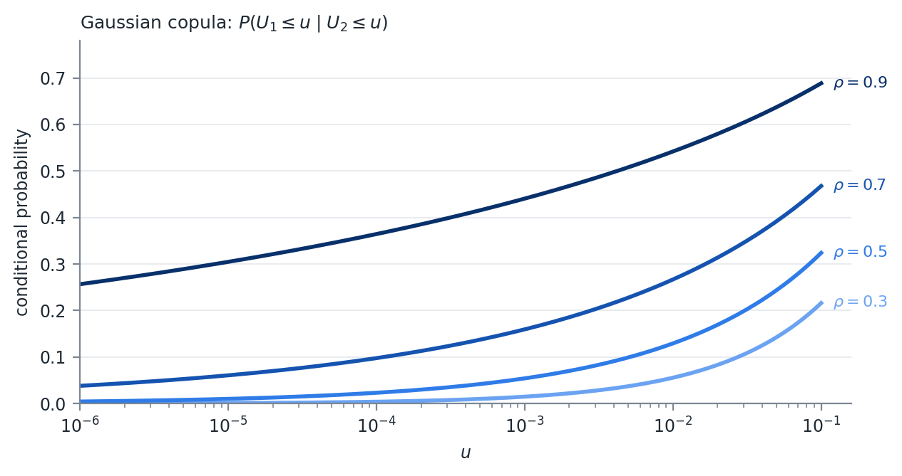{#fig-w05-jointex width=95%}

@fig-w05-jointex is that limit in progress. At $\rho = 0.7$, a 5% day in one asset means a 39% chance of a 5% day in the other, which sounds reasonable. Go to a 0.1% day and it is 16%. Go to a 0.001% day and it is 6%, still falling, on its way to 0.

Whether that matters depends entirely on what the simulation is for. It does not change a portfolio's variance and it barely moves a 5% VaR. It changes the probability that many positions lose together on the same day, which is the event a risk manager is paid to worry about.

The Gaussian copula took a great deal of blame after 2008, mostly through Li (2000), which used it to price correlated defaults in CDO tranches. My opinion: the criticism is fair as far as the tail dependence goes and unfair as an explanation of the crisis. A model that assumes defaults become independent in the extreme is the wrong model for a senior tranche, and that is a real defect. It is not the reason anyone bought the tranche.

Other copula families do not have this property. The $t$ copula is the same construction with a $t$ CDF in place of $\Phi$, and it has positive tail dependence controlled by its degrees of freedom. Archimedean copulas, including Clayton, Gumbel, and Frank, are built from a generator function rather than from a multivariate distribution, and can be asymmetric between the upper and lower tails. Vine copulas build a high dimensional dependence structure out of a tree of bivariate ones.

We are not covering any of them. The $t$ copula alone would require the multivariate $t$, which Week 02 did not cover. Investigate them on your own if you are going to simulate financial data seriously, and start with the $t$ copula, since fitting it is the smallest step from what we have already done.

## Putting It Together

Example problem.

- Calculate VaR on a portfolio holding 1 share of each stock in `DailyPrices.csv`.
- Model prices as a linear function of SPY with $t$ distributed errors.
- Model SPY as normally distributed.
- Assume all stocks and SPY have 0 expected return.
- Calculate VaR for each stock as well as the total portfolio.

Every piece of that is in this week. The regressions and their residual covariance are @sec-w05-mbs. The mixed distributional assumptions, normal for SPY and $t$ for the errors, are what forces a copula in @sec-w05-gauss. Simulating the copula and repricing the portfolio is Week 04's Monte Carlo VaR with a non-normal draw. Report ES alongside VaR from the same simulated vector, since it costs one more line.

# Week 06 — Options

## Time Value of Money

Modern finance is predicated on the concept of "Time Value of Money" (TVM). TVM is simply the fact that \$1 today is worth more than a guaranteed \$1 at a future time.

Would you loan someone \$100 with a promise to pay \$100 back in 1 year?

At a minimum, there is an economic opportunity cost to forgoing money until a later date. In the presence of inflation, where purchasing power drops over time, there is a real economic cost as well.

Everything in this week is a discounting problem wearing different clothes. An option is a payoff that arrives later and whose size is not known yet, so the apparatus that follows exists to answer two questions at once -- what the payoff will be on average, and what that average is worth today.

### The Risk Free Rate

If money is worth more now than later, then we need a concept of a discount factor, or rate, that equates money now with money later.

The rate at which money can be borrowed or lent, without risk, is called the risk free rate:

$$
P_{t+1} = P_t(1 + r_{rf})
$$

Generally when discussing the risk free rate, this is the rate that the government or banks can borrow or lend short term, overnight. It represents the 1 day risk free rate. This is generally quoted as an annual rate. Compounding rules differ by market.

### Arbitrage

We use interest rates as a discounting mechanism. If you know, without a doubt, that you will receive $\$X$ at some future time $t$, what is that worth now?

To understand what that value is, we need to understand arbitrage. Arbitrage is the ability to make a return, in excess of the risk free rate, without taking any risk.

For example, if student A will buy 1 BTC from me for \$50,000 and another student, B, will sell me 1 BTC for \$30,000, I can buy from B and sell immediately to A, making \$20,000.

In this example, I made a 67% return, $\frac{20,000}{30,000}$. I did this instantaneously, so regardless of what the risk free rate was, the rate for zero time is always 0%, and $67\% > 0\%$.

Another example. Student A agrees to buy 1 BTC from me in 1 year for \$50,000. Student B will sell me 1 BTC today for \$30,000. I can buy a 1 year government bond with a rate of 1%. I still make a 67% return, but now the risk free rate is 1%. If there was no chance of Student A failing to do the deal, which is credit risk, then this is arbitrage.

The example above is a forward agreement.

Arbitrage is free money.

When arbitrage exists, market actors are incentivized to take action and pick up the free money. This change in supply and demand causes pricing to shift toward a state where there is no arbitrage.

> "All pricing problems in finance can be described as, 'find the no-arbitrage condition'" -- some old finance professor

### Present and Future Value

Present value is the current value of some asset. We find this by discounting the cash flows from that asset using an interest rate. For risky assets, we take the risk free rate and add a risk premium to it.

$$
DiscountRate = RiskFreeRate + RiskPremium
$$

How to come up with the risk premium is the subject of another class. Just understand that it exists. There can be multiple premiums for different risks added.

The question at the top of the section was, if you know without a doubt that you will receive $\$X$ at some future time $t$, what is that worth now?

Here this is a risk free asset. We know with 100% certainty we will receive $\$X$ at time $t$. There is no risk premium, so the discount rate is equal to the risk free rate.

$$
DiscountRate = RiskFreeRate + 0
$$

Assume the risk free rate is quoted as a continuously compounded annual return, and $t$ is in years. Present value is the discounted value of the cash flow:

$$
PV = Xe^{-rt}
$$

Why? If I invested $PV$ into a government bond now, its future value would be

$$
FV = PVe^{rt}
$$

I would receive $FV$ at time $t$. If $FV \neq X$, then there is an arbitrage opportunity.

If our asset was a bond that paid cash flows $X_i$ at times $i \in [1,2,\dots,t]$, then

$$
PV = \sum_{i=1}^{t} X_i e^{-ri}
$$

If the discounting rate is instead compounded discretely, on an $N$ times per year basis, then the formula would be

$$
PV = \sum_{i=1}^{t} \frac{X_i}{\left( 1 + \frac{r}{N} \right)^{N i}}
$$

Recognize that

$$
\lim_{N \to \infty} \frac{1}{\left( 1 + \frac{r}{N} \right)^{N}} = e^{-r}
$$

Continuous compounding is a convenience rather than a description of any market, since nothing actually pays interest an infinite number of times per year. It survives because it makes the algebra close, which is why every option formula in this week is written in terms of $e^{-rT}$ rather than a discrete compounding factor.

## Derivatives and Hedging

Derivatives are financial contracts whose value is derived from an underlying asset or reference. That reference can be a stock, a bond, a commodity, an interest rate, a currency, or an index. Common derivatives include forwards and futures, swaps, and options.

What makes derivatives useful is that they let a participant reshape an exposure without buying or selling the underlying. A producer of jet fuel does not need to stockpile fuel to manage price risk. A portfolio manager can change equity market exposure in one trade using index futures rather than touching every stock in the book.

### Hedging and Speculation

Hedging is reducing risk from an existing exposure. If you are vulnerable to a particular adverse move -- a stock falling, rates rising, a currency weakening -- you take an offsetting position that gains when the original position loses.

The same instruments are used for speculation, which is taking a position to profit from a forecast about direction, volatility, or relative pricing.

Whether a position is a hedge or a speculation depends on what else you hold. A put bought by an investor who owns the shares is a hedge. The same put bought by someone with no position in the stock is a speculation. A company using currency forwards to stabilize future cash flows is hedging. A trader using the same forwards to bet on the exchange rate is speculating. The contract does not know the difference.

That distinction is the economic purpose of derivatives. They transfer risk and put a price on it. Hedgers pay to reduce uncertainty, through the option premium or a less favorable forward price. Speculators accept the risk in exchange for that payment.

### Inherent Leverage

Inherent leverage means you control a large amount of underlying exposure for a small upfront cash outlay, sometimes none at all. Small moves in the underlying become large percentage moves on the derivative position.

Hedgers and speculators therefore do not have to put up much cash to build a position. That is what makes derivatives efficient, and it is the same property that makes them dangerous. Selling options is the case to watch, because the loss is not bounded by what was posted.

## Options

An option is the right, but not the obligation, to exchange at a later date at a determined price. Any time you see a contract where someone has the ability to decide to transact at a later date, that is an option.

> "All options have value." -- another old finance professor

### Where Options Appear

The stock option is the classic example, and it is far from the only one.

1. Stock option. The ability to buy or sell a stock at a given price at some future date.
2. Loans with no prepayment penalty. US mortgages, auto loans, and similar. A customer can hand the lender the remaining principal of the loan at any time. This has positive value when a borrower can refinance at a lower rate, lowering their payment but keeping the amount owed the same.
3. Callable bonds. Corporate borrowers sometimes issue callable bonds that allow them to pay the face value plus some premium to retire the debt. This can generally only happen on set dates. When rates fall, corporations call their bonds and issue new bonds at the lower rate. The same as item 2, but for corporations and with set dates.
4. Puttable bonds. Some corporate bonds are puttable, meaning the lender, who owns the bond, can force the corporation to buy back the bond at face value minus some premium. When rates rise, bond buyers will do this in order to invest their capital at higher rates.
5. Convertible bonds. Convertible bonds allow the owner of the bond to convert it to common stock at a set price on certain dates.
6. Auto leases. In the US, you can lease a car for a set period. At the end of that period you can buy the car for a predetermined price or give it back to the dealer.

Items 2 through 6 are not traded as options, and they are frequently not priced as options by the party who wrote them. That gap between what was sold and what was actually given away is where a great deal of money has been made and lost.

### Terms

The security whose price determines the payoff of the option is called the **underlying**. The option's value is derived from the value of the underlying, among other parameters. This is why we call options a derivative.

The price at which the underlying can be bought or sold is called the **strike**. If I buy an Apple option that allows me to buy 1 share of stock at \$100 in 1 year, then the strike is \$100.

The option to purchase something in the future is a **call**. If I buy an Apple option that allows me to buy 1 share of Apple stock in 1 year at a strike of \$100, then I have bought a call.

The option to sell something in the future is a **put**. If I buy an Apple option that allows me to sell 1 share of Apple in 1 year at a strike of \$100, then I have bought a put.

When an option is used, it is called the **exercise**. When you exercise a call option, you buy the contracted amount at the contracted price.

**Maturity or Expiration Date** is the date on which the option contract expires. The option cannot be exercised after this date and the contract is over.

**Time to Maturity** -- the time, usually expressed as a fraction of a year, until the maturity date of the option.

### Exercise Styles

Options that can only be exercised at the maturity date are called **European Options**. In the US, most options on indexes such as the S&P 500 are European options.

Options that can be exercised at any time are called **American Options**. Most options on single name equities are American options.

Options that can be exercised at certain dates between the start and end of the contract are called **Bermuda Options**. Bermuda is an island roughly halfway between the Americas and Europe. That is how these options got their names.

**Asian Options** set either the strike price or the underlying price by some averaging mechanism. This averaging lowers the volatility and the ability to manipulate prices. Energy and some commodity options use this. Asian options tend to be cash settled.

There are many other types of options that vary in how they are exercised.

The style determines how hard the option is to value. European is the only one of the four with a closed form solution, and every case in this course that requires a tree requires it because of the exercise style rather than because of anything about the underlying. Week 07 takes up the American case.

### Settlement

**Physical Settlement** occurs when at option exercise the underlying asset is exchanged. US stock options are physically settled. If you exercise the option, you either are given shares or have to deliver shares.

**Financial (or Cash) Settlement** occurs when the difference between the strike and underlying price is delivered instead of the underlying asset. US index options are usually cash settled.

**Implied Volatility** -- the value of an option depends on the range of possible outcomes at exercise. This implies there is some probability distribution to prices. While we cannot directly observe the market's expectation of the forward price volatility, we can observe option prices. We can back out the market implied volatility from an option pricing function and the option price.

### Payoffs and Moneyness

The **payoff**, or profit, $\pi$, of the option at the time of exercise is the amount of money made when the option is exercised.

The payoff for a call option is

$$
\pi = \max(0,\ S - X)
$$

Where $S$ is the underlying price and $X$ is the strike price.

- If the value of the underlying is greater than the strike price, $S > X$, then I can buy the underlying, spending $X$, and sell it for $S$. My profit is $S - X$.
- If the value of the underlying is less than the strike price, $S < X$, then I do nothing. It does not make sense to buy a stock for $X$ when I could buy it for $S$ where $S < X$.

The payoff of a put option at the time of exercise is

$$
\pi = \max(0,\ X - S)
$$

- If the value of the underlying is less than the strike price, $S < X$, then I can buy the underlying for $S$ and sell it back for $X$.
- If the value of the underlying is greater than the strike price, $S > X$, then I do nothing.

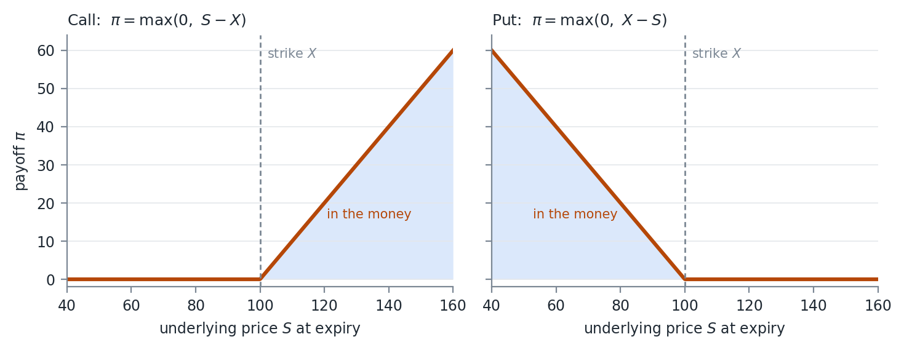{#fig-w06-payoffs width=100%}

The kink at the strike in @fig-w06-payoffs is the whole difficulty of this week. It is the point where the payoff function stops being linear, and that non-linearity is why the Delta Normal VaR of Week 04 fails on a book of options, why the second derivative gets a name of its own in Week 07, and why a tree or a simulation is needed wherever a closed form is not available.

If the strike price and underlying price are close together, the option is said to be **At the Money (ATM)**. If the payoff for the option, assuming immediate exercise, is positive, the option is said to be **In the Money**. If the payoff of the option, assuming immediate exercise, is 0, then the option is said to be **Out of the Money**.

The degree to which an option is in or out of the money is called **Moneyness**.

## Option Valuation {#sec-w06-valuation}

So how do we put a value on an option?

In general, we need the present value of the average of the payoff function at exercise.

Assume that $f(S)$ is the PDF of the distribution of the underlying price at the exercise time $t$. Then the value of the option would be

$$
Value = e^{-rt} \int_{0}^{\infty} \pi\, f(S)\, dS
$$

Read that as two separate operations. The integral is an expected payoff under an assumed distribution, and the $e^{-rt}$ in front of it discounts that expectation back to today. Everything else in this section is a different way of doing the same integral, and the differences between the methods are entirely about how the distribution of $S$ is obtained.

### A Worked Example

Value a European call option with:

- Underlying price = 100
- Strike price = 100
- 125 days until maturity
- 255 trading days in a year
- Risk free rate of 5%
- Implied volatility of 20%

Further assume prices are lognormally distributed.

First, find the volatility to maturity.

$$
dailyVol = \frac{0.2}{\sqrt{255}} = 1.252\%
$$

$$
\sigma = dailyVol \cdot \sqrt{125} = 14\%
$$

Next find the mean expected price.

$$
Y \sim LN(\mu,\sigma) \Rightarrow E(Y) = e^{\mu + \frac{\sigma^2}{2}}
$$

$$
E\left( P_t \right) = P_0 e^{ttm \cdot r + \frac{\sigma^2}{2}}
$$

Where $ttm$ is the time to maturity, $\frac{125}{255}$.

$$
\mu = \ln\left( P_0 \right) + ttm \cdot r
$$

We grow the asset by the risk free rate. This is part of the no arbitrage condition.

However, we do not want the volatility term to change this. So we set the $\mu$ for the lognormal distribution to remove this.

$$
\mu = \ln\left( P_0 \right) + ttm \cdot r - \frac{\sigma^2}{2} = \ln(100) + \frac{125}{255}(0.05) - 0.0098 = 4.6199
$$

That correction is worth pausing on. The mean of a lognormal carries a $\frac{\sigma^2}{2}$ term, so if we left $\mu$ alone then raising the assumed volatility would raise the expected price and manufacture an arbitrage out of nothing. Subtracting the same term inside $\mu$ leaves the expected price at $P_0 e^{rT}$ for any $\sigma$ we choose.

The price of the call option is then

$$
Value = e^{-\frac{125}{255}(0.05)} \int_{0}^{\infty} \max(0,\ S - 100) \left[ \frac{1}{S\sqrt{2\pi\sigma^2}} e^{-\left( \frac{\left( \ln(S) - \mu \right)^2}{2\sigma^2} \right)} \right] dS
$$

$$
Value \approx 6.8089
$$

This integral has to be solved numerically. In the case of a European option, there is a closed form solution.

### Black Scholes Merton

Fischer Black and Myron Scholes published a paper in 1973 setting up a second order partial differential equation that had to hold for the no arbitrage condition, via a replicating portfolio of continuous delta hedging, consistent with the Capital Asset Pricing Model. Robert Merton published a paper shortly after with the same derivation.

Scholes and Merton were awarded the Nobel Prize in Economics in 1997 for this work. Fischer Black had passed away from cancer in 1995 and the Nobel Prize committee does not care about dead people.

There were a number of papers that take the same equation and modify it for different underlying markets.

1. Black Scholes 1973. Options on non-dividend paying equities. The solution equals the integral in the example above.
2. Merton 1973. Options on equities paying a continuously compounded dividend. $\mu$ is updated to include the dividend accrual.
3. Black 1976. Options on futures. Futures prices are quoted in future value, so $\mu$ is updated such that the price does not grow.
4. Garman and Kohlhagen 1983. Options on FX. Here the risk free rate of the foreign currency needs to be taken into account.

### The Generalized Form

All of these, plus some other cases, can be generalized into a single formula.

- $S$ -- underlying price
- $X$ -- strike price
- $T$ -- time to maturity
- $\sigma$ -- implied volatility
- $r$ -- risk free rate
- $b$ -- cost of carry
- $\Phi()$ -- the normal CDF

$$
d_1 = \frac{\ln\left( \frac{S}{X} \right) + \left( b + \frac{\sigma^2}{2} \right)T}{\sigma\sqrt{T}}
$$

$$
d_2 = d_1 - \sigma\sqrt{T}
$$

$$
Call = Se^{(b-r)T}\Phi\left( d_1 \right) - Xe^{-rT}\Phi\left( d_2 \right)
$$

$$
Put = Xe^{-rT}\Phi\left( -d_2 \right) - Se^{(b-r)T}\Phi\left( -d_1 \right)
$$

| Cost of carry | Model | Underlying |
|:--|:--|:--|
| $b = r$ | Black Scholes 1973 | Equities with no dividends |
| $b = r - q$ | Merton 1973 | Equities paying a continuous dividend rate $q$ |
| $b = 0$ | Black 1976 | Futures |
| $b = r - r_{ff}$ | Garman and Kohlhagen 1983 | FX, where $r_{ff}$ is the foreign risk free rate |

: One formula, four models, set by the cost of carry {#tbl-w06-carry}

@tbl-w06-carry is why we write the generalized form rather than four separate ones. The four papers differ in what the underlying does to itself while you hold the option, and that is entirely captured by $b$.

This is equivalent to updating the integral's formula for $\mu$ to:

$$
\mu = \ln\left( P_0 \right) + ttm \cdot b - \frac{\sigma^2}{2}
$$

The underlying asset grows at rate $b$, the cost of carry.

### Monte Carlo

When the limiting distribution of the final price is unknown, you can always use a Monte Carlo simulation.

1. Simulate prices through time for $N$ iterations.
2. Evaluate the payoff function at the final time.
3. Take the average of the payoff function values across the simulations.
4. Discount that value back to the present value.

Those four steps are the integral at the top of this section, evaluated by sampling instead of by quadrature. Week 03 built the machinery for the draws and Week 05 gave us the tools to draw from something other than a normal, so the only genuinely new part here is step 2, which is the payoff function.

### Value Against Payoff

For a European call on a non-dividend-paying stock, the value of the option is always greater than the payoff function prior to maturity. This premium to the payoff decays with time, called theta decay, until maturity, when the option value equals the payoff function.

$$
Call\ Value_t > \pi_t \ \ \ \forall\ t > 0
$$

This does NOT hold for puts. A deep in-the-money European put can be worth less than its payoff function. The holder of a put receives the strike, $X$, but only at maturity, so that strike has to be discounted.

As the underlying goes to 0, the European put converges to $Xe^{-rT} - S$, while the payoff function is $X - S$. The put therefore sits below its payoff by $X\left(1 - e^{-rT}\right)$ -- the interest on the strike.

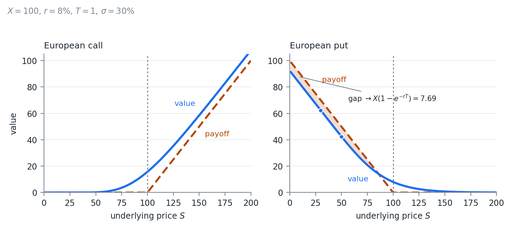{#fig-w06-valpay width=100%}

Example. $X=100$, $r=8\%$, $T=1$, $\sigma=30\%$. At $S=50$ the European put is worth $42.46$ against a payoff of $50.00$. At $S=30$ it is worth $62.31$ against a payoff of $70.00$. Both points are marked in the right panel of @fig-w06-valpay, and the shaded region is the gap, which converges to $X(1-e^{-rT}) = 7.69$.

This gap is exactly what makes early exercise of an American put valuable. We will pick that up next week.

## Put Call Parity

First described at the turn of the 20th century by Higgins (1902) and Nelson (1904), put call parity describes a fundamental relationship between the price of a European put and a call on the same underlying, at the same strike price, and with the same maturity.

$$
C + Xe^{-rT} = P + S
$$

This holds as a no arbitrage condition, assuming the underlying can be easily shorted, you can lend and borrow at the risk free rate, and there are no transaction costs.

- $C$ -- the price of the call
- $Xe^{-rT}$ -- the present value of the strike price
- $P$ -- the price of the put
- $S$ -- the current price of the underlying

Each term is a transaction we can make, and putting them together gives us replicating portfolios for both a call and a put.

A replicating portfolio is a series of transactions we can do now that mirror the payoff of another portfolio. If the two portfolios have the same payoffs, then their value today should be equal. Otherwise I can buy one and sell the other and lock in an arbitrage profit.

Rearranged, the relationship reads

$$
C = P + S - Xe^{-rT}
$$

Show this must hold.

| Transaction | $t=0$ | $t=T$, $S_T > X$ | $t=T$, $S_T \leq X$ |
|:--|--:|--:|--:|
| Buy C | $-C$ | $S_T - X$ | $0$ |

: Cash flows from buying the call {#tbl-w06-buycall tbl-colwidths="[31,23,23,23]"}

| Transaction | $t=0$ | $t=T$, $S_T > X$ | $t=T$, $S_T \leq X$ |
|:--|--:|--:|--:|
| Buy P | $-P$ | $0$ | $X - S_T$ |
| Buy stock | $-S_0$ | $S_T$ | $S_T$ |
| Borrow PV of X | $Xe^{-rT}$ | $-X$ | $-X$ |
| **Total** | $Xe^{-rT} - P - S_0$ | $S_T - X$ | $0$ |

: Cash flows from the replicating portfolio {#tbl-w06-replicate tbl-colwidths="[31,23,23,23]"}

Compare the Total row of @tbl-w06-replicate to the single row of @tbl-w06-buycall. The two tables use the same columns, so read them straight down. In both future states of the world, buying the call gives the same payoff as buying a put, buying the stock, and taking out a loan. If the two cost different amounts today, the arbitrage is available in whichever direction is cheaper.

Parity is also the cheapest data quality check you have. Take a call and a put on the same underlying, strike, and maturity, compute both sides of the relationship, and if they disagree by more than the bid-ask spread then one of the two prices is stale or one of the contract terms in your database is wrong.

## Binomial Trees

Binomial trees provide a way to value options with path dependencies. They were first published in 1979 by Cox, Ross, and Rubinstein.

A binomial tree is a recombining tree structure that discretely approximates geometric Brownian motion. If taken to its limit with an infinite number of small steps, it converges to Brownian motion.

Recommended reading: Chapter 13 of Hull, *Options, Futures, and Other Derivatives*, 11th edition, starting page 266.

### One Step

You own a European call option with a strike of \$100. The current share price of the stock is \$100. The risk free rate is 5%. The time to maturity is 1 year. Using a 1 step binomial tree, approximate the value of the option.

In this tree we say the binomial states of the world are either the stock gains 10% or loses 10%. The 10% is arbitrarily chosen for now. If this is the case, the value of the call at expiration is either \$10 or \$0.

{#fig-w06-tree1 width=70%}

@fig-w06-tree1 has two terminal nodes and nothing in between, which is as small as a tree gets and still says something.

What is the value of the call today? The intuitive answer is a probability weighted average of the final states discounted to present value.

$$
C_0 = e^{-0.05}\left( p \cdot 10 + (1-p) \cdot 0 \right)
$$

### Risk Neutral Probability

Finding the value of $p$ requires us to go back to the risk neutral framework used in the option valuations above. This is the probability, in the risk neutral world and not the real world, of the up move in price.

$$
u,\ d = \text{price multiplier in the (positive, negative) case}
$$

$$
p = \frac{e^{b \Delta t} - d}{u - d}, \qquad (1-p) = \frac{u - e^{b \Delta t}}{u - d}
$$

The book walks you through the proof.

Here we use the cost of carry, $b$, instead of the risk free rate to be consistent with our generalized Black Scholes model.

What is interesting, and what was proved long ago, is that we do not need real probabilities of the moves. The risk neutral assumption gives the same option value as if we used appropriate probabilities and non-risk-free discount rates.

Back to the example. With one step, $\Delta t = T = 1$:

$$
p = \frac{e^{0.05} - 0.9}{1.1 - 0.9} = \frac{0.1513}{0.2} = 0.7564
$$

$$
C_0 = e^{-0.05}\left( 0.7564 \cdot 10 + 0.2436 \cdot 0 \right) \approx 7.20
$$

### Adding Volatility

The missing piece is how to incorporate volatility. The $u$ and $d$ values are chosen as

$$
u = e^{\sigma\sqrt{\Delta t}}, \qquad d = e^{-\sigma\sqrt{\Delta t}}
$$

Where

$$
\Delta t = \frac{T}{N}
$$

$N$ is the number of steps in the tree and $T$ is the time to maturity, expressed in years.

Note that $ud = 1$. That is what makes the tree recombine, since an up move followed by a down move returns to exactly the starting price, and it is the reason an $N$ step tree has $N+1$ terminal nodes rather than the $2^N$ a non-recombining tree would produce. At $N = 50$ that is the difference between 51 nodes and a number with 16 digits in it.

### Two Step Example

$T = 1$, $N = 2$, $S = 100$, $r = b = 0.05$, and $\sigma = 0.1$.

Note that $\sigma$ here is an annual volatility. In the first example we started from a 20% annual volatility and converted it to a 14% volatility to maturity, so the two are not directly comparable.

Then

$$
u = e^{0.1\sqrt{0.5}} = 1.073271, \qquad d = e^{-0.1\sqrt{0.5}} = 0.931731
$$

$$
p = \frac{e^{0.05 \cdot 0.5} - 0.931731}{1.073271 - 0.931731} = 0.6612
$$

The general form of the recombining 2 step tree is shown in @fig-w06-tree2.

{#fig-w06-tree2 width=90%}

There are 3 states of the world to consider.

1. The Up/Up case has a final stock value, probability, and call value:
    a. $S_T = Su^2 = 115.19$
    b. $p_T = p^2 = 0.4372$
    c. $C_T = \max(0,\ S-X) = 15.19$
2. The Up/Down and Down/Up case can be reached through 2 paths:
    a. $S_T = Sud = 100$
    b. $p_T = 2p(1-p) = 0.4480$
    c. $C_T = 0$
3. The Down/Down case has values:
    a. $S_T = Sd^2 = 86.81$
    b. $p_T = (1-p)^2 = 0.1148$
    c. $C_T = 0$

The approximate value of the call option is then

$$
C \approx e^{-0.05}\left( 15.19 \cdot 0.4372 + 0 + 0 \right) = 6.32
$$

Using the BSM model, the exact value of the call option is \$6.80.

The 2 step tree is a coarse approximation. It is off by roughly \$0.49 here. The tree converges to the BSM value as $N$ increases: $N=10$ gives $6.70$, $N=50$ gives $6.78$, $N=200$ gives $6.80$, and $N=1000$ gives $6.8039$, against the closed form $6.8050$. Use enough steps.

### The General N Step Tree

If we generalize the binomial tree out to $N$ steps, then we have $N+1$ terminal nodes.

For each node $i \in 0 \dots N$:

$$
S_{T,i} = S u^{i} d^{N-i}
$$

$$
p_{T,i} = p^{i}(1-p)^{N-i}
$$

$$
nPaths = \frac{N!}{i!(N-i)!}
$$

Where $nPaths$ is the number of pathways that arrive at node $i$.

Therefore the final value of the option is

$$
Value = e^{-rT}\sum_{i=0}^{N} \left( \frac{N!}{i!(N-i)!} \right) p^{i}(1-p)^{N-i}\, \pi\left( S u^{i} d^{N-i} \right)
$$

That expression is a binomial distribution over terminal prices, and as $N$ grows the Central Limit Theorem takes it to the lognormal of @sec-w06-valuation. The tree and the closed form are the same model at different resolutions.

Nothing in that formula requires the option to be European. It sums over terminal nodes only, so it prices the European case. Working backwards through the tree node by node instead, and taking the larger of the continuation value and the exercise payoff at each node, prices the American case. That is Week 07.

## Implied Volatility

So far, we have used the implied volatility as an input. However, the market priced volatility is not directly observable. Instead we have to solve for it using our option valuation routine and the observed market price.

The valuation formula is monotone in $\sigma$ -- more volatility is always more option value -- so the inverse exists and is unique. Any root finder will locate it.

Example. The observed option price is \$6. There are 125 days until maturity, 255 days in a year. The risk free rate is 5%. The strike on the option is \$100 and the current stock price is \$100. What is the implied volatility?

Solution: using the root finder in Julia and the generalized Black Scholes Merton formula, we find the volatility implied by the market price is approximately 17%.

Compare that to the worked example in @sec-w06-valuation, where a 20% volatility on the same option gave a value of \$6.81. A difference of \$0.81 in the price moved the implied volatility by 3 percentage points, which means option prices are a sensitive read on the market's volatility expectation and a noisy one on anything else. That sensitivity is the reason traders quote options in volatility terms rather than in dollars.

# Week 07 — American Options and Portfolio Construction

## American Options

American options allow you to exercise the option at any time up to maturity. This gives the owner more choices about when to exercise. Remember that options have value, so we expect the price of an American option to be greater than or equal to the equivalent European option.

$$
Value_{American} \geq Value_{European}
$$

### When Early Exercise Pays

Exercising early means the investor gives up whatever option value remains and takes the payoff function instead. For a call on a non-dividend-paying stock, the European value is always greater than the payoff function, so this trade is never worth making:

$$
Call\ Value_{American,t} \geq Call\ Value_{European,t} > \pi_t \ \ \ \forall\ t > 0
$$

When the option value exceeds the payoff, the investor is better off selling the option than exercising it. For calls on non-dividend payers this always holds, so an American call on a non-dividend-paying stock is worth exactly the same as the European call.

For a call, this inequality holds unless there are underlying cash flows on the asset. In that case it might make sense to exercise in order to own the underlying and receive the cash flow. If the cash flow plus the payoff is greater than the value of the option, then early exercise makes sense. We work through the dividend case in @sec-w07-div.

Puts are different. As we saw last week, a deep in-the-money European put can be worth less than its payoff function, because the strike is only received at maturity and has to be discounted. That gap is the interest on the strike.

An American put cannot trade there. Arbitrage forces its value to at least the payoff function:

$$
Put\ Value_{American,t} \geq \pi_t \ \ \ \forall\ t
$$

If it traded below, buy the option and exercise it immediately. You pay less than $X - S$ and receive exactly $X - S$, with no risk and no waiting. Anyone can do that, so the price never gets there.

That bound is what the early exercise right is worth. The European put is free to sink below its payoff and does. The American put is held up at the payoff by arbitrage, and the difference between the two is the early exercise premium.

So early exercise of an American put can be optimal even with no dividend at all.

### The Free Boundary

There is no closed form for the American put for exactly this reason. The exercise decision defines a free boundary that has to be solved numerically.

The boundary is a critical stock price $S^*$. For a given time remaining, exercise is optimal when the stock is below $S^*$, and it is optimal to hold above it. For the example below, with $X=100$, $r=8\%$, and $\sigma=30\%$, with $0.25$ years remaining, $S^*$ is about $81.63$.

Two things make the boundary awkward. It is not known in advance, because it comes out of the same backward induction that produces the price, and it moves as the time remaining shrinks. Those two properties together are why the American put has no closed form while the European put does.

A word of caution on the 2 step example that follows. Its early exercise node sits at $S=86.07$, which is *above* the true boundary of $81.63$, so a properly converged model would not exercise there. The coarse tree gets the right qualitative answer for the wrong reason. With this example's parameters the 2 step tree gives $6.4218$, while the converged American value is $6.8662$ against a European value of $6.4670$, so the true early exercise premium is about $0.40$, not the $0.91$ the 2 step tree implies. As always, use enough steps.

### Valuing with a Binomial Tree

American options, as well as Bermuda options, are typically valued using a binomial tree. Here we modify the European binomial tree method from last week.

1. Construct the tree as before.
2. Calculate the underlying price at each node instead of just the final nodes.
3. At the maturity nodes, calculate the value of the option with the payoff function.
4. Using backward induction, check whether it is optimal to exercise the option or to hold the current present value of the option from the nodes after.

$$
P_{i,j} = \max\left( \pi\left( S u^{i} d^{(j-i)} \right),\ e^{-r\Delta t}\left[ p P_{i+1,j+1} + (1-p) P_{i,j+1} \right] \right)
$$

Compare that to the European formula at the end of Week 06, which summed over terminal nodes only. The change is the $\max$, and it is the reason the European case has a closed form and this one does not. A sum can be evaluated. A sequence of $\max$ operations has to be walked.

### Two Step Example

American put, $N=2$, $T=0.5$, $S=100$, $X=100$, $r=b=0.08$, $\sigma=0.3$.

$$
u = e^{0.3\sqrt{0.25}} = 1.1618, \qquad d = e^{-0.3\sqrt{0.25}} = 0.8607, \qquad p = 0.5297
$$

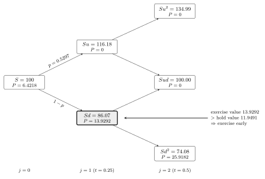{#fig-w07-amput width=100%}

- At $(j=2, i=0)$, the price of the put is just the payoff function. At all other $j=2$ nodes, the value of the put is 0.
- At $(j=1, i=0)$, the price of the put is the maximum of the payoff and the present value of the forward option prices:
    - $\pi = 100 - 86.0708 = 13.9292$
    - $e^{-0.08 \cdot 0.25}\left( 0.5297 \cdot 0 + (1 - 0.5297) \cdot 25.9182 \right) = 11.94907$
    - The option value is then $13.9292$ at this node
- At $(j=0, i=0)$ the price of the put is:
    - $\pi = 100 - 100 = 0$
    - $e^{-0.08 \cdot 0.25}\left( 0.5297 \cdot 0 + (1 - 0.5297) \cdot 13.9292 \right) = 6.4218$

The value of the option is $6.4218$.

@fig-w07-amput marks the exercised node. The early exercise happened at exactly one place in the tree, and it changed the root value because the larger number propagated backwards. That is the whole mechanism, and it is the only difference from last week. Everything else in the tree is the European calculation.

## American Options with Discrete Dividends {#sec-w07-div}

For index options, options on a basket of stocks, the continuously compounded dividend approach we have taken before generally works well. The basket of stocks pay their dividends at different times and they accrue to the index slowly.

However, single stocks pay dividends at a discrete time at a set value, not a rate, causing a discontinuity in the share price. When a dividend is paid, the price of the stock will adjust downward by the amount of the dividend.

### Why the Tree Stops Recombining

That discontinuity causes a problem in the binomial tree. Because the dividend is a set amount, the percentage change in stock price is different for each node. This causes the tree to no longer recombine after the dividend is paid.

Recall from Week 06 that recombination came from $ud = 1$, so an up move followed by a down move returned exactly to the starting price. Subtracting a fixed dollar amount at one date breaks that identity, because the same dollar is a different percentage at each node.

American call, $N=2$, $T=0.5$, dividend of $1.00$ at $t=0.25$, $S=100$, $X=100$, $r=b=0.08$, $\sigma=0.3$.

$$
u = e^{0.3\sqrt{0.25}} = 1.1618, \qquad d = e^{-0.3\sqrt{0.25}} = 0.8607, \qquad p = 0.5297
$$

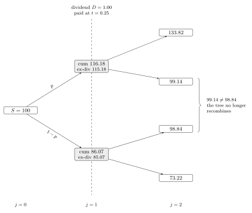{#fig-w07-divtree width=95%}

Each dividend paid at $j = n$ creates $n+1$ new trees. The logic from before holds with a twist. In the case of a call, exercising at $j = n$ gets the holder the value of the stock plus the dividend. In the case of a put, the holder can exercise the put, forgoing the dividend. Either way, the payoff is the same as before, $\pi\left( S_n + D_n \right)$, which is the payoff if the dividend had not occurred.

The cost of @fig-w07-divtree is worth noting. The node count is back to growing like $2^N$ after the dividend date, so a tree with several dividends and a realistic number of steps becomes expensive quickly.

### When Early Exercise Is Optimal

In practice, only call options are exercised early to receive the dividend. Hull, Chapter 15 page 340, shows that exercise is optimal when

$$
D_n > X\left( 1 - e^{-r\left( T - t_n \right)} \right)
$$

Where $t_n$ is the time dividend $D_n$ is paid.

Read the right hand side as the interest earned on the strike between the dividend date and maturity. Exercising early hands over the strike sooner, so the dividend has to be worth more than the interest given up.

Apply that test to the example above. With $D_n = 1.00$, $X = 100$, $r = 8\%$, and $T - t_n = 0.25$, the right hand side is $X\left(1 - e^{-0.08(0.25)}\right) = 1.98$. Since $1.00 < 1.98$, this dividend is too small to justify early exercise. The example is here to show what a discrete dividend does to the geometry of the tree, not to show an optimal early exercise. Raise the dividend above $1.98$ and the call would be exercised at $t_n$.

### Implementing the Non-Recombining Tree

Implementing the non-recombining tree is an exercise in recursion. This method can handle multiple dividends.

1. If there are no dividends during the life of the option, use the recombining tree method previously implemented.
2. Construct the nodes up to the first dividend payment. For each node:
    a. Value no exercise. Recursively call the non-recombining tree with the stock price minus the dividend and any remaining dividends to be paid.
    b. Value exercise. The payoff function with the price before the dividend.
3. Using backward induction, find the value at the starting node.

There are many ways to tackle the problem of discrete cash flows. Binomial trees that allow for non-recombining are the most generic and let you apply the method to many problems.

## The Greeks

Option Greeks, or sensitivities, are the partial derivatives of the pricing function with respect to one of the input variables.

These sensitivities are important because they approximate the change in the option value for changes to the inputs. Changing inputs, such as the underlying price or the implied volatility, cause risk to holding the option. Having a way to judge approximate changes to those inputs allows hedging of options risk.

Delta is the same object as the $\delta$ in Week 04's Delta Normal VaR. The gradient we built there needed the first derivative of every position with respect to every underlying price, and for an option that derivative is the delta below.

### The Main Greeks

The most used Greeks are listed below along with their formula from the generalized BSM formula from last week. This list is not exhaustive. People who trade options or make markets often look at additional cross partial derivatives to understand the risk in their portfolio.

| Greek | Definition | Call | Put |
|:--|:--|:--|:--|
| Delta, $\Delta$ | $\frac{\partial P}{\partial S}$ | $e^{(b-r)T}\Phi(d_1)$ | $e^{(b-r)T}\left( \Phi(d_1) - 1 \right)$ |
| Gamma, $\Gamma$ | $\frac{\partial^2 P}{\partial S^2}$ | $\frac{f(d_1) e^{(b-r)T}}{S\sigma\sqrt{T}}$ | same as call |
| Vega | $\frac{\partial P}{\partial \sigma}$ | $S e^{(b-r)T} f(d_1)\sqrt{T}$ | same as call |
| Rho, $\rho$ | $\frac{\partial P}{\partial r}$ | $T X e^{-rT}\Phi(d_2)$ | $-T X e^{-rT}\Phi(-d_2)$ |
| Carry Rho | $\frac{\partial P}{\partial b}$ | $T S e^{(b-r)T}\Phi(d_1)$ | $-T S e^{(b-r)T}\Phi(-d_1)$ |

: The most used Greeks under the generalized BSM {#tbl-w07-greeks tbl-colwidths="[14,14,32,40]"}

$f(x)$ is the normal PDF and $\Phi(x)$ is the normal CDF. Gamma is also called convexity. The Rho formulas in @tbl-w07-greeks are for Black Scholes, where $r = b$.

Theta is the derivative with respect to time to maturity, $-\frac{\partial P}{\partial T}$. The derivative is negative but is often expressed as a positive number, and it is also called theta decay. The formulas are too long for the table:

$$
\Theta_{call} = -\frac{S e^{(b-r)T} f(d_1) \sigma}{2\sqrt{T}} - (b-r) S e^{(b-r)T}\Phi(d_1) - r X e^{-rT}\Phi(d_2)
$$

$$
\Theta_{put} = -\frac{S e^{(b-r)T} f(d_1) \sigma}{2\sqrt{T}} + (b-r) S e^{(b-r)T}\Phi(-d_1) + r X e^{-rT}\Phi(-d_2)
$$

Two patterns in @tbl-w07-greeks are worth committing to memory. Gamma and vega are identical for a call and a put at the same strike, which follows directly from put call parity, since the difference between the two is $S - Xe^{-rT}$ and that has no second derivative in $S$ and no derivative in $\sigma$ at all. And every formula carries $f(d_1)$ or $\Phi(d_1)$, so a single evaluation of the pricing function produces all of them.

### Hedging Example

A market maker sells 100 call options that expire in 15 trading days for \$2.50. The stock price is \$100.50, the strike price is \$100, the risk free rate is 25bp, and the stock does not pay a dividend. The market maker uses the GBSM model for pricing his options.

What is the 1 day VaR and ES for this position using a simulated normal?

The market maker hedges his position by buying stock equal to negative his delta. What is his new 1 day VaR and ES?

The hedge removes the first order exposure and leaves the second order exposure behind. A short call position is short gamma, so the delta hedged book loses on a large move in either direction, and its VaR does not go to zero no matter how precisely the delta is matched. Compare the two answers rather than just reporting the second one.

### Numerical Derivatives

Not all option valuation routines have closed form derivative solutions. An American option priced on a tree is the obvious case -- there is no formula to differentiate. In the case where an explicit solution is not found, a numerical method should be used. The simplest method is a finite difference. Other methods such as [automatic differentiation](https://en.wikipedia.org/wiki/Automatic_differentiation) may be available and faster or more accurate.

$$
f'(x) \approx \frac{f(x+\Delta) - f(x-\Delta)}{2\Delta}, \qquad \lim_{\Delta \to 0}\frac{f(x+\Delta) - f(x-\Delta)}{2\Delta} = \frac{\partial f}{\partial x}
$$

Given a small enough choice of $\Delta$, the finite difference approximation for the first derivative, assuming a smooth differentiable surface, is close enough.

The drawback is that we have had to evaluate the function 2 times. For some valuation methods, this can be a significant computing cost burden.

Using a backward or forward difference instead of the central difference above reduces the computational burden, but comes at a cost of accuracy.

Forward differencing:

$$
f'(x) \approx \frac{f(x+\Delta) - f(x)}{\Delta}, \qquad \lim_{\Delta \to 0}\frac{f(x+\Delta) - f(x)}{\Delta} = \frac{\partial f}{\partial x}
$$

Assuming we have already evaluated the function $f(x)$ to get the current value of the option, we only need 1 more evaluation.

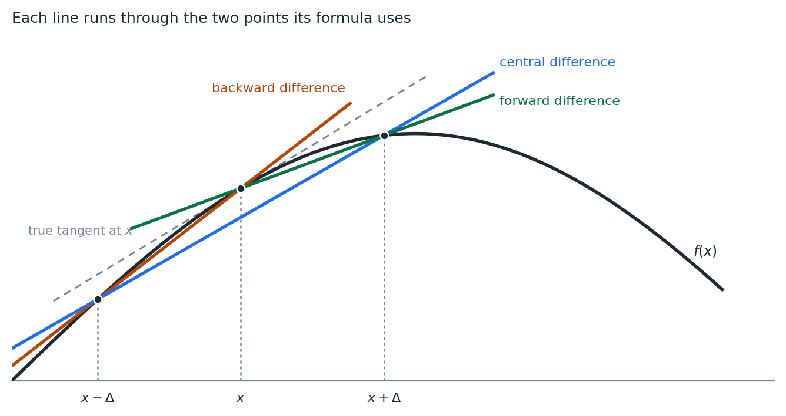{#fig-w07-finitediff width=90%}

@fig-w07-finitediff shows why the central difference is worth the extra evaluation. The forward and backward secants both sit visibly off the tangent, and they miss in opposite directions. The central difference averages the two and the leading error term cancels.

Calculating a second derivative, such as gamma, is simply the first derivative of the first derivative.

$$
f''(x) \approx \frac{\frac{f(x+\Delta) - f(x)}{\Delta} - \frac{f(x) - f(x-\Delta)}{\Delta}}{\Delta} = \frac{f(x+\Delta) + f(x-\Delta) - 2f(x)}{\Delta^2}
$$

Choosing $\Delta$ is a real trade. Too large and the approximation error dominates. Too small and the subtraction in the numerator loses precision, since we are differencing two nearly equal floating point numbers and then dividing by something small. The second derivative divides by $\Delta^2$, which makes it considerably more sensitive to that choice than the first.

## Portfolio Construction

Portfolio construction is the art of balancing expected return against expected risk in a portfolio.

Higher expected returns generally require taking higher risks.

### The Efficient Frontier

Every combination of the assets available to us produces a pair -- an expected return and a risk. Plotting all of them fills a region.

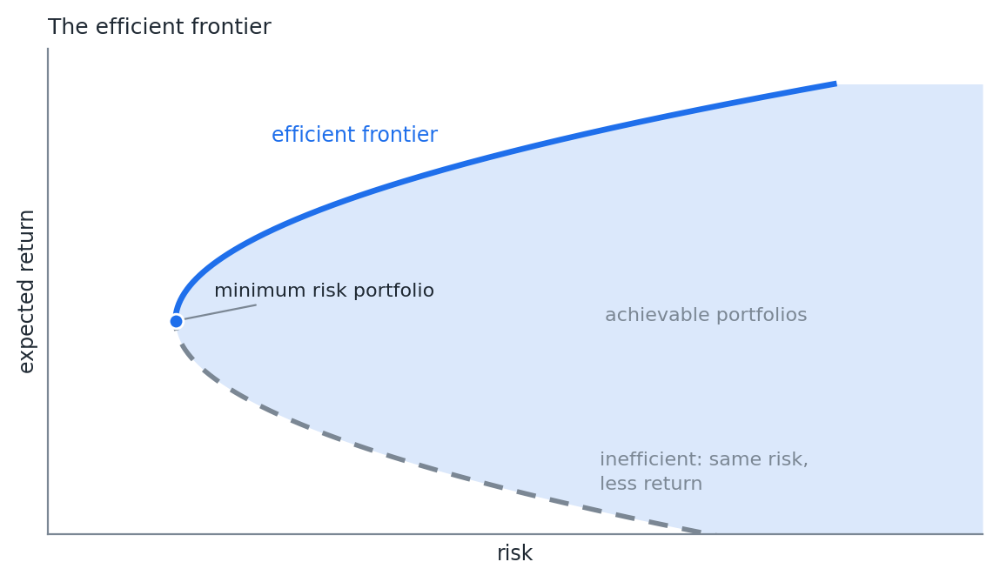{#fig-w07-frontiergen width=85%}

The efficient frontier is the left edge of that region above the minimum risk point, drawn solid in @fig-w07-frontiergen. It is the graph of the maximum return achievable by a set of investments for a given level of risk. Equivalently, and this matters later, it is the minimum risk achievable for a given level of return.

Nothing below the frontier is worth holding. For any portfolio strictly inside the shaded region there is one directly above it on the frontier with the same risk and more return. The dashed lower branch is the extreme case -- same risk as a point on the solid branch, less return.

Only the upper branch is efficient. The minimum risk portfolio is where the two branches meet, and it is the leftmost point anyone can reach.

### The Markowitz Problem

The father of modern portfolio theory is Harry Markowitz. Professor Markowitz won the 1990 Nobel Prize in Economics for his work.

Markowitz assumed multivariate normality. Risk is the variance of the portfolio. The optimization problem is constructed as a quadratic problem:

$$
\max\ U(w) = w\mu^T - \frac{1}{2}\lambda\, w\Sigma w^T
$$

$$
s.t.\ \sum_{1}^{n} w_i = 1
$$

Where $U$ is the utility of the portfolio's risk and return, $w$ are the weights of the portfolio constituents, $\mu$ is the vector of expected returns, $\Sigma$ is the covariance of returns, and $\lambda$ is a risk aversion parameter.

$w\Sigma w^T$ is fact 7 from Week 02 again. The entire optimization is that one quadratic form, traded against a linear term.

This setup trades off risk with return for a given investor's risk tolerance. Solving this optimization for different levels of $\lambda$ will give us points along the efficient frontier.

In practice, we do not have a quadratic utility function and asking someone their "$\lambda$" value is nonsensical.

### The Minimum Variance Form

We can, however, reform the problem. Invert the graph. Recognize that each maximum return for a given level of risk is the same as the minimum risk for a given level of return.

$$
\min\ \sigma^2 = w\Sigma w^T
$$

$$
s.t.\ \sum_{1}^{n} w_i = 1, \qquad w\mu^T = R
$$

This is still a quadratic problem and is easily solved. Often we will put bounds on the values of the portfolio weights to either disallow shorting, meaning negative weights, or to limit the amount short. These boundaries take the form of additional linear constraints.

The two forms trace the same curve. The first sweeps it out by varying $\lambda$ and the second by varying $R$, and both are quadratic programs with linear constraints. The second is the one to implement, because $R$ is a number an investor can actually state and $\lambda$ is not.

#### A Three Asset Example

Plot the efficient frontier for a portfolio of 3 assets. Do not allow negative weights.

| | A1 | A2 | A3 |
|:--|--:|--:|--:|
| A1 | 1 | 0.5 | 0 |
| A2 | 0.5 | 1 | 0.5 |
| A3 | 0 | 0.5 | 1 |
| **Std dev** | 0.20 | 0.10 | 0.05 |
| **$E(r)$** | 0.05 | 0.04 | 0.03 |

: Correlations, standard deviations, and expected returns {#tbl-w07-3asset tbl-colwidths="[28,24,24,24]"}

Solve the minimum variance problem once for each level of $R$ between the lowest and highest achievable return. Each solve returns a weight vector, and each weight vector gives one point on the curve.

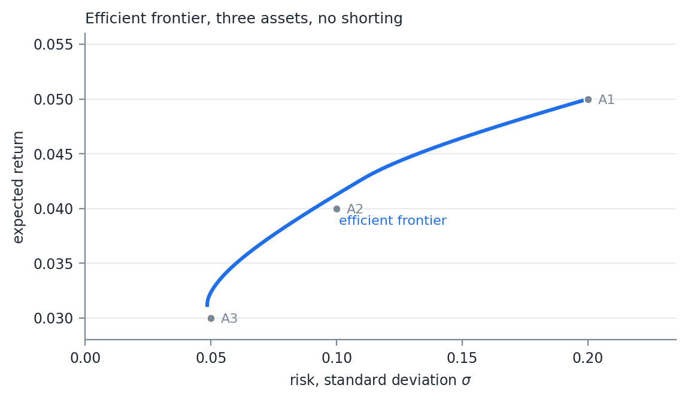{#fig-w07-frontier width=85%}

Note where the individual assets sit in @fig-w07-frontier. A1 and A3 are on the frontier, because A1 is the only way to reach the highest return and A3 is close to the lowest risk available. A2 sits inside it, since a mix of A1 and A3 beats holding A2 alone. That is diversification doing its work, and it comes entirely from the zero correlation between A1 and A3.

## The Sharpe Ratio and the Capital Market Line

In the mid 1960s William Sharpe and others began publishing papers on portfolio theory that led to the Capital Asset Pricing Model (CAPM). Sharpe, along with Merton Miller, shared in the 1990 Nobel Prize with Harry Markowitz for this work. Sharpe also did work with binomial trees and their applications.

Professor Sharpe developed a metric that has been named after him, the Sharpe Ratio:

$$
SR = \frac{E\left( r_p \right) - r_{rf}}{\sigma_p}
$$

The Sharpe Ratio compares the expected return on the portfolio in excess of the risk free rate to the risk of the portfolio, measured by standard deviation. It standardizes returns into units of risk.

### Combining with the Risk Free Asset

Investors will always prefer assets with a higher Sharpe Ratio. Assume borrowing and lending is possible at the risk free rate. An investor can choose either investment A or investment B, but not both.

Risk free rate: 5%.

- Investment A expects to return 10% per year with a 16% standard deviation. $SR = \frac{10-5}{16} = 0.3125$
- Investment B expects to return 8% per year with a 10% standard deviation. $SR = \frac{8-5}{10} = 0.3000$

The investor only wants to have 8% risk on his portfolio.

Investment A. Invest 50% in investment A and 50% in the risk free asset:

$$
E(r) = 50\% \cdot 10\% + 50\% \cdot 5\% = 7.5\%
$$

$$
Risk = \sqrt{0.5^2 \cdot 0.16^2 + 0.5^2 \cdot 0} = 8\%
$$

$$
SR = \frac{7.5 - 5}{8} = 0.3125
$$

Investment B. Invest 80% in investment B and 20% in the risk free asset:

$$
E(r) = 80\% \cdot 8\% + 20\% \cdot 5\% = 7.4\%
$$

$$
Risk = \sqrt{0.8^2 \cdot 0.1^2 + 0.2^2 \cdot 0} = 8\%
$$

$$
SR = \frac{7.4 - 5}{8} = 0.3
$$

Investment A, with the higher Sharpe Ratio, should be chosen. For our given level of risk, we can achieve a higher level of return. Notice that each portfolio maintains the Sharpe Ratio of the investment when combined with the risk free asset.

Further, if we wanted to achieve a risk higher than available in investment A, we could always borrow at the risk free rate and use that money to buy additional A.

Borrow 50%:

$$
E(r) = 150\% \cdot 10\% + (-50\%) \cdot 5\% = 12.5\%
$$

$$
Risk = \sqrt{1.5^2 \cdot 0.16^2 + (-0.5)^2 \cdot 0} = 24\%
$$

$$
SR = \frac{12.5 - 5}{24} = 0.3125
$$

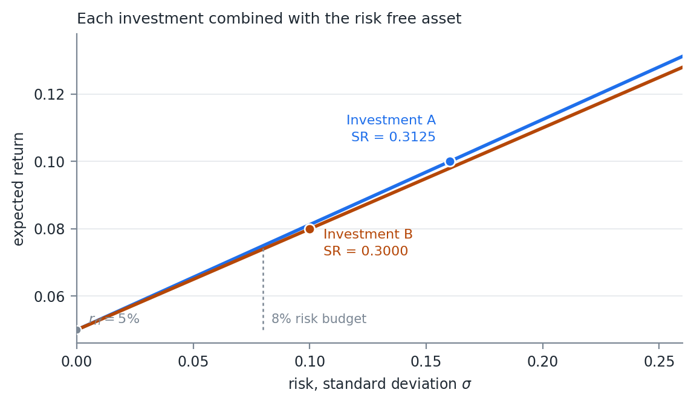{#fig-w07-sharpeline width=85%}

Look at what determines each line in @fig-w07-sharpeline. Two points fix it. The first is the risk free asset itself, at $\sigma = 0$ and $\mu = r_{rf}$, which is where the line starts. The second is the investment's own risk and return, $(\sigma_p, E(r_p))$, which is the marked point on the line.

The slope between those two points is

$$
\text{slope} = \frac{E\left( r_p \right) - r_{rf}}{\sigma_p - 0} = SR
$$

The Sharpe Ratio is the slope of the line. That is not a coincidence or an analogy -- the definition of the ratio and the rise over run of the line are the same expression.

Everything else about the picture follows. Every mix of the investment and cash lands somewhere on that line, so the Sharpe Ratio is preserved at every level of risk, and a higher ratio means a steeper line. At the 8% risk budget A sits above B, and it stays above at every level of risk, because a steeper line through the same intercept is above a shallower one everywhere to the right of it.

#### Why the Locus Is a Line

The fact that this comes out straight is not an accident of the arithmetic. It follows from two of the risk measure properties in Week 05.

**Positive homogeneity**, $q(\lambda X) = \lambda\, q(X)$. Holding a fraction $w$ of the risky investment scales its risk by exactly $w$, with no curvature.

**The translation property.** Adding a certain amount to a portfolio does not change its dispersion, so the cash leg contributes nothing to $\sigma$.

Put $w$ in the investment and $1-w$ in cash. The two properties give

$$
\sigma\left( w\, r_p + (1-w) r_{rf} \right) = w\, \sigma_p
$$

and the definition of the expectation gives

$$
E\left( w\, r_p + (1-w) r_{rf} \right) = r_{rf} + w\left( E(r_p) - r_{rf} \right)
$$

Both coordinates are linear in $w$. A locus whose two coordinates are both linear in the same parameter is a straight line, and dividing one slope by the other returns the Sharpe Ratio. Standard deviation behaving well under scaling and under adding cash is precisely why the picture is a line and not a curve.

One caveat on terminology. Standard deviation satisfies subadditivity, positive homogeneity, and the translation property, but not monotonicity -- a portfolio that loses more in every state can still carry the lower standard deviation. That makes it a deviation measure rather than a coherent risk measure in the strict Artzner sense. The two properties used above are ones it does have.

Try this with a measure that lacks either property and the line disappears. Variance is not positively homogeneous, since $\operatorname{var}(wX) = w^2 \operatorname{var}(X)$, so plotting the same picture against variance instead of standard deviation bends every one of these lines into a curve. That is the reason for the axis choice noted in @sec-w07-cml.

That is the whole comparison, and it sets up the next question. If the slope of the line is what we want to maximize, and we are choosing among all the portfolios on an efficient frontier rather than between two investments, which point on the frontier gives the steepest line out of $r_{rf}$?

### The Capital Market Line {#sec-w07-cml}

Going back to the efficient frontier from before, this raises the question. What is the portfolio with the maximum Sharpe Ratio? Assume the risk free rate is 3.5%.

Combining the fact that we can create a linear combination of a portfolio with the risk free asset and retain the portfolio's Sharpe Ratio, we can construct a portfolio that has a return greater than or equal to the efficient frontier return for all levels of risk.

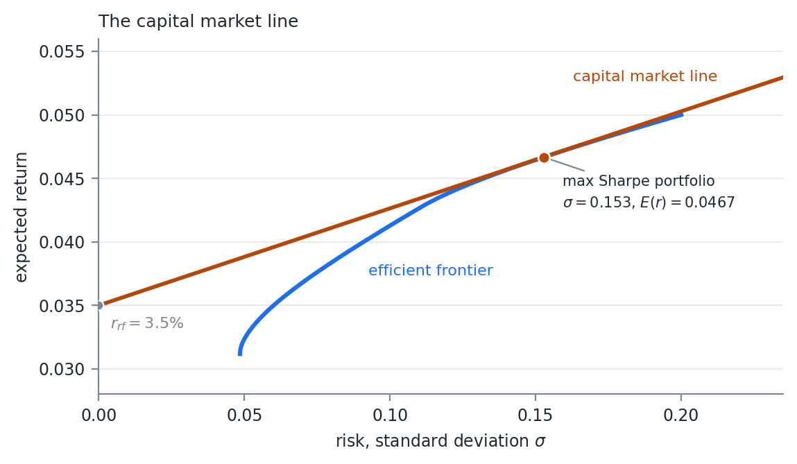{#fig-w07-cml width=85%}

The straight line in @fig-w07-cml is called the capital market line (CML). It is tangent to the efficient frontier at the point of the maximum Sharpe Ratio portfolio. This portfolio is sometimes called the super efficient portfolio, or the market portfolio.

For the three assets in @tbl-w07-3asset at a 3.5% risk free rate, the tangency portfolio is two thirds A1 and one third A2, with $\sigma = 0.153$, an expected return of $4.67\%$, and a Sharpe Ratio of $0.0764$. A3 drops out entirely, despite being the lowest risk asset available.

Note that both @fig-w07-frontier and @fig-w07-cml plot risk as standard deviation rather than variance. The CML is a straight line in $(\sigma, \mu)$ space and a square root curve in $(\sigma^2, \mu)$ space, so the tangency argument only reads correctly against $\sigma$.

Combining CAPM with the Efficient Market Hypothesis (EMH) leads to the conclusion that the market portfolio is the portfolio of all assets weighted by their current market capitalization.

In practice, most investors cannot borrow at the risk free rate. Values on the CML above the market portfolio are unobtainable. Investors either have to borrow at higher rates, lowering the slope of the line above the market portfolio, or simply attempt to invest along the efficient frontier.

### CAPM

Under CAPM, rational investors will only invest in the market portfolio and the risk free asset. This presents a single source of systematic risk. The classic CAPM formula for decomposing the returns on a single asset is:

$$
r_s - r_{rf} = \alpha + \beta\left( r_{mkt} - r_{rf} \right) + \epsilon_s
$$

The excess return on the asset $s$ is a linear combination of the excess return on the market portfolio, an alpha value, and an idiosyncratic error term. In the long run, theory would say that $\alpha = 0$.

That is an OLS regression, and everything in Week 02 applies to it. $\beta$ is a scaled covariance, the standard error on $\beta$ comes from the usual formula, and $\alpha$ is an intercept whose $t$-statistic is what anyone claiming skill has to clear.

## Arbitrage Pricing Theory

Proposed by Stephen Ross in 1976, Arbitrage Pricing Theory (APT) is a general theory of asset pricing that says financial assets can be modeled as a linear function of various sources of risk and return. These sources, or factors, of risk are systematic and each contribute to an asset's expected return.

$$
E\left( r_s - r_{rf} \right) = \alpha_s + \sum_{i=1}^{n} \beta_i E\left( f_i \right)
$$

$$
E\left( f_i \right) = RP_i
$$

Each factor $f$ has an expected return $RP$, called its risk premium. This is the expected return in excess of the risk free rate for taking on the risk of that factor.

CAPM is an APT model with 1 factor, the market risk factor:

$$
r_s - r_{rf} = \alpha + \beta\left( r_{mkt} - r_{rf} \right) + \epsilon_s
$$

These factors arise for different reasons. As we discussed above, reaching for additional return above the market portfolio, along with the inability to borrow at the risk free rate, is a leading theory for why certain types of stocks perform better over longer periods than CAPM and EMH would predict. Value stocks and stocks with low beta values both show long term positive alpha values.

APT says nothing about what the factors are. It says only that if returns have a linear factor structure, then the absence of arbitrage forces expected returns into the form above. Choosing the factors is left as a separate problem, and it is the problem Week 09 is about.

## Extensions to CAPM

In 1993 Eugene Fama (Nobel Prize 2013) and Kenneth French published a paper which attempted to model known anomalies found when testing CAPM.

Specifically, they added risk factors for value and size. It was easy to see in historic returns that stocks with a low price to book ratio and stocks with a lower market cap outperformed. Fama and French did not attempt to specify why the anomalies exist, only to model their return.

To do this, they constructed market neutral portfolios for each factor. The value factor would be long value stocks and short expensive stocks. They called this High (book to price) Minus Low (book to price), or HML. The small factor would be long small stocks and short large stocks. This they named Small Minus Big, or SMB.

$$
r_s - r_{rf} = \alpha + \beta_{mkt}\left( r_{mkt} - r_{rf} \right) + \beta_{SMB}SMB + \beta_{HML}HML + \epsilon_s
$$

In 1997 Mark Carhart published an extension to Fama French adding a momentum factor. Momentum is the tendency of assets that have recently done well to continue doing well. Week 02 gave the process behind it -- an autoregressive term with $\beta > 0$ makes a positive move more likely to be followed by another. The UMD (up minus down) factor is long high momentum stocks and short low momentum stocks.

$$
r_s - r_{rf} = \alpha + \beta_{mkt}\left( r_{mkt} - r_{rf} \right) + \beta_{SMB}SMB + \beta_{HML}HML + \beta_{UMD}UMD + \epsilon_s
$$

Over the years, academics have debated these factors and attempted to find new ones. Most agree that size is no longer a priced factor. Fama and French argue that their original HML value factor can be decomposed into 2 factors, companies that are profitable, RMW, and companies that invest in their business, CMA.

Some researchers have attempted to revive the value factor by moving away from book value. In an age of technology, a lot of a company's value does not accrue to the accounting book value. In the last 10 or more years value has significantly underperformed, leading some researchers to ask if it should be considered a factor at all.

Quality businesses, where RMW and CMA were early attempts at quality, are considered by some to be a priced factor. Like value, there is no good single definition of quality.

Every model in this section takes the factors as given and estimates the betas. Week 08 uses them to attribute realized risk and return. Week 09 builds the factors.

# Week 08 — Attribution and Risk Parity

## Risk and Return Attribution

Attribution analysis attempts to find the contribution to return or risk from underlying factors. This is either done ex-post or ex-ante.

Ex-post looks at realized risk and return. That is, how much did this stock contribute to the total return of the portfolio and to the realized standard deviation?

Ex-ante looks at assumed forward distributions and finds the contributions to expected risk and return.

Week 07 built portfolios. This week takes a portfolio apart and asks where its risk and its return actually came from, which is the question anyone who has to explain a quarter to a client is being asked. The two exercises use the same machinery run in opposite directions.

### The Decomposition

We do this by estimating the first derivative and using the fact:

$$
f(x) \approx \sum_{i}^{n} x_i \frac{\partial f}{\partial x_i}
$$

That relation is better than an approximation for the cases we care about. Euler's homogeneous function theorem says that if $f$ is homogeneous of degree 1, meaning $f(\lambda x) = \lambda f(x)$, then

$$
f(x) = \sum_{i}^{n} x_i \frac{\partial f}{\partial x_i}
$$

exactly, with no error term. Positive homogeneity is the property from Week 05 and Week 07, and both risk measures we use here have it -- portfolio standard deviation and expected shortfall are both homogeneous of degree 1 in the weights. So the contributions add to the total exactly, and any residual in your code is an arithmetic error rather than a modeling one.

### Return Attribution

For return this is easy. The portfolio return is the sum of the weights times the arithmetic returns. The derivative of the portfolio return with respect to factor $i$ is just the factor weight:

$$
R_t = \sum_{i}^{n} r_{i,t} w_{i,t}
$$

So for any given time $t$, the contribution to return for factor $i$ is $w_i r_i$.

Arithmetic returns are the right choice here for the reason given in Week 04. They are additive across assets inside a period, which is exactly what an attribution needs.

### Linking Through Time

The individual time period return and its attribution is an arithmetic return. Arithmetic returns are not summable across time. The total return is not the sum of individual period returns, so the total attribution for a factor is not the sum of the individual period contributions. We need a way to link individual time period returns.

There are a few methods, each with their own pros and cons. The most straightforward is Cariño's K.

The arithmetic total return:

$$
R = \left[ \prod_{t}^{T} \left( 1 + R_t \right) \right] - 1
$$

The geometric total return:

$$
GR = \ln(R + 1)
$$

Let $K$ be the ratio between the two:

$$
K = \frac{GR}{R}
$$

Create a vector of $k_t$:

$$
k_t = \frac{\ln\left( R_t + 1 \right)}{K R_t}
$$

By construction:

$$
R = \sum_{t}^{T} R_t k_t
$$

That construction is worth checking once by hand. Substituting $k_t$ gives $\frac{1}{K}\sum_t \ln(1+R_t)$, the sum of logs is the log of the product, and the log of the product is $GR$. So the sum is $GR / K = R$.

The $k$ vector provides a scaling factor for each day. Because the factor component returns are summable inside the period:

$$
R = \sum_{t}^{T} k_t \sum_{i}^{n} w_{i,t} r_{i,t}
$$

The total attribution of return for factor $i$ is then

$$
A_i = \sum_{t}^{T} k_t w_{i,t} r_{i,t}
$$

### Calculating Weights Through Time

Unless we rebalance the portfolio every time period, the weights of each factor will move with market movements. We need the weight at each time period to calculate the ex-post return attribution. Luckily this is straightforward to calculate.

First grow the weight by the time period return:

$$
w_{i,t}^{*} = w_{i,t}\left( 1 + r_{i,t} \right)
$$

By definition, the portfolio return at time $t$ is

$$
R_t = \left( \sum_{i}^{n} w_{i,t}^{*} \right) - 1
$$

Normalize the updated weights to get the next period's starting weight:

$$
w_{i,t+1} = \frac{w_{i,t}^{*}}{R_t + 1}
$$

This gives us a way to calculate the individual portfolio returns at each time period while calculating the individual time period weights.

Do not skip this step and use the starting weights throughout. A position that doubles while the rest of the book is flat carries a very different weight at the end of the period than it did at the start, so attributing its later returns at the original weight misstates every line of the report, and it does so without producing any error large enough to notice.

## Risk Attribution

In this section we will look at risk as defined as portfolio volatility.

$$
\sigma_p = \sqrt{w'\Sigma w}
$$

Given the formula at the start of the notes:

$$
f(x) = \sum_{i}^{n} x_i \frac{\partial f}{\partial x_i}
$$

We need to find the derivative of volatility with respect to $w$. You are welcome to solve this by hand. I will just give it to you:

$$
\frac{\partial \sigma_p}{\partial w} = \frac{\Sigma w}{\sqrt{w'\Sigma w}}
$$

This is the gradient. For an individual $w_i$ take the $i^{th}$ row.

$$
\frac{\partial \sigma_p}{\partial w_i} = \frac{1}{\sigma_p}\sum_{j}^{n}\left( w_j \Sigma_{i,j} \right)
$$

So the vector of component volatilities is:

$$
CSD = w\, \#\, \frac{\Sigma w}{\sqrt{w'\Sigma w}}
$$

Where $\#$ is the element wise multiplication operator.

Note what $CSD$ is not. It is not the risk of holding position $i$ on its own, and the components do not add up to the sum of the individual position volatilities. They add to the portfolio volatility, which is the smaller number. The difference between the two is diversification, and the gradient has allocated it across the positions rather than leaving it as an unexplained residual.

### The Regression Interpretation

This gives us a way to do ex-ante risk attribution. For ex-post we need to recognize something about the formula for an individual derivative.

$$
\frac{\partial \sigma_p}{\partial w_i} = \frac{1}{\sigma_p}\sum_{j}^{n}\left( w_j \Sigma_{i,j} \right)
$$

The summation is the definition of:

$$
\sum_{j}^{n}\left( w_j \Sigma_{i,j} \right) = \operatorname{cov}(x_i, p)
$$

Therefore:

$$
\frac{\partial \sigma_p}{\partial w_i} = \frac{\operatorname{cov}(x_i,p)}{\sigma_p} \Rightarrow RA_i = \frac{w_i \operatorname{cov}(x_i,p)}{\sigma_p} = \frac{\operatorname{cov}(w_i x_i, p)}{\sigma_p}
$$

Remember the formula for the OLS $\beta$, where the denominator is the variance of the regressor:

$$
\beta = \frac{\operatorname{cov}(y, x)}{\sigma_x^2}
$$

So the risk attribution is the regression coefficient of the weighted returns regressed on the portfolio return, multiplied by the portfolio standard deviation:

$$
w_i x_i = c + \beta_{i,p}\, p + \epsilon
$$

$$
RA_i = \frac{\operatorname{cov}(w_i x_i, p)}{\sigma_p} = \sigma_p \beta_{i,p}
$$

That last line is the practical one. Ex-ante risk attribution needs a covariance matrix. Ex-post needs only a series of realized returns and a regression, which is Week 02 machinery applied to a question Week 02 never asked.

Read $\beta_{i,p}$ directly as a share. Dividing both sides by $\sigma_p$:

$$
\frac{RA_i}{\sigma_p} = \beta_{i,p}
$$

The beta of position $i$ against the portfolio is the fraction of total portfolio risk attributable to that position. A beta of 0.30 means the position accounts for 30% of the portfolio's volatility, whatever the portfolio's volatility happens to be.

That reading is consistent because the betas sum to 1. Regressing the portfolio on itself gives a coefficient of 1, and the regression is linear in its dependent variable, so the individual betas must add to that. Shares that sum to 1 are shares. It is also a free check on the arithmetic.

### Problem 1

Part 1. Construct the maximum Sharpe Ratio portfolio for AAPL, MSFT, BRK-B, CSCO, and JNJ, then attribute its realized return.

The expected returns come from the factor model rather than from the sample means of the stocks, for the reason given in @sec-w08-rb -- a sample mean estimated from a few years of daily data is too noisy to feed an optimizer. The construction is:

1. Join the daily Fama French 3 factor file to the momentum file on date, and divide the factor columns by 100 to convert from percent. Join that to `DailyReturn.csv`.
2. Regress each stock's daily returns on $[\text{Mkt-RF},\ \text{SMB},\ \text{HML},\ \text{Mom}]$ with an intercept, by OLS over the joined history. Keep the four betas per stock and discard the intercept.
3. Estimate each factor's expected daily return as its mean over the last 10 years of factor history.
4. Build expected stock returns from the loadings, converted to geometric and annualized at 255 trading days:

$$
\mu_i = 255 \cdot \ln\left( 1 + \sum_{j} \beta_{i,j} E(f_j) \right)
$$

5. Build the covariance matrix from the log returns of the stocks themselves, annualized the same way:

$$
\Sigma = 255 \cdot \operatorname{cov}\left( \ln(1 + Y) \right)
$$

6. Maximize the Sharpe Ratio subject to $\sum w_i = 1$ and $w_i \geq 0$, at a risk free rate of 25bp. This is a non-linear objective, so it needs a solver rather than a closed form.

Note what came from where. The betas and the expected returns came from the factor model. The covariance came from the stock returns directly.

The factor model is not needed for the covariance here. We are assuming multivariate normality, and a multivariate normal is completely described by $\mu$ and $\Sigma$, so there is nothing to gain from decomposing $\Sigma$ into a factor covariance and a matrix of idiosyncratic variances. Estimating those two pieces separately would only add estimation error to a quantity we can already get in one step.

The sample covariance is enough because the series is far longer than the number of assets. Five stocks against several years of daily observations leaves $T \gg n$, so $\Sigma$ is full rank and comfortably estimated, and every concern from Week 03 about singular covariance matrices is absent.

That is not true in general, and it is the first thing to check before reusing this setup. Once the number of assets approaches the length of the series, the sample covariance degrades and then fails outright. Week 09 takes up that case and is where the factor structure earns its keep on the covariance side as well as the mean side.

Use the returns from the end of the history (1-14) until the end of February for the attribution window.

Calculate the ex-post return attribution for each stock.

(See code)

| Stock | Weight |
|:--|--:|
| AAPL | 10.076% |
| MSFT | 20.951% |
| BRK-B | 43.839% |
| CSCO | 8.118% |
| JNJ | 17.015% |

: Optimal weights, maximum Sharpe Ratio portfolio {#tbl-w08-p1weights tbl-colwidths="[50,50]"}

| | AAPL | MSFT | BRK-B | CSCO | JNJ | Portfolio |
|:--|--:|--:|--:|--:|--:|--:|
| Total Return | -4.47% | -3.48% | -0.83% | -9.11% | -1.32% | -2.51% |
| Return Attribution | -0.46% | -0.71% | -0.37% | -0.75% | -0.22% | -2.51% |

: Ex-post return attribution {#tbl-w08-p1return tbl-colwidths="[26,12,12,13,12,12,13]"}

Read the two rows of @tbl-w08-p1return against each other. CSCO had the worst total return at $-9.11\%$, but MSFT contributed more to the portfolio loss, because MSFT was held at more than twice the weight.

Part 2. Using the same data as part 1, add the risk attribution for each stock.

(See code)

| | AAPL | MSFT | BRK-B | CSCO | JNJ | Portfolio |
|:--|--:|--:|--:|--:|--:|--:|
| Total Return | -4.47% | -3.48% | -0.83% | -9.11% | -1.32% | -2.51% |
| Return Attribution | -0.46% | -0.71% | -0.37% | -0.75% | -0.22% | -2.51% |
| Vol Attribution | 0.16% | 0.32% | 0.48% | 0.09% | 0.14% | 1.19% |

: Return and risk attribution together {#tbl-w08-p1both tbl-colwidths="[26,12,12,13,12,12,13]"}

The volatility attribution row of @tbl-w08-p1both adds to $1.19\%$, the portfolio volatility, not to the sum of the five individual volatilities. That is Euler's theorem doing its work.

## Attribution to a Factor

In the above sections, we attributed risk and return to the underlying position. If we used something like the Fama French factors to describe our portfolio, how would we do the attribution?

Assume you have $m$ factors and $n$ assets.

$$
x_i = \alpha + \beta_i F + \epsilon
$$

$$
\beta_i F = \sum_{j}^{m} \beta_{i,j} F_j
$$

Because of the $\alpha$ and $\epsilon$ in the regression, the attribution to the factors will not be perfect, unless $\alpha = 0$ and $\sigma_e = 0$. We have to account for this error.

$$
e_i = \alpha_i + \epsilon_i
$$

The portfolio can be written as:

$$
p = \sum_{i}^{n} w_i \left( \beta_i F + e_i \right)
$$

$$
p = \sum_{i}^{n} w_i \sum_{j}^{m} \beta_{i,j} F_j + \sum_{i}^{n} w_i e_i
$$

Depending on the requirements, we can calculate the error attribution to each asset, or take the sum and treat the error as a single factor for the portfolio. Often in ex-post analysis, we call this total the portfolio alpha.

$$
\alpha_p = \sum_{i}^{n} w_i e_i
$$

Notice that the residual gets two different names depending on which attribution is being reported, and that both are describing the same $e_i$.

On the return side it is the portfolio alpha. It is the part of the realized return that the factors did not explain, which is exactly what an active manager is being paid for and exactly what a client will ask about.

On the risk side it is idiosyncratic risk, sometimes called specific or residual risk. It is the part of the realized volatility that did not come from factor exposure.

We use alpha for both throughout these notes. Some practitioners use the idiosyncratic label for both, and plenty of reports use one term in the return table and the other in the risk table without saying so. Ask which is meant, particularly when the two tables sit on the same page.

### Collapsing to Factor Weights

We can simplify the problem by creating a new factor weight and rearranging the portfolio equation:

$$
w_j = \sum_{i}^{n} w_i \beta_{i,j}
$$

$$
p = \sum_{j}^{m} w_j F_j + \alpha_p
$$

That substitution is the whole trick. A portfolio of $n$ assets has become a portfolio of $m$ factors plus a residual, and if $m < n$ the problem got smaller. Nothing after this point knows or cares that the factors are not assets.

The first derivatives of this equation are straightforward and we can proceed as we did before.

1. Calculate factor weights through time
2. Calculate portfolio return through time
3. Calculate alpha through time
4. Calculate the Cariño K scaling factors
5. Perform the return attribution
6. Use the factor weights and returns to run the regression to find the risk attribution

If you want to attribute the residual risk and return to the underlying assets, expand out the $\alpha_p$ equation.

$$
p = \sum_{j}^{m} w_j F_j + \sum_{i}^{n} w_i e_i
$$

Either way, the math is the same.

### Problem 2

Using the same data as Problem 1, attribute realized risk and return to the Fama French 3 plus Momentum model. Report the residual total as portfolio alpha.

Note: the factor rows below are rounded to 2 decimal places, so they will not add exactly to the portfolio total. The underlying attribution does sum exactly. Check against the code, not the printed table.

(See code)

| | Mkt-RF | SMB | HML | Mom | Alpha | Portfolio |
|:--|--:|--:|--:|--:|--:|--:|
| Total Return | -5.8% | -0.11% | 2.03% | 0.82% | 1.78% | -2.51% |
| Return Attribution | -4.45% | 0 | 0.29% | -0.08% | 1.77% | -2.51% |
| Vol Attribution | 1.00% | -0.01% | -0.07% | 0.01% | 0.27% | 1.19% |

: Attribution to the Fama French 3 plus Momentum factors {#tbl-w08-p2 tbl-colwidths="[26,13,12,12,12,12,13]"}

Two things in @tbl-w08-p2 are worth calling out. The market factor accounts for nearly the whole loss and nearly the whole risk, which is the usual result for a long only equity portfolio. And SMB and HML carry negative volatility attribution, which is not an error -- a factor whose realized returns ran counter to the portfolio reduces total risk, and the gradient allocates it a negative share.

## Risk Budgeting and Risk Parity {#sec-w08-rb}

Constructing a portfolio based on risk and return as described in last week's notes usually creates a non-optimal portfolio.

Richard Michaud discusses this in his 1989 paper, "The Markowitz Optimization Enigma: Is 'Optimized' Optimal?" Michaud shows that small changes to correlations, volatilities, and expected values can change the portfolio dramatically. This has led to the often stated:

> "Mean Variance Optimization is Error Maximizing."

Or as Yogi Berra said:

> "It's tough to make predictions, especially about the future."

The mechanism behind Michaud's result is in Week 01. The standard error of an estimated mean is $\sigma/\sqrt{n}$, and for returns $\sigma$ dwarfs $\mu$. The optimizer takes those noisy means at face value and loads up on whichever asset happened to look best.

In practice, we make long term portfolio plans using estimated expected returns and covariance. Research has shown that in the long run risk premia are fairly stable.

For shorter term problems we are often less confident about the expected return, because return volatility dwarfs the expected return. However, we are more confident about volatilities and to some extent correlations.

### Risk Budgets

Ex-ante risk contributions, expressed as a percentage of the total portfolio risk, give us an idea of how much risk we are giving to each position.

If we do not have a good view on expected return, we can instead control how much risk each of our positions uses. This is risk budgeting.

The ex-ante risk budget of the mean variance portfolio from Problem 1 (see code):

| AAPL | MSFT | BRK-B | CSCO | JNJ |
|--:|--:|--:|--:|--:|
| 11.8% | 29.5% | 39.7% | 9.15% | 9.8% |

: Risk budget implied by the maximum Sharpe Ratio weights {#tbl-w08-mvbudget}

Here, we have AAPL, CSCO, and JNJ with roughly the same risk budget. MSFT has 3x their assigned risk, and BRK-B has 4x.

Compare @tbl-w08-mvbudget to the weights in @tbl-w08-p1weights. BRK-B is 43.8% of the money and 39.7% of the risk, so those two happen to be close. AAPL is 10.1% of the money and 11.8% of the risk. The two views do not have to agree, and when they diverge the risk view is the one that tells you what the portfolio will actually do.

### Solving for Risk Parity

What if we were to set these risk budgets equal? This is called risk parity.

You can solve for risk parity by setting up a least squares problem. Unfortunately, because we are dealing with the inverse of portfolio volatility, which also involves a square root, this has to be solved with a non-linear optimization.

$$
CSD = w\, \#\, \frac{\Sigma w}{\sqrt{w'\Sigma w}}
$$

$$
SSE = \sum_{i}^{n} \left( CSD_i - \overline{CSD} \right)^2
$$

$$
\min SSE
$$

$$
s.t.\ \sum_{i}^{n} w_i = 1
$$

For the covariance matrix used in Problem 1, here are the weights under risk parity (see code):

| Stock | Weight | Risk Budget | $\sigma$ |
|:--|--:|--:|--:|
| AAPL | 15.4% | 20% | 25.6% |
| MSFT | 14.3% | 20% | 25.5% |
| BRK-B | 26.5% | 20% | 15.2% |
| CSCO | 15.1% | 20% | 23.4% |
| JNJ | 28.7% | 20% | 14.9% |

: Risk parity weights {#tbl-w08-rpweights tbl-colwidths="[28,24,24,24]"}

@tbl-w08-rpweights shows the result. Lower risk stocks are given larger weights, roughly in proportion to the inverse of their individual risk, $\sigma$. JNJ carries the lowest volatility at 14.9% and takes the largest weight at 28.7%, while AAPL at 25.6% volatility takes about half that.

Note also what is absent from the problem. No expected return appears anywhere in the optimization, so no estimated mean can distort the answer. That is the entire appeal.

### The Inverse Volatility Approximation

We can approximate risk parity by using the normalized inverse volatility. These are good starting values for your optimization if you have trouble with convergence.

$$
w_i = \frac{1}{\sigma_i} \cdot \frac{1}{\sum_{j}^{n} \frac{1}{\sigma_j}}
$$

If all the correlations are equal, the risk parity portfolio is the inverse volatility portfolio.

If all correlations are equal and all Sharpe Ratios are equal, then the risk parity portfolio is also the super efficient, maximum Sharpe Ratio portfolio.

If we think that long term Sharpe Ratios between assets are equal, then the inverse volatility portfolio is an approximation of the super efficient portfolio. This is an estimate that does not rely on estimation of means or correlations, removing a source of error.

That chain of conditions is what makes risk parity defensible rather than arbitrary. It is not a claim that equal risk shares are inherently right. It is a claim that under two assumptions we are more willing to make than a forecast of means, equal risk shares land on the same portfolio the Week 07 optimization would have chosen.

## Risk Parity with Unequal Risk Budgets

Often portfolio managers have an opinion on which assets will outperform other assets in their portfolio. One way to express this view is to give high conviction positions a larger risk weight and low conviction positions a smaller risk weight.

We can add this to our optimization by introducing a vector of relative risk budget.

$$
b = \left[ b_1, b_2,\ \dots,\ b_n \right]
$$

If asset $i$ should have 2 times the risk budget of all the others, then

$$
b_2 = 2 b_i \ \ \forall\ i \neq 2
$$

Calculate the CSD as before:

$$
CSD = w\, \#\, \frac{\Sigma w}{\sqrt{w'\Sigma w}}
$$

Modify CSD by element wise division by the risk budget:

$$
CSD^{*} = \left[ \frac{CSD_1}{b_1}, \frac{CSD_2}{b_2},\ \dots,\ \frac{CSD_n}{b_n} \right]
$$

$$
SSE = \sum_{i}^{n} \left( CSD_i^{*} - \overline{CSD^{*}} \right)^2
$$

$$
\min SSE
$$

$$
s.t.\ \sum_{i}^{n} w_i = 1
$$

This is a strictly more general problem. Set every $b_i$ equal and the division changes nothing, so plain risk parity is the special case where the manager has no view.

Example, using the data from before. Assume we have high conviction in MSFT and very little confidence in JNJ. We want MSFT to have 2 risk shares and we want JNJ to only have 50% of a risk share.

| Stock | Weight | Risk Budget | $b$ | RP Weight |
|:--|--:|--:|--:|--:|
| AAPL | 13.8% | 18.2% | 1 | 15.4% |
| MSFT | 23.2% | 36.4% | 2 | 14.3% |
| BRK-B | 29.1% | 18.2% | 1 | 26.5% |
| CSCO | 14.7% | 18.2% | 1 | 15.1% |
| JNJ | 19.3% | 9.1% | 0.5 | 28.7% |

: Unequal risk budgets, against the equal budget weights {#tbl-w08-unequal tbl-colwidths="[22,20,20,14,24]"}

The $b$ column of @tbl-w08-unequal sums to 5.5, so a single share is $1/5.5 = 18.2\%$ of the risk, two shares are $36.4\%$, and half a share is $9.1\%$.

Note that this is not purely a rescaling of the prior risk parity weights. You can see that even though the BRK-B risk budget went down, 18.2% against 20% under equal budgets, the portfolio weight increased.

Correlations matter.

| | AAPL | MSFT | BRK-B | CSCO | JNJ |
|:--|--:|--:|--:|--:|--:|
| **AAPL**  | 1.00 | 0.61 | 0.00 | 0.20 | (0.08) |
| **MSFT**  | 0.61 | 1.00 | (0.04) | 0.38 | (0.04) |
| **BRK-B** | 0.00 | (0.04) | 1.00 | 0.22 | 0.40 |
| **CSCO**  | 0.20 | 0.38 | 0.22 | 1.00 | 0.17 |
| **JNJ**   | (0.08) | (0.04) | 0.40 | 0.17 | 1.00 |

: Correlation matrix used in the risk parity examples {#tbl-w08-rpcorr}

BRK-B and JNJ were offsetting risk from MSFT. Lowering the JNJ weight caused the weight of BRK-B to increase to offset the risk from the additional MSFT weight.

Trace it through @tbl-w08-rpcorr. MSFT and AAPL are correlated at 0.61 and MSFT and CSCO at 0.38, so raising MSFT raises the risk of two other positions along with its own. BRK-B is the only asset with essentially no correlation to MSFT, at $-0.04$, so it is the only place to put money without adding to the concentration that was just created.

## Non-Normal Risk Parity

We have spent a lot of time discussing how returns are not normally distributed. The above risk parity portfolios all assumed multivariate normality and used the volatility as the risk measure.

In the non-normal case, we need a more robust risk measure. We have used VaR and ES in this class. VaR is not a coherent risk measure. One of the implications of this is that the VaR surface is non-convex, so optimizations using VaR may not easily converge and can converge to local optima that are not the global optimum.

Luckily ES is a coherent risk measure and convex.

### Component Expected Shortfall

We will use the same logic as before:

$$
ES(w) = \sum_{i}^{n} w_i \frac{\partial ES}{\partial w_i}
$$

That is Euler's theorem again. ES is positively homogeneous, which was property 3 of coherence in Week 05, so the decomposition is exact for the same reason it was exact for volatility.

However, ES does not have a closed form solution if the distribution of the assets is unknown. We can, however, estimate this using finite differences and our simulated returns, $R$.

$$
\frac{\partial ES}{\partial w_i} \approx \frac{ES\left( \left[ w_1, w_2,\ \dots,\ w_i + e,\ \dots,\ w_n \right]\ |\ R \right) - ES(w\ |\ R)}{e}
$$

That is the forward difference from Week 07, applied to a function we can only evaluate by simulation. Hold the simulated return matrix $R$ fixed across both evaluations. Redrawing it between them adds simulation noise to the numerator, and since the numerator is a difference of two nearly equal numbers, that noise will dominate the derivative.

From here, the optimization problem is the same. Only the calculation of the component risk changes.

$$
CES = w\, \#\, \frac{\partial ES}{\partial w}
$$

$$
SSE = \sum_{i}^{n} \left( CES_i - \overline{CES} \right)^2
$$

$$
\min SSE
$$

$$
s.t.\ \sum_{i}^{n} w_i = 1
$$

You can update the above with the risk budget as before.

$$
CES^{*} = \left[ \frac{CES_1}{b_1}, \frac{CES_2}{b_2},\ \dots,\ \frac{CES_n}{b_n} \right]
$$

$$
SSE = \sum_{i}^{n} \left( CES_i^{*} - \overline{CES^{*}} \right)^2
$$

### Problem 3

Using the same data as Problem 1 and assuming a 0 mean return, fit a $t$ distribution to each stock return series. Simulate the system using a Gaussian copula. Find the risk parity portfolio using ES as the risk measure.

(See code)

| Stock | ES RP Portfolio | Vol RP Portfolio | Fitted DF |
|:--|--:|--:|--:|
| AAPL | 14.9% | 15.4% | 60,120 |
| MSFT | 13.5% | 14.3% | 4.6 |
| BRK-B | 26.4% | 26.5% | 21.7 |
| CSCO | 14.2% | 15.1% | 4.5 |
| JNJ | 31.0% | 28.7% | 9.4 |

: Risk parity under ES against risk parity under volatility {#tbl-w08-esrp tbl-colwidths="[22,26,26,26]"}

AAPL returns, with a large fitted degrees of freedom, are effectively normally distributed in this simulation. The same is true of BRK-B. The 2 stocks with the lowest fitted degrees of freedom are both reduced in weight, as their fat tails contribute more to tail risk.

The differences in @tbl-w08-esrp are small, and that is the honest headline. Switching from volatility to ES moved the largest weight by 2.3 percentage points. The tail matters, but on this data it matters less than the choice of risk measure suggests it might, and a portfolio manager deciding whether the extra machinery is worth it should see the size of the effect before committing to it.

# Week 09 — Factor Models: Construction and Use

## Why We Need Factor Models

In Week 07 we covered CAPM, APT, and the Fama French family. In Week 08 we used those factors to attribute realized risk and return. In both cases the factors were given to us. This week we build the models.

The reason to do this is not elegance. It is that the sample covariance matrix stops working.

### The Parameter Counting Problem

A covariance matrix for $n$ assets has

$$
\frac{n(n+1)}{2}
$$

free parameters. For $n = 100$ that is 5,050 numbers. The data available to estimate them is $T \times n$.

`DailyReturn.csv` from Week 08 has 100 stocks (plus SPY) and $T = 60$ daily observations. We are estimating 5,050 parameters from 6,000 data points.

### What Actually Breaks

Compute the sample covariance of the 100 stocks and look at the eigenvalues.

| $n$ | $T$ | Parameters | Rank of $\widehat{\Sigma}$ | $\lambda_{\min}$ | Non-zero columns in $L$ |
|--:|--:|--:|--:|--:|--:|
| 100 | 60 | 5,050 | 59 | $\sim -10^{-18}$ | 59 of 100 |

: Sample covariance of 100 stocks from 60 daily observations {#tbl-w09-fail}

The rank is $\min(T-1, n) = 59$. This is not an estimation error, it is a certainty. A sum of $T$ rank-one outer products cannot have rank greater than $T$, and centering the data costs one more. With $n > T$ the sample covariance is always singular.

Be careful about what has broken here. The PD Cholesky algorithm fails. The PSD version from Week 03 does not -- it returns a valid root $L$ with 41 zero columns and reproduces $\widehat{\Sigma} = LL'$ to $1.5 \times 10^{-16}$. The Week 03 PCA simulation works too. Drop the zero eigenvalues and simulate the system from 59 random draws instead of 100.

So we can factor the matrix and we can simulate from it. That is the problem.

### What the Factorization Cannot Tell Us

$L$ has rank 59. Every simulated return vector $r = Lz$ lies in a 59 dimensional subspace of $\mathbb{R}^{100}$, and that subspace is the span of the 60 demeaned historical observations.

No matter how many scenarios we draw, each one is a linear combination of days we have already seen. There is no information in the estimate about the other 41 directions.

The matrix is not silent about those directions. It says they have exactly zero variance.

To see what that costs, estimate the covariance on the first 30 days only. The null space is then 71 dimensional. Pick any portfolio in that null space with weights summing to 1. The one below has an 8.3% maximum weight and 2.4x gross exposure, which is an ordinary looking portfolio.

| | Value |
|:--|--:|
| Forecast volatility (in-sample) | 0% to numerical precision |
| Realized volatility, same 30 days | $\sim10^{-14}$% |
| Realized volatility, next 30 days | 10.50% |
| FF3 factor model forecast, same portfolio | 8.09% |

: A portfolio the sample covariance calls riskless {#tbl-w09-nullspace}

The estimate says the portfolio is riskless and is internally consistent about it. Out of sample it runs at 10.5% annualized. The factor model, which never assigns zero risk to anything, would have told you 8.09%.

Run a minimum variance optimization on all 60 days using a pseudo-inverse and the largest weight comes out at 350%. The optimizer is not finding a low risk portfolio. It is finding the direction where the estimate is most confidently wrong.

### Two Ways Out

The first is to repair the matrix numerically. Week 03 gave us the tools -- Rebonato and Jackel, Higham, the PSD Cholesky, PCA.

None of them adds information. They are the right tools for a matrix that is nearly good and has been corrupted by floating point error or missing data. That is a numerical problem with a numerical fix.

Our problem is not numerical. Raising 41 zero eigenvalues to some small positive number gives you a matrix you can invert, but the directions it is built on are arbitrary and the risk it reports along them is whatever you picked when you patched it. You have converted "I know nothing here" into a specific number.

The second way is to change the model. If returns are driven by a small number of common factors we can write

$$
\Sigma = BFB' + D
$$

and estimate 406 parameters instead of 5,050. This is full rank and invertible for any $T$. The rank comes from the structure, not from a patch. Every asset gets its own strictly positive specific variance, so no portfolio is ever called riskless.

The trade is explicit. We buy conditioning, tractability, and interpretable exposures with a structural assumption. If the assumption is wrong we get a well behaved matrix that is confidently incorrect. Section 9 covers how to detect that.

## The General Linear Factor Model

For asset $i$ at time $t$:

$$
r_{i,t} = \alpha_i + \sum_{k=1}^{m} \beta_{i,k} f_{k,t} + \varepsilon_{i,t}
$$

For the cross-section at a single date:

$$
r_t = \alpha + B f_t + \varepsilon_t
$$

$r_t$ is $n\times 1$, $B$ is $n \times m$, $f_t$ is $m \times 1$, $\varepsilon_t$ is $n \times 1$. Stacking all $T$ dates:

$$
R = \mathbf{1}\alpha' + F B' + E
$$

with $F$ the $T\times m$ matrix of factor returns and $E$ the $T \times n$ matrix of residuals.

### Vocabulary

Three different things get called "the factor" in conversation. Keep them straight.

| Term | Symbol | Dim. | What it is |
|:--|:--|:--|:--|
| Exposure / loading / beta | $B$ | $n\times m$ | how much of factor $k$ asset $i$ carries |
| Factor return | $f_t$ | $m\times 1$ | what the factor did in period $t$ |
| Factor premium | $E[f]$ | $m\times 1$ | long run expected reward for the exposure |

: Three distinct objects {#tbl-w09-vocab}

"Apple has a high momentum beta" is a statement about $B$. "Momentum was up 40bp yesterday" is about $f_t$. "Momentum earns 3% a year" is about $E[f]$. Only the last is an asset pricing claim. The first two are risk statements.

### The Assumptions

The model is the equation plus three assumptions. We violate all three later.

1. $E[\varepsilon_{i,t}] = 0$. The residual has no drift. Anything systematic left in the residual becomes $\alpha$, and $\alpha$ is either skill or a missing factor.

2. $\operatorname{cov}(f_{k,t}, \varepsilon_{i,t}) = 0$. In a time series model fit by OLS this holds in sample by construction. It is a property of the residual, not a testable claim. Out of sample it is a real assumption.

3. $\operatorname{cov}(\varepsilon_{i,t}, \varepsilon_{j,t}) = 0$ for $i \neq j$. The residual covariance $D$ is diagonal. This is the load bearing assumption. It is what collapses the parameter count and it is the one most often false. Section 9.3 shows how to test it.

Write $F = \operatorname{cov}(f)$ and $D = \operatorname{diag}(d_1,\dots,d_n)$. Using assumptions 2 and 3:

$$
\Sigma = \operatorname{cov}(r) = B\,\operatorname{cov}(f)\,B' + \operatorname{cov}(\varepsilon) = BFB' + D
$$

Everything else in these notes follows from that line.

## Three Ways to Build a Factor Model

$R = FB' + E$ has two unknowns on the right. Which one you treat as observed determines the type of model and the direction of the regression.

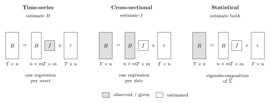{#fig-w09-taxonomy width=100%}

| | Observed | Estimated | Regression | Examples |
|:--|:--|:--|:--|:--|
| Time-series | $f$ | $B$ | one per asset, over time | Fama French, Carhart, macro |
| Cross-sectional | $B$ | $f$ | one per date, across assets | BARRA, Axioma, Fama MacBeth |
| Statistical | neither | both | eigendecomposition | PCA, factor analysis |

: The three model types {#tbl-w09-taxonomy}

In a time series model the factor returns are data and the betas are output. In a cross-sectional model the betas are data and the factor returns are output. In a statistical model nothing is data except returns.

There is no correct choice. They answer different questions.

- Time-series, when the factors are economically meaningful and observable. Market, rates, oil, the published FF portfolios. Best for attribution against a standard.
- Cross-sectional, when you have good firm characteristics and a large changing universe. This is what the commercial risk vendors sell.
- Statistical, when you want the risk structure with no priors, or as a diagnostic on the other two.

## Estimation

### Time-Series Models

The factor returns are given, so this is OLS run once per asset. Every asset shares the same right hand side, so do all $n$ at once. Let $X = [\mathbf{1} \;\; F]$ be $T \times (m+1)$.

$$
\widehat{\Theta} = (X'X)^{-1}X'R
\qquad
\widehat{\alpha} = \widehat{\Theta}_{1,\cdot}\,,\quad
\widehat{B}' = \widehat{\Theta}_{2:m+1,\cdot}
$$

One inverse of size $(m+1)\times(m+1)$ serves all $n$ assets. Residuals are $E = R - X\widehat{\Theta}$ and

$$
\hat{d}_i = \frac{1}{T-m-1}\sum_{t=1}^{T}E_{t,i}^2
$$

The $T - m - 1$ denominator matters. With $T = 60$ and $m = 3$ we divide by 56, not 60. Ignoring that biases every specific variance down by 7%, which biases the whole risk model down.

#### Fitting FF3 to our data

Fit the three Fama French factors to the 100 stocks over the 60 days.

| | NVDA | TSLA | XOM | MSFT | AAPL | CSCO | BRK-B | JNJ |
|:--|--:|--:|--:|--:|--:|--:|--:|--:|
| $\beta_{\text{Mkt}}$ | 2.452 | 1.726 | 1.171 | 1.148 | 0.980 | 0.774 | 0.652 | 0.276 |
| $\beta_{\text{SMB}}$ | -0.666 | 1.111 | 0.046 | -0.678 | -0.180 | -0.388 | -0.295 | -0.578 |
| $\beta_{\text{HML}}$ | -1.015 | -0.631 | 0.938 | -0.571 | -0.346 | 0.036 | 0.576 | 0.083 |
| $R^2$ | 0.54 | 0.32 | 0.59 | 0.66 | 0.46 | 0.19 | 0.71 | 0.19 |
| Ann. $\sigma$ | 61.0% | 73.6% | 27.9% | 25.7% | 26.0% | 23.8% | 15.3% | 15.2% |

: FF3 betas, selected stocks, 60 daily observations {#tbl-w09-ff3betas}

The signs are sensible. XOM has a large positive HML loading -- energy was the value trade in late 2021. NVDA has a market beta of 2.45 and a strongly negative HML, which is what a high multiple growth name should look like.

Across all 100 stocks the mean $R^2$ is 0.377, ranging from 0.004 (MRK) to 0.817 (TFC). Three factors explain roughly 38% of a typical stock's daily variance. We come back to that number.

#### Full sample vs rolling betas

Two choices, both defensible.

- Full sample. Equal weight on every observation. Lowest estimation error, assumes beta is constant over the window.
- Rolling or exponentially weighted. Tracks changing exposure at the cost of noisier estimates.

The standard error of an OLS beta is roughly

$$
\operatorname{se}(\hat\beta_k) \approx \frac{\sigma_\varepsilon}{\sigma_{f_k}\sqrt{T}}
$$

Halving the window multiplies the standard error by $\sqrt{2}$. On our data the market beta standard error is already about 0.2. A rolling 20 day beta on daily data is mostly noise.

My opinion: on daily data use at least a year. If you need faster adaptation, use exponential weighting rather than a short window. You keep effective sample size while still down-weighting the past.

### Cross-Sectional (Fundamental) Models

Invert the problem. Instead of observing factor returns and estimating betas, we observe the betas and estimate the factor returns.

Observed betas come from firm characteristics.

- Industry or sector membership, as 0/1 dummies
- Size, $\log(\text{market cap})$
- Value, book to price or earnings to price
- Leverage, profitability, trading activity, historical volatility

These are called descriptors. They are observable today for every stock with no regression required. A newly listed stock has a book to price ratio on day one. It has no beta until you have a return history.

#### Standardizing descriptors

Raw descriptors are not usable directly. $\log(\text{cap})$ is around 25 and book to price is around 0.3, so the factor returns would be on wildly different scales. Standardize cross-sectionally at each date.

$$
z_{i,k} = \frac{x_{i,k} - \bar{x}_k}{s_k}
$$

Then winsorize at roughly $\pm 3$. One stock with a book to price of 40 because its book value is an accounting artifact will otherwise run the entire regression for that day.

After standardizing, a factor return is the return to a portfolio with one unit of standardized exposure.

#### The regression

At each date $t$, regress that day's returns on the known exposure matrix.

$$
r_t = B f_t + \varepsilon_t
\qquad\Longrightarrow\qquad
\hat{f}_t = (B'WB)^{-1}B'W r_t
$$

One regression per date, $n$ observations and $m$ regressors. That is the opposite orientation from the time series case. Repeating over $T$ dates gives a time series of estimated factor returns.

$W$ is a weighting matrix. Two standard choices:

- $W = D^{-1}$, inverse specific variance. This is GLS and is efficient if $D$ is known.
- $W = \operatorname{diag}(\sqrt{\text{mktcap}})$. A common vendor choice. It damps small illiquid names without letting the mega caps run the regression.

The first requires $D$, which requires residuals, which requires the regression. In practice you iterate. Run OLS, get residuals, estimate $D$, re-run as GLS.

#### Factor returns are portfolio returns

Look at the estimator again.

$$
\hat{f}_t = \underbrace{(B'WB)^{-1}B'W}_{\textstyle \Omega,\ \ m\times n} \, r_t
$$

$\Omega$ does not depend on $r_t$. Each row of $\Omega$ is a vector of $n$ weights, and the factor return is the return on that portfolio.

$$
\hat{f}_{k,t} = \sum_{i=1}^{n} \Omega_{k,i}\, r_{i,t}
$$

These are factor mimicking portfolios. Three consequences:

1. The estimated factor returns are achievable. You can hold the portfolio.
2. $\Omega B = I$ by construction, so the mimicking portfolio for factor $k$ has unit exposure to $k$ and zero exposure to every other factor. Cross-sectional factor returns are purified in a way that the Fama French portfolios are not. HML has a well known negative market beta.
3. It gives you a hedge. Short the mimicking portfolio to neutralize an unwanted exposure.

#### Identification

Suppose $B$ has a market column of ones plus a full set of industry dummies. The dummies sum to the market column, $B$ is rank deficient, and $(B'WB)^{-1}$ does not exist.

The standard fix is a constraint forcing the industry factor returns to sum to zero.

$$
\sum_{k \in \text{industries}} c_k f_{k,t} = 0
$$

with $c_k$ either equal weights or industry cap weights. Solve through the KKT system.

$$
\begin{bmatrix} B'WB & C' \\ C & 0 \end{bmatrix}
\begin{bmatrix} f_t \\ \lambda \end{bmatrix}
=
\begin{bmatrix} B'W r_t \\ 0 \end{bmatrix}
$$

The constraint is not cosmetic. It defines what "the market factor" means. With the sum to zero constraint the market factor return is the cap weighted market return and the industries are pure relative effects. Change the constraint and you change the interpretation of every factor.

#### Fama MacBeth inference

We have $T$ estimates $\hat{f}_1,\dots,\hat{f}_T$. Fama and MacBeth (1973) use the time series of the cross-sectional estimates rather than modeling the cross-sectional correlation.

$$
\bar{f}_k = \frac{1}{T}\sum_{t=1}^T \hat{f}_{k,t}
\qquad
t\text{-stat} = \frac{\bar{f}_k}{s(\hat{f}_k)/\sqrt{T}}
$$

Residuals within a single date are heavily correlated, since everything moves with the market. Standard errors from any one cross-sectional regression are badly understated. The estimates across dates are approximately independent, because daily returns are approximately serially uncorrelated. So the dispersion of the estimates over time gives valid inference and we never model the within-date correlation.

The limitation is that it assumes no serial correlation in $\hat{f}_t$. If there is any, use Newey West standard errors.

#### A cross-sectional model on our data

Market factor plus 8 industry groups, weighted by inverse specific variance, sum to zero constrained.

| Factor | Mean return (bp/day) | Ann. vol | FM $t$-stat |
|:--|--:|--:|--:|
| Market | +7.9 | 11.9% | +0.82 |
| Staples | +8.7 | 10.9% | +0.98 |
| Health | +2.0 | 9.8% | +0.26 |
| Tech | -0.5 | 14.7% | -0.04 |
| Financials | -0.8 | 12.3% | -0.08 |
| Discretionary | -1.9 | 9.4% | -0.25 |
| Industrials | -1.9 | 9.6% | -0.24 |
| Comm. Services | -12.0 | 8.4% | -1.78 |

: Cross-sectional factor returns, 60 days {#tbl-w09-xsfactors}

Not one $t$-statistic clears 2.0. That is the correct result. Sixty days is far too short to say anything about factor premia. The volatilities are estimated much more precisely than the means. Use this model for risk. Do not use these means as expected returns.

### Statistical Models

Neither $B$ nor $f$ is observed. Extract both from the covariance matrix. This is Week 03 PCA applied to a new purpose.

$$
\widehat{\Sigma} = S\Lambda S'
$$

Keep the largest $m$ eigenvalues and set

$$
B = S_{[\cdot,1:m]}\,\Lambda_{[1:m]}^{1/2}, \qquad F = I_m
$$

The factors are the principal components scaled to unit variance, so $F$ is the identity and $BFB' = BB'$. The specific variances are what the components did not explain.

$$
d_i = \widehat{\Sigma}_{ii} - \sum_{k=1}^m B_{i,k}^2
$$

#### Rotation indeterminacy

For any orthogonal $m\times m$ matrix $Q$,

$$
B f = (BQ)(Q'f)
\qquad\text{and}\qquad
(BQ)(BQ)' = BQQ'B' = BB'
$$

Loadings $BQ$ with factors $Q'f$ fit the data equally well and give an identical covariance matrix. Statistical factors are only identified up to rotation.

This is where students most often go wrong. PC1 is not the market factor. PC1 is the direction of maximum variance, which for equity returns is usually close to a market-like direction, but the model has no opinion about that.

On our data the correlation between the PC1 loadings and the FF3 market betas is $-0.95$. Eigenvector signs are arbitrary, so read that as $+0.95$. 93% of the PC1 loadings share a sign. So PC1 is market-like here, but that is something we verified after the fact, not something the method delivered.

The practical consequence: statistical models are good for risk, which depends only on $BB' + D$ and is rotation invariant. They are awkward for attribution, which requires naming the factors.

#### Choosing $m$

- Scree plot. Eigenvalues in descending order, look for the elbow where they flatten into the noise floor.
- Cumulative variance. Keep enough components to hit a target.
- Information criteria. Bai and Ng (2002) penalize $m$ correctly when both $n$ and $T$ are large.

$$
IC_{p1}(m) = \ln V(m) + m\left(\frac{n+T}{nT}\right)\ln\left(\frac{nT}{n+T}\right)
$$

$V(m)$ is the mean squared residual. Minimize over $m$. This is preferable to eyeballing a scree plot, though the answer is often the same.

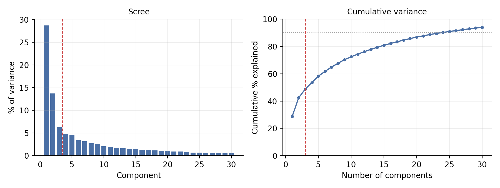{#fig-w09-scree width=95%}

| Components | 1 | 2 | 3 | 5 | 10 | 20 | 59 |
|:--|--:|--:|--:|--:|--:|--:|--:|
| Cumulative variance | 28.7% | 42.4% | 48.8% | 58.2% | 72.3% | 86.8% | 100.0% |

: Variance explained by principal components {#tbl-w09-scree}

The first component explains 28.7% and the second adds 13.7%. After that the drop-off is gradual and there is no clean elbow, which is typical for equity returns. The elbow argument supports $m = 2$ or 3. A 90% of variance rule would demand more than 20 factors, which is overfitting 60 observations.

The eigenvalues also run out at 59. Everything past that is exactly zero. That is the rank problem again.

#### Asymptotic PCA when $n > T$

Eigendecomposing a $100\times100$ matrix built from 60 observations is wasteful. At most 59 eigenvalues are non-zero. Connor and Korajczyk (1986) work with the $T \times T$ matrix instead.

$$
\Omega = \frac{1}{n}\tilde{R}\tilde{R}' \quad (T\times T)
$$

$\tilde{R}$ is the demeaned return matrix. The non-zero eigenvalues of $\Omega$ match those of $\frac{1}{n}\tilde{R}'\tilde{R}$, and the eigenvectors of $\Omega$ give the factor realizations directly. Recover the loadings by regressing returns on those factors.

Cost is $O(T^3)$ instead of $O(n^3)$, and it is better conditioned. For $n=100, T=60$ the saving is modest. For 3,000 stocks on 250 days it is a factor of 1,700.

#### PCA on correlation vs covariance

These give different answers. PCA on the covariance matrix is dominated by the highest variance assets. With TSLA at 74% annualized volatility and JNJ at 15%, TSLA gets roughly 24 times the influence of JNJ in the first component. PCA on the correlation matrix treats every asset equally.

My opinion: for a risk model use covariance, because you care about dollars of risk and the high volatility names genuinely matter more. For exploratory structure finding use correlation, so a few volatile names do not dictate the answer.

## The Factor Covariance Matrix

Everything follows from

$$
\Sigma = BFB' + D
$$

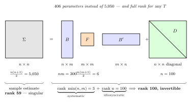{#fig-w09-sigma width=100%}

### Parameter Count

$$
\underbrace{nm}_{B}\;+\;\underbrace{\frac{m(m+1)}{2}}_{F}\;+\;\underbrace{n}_{D}
\;=\; 300 + 6 + 100 \;=\; 406
\qquad\text{versus}\qquad
\frac{n(n+1)}{2} = 5{,}050
$$

A 12 fold reduction. More important, the count is linear in $n$ rather than quadratic. Doubling the universe doubles the parameters instead of quadrupling them.

### Positive Semi-Definiteness

Claim: if $F$ is PSD and $d_i \geq 0$ for all $i$, then $\Sigma = BFB' + D$ is PSD. If $F$ is PD and $d_i > 0$, then $\Sigma$ is PD.

Proof: for any $x \in \mathbb{R}^n$, let $y = B'x$.

$$
x'\Sigma x = x'BFB'x + x'Dx = y'Fy + \sum_{i=1}^n d_i x_i^2
$$

The first term is $\geq 0$ because $F$ is PSD, the second because every $d_i \geq 0$. If $d_i > 0$ for all $i$ then the second term is strictly positive for $x \neq 0$. $\blacksquare$

Compare that to Week 03. There we estimated a covariance matrix, found it was not PSD, and repaired it. Here the question never comes up. As long as we do not produce a negative specific variance, PSD is automatic.

The factor structure is a parameterization of the PSD cone. Every matrix of the form $BFB'+D$ with $F \succeq 0, D \succeq 0$ is PSD, and no adjustment to $B$ can leave the cone.

The one thing to check is $d_i \geq 0$. In a statistical model $d_i = \Sigma_{ii} - \sum_k B_{ik}^2$ can go negative if the components over-explain an asset. That is a Heywood case. Floor it at a small positive number. On our data the minimum $d_i$ from the 3 component model is $3.09\times10^{-5}$, so no flooring was needed.

### Rank and Invertibility

$\operatorname{rank}(BFB') = \min(n,m) = m$ when $B$ has full column rank. So $BFB'$ is massively singular, rank 3 out of 100.

Adding $D$ with a strictly positive diagonal fixes it. From the proof above $x'\Sigma x \geq \min_i d_i \cdot \|x\|^2 > 0$, so $\lambda_{\min}(\Sigma) \geq \min_i d_i$.

The idiosyncratic term is what makes the matrix invertible. Students think of $D$ as leftover junk. It is doing the structural work.

It also rules out the null space problem from Section 1.3. There a portfolio existed with $w'\widehat{\Sigma}w = 0$ exactly. Under a factor model the best a portfolio can do is neutralize all $m$ factor exposures, which leaves $w'\Sigma w = \sum_i w_i^2 d_i > 0$. The model never calls a portfolio riskless because it never claims certainty about a single stock.

| | Sample | FF3 factor model | PCA-3 model |
|:--|--:|--:|--:|
| Rank | 59 | 100 | 100 |
| $\lambda_{\min}$ | $\sim -10^{-18}$ | $2.91\times10^{-5}$ | $3.19\times10^{-5}$ |
| Condition number | undefined | 343 | 323 |
| Non-zero columns in $L$ | 59 of 100 | 100 | 100 |
| Parameters | 5,050 | 406 | 406 |

: The three covariance estimates compared {#tbl-w09-compare}

A condition number of 343 is a well behaved matrix. For the sample estimate the condition number is not a large number, it is undefined. $\lambda_{\min}$ is zero, and whatever your software prints is a report on rounding. Values above $10^{13}$ are typical and the figure changes with the LAPACK path.

### Fast Inversion, the Woodbury Identity

Inverting a $100\times100$ matrix is cheap. For a real universe of 3,000 to 8,000 names an $O(n^3)$ inverse inside an optimizer loop is not.

The Sherman Morrison Woodbury identity:

$$
(D + BFB')^{-1} = D^{-1} - D^{-1}B\left(F^{-1} + B'D^{-1}B\right)^{-1}B'D^{-1}
$$

Look at the right hand side. $D^{-1}$ is a diagonal inverse, $n$ divisions. $F^{-1}$ is $m\times m$ and trivial. $B'D^{-1}B$ is $m\times m$, formed in $O(nm^2)$. The only real inverse is of an $m\times m$ matrix.

Total cost is $O(nm^2)$ instead of $O(n^3)$. With $m = 3$ that is effectively linear in $n$.

| $n$ | 100 | 500 | 1,000 | 2,000 | 5,000 |
|:--|--:|--:|--:|--:|--:|
| Direct (ms) | 0.17 | 5.99 | 30.2 | 148 | 2,375 |
| Woodbury (ms) | 0.030 | 0.049 | 0.074 | 0.105 | 0.136 |
| Speedup | 6x | 122x | 406x | 1,410x | 17,428x |

: Cost of solving with and without the factor structure {#tbl-w09-woodbury}

Maximum relative difference between the two answers is $4.1\times10^{-15}$. It is the same answer.

The Woodbury row is nearly flat. It is not just faster, it barely grows. Commercial optimizers store the covariance in factor form for this reason, and they never form $\Sigma$ explicitly at all. An $8{,}000\times8{,}000$ dense matrix is 512MB. The factor form is under 2MB.

### Factor Structure vs Shrinkage

Factor models are not the only route to a well conditioned covariance. Ledoit and Wolf take a convex combination of the sample covariance and a structured target.

$$
\Sigma_{\text{shrunk}} = \delta\, T_{\text{target}} + (1-\delta)\,\widehat{\Sigma}_{\text{sample}}
$$

$\delta$ is chosen to minimize expected squared error. Common targets are a scaled identity or the constant correlation matrix.

Both approaches fix the conditioning. They differ in what they assume and what they return.

| | Factor model | Shrinkage |
|:--|:--|:--|
| Assumption | returns driven by $m$ common factors | none structural, target is a bias/variance device |
| Well conditioned | yes, by construction | yes, for $\delta > 0$ |
| Gives exposures | yes | no |
| Supports attribution | yes | no |
| Fast inverse | yes, Woodbury | no, dense |
| Fails when | the factors are wrong | never badly, but never great |
| Parameters | $O(nm)$ | $O(n^2)$, regularized |

: Two routes to a usable covariance matrix {#tbl-w09-shrink}

The two are closer than they look. Ledoit and Wolf's 2003 paper used the single index model as the shrinkage target. The target was a one factor model. A factor model is then the $\delta = 1$ corner, full commitment to the structure with no sample covariance at all.

That suggests the hybrid, which is what practitioners do. Shrink the sample matrix toward the factor model rather than choosing between them.

My opinion: if all you need is a number for portfolio volatility, shrinkage is simpler and hard to beat. If you need to answer why the risk is that number, or what happens if the market rallies 2%, you need a factor model. Shrinkage answers neither question.

## Systematic and Idiosyncratic Risk

The factor structure splits every variance into two pieces.

$$
\sigma_i^2 = \underbrace{\beta_i' F \beta_i}_{\text{systematic}} + \underbrace{d_i}_{\text{idiosyncratic}}
$$

The systematic share is the regression $R^2$.

$$
R_i^2 = \frac{\beta_i' F \beta_i}{\beta_i' F \beta_i + d_i}
$$

For a portfolio $w$, define the portfolio exposure vector

$$
x = B'w \qquad (m\times 1)
$$

Then

$$
\sigma_p^2 = w'\Sigma w = \underbrace{x'Fx}_{\text{systematic}} + \underbrace{\sum_{i=1}^n w_i^2 d_i}_{\text{idiosyncratic}}
$$

### Diversification

The idiosyncratic term is $\sum_i w_i^2 d_i$. For an equally weighted portfolio $w_i = 1/n$, so

$$
\sum_{i=1}^n \frac{1}{n^2}d_i = \frac{1}{n}\bar{d} \;\longrightarrow\; 0 \quad\text{as } n \to \infty
$$

Idiosyncratic variance falls at rate $1/n$. The systematic term $x'Fx$ does not fall at all. That is the precise statement of "diversification eliminates specific risk but not market risk."

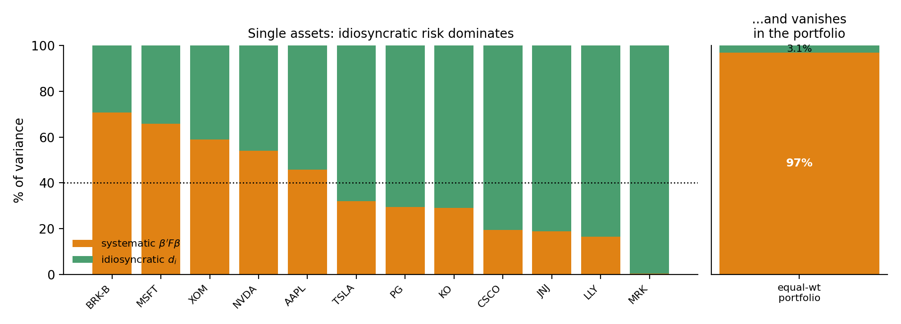{#fig-w09-vardecomp width=100%}

| | Typical single stock | AAPL alone | Equal-weighted 100-stock portfolio |
|:--|--:|--:|--:|
| Systematic share of variance | 37.7% | 45.9% | 96.9% |
| Idiosyncratic share | 62.3% | 54.1% | 3.1% |

: Idiosyncratic risk at the asset level and the portfolio level {#tbl-w09-vardecomp}

For a single stock most of the variance is idiosyncratic and the factors explain less than half. For a portfolio of the same 100 stocks the idiosyncratic share is 3% and effectively gone.

This is why a 3 factor model can be a poor description of one stock and a good description of a diversified portfolio. It is also why the diagonal $D$ assumption is more forgivable than it looks. Errors in $D$ get multiplied by $w_i^2$.

In volatility terms:

$$
13.40\% = \sqrt{(13.19\%)^2 + (2.34\%)^2}
$$

Risk adds in quadrature, so a component five times smaller contributes almost nothing.

## Ex-Ante Risk

### Working in Exposure Space

$x = B'w$ reduces a 100 dimensional portfolio to a 3 dimensional risk description.

| | Mkt-RF | SMB | HML |
|:--|--:|--:|--:|
| Exposure $x = B'w$ | 0.930 | -0.125 | +0.157 |
| Share of portfolio variance | 102.3% | -3.6% | -1.8% |

: Equal-weight portfolio exposures {#tbl-w09-exposures}

A portfolio manager can hold three numbers in their head. They cannot hold 100 weights and a $100\times100$ correlation matrix.

The negative shares are not an error. Marginal contribution to variance is

$$
\frac{\partial \sigma_p^2}{\partial x_k} = 2(Fx)_k
$$

so the share for factor $k$ is $x_k (Fx)_k / \sigma_p^2$. SMB and HML are negatively correlated with the market here, $-0.33$ and $-0.38$. A small negative SMB tilt reduces total risk. Contributions can be negative. That is the point of hedging, and it is the Week 08 decomposition applied in factor space.

### Factor Risk Attribution

Week 08 carries over directly. Same Euler decomposition:

$$
\sigma_p = \sum_{k=1}^{m} x_k \frac{\partial \sigma_p}{\partial x_k}
= \sum_{k=1}^m \frac{x_k (Fx)_k}{\sigma_p}
$$

plus the idiosyncratic term $\sum_i w_i^2 d_i / \sigma_p$. The sum is exact. The difference from Week 08 is that we no longer need a regression. We have $B$ and $F$ directly, so this is ex-ante rather than ex-post.

### Simulation and Factor VaR

Week 05 simulated $n$ dimensional joint distributions with copulas. That gets expensive and statistically shaky as $n$ grows. A Gaussian copula on 100 series needs a $100\times100$ correlation matrix, and we know how that ends with 60 observations.

The factor model restructures the simulation.

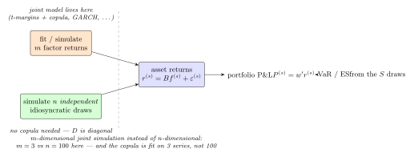{#fig-w09-simflow width=100%}

For each of $S$ scenarios:

1. Draw a factor return vector $f^{(s)}$ from the joint factor distribution. $m$ dimensions, so the copula and marginals are fit on $m$ series.
2. Draw $n$ independent idiosyncratic returns $\varepsilon_i^{(s)}$. Independent because $D$ is diagonal. No copula needed.
3. Form $r^{(s)} = \alpha + Bf^{(s)} + \varepsilon^{(s)}$.
4. Compute $P^{(s)} = w'r^{(s)}$.
5. Take the empirical quantile for VaR and the tail mean for ES, as in Week 05.

What this buys:

- The joint model is $m$ dimensional instead of $n$ dimensional. Three instead of 100.
- The copula is fit on 3 series with 60 observations. On 100 series it is not feasible.
- Fat tails go where they belong. Fitting a $t$ to each of 100 stocks conflates market tail risk with single name event risk. Here you can give the market factor a $t_5$ and leave the idiosyncratic terms normal, which is closer to what happens.
- Factor VaR is free. Rerun with one factor shocked and the rest at zero.

Under normality the equal weight portfolio has a daily volatility of 0.839%.

$$
\text{VaR}_{5\%} = 1.645 \times 0.839\% = 1.380\%
\qquad
\text{ES}_{5\%} = \frac{\phi(z_{0.05})}{0.05}\times 0.839\% = 1.731\%
$$

Simulating with a $t_5$ market factor pushes both out, ES in particular. That is Problem 2.

### Tracking Error and Active Risk

Most institutional mandates are relative to a benchmark. With benchmark weights $b$, the active weights are $a = w - b$.

$$
TE = \sqrt{a'\Sigma a} = \sqrt{\underbrace{(B'a)'F(B'a)}_{\text{factor bets}} + \underbrace{\textstyle\sum_i a_i^2 d_i}_{\text{stock selection}}}
$$

The active exposures $B'a$ are what the manager is betting on relative to the benchmark. The decomposition separates two very different activities.

Take the equal weighted portfolio as active against a benchmark of the 20 largest names.

| Total TE (ann.) | from factor bets | from stock selection | Active Mkt-RF | Active SMB | Active HML |
|--:|--:|--:|--:|--:|--:|
| 5.69% | 2.67% | 5.03% | $-0.036$ | $+0.094$ | $+0.138$ |

: Tracking error decomposition {#tbl-w09-te}

The manager is close to market neutral in active terms, has a modest small and value tilt, and gets most of the tracking error from stock selection rather than factor bets. Whether that is good depends on whether they are a stock picker or a factor allocator. If they claimed to be a factor allocator, this table says otherwise.

The two pieces add in quadrature, $\sqrt{2.67^2 + 5.03^2} = 5.69$.

## Portfolio Construction

### Optimization with a Factor Covariance

Minimum variance subject to full investment:

$$
\min_w \; w'\Sigma w \quad \text{s.t.} \quad \mathbf{1}'w = 1
\qquad\Longrightarrow\qquad
w^* = \frac{\Sigma^{-1}\mathbf{1}}{\mathbf{1}'\Sigma^{-1}\mathbf{1}}
$$

Every mean variance problem needs $\Sigma^{-1}$ times something. With a sample covariance and $n > T$ that object does not exist. With the factor covariance it always does, and Woodbury makes it cheap.

Running minimum variance four ways on the same 100 stocks:

| Covariance | Max weight | Gross | Predicted ann. vol | Realized ann. vol |
|:--|--:|--:|--:|--:|
| Sample (rank 59)$^\dagger$ | 350% | --- | ~0% | --- |
| FF3 time-series | 6.6% | 1.76 | 4.26% | 8.68% |
| PCA-3 statistical | 9.2% | 1.98 | 4.57% | 7.14% |
| Cross-sectional (mkt + industry) | 8.6% | 1.23 | 9.97% | 9.89% |

: Minimum-variance portfolios from four covariance estimates {#tbl-w09-mvp}

$^\dagger$ Not solvable, $\Sigma^{-1}$ does not exist. The figures shown use a pseudo-inverse.

Three things here.

First, every factor model produces a sane portfolio. Maximum weights under 10%, gross exposure under 2x, no position dominating. The sample covariance solution puts 350% into one name. That is Michaud's error maximization from Week 08.

Second, FF3 and PCA-3 badly underestimated realized risk, by roughly 2x for FF3. That is the diagonal $D$ assumption failing. The optimizer looked at $D$, decided the residuals were independent, and diversified aggressively against them. They were not independent.

Third, the cross-sectional model with industry factors predicted 9.97% against a realized 9.89%. It also needed the least gross exposure to get there.

Section 9.3 explains why. Stocks in the same industry move together beyond what market, size, and value explain. FF3 pushes that into the residuals and then assumes it away. The cross-sectional model gives it somewhere to live. A model that is honest about correlation produces a higher risk forecast, and the higher forecast is the right one.

A factor model's value is not measured by $R^2$ or by average residual correlation. It is measured by whether the risk it forecasts is the risk you get.

### Factor-Neutral Construction

A factor model turns "I want no exposure to value" into a linear constraint.

$$
\min_w \; w'\Sigma w \quad \text{s.t.} \quad \mathbf{1}'w = 1, \;\; B'w = 0
$$

With $A = [\mathbf{1} \;\; B]$ and target $c = [1, 0, \dots, 0]'$:

$$
w^* = \Sigma^{-1}A\left(A'\Sigma^{-1}A\right)^{-1}c
$$

Common variants:

- $B'w = 0$ on all factors. Fully factor neutral, pure stock selection.
- $\beta_{\text{Mkt}}'w = 0$ only. Market neutral, other tilts retained.
- $B'w = B'b$. Match the benchmark exposures, take no active factor bets.
- $B'w = x_{\text{target}}$. Hold a specified exposure deliberately.

| | Unconstrained MVP | Fully factor-neutral |
|:--|--:|--:|
| Annualized volatility | 4.26% | 4.63% |
| $B'w$ | $(0.106, -0.109, 0.018)$ | $(0,0,0)$ to machine precision |
| Gross exposure $\sum|w_i|$ | 1.76 | 2.03 |

: Cost of imposing factor neutrality {#tbl-w09-neutral}

Neutrality costs 37bp of volatility and requires more gross exposure. Quote that price to whoever demanded the neutrality.

### Risk Budgeting in Factor Space

Week 08 set risk budgets across assets. With a factor model you can set them across factors, which is what most allocators want.

The machinery is identical. Replace asset component contributions with factor component contributions.

$$
CSD_k = \frac{x_k (Fx)_k}{\sigma_p}, \qquad x = B'w
$$

$$
\min_w \sum_{k=1}^m \left(\frac{CSD_k}{b_k} - \overline{\frac{CSD}{b}}\right)^2
\quad\text{s.t.}\quad \mathbf{1}'w = 1
$$

"Equal risk contribution from equities, rates, and credit" is a factor space risk parity statement. It is what most risk parity funds are doing. Asset space risk parity on a 60/40 portfolio is a different and less meaningful exercise, because the assets are not the risks.

$m$ is also small, so this optimization has 3 residuals instead of 100. It converges far more reliably than the asset space version.

## What Goes Wrong

### The Factor Zoo

More than 400 factors have been published as priced in the cross-section. They cannot all be real.

Harvey, Liu, and Zhu (2016) make the multiple testing argument. If hundreds of researchers test thousands of candidate factors on the same CRSP data, a $t$-statistic of 2.0 gets exceeded by chance many times over. They argue the hurdle should be $t > 3.0$, and that many published factors do not clear it.

- Be suspicious of any factor without an economic story that predates its discovery.
- Demand out of sample and out of region evidence.
- Separate a risk factor, which explains covariance, from a return factor, which predicts returns and is an alpha claim. A model can be excellent at the first and useless at the second. For risk purposes the factor does not need to be priced at all. It only needs to explain co-movement.

### Estimation Error in Betas

Betas move. Some of that is real change in the business. Most of it is estimation noise, and the two are hard to separate.

On our data the standard error on a market beta is about $\pm 0.2$. A beta estimated at 1.15 and one estimated at 0.85 are barely more than one standard error apart. Ranking stocks on that difference is ranking on noise.

- Blume shrinkage, $\beta^{adj} = \frac{2}{3}\hat\beta + \frac{1}{3}$, shrinking toward 1. Crude but widely used.
- Vasicek shrinkage, shrinking each beta toward the cross-sectional mean in proportion to its own estimation variance. Noisy betas get shrunk harder. Better than Blume and barely more work.
- Longer windows, or exponential weighting instead of short rolling windows.
- A cross-sectional model, where exposures come from observable characteristics and are not estimated at all. This is a real advantage of the fundamental approach and is why the vendors favor it.

### Residual Correlation, Testing the Diagonal $D$ Assumption

The diagonal $D$ does the most work and gets the least scrutiny. It is directly testable. Compute the residual correlation matrix and look at the off-diagonals.

| Pair | FF3 residual corr | After adding industry factors |
|:--|--:|--:|
| GOOGL / GOOG | +0.986 | +0.988 |
| MS / GS | +0.860 | +0.784 |
| HD / LOW | +0.849 | +0.747 |
| AMAT / LRCX | +0.809 | +0.744 |
| V / MA | +0.802 | +0.814 |
| TMO / DHR | +0.752 | --- |
| TXN / ADI | +0.746 | --- |
| PG / PEP | +0.742 | +0.258 |

: Largest FF3 residual correlations {#tbl-w09-resid}

That list is not random. GOOGL and GOOG are two share classes of the same company. No factor model fixes that, because they are the same asset. Drop one or treat them as one line item. Every other pair is an industry pair -- investment banks, home improvement retail, semiconductor equipment, payment networks, life science tools, analog semis.

FF3 has no industry factors, so industry co-movement goes into the residuals where the model insists it does not exist. That is a missing factor, and it is why the minimum variance portfolio in @tbl-w09-mvp underestimated realized risk.

Adding industry factors helps but does not fully fix it. PG/PEP drops from 0.74 to 0.26, since both are staples and a staples factor absorbs it. MS/GS only falls from 0.86 to 0.78, because a broad Financials bucket does not capture "bulge bracket investment bank." Finer sub-industry granularity would do better. GOOGL/GOOG does not move.

One caveat on reading the table. Mean absolute residual correlation is 0.140 for FF3 and 0.157 for the cross-sectional model. Adding six factors made the average slightly worse. Do not over-interpret that. With $T=60$ and 4 regressors the sampling standard deviation of a correlation is about $1/\sqrt{56} = 0.134$, so the expected absolute correlation under a true null of zero is around 0.107. Both models sit near the noise floor, and the cross-sectional model has fewer residual degrees of freedom, which raises its floor.

Two lessons.

The average is uninformative and the tail carries the signal. A residual correlation of 0.15 is noise. A residual correlation of 0.86 between two investment banks is a missing factor. Sort the list, look at the top, ask whether the pairs make economic sense.

Judge the model by its risk forecast, not its residual diagnostics. On average residual correlation the cross-sectional model looked worse than FF3. On @tbl-w09-mvp, forecast versus realized, it was the only one of the three that got the answer right. Diagnostics tell you what to fix. Out of sample forecast accuracy tells you which model to use.

### Collinear Exposures

If two columns of $B$ are highly correlated, $B'WB$ is near singular and $\hat{f}_t$ becomes unstable. You get large offsetting factor returns that swing sign period to period.

Watch the condition number of $B'WB$. If it is large the factors are redundant. Combine them, orthogonalize one against the other, or drop one.

Instability in $\hat{f}$ does not necessarily damage $\Sigma$. $BFB'$ can be well determined even when $B$ and $F$ individually are not, for the same reason rotation indeterminacy in a statistical model does not affect the risk numbers. This matters if you use the model for risk but not attribution.

### Look-Ahead and Survivorship

Three ways to build a factor model that backtests beautifully and fails in production.

- Look-ahead in descriptors. Book value for the quarter ending March is not public in March. Fama and French lag accounting data by six months for this reason. If your 31 March book to price uses the March balance sheet, your model knows the future.
- Survivorship in the universe. A model built on stocks currently in the S&P 500 means every stock in the sample survived. The delisted, acquired, and bankrupt names carry the tail risk you are trying to measure.
- Restatements. Point in time databases give you what was known on a date, not what was later determined to be true. Use them.

### Short Estimation Windows

Everything here used $T = 60$. That was deliberate -- it reuses data you already have and it makes the rank problem vivid -- but do not build a production risk model this way.

At $T = 60$:

- Factor volatilities carry a standard error of roughly $1/\sqrt{2T} \approx 9\%$ of their value. Tolerable.
- Factor means carry a standard error of $\sigma/\sqrt{T}$. For a factor at 15% annualized volatility that is 1.9% annualized on a premium that might be 5%. Useless, and it is why no $t$-statistic in @tbl-w09-xsfactors cleared 2.0.

Volatility is estimable from short samples. Expected return is not. Merton (1980) made the point formally. You can improve a variance estimate by sampling more finely. You cannot improve a mean estimate that way, only by extending the calendar span.

This is the statistical justification for everything in Week 08 about risk budgeting and risk parity. Those methods avoid expected returns because expected returns are the parameter we cannot estimate.

## Worked Example and Problems

`week09.jl` runs the full analysis reported here.

1. Load `DailyReturn.csv`. Show $\operatorname{rank}(\widehat{\Sigma}) = 59$, that the PSD Cholesky succeeds with 41 zero columns, and that a null space portfolio forecast at zero risk realizes 10.5% out of sample.
2. Fit FF3 by stacked OLS. Build $\Sigma = BFB' + D$, confirm rank 100 and PD.
3. Fit a 3 component statistical model by PCA. Produce the scree plot, compare.
4. Fit the cross-sectional industry model with the sum to zero constraint. Compute Fama MacBeth $t$-statistics.
5. Verify the Woodbury identity and time it.
6. Compute exposures, the variance decomposition, and tracking error.
7. Solve the minimum variance and factor neutral problems.
8. Run the residual correlation diagnostic.

### Problem 1

Using `DailyReturn.csv`, all 100 stocks excluding SPY.

a. Confirm the sample covariance is singular and report its rank. Run the Week 03 PSD Cholesky on it and report the number of zero columns in the root. Explain in one sentence why the factorization succeeding is not reassuring.

b. Estimate the covariance on the first 30 days only. Find a portfolio in its null space with weights summing to 1. Report its forecast volatility, its realized volatility over the last 30 days, and what the FF3 model forecasts for the same portfolio. Which number would you show a risk committee?

c. Build a statistical factor model with $m = 2$ and $m = 5$. Report the percentage of total variance explained, the minimum specific variance $d_i$, and the condition number of the resulting $\Sigma$.

d. For which $m$, if any, does a specific variance go negative? Explain what a negative $d_i$ means and how you would handle it.

e. Using the Bai-Ng $IC_{p1}$ criterion, choose $m$. Does it agree with the scree plot?

### Problem 2

Using the FF3 model from the worked example and an equally weighted portfolio of all 100 stocks.

a. Report the portfolio exposures $x = B'w$ and the split of variance into systematic and idiosyncratic.

b. Compute the 1 day 5% VaR and ES under multivariate normality.

c. Simulate 10,000 scenarios where the market factor is $t$ with 5 degrees of freedom, scaled to the historical market variance, SMB and HML are normal, and the idiosyncratic terms are independent normal. Recompute VaR and ES.

d. How much did the fat tailed market factor move the ES? Compare that to fitting a $t$ to each of the 100 stocks individually and simulating with a Gaussian copula. Which is the more defensible model, and why?

### Problem 3

Using the same FF3 model.

a. Construct the minimum variance portfolio subject to $\mathbf{1}'w = 1$ and full factor neutrality $B'w = 0$. Verify the constraint holds to machine precision.

b. Report the volatility cost of neutrality relative to the unconstrained minimum variance portfolio.

c. Impose neutrality on the market factor only. Where does this portfolio sit between the other two?

d. Compute the residual correlation matrix and report the ten largest absolute off-diagonal values. Which pairs would a sector factor plausibly fix, and which would not? Propose a specific change to $B$ and justify it.
